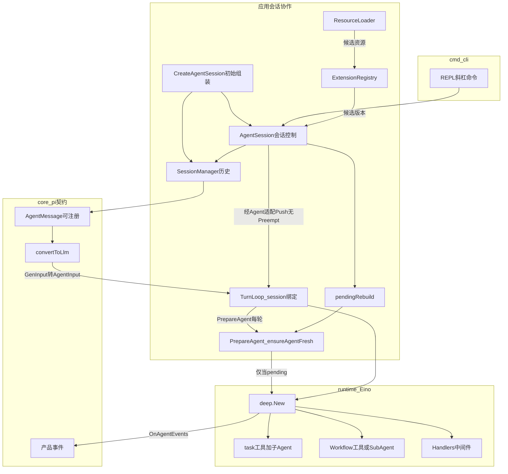
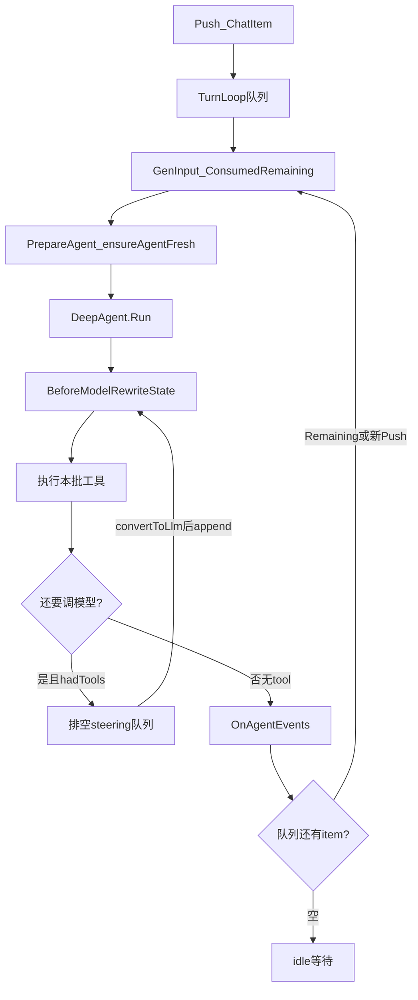

# pi 思想 + Eino DeepAgent 技术方案

| 项 | 内容 |
|---|---|
| 文档状态 | 前序技术方向记录；最新范围与分层以 [PRD 总纲](pi-eino-prd/README.md) 和 [第 2 章](pi-eino-prd/02-architecture-boundaries.md) 为准 |
| 日期 | 2026-09-21 |
| 工作名 | pi-eino（正式仓库名待定） |
| 建议路径 | `d:\Code\owner_agents\pi-eino` |
| 对照实现 | `pi/`（产品与扩展模型）、CloudWeGo Eino（执行内核） |
| 明确不改 | `pigo/`（只读对照，不依赖、不 fork） |

2026-09-21 用户澄清：本产品提供前端接入能力，前端实现不纳入设计范围，先用最小 Web 页面测试；代码参考 pi 分层，下层不依赖上层。下文 CLI/REPL 为前序交互示例，不再是首期必交付入口；当前建议通过 HTTP/SSE 接入，A2UI 等映射放在最外侧。原图表示运行调用关系，不是最终 Go 包依赖图。资源读取交给 ResourceLoader，能力登记交给 ExtensionRegistry，AgentSession 协调生效时机；加载器不反向依赖会话控制器。其他源码核查差异见 [PRD 差异记录](pi-eino-prd/source-evidence.md#原方案需要修订或补足的地方)。

对象名称已按 pi 语义统一：CreateAgentSession 组装、AgentSession 控制、Agent 执行、SessionManager 保存、ResourceLoader 加载。前序统称 Host/AgentHost 的职责已拆分；完整定义以 [PRD 术语表](pi-eino-prd/02-architecture-boundaries.md#23-与-pi-对齐的对象名称与职责) 为准。SessionStore 仅是 SessionManager 的内部存储契约，ExtensionRegistry/AddSubAgent 为本产品补充。

2026-09-23：第 1～12 章已按用户确认完成本轮收口，统一入口为 [系统闭合检查](pi-eino-prd/system-review.md)。当前开发方案见 [方案总览](pi-eino-dev-plan/README.md)，已采用 Agentic 消息、完整 Trace 边界、必需工作区与默认 DeepAgent 基础能力。下文保留作前序方向参考，不直接作为实施指令。

2026-09-24：第 4 节“工具 / 子 Agent / `/workflow` 三入口”及“一期只做 Go 代码注册”已被新决策替代。现行规范见 [工作流两种使用方式](pi-eino-prd/11-extensions-workflows-access.md#22-工作流的两种使用方式) 与 [开发方案第 10 章](pi-eino-dev-plan/10-extensions-and-workflows.md#workflows)：声明式动态定义、先兼容 Coze Canvas，对外只保留主 Agent 委派和对话框选择独立 Agent。沙箱实现参考改为 Zero，见 [安全补充篇](pi-eino-prd/12-security-sandbox.md)。

另起独立 Go module：对照 [pi](../pi) 的产品与扩展模型，执行内核用 CloudWeGo Eino 的 `adk/prebuilt/deep`（自带 `task` 工具与 general-purpose 子 Agent）。**不改 pigo，也不把本方案写进 pigo。**

热重启语义：**进程不退**；**不中断当前 `DeepAgent.Run`**。加载 skills / 插件 / 工作流只登记变更；当前 Run 用旧实例跑完，下一轮 TurnLoop 的 `PrepareAgent` 再 `deep.New` 换实例。会话消息与 cwd 始终保留。

外层循环采用 [Eino TurnLoop](https://www.cloudwego.io/zh/docs/eino/quick_start/chapter_11_turnloop/)（源码 `eino/adk/turn_loop.go`）：一个 Session 一个长期循环。它对应 **idle / follow-up / Abort / PrepareAgent 热换**，**不是** pi 的 steering。

主 Agent 还要能调用**自定义固定工作流**：开放任务走 DeepAgent ReAct；报销 / 审批 / 同步这类确定性业务走 `compose.Workflow` / `Graph`，由主 Agent 当工具或子 Agent 调起，而不是把整条业务画进 DeepAgent 内部循环。

---

## 1. 决策

- 新产品仓，不是 pigo 换引擎。
- 内核用 **DeepAgent**，不是裸 ChatModelAgent，也不是用一张大 Graph 替代 Agent。
- 消息用 `*schema.Message`（DeepAgent 的 cancel/retry 对 AgenticMessage 尚未完全接线）。
- 扩展放在产品层：开放 `AgentMessage` + ResourceLoader / ExtensionRegistry（skill / 插件 / **workflow**）。
- 工作流**挂在主 Agent 下面**，不挡在主 Agent 前面做唯一路由器。用户也可 `/workflow <name>` 强制执行，跳过模型选择。
- 扩展热更新是 **deferred swap**：当前 `DeepAgent.Run`（一次内层执行）不受影响；下一轮 TurnLoop 的 `PrepareAgent` 才换实例。
- 会话外层用 Eino **TurnLoop**：idle / Push / Abort / 声明式 Checkpoint。**不要**用 `WithPreempt` 实现 steering。

---

## 2. 分层



职责划分（最终包名以完整 PRD 后的开发方案为准）：

- `core/`：开放消息、`convertToLlm`、事件、钩子契约。
- `CreateAgentSession`：组合模型、Agent、SessionManager、ResourceLoader 及 ExtensionRegistry，返回 AgentSession。
- `SessionManager`：JSONL 消息树、历史分支与提交；未知 role 保留原始内容。
- `AgentSession`：会话内 Task 控制、cwd 与能力版本选择；同会话最多一个活动执行循环，已关闭循环由 Agent 重建。加载资源不直接换掉活动任务实例。
- `Agent` / Eino 适配：消费执行配置，复用 DeepAgent/TurnLoop；`BuildDeepAgent(cfg)` 为内部构建能力。
- `ResourceLoader` / `ExtensionRegistry`：分别读取资源、登记候选能力；返回结果给 AgentSession 协调，不直接修改它的运行状态。
- `cmd/cli/`：REPL。pigo 只对照不 import。

---

## 3. 对齐 pi 的扩展面

### 3.1 消息

- 不密封的 `Role() string` 接口 + `RegisterMessage(role, decode, toLlm)`。
- 内置 `user` / `assistant` / `toolResult` / `compactionSummary`；插件可加 `custom`、`bashExecution`、**`workflowResult`**（工作流结构化结果给 UI；不污染模型则 `toLlm` 可过滤或压成摘要 user）。

### 3.2 插件

可注册：工具、斜杠命令、事件订阅、自定义消息、子 Agent、**工作流**。

一期同进程扩展包；RPC / `.so` 二期。

### 3.3 Skills

Eino skill 中间件（`eino/adk/middlewares/skill/skill.go`）；扫描 `~/.pi-eino/skills` 与项目 `.pi-eino/skills`。加载卸载只置 `pendingRebuild`，不 Cancel 当前 `DeepAgent.Run`。

---

## 4. 自定义工作流（主 Agent 调用）

业务里大量是固定步骤（校验字段 → 调内部 API → 写台账），不该每轮让模型自己摸索。Eino 的 `compose.Workflow`（DAG、字段映射、无环）和 `compose.Graph`（需要分支循环时）就是这块；DeepAgent 负责「何时启动哪条流、缺参时追问」。

### 4.1 挂到主 Agent 的两种暴露（注册时可多选）

- **工具（默认）**：把编译后的 `Runnable` 封成 `tool.BaseTool`（官方 Graph-as-tool 思路）。主 Agent 在 ReAct 里像调 `bash` 一样调 `workflow_expense_submit`。适合短、入参明确、一次跑完的流。
- **子 Agent**：工作流包一层 `adk.Agent`，放进 DeepAgent `SubAgents`，模型用自带 **`task` 工具**委派。适合多步、要单独事件流 / 中断恢复的长流程。

同一条工作流可以 `ExposeAs: tool | subagent | both`。

### 4.2 用户强制走固定路径

`/workflow <name> [json-args]`：AgentSession 受理显式工作流任务，经执行适配调用 Runnable，不经过模型选工具。SessionManager 保存执行结果；该操作遵守同会话串行规则。命令文本仅为入口示例，Web/API 使用同一会话操作。

### 4.3 注册契约（插件或 `ext/workflow` 目录）

- `Name` / `Description`：给模型看，description 必须写清何时该调、必填字段。
- `InputSchema`：JSON Schema，工具参数校验。
- `Build(ctx) (Runnable, error)`：内部用 `compose.NewWorkflow` 或 `NewGraph`，节点可以是 Lambda、ChatModel、Retriever、再调其它工具。
- 可选 HITL：节点里 `Interrupt`，Checkpoint 只服务这条执行，仍不替代产品 Session。

### 4.4 一期实现形态

- Go 代码注册（类型安全、可测）。YAML / JSON 声明式 DAG 放到二期，避免一上来做工作流 IDE。

### 4.5 边界

- Agent：意图不清、要搜资料、要写代码、要选哪条流。
- Workflow：步骤固定、字段映射固定、可测的业务 DAG。
- 正式会签 / SLA / 补偿仍建议公司 BPM；本系统工作流是 Agent 侧的确定性子程序，不是全公司流程引擎。

### 4.6 会话与 UI

- 工具暴露：标准 `toolResult` 回主对话。
- 需要富展示时用自定义 `workflowResult`（步骤列表、失败节点）；`convertToLlm` 默认压成短摘要，避免把整份 DAG 状态塞进上下文。

---

## 5. DeepAgent 怎么用

`deep.New`（`eino/adk/prebuilt/deep/deep.go`）一次装配：

- `ChatModel`：eino-ext。
- `ToolsConfig`：编码工具 + 插件工具 + **工作流工具**。
- `SubAgents`：general-purpose + 插件专家 Agent + **工作流子 Agent**。
- `task`：委派子 Agent（含工作流型子 Agent）。
- 可选 `Backend` / `Shell`。
- `Handlers`：压缩、skills 注入、信任闸门。

Instruction 里加一小段：有匹配的已注册工作流时优先调工作流工具，不要逐步用 bash 重做同一条业务。

**Checkpoint ≠ Session。** Checkpoint 只服务 interrupt / resume；产品会话树独立持久化。

---

## 6. Steering 与 Follow-up（对照 TurnLoop）

[第十一章 TurnLoop](https://www.cloudwego.io/zh/docs/eino/quick_start/chapter_11_turnloop/) **就是会话外层循环的官方实现**，用来替换手写 `Runner.Run` 套循环。它 **不是** pi 两条队列的 1:1 替换。

### 6.1 名词对齐

避免把 Eino「轮次」和 pi「turn」混用：

- **TurnLoop 轮次** = 一次 `PrepareAgent` + 一次 `DeepAgent.Run`（整段内层 ReAct，直到不再调工具）。
- **pi / DeepAgent turn** = 该 Run 里一次「模型 → 工具」。
- **Session** = 一个长期 `TurnLoop`（idle 等待 `Push`）。

### 6.2 能力对照

| 产品能力 | 实现 | 说明 |
|---|---|---|
| 会话生命周期 / idle / 流式 / Abort / 声明式 Checkpoint | TurnLoop | 对应 `Push`、`Stop`、`Store` + `CheckpointID` |
| Follow-up（等当前 Run 做完再处理） | `loop.Push(item)` **不带** `WithPreempt` | 当前轮继续跑完；新 item 进缓冲。`GenInput` 用 `Consumed` / `Remaining` 实现 pi `QueueMode`：`one-at-a-time` 只 Consumed 第一条、其余 Remaining；`all` 一次 Consumed 全部。本轮结束后看到 Remaining 会立刻开下一轮，无需手写外层 for |
| Steering（当前 Run 还在、工具跑完后下一拍模型看到） | `BeforeModelRewriteState` | TurnLoop **做不到**。无 Preempt 的 Push 要等到本轮 `DeepAgent.Run` 结束才进 `GenInput`，那已经是 follow-up。`WithPreempt(AfterToolCalls)` 会在工具结束后 **取消整轮** 再开新轮（文档：「旧回答立即停止」），等于换题，不是插一句继续干 |
| 换题 / 抢占 | `Push(..., WithPreempt(AfterToolCalls))` | 可选，一期可不做。与 pi `streamingBehavior=steer` 不同 |
| 热换实例 | `PrepareAgent` 里 `ensureAgentFresh()` | 每轮都会调，正好落在「当前 Run 已结束、下一 Run 未开始」。**follow-up 下一轮可以看到新 skill**；**steering 仍用旧实例**（还在同一次 Run 里） |
| Abort | `loop.Stop(adk.WithImmediate())` + `Wait()` | |



### 6.3 Steering：中间件，挂在同一次 `DeepAgent.Run` 里

- AgentSession 协调 `steeringQueue`（产品层 `AgentMessage`），通过窄接口供 Agent 在安全边界消费。
- REPL 进行中 `/steer` 或 `streamingBehavior=steer` → `EnqueueSteer`，**不要** `Push` + Preempt。
- `BeforeModelRewriteState`：`state.Messages` 末尾已是 tool 结果时，按 mode 取出 steering，`convertToLlm` 后 append，并写产品 Session。
- 本轮第一次模型调用（history 以 user 结尾）不排空 steering。

### 6.4 Follow-up：AgentSession 受理，TurnLoop 调度

- 进行中的普通输入 → `Push` 无 Preempt（idle → 下一轮；忙时则等当前 Run 结束）。
- `GenInput` 把产品消息写入 Session，再 `convertToLlm` 成 `AgentInput`。
- 不要在 `OnAgentEvents` / `AfterAgent` 里再调 `Run`（重入）。

### 6.5 REPL 怎么进队

- 空闲输入 → `Push`，TurnLoop 从 idle 开新轮。
- 当前 Run 进行中默认 follow-up（`Push` 无 Preempt）。
- 显式 `/steer` → steering 队列。
- 可选 `/abort` → `Stop(WithImmediate())`。
- 可选「换题」再接 Preempt。

### 6.6 写入 Session

steering / follow-up 都是产品消息，先入 Session 再 `convertToLlm`。自定义 role 走注册表。Checkpoint 仍只服务 interrupt / resume，不替代 Session。

---

## 7. 热重建（进程内，当前 Run 不中断）

前序方案用重建 DeepAgent 激活新的 tools / subagents / 工作流。当前职责为：ExtensionRegistry 提供候选版本，AgentSession 决定正常任务边界，Agent 的 Eino 适配通过 `PrepareAgent` 构建；不在加载资源时取消执行。Task 固定版本与恢复约束以完整 PRD 为准：

- **TurnLoop 轮次** = 一次 `DeepAgent.Run`（内层可含多次模型往返）。
- **pi turn** = 该 Run 内一次模型往返。

安装或加载 skill / 插件 / 工作流 / `/reload` 时：

1. ResourceLoader 返回候选资源，ExtensionRegistry 登记候选版本；AgentSession 将其记为 pending。
2. **禁止** Cancel 当前 `DeepAgent.Run`（也不要用 Preempt 来「尽快换实例」）。
3. 当前 Run 结束后，TurnLoop 若还有 Remaining / 新 Push，或之后 idle 再 Push：`PrepareAgent` 调 `ensureAgentFresh()`；若 pending 则 `deep.New`、清 pending。失败保留旧 Agent 并报错，会话不丢。
4. 空闲时加载同样等到下一轮 `PrepareAgent`，代码路径唯一。

```mermaid
sequenceDiagram
  participant User
  participant Loop as TurnLoop
  participant Old as OldDeepAgent
  participant New as NewDeepAgent
  participant Sess as SessionManager
  User->>Loop: Push当前轮已在跑
  Loop->>Old: Run不中断
  User->>Loop: 安装skill
  Note over Loop: AgentSession选定ExtensionRegistry候选版本
  Note over Old: 本轮仍用旧实例
  Old-->>Loop: DeepAgent.Run结束
  User->>Loop: 下一轮Prompt或follow-up
  Loop->>Loop: PrepareAgent_ensureAgentFresh
  Loop->>New: deep.New
  Loop->>Sess: 读历史AgentMessage
  Note over Sess: cwd与消息树不动
  Loop->>New: Run
```

其它约束：

- 进行中的普通输入走 follow-up Push，不要第二套 Agent 同时写同一 Session。
- `/workflow` 直跑 Runnable 也视为新一轮（可走 TurnLoop item 类型分支，或独立 Invoke 但仍先 `ensureAgentFresh`）。
- 新 skill 从**下一轮 TurnLoop**起可见；本轮中途加载的，当前 ReAct 看不到（工具列表不能在 Run 中途变）。follow-up 下一轮 **会** 换到新实例。

---

## 8. 明确不做

- 改 pigo 或依赖 pigo。
- Fork Eino 解开 `MessageType`。
- 用一张业务 Graph **替换** DeepAgent 循环。
- 一期 Go `plugin` `.so`。
- Session 与 Checkpoint 混存。
- 一期 YAML 工作流 IDE / 可视化编排器。
- 用工作流引擎替代公司审批 BPM。
- 用手写 `Runner.Run` for 循环替代 TurnLoop 做会话外层（follow-up / idle / Abort 都走 TurnLoop）。
- 用 `WithPreempt` 实现 steering（会取消当前轮，变成换题，与 pi 不符）。
- 用 Preempt 实现热换实例。

---
