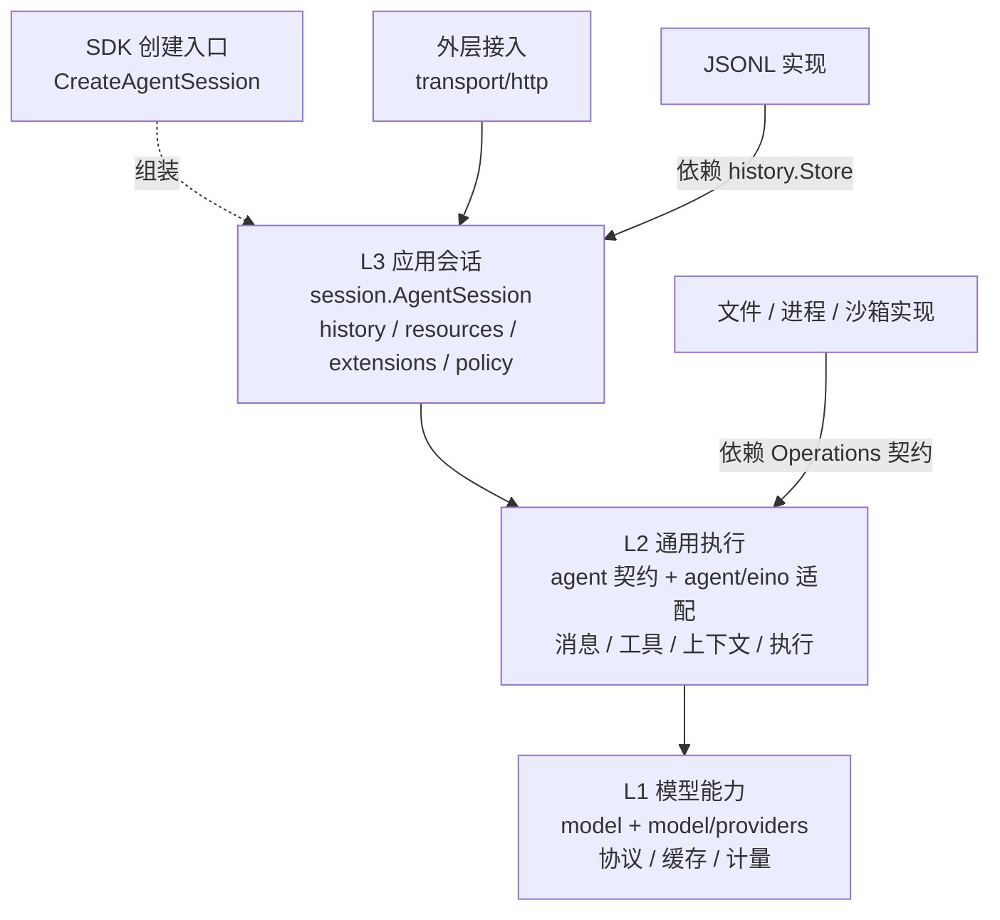
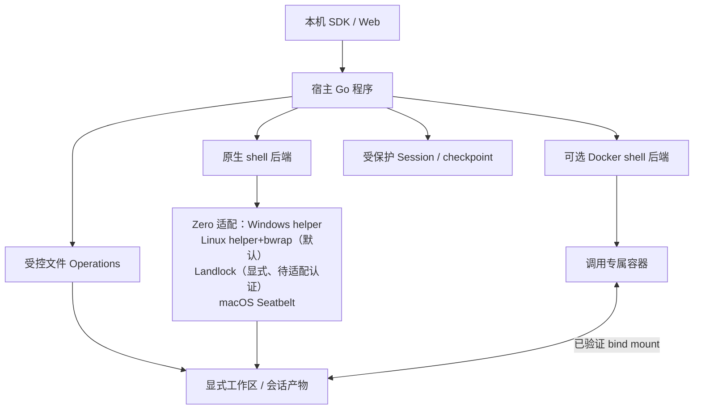

# 01 技术选型与总体架构

对应 PRD M01/M02；本章规定包依赖、装配和部署。运行行为归 [03](03-runtime-and-scheduling.md)，安全后端归 [11](11-security-and-sandbox.md)。

<a id="stack"></a>
## 1. 技术选型与版本

| 技术 | 确定选择 | 选择理由和边界 |
| --- | --- | --- |
| 工具链 | Go 1.27.0 | 与本地已通过 Eino 定向测试的工具链一致，构建和 CI 固定版本 |
| 执行 | Eino `ebd616c8291e957684ea6ca99dd54225d04e0438` | 使用 Agentic DeepAgent/TypedRunner/TurnLoop、Graph、Interrupt；不复制模型循环 |
| 模型 | eino-ext `6752ff8da9b1ea85c8e91b27b0a64fef099f22f9` | agenticopenai / agenticclaude / agenticgemini / agenticdeepseek 各自为 module |
| 请求服务 | 标准库 net/http、encoding/json、log/slog | 本地接口和 SSE 不需要额外 Web 框架；不引入消息队列 |
| schema | github.com/santhosh-tekuri/jsonschema/v6 v6.0.3 | 本地编译工具/Workflow schema；不把模型 strict 当作本地校验 |
| 文件锁 | github.com/gofrs/flock v0.13.1 | 单 Session 跨进程排他写锁；Session 内另有串行提交 |
| OS 能力 | golang.org/x/sys v0.48.0 | Windows API、Unix 进程/文件/沙箱调用 |
| 文件搜索 | ripgrep 15.2.0 | 各发布平台配套固定版本；使用受控 argv，不拼 shell 字符串 |
| 存储 | JSONL + 独立 blob | 本地可读、追加历史、符合 M10；首版不增加数据库 |
| 展示验证 | 同源静态 HTML/JS + fetch/SSE | 只验证公开能力，核心没有浏览器依赖 |

依赖通过 module 的 commit 对应版本固定在产品 go.mod/go.sum；不能对 eino-ext 根仓库执行一次 require 就认为锁定所有组件。开发可用显式 go.work 指向固定 checkout，发布不得包含作者机器的绝对 replace。上述附加库版本依据其发布 tag/go.mod；实际产品依赖编译仍进入 V-BUILD。

参考源码：pi `5cd93f688aaab89dbb6dfa4aca535f21796ae185`、DSH `ddefc45fbc7f8e46dd73185e68295696d1297887` 作为策略/审批行为参考；Zero `99721c762f37cd43ac511007a5f51d1846df959e` 作为原生三平台沙箱实现参考。独立产品工作目录采用前序工作名 pi-eino；不修改或依赖 pigo，不把相邻产品仓库作为运行依赖。Zero `internal` 包需抽取移植，不能直接 import。

<a id="layers"></a>
## 2. 代码层级

职责自下而上是 model → agent → session；**import 自上而下是 session → agent → model**。Eino/schema 是底层依赖，不构成产品的上层对象。

当前仓库已落地的目录与上表未来分层对应，但不等于下列能力已经交付：公开入口只有 `github.com/ww1489/seasprak/sdk`（`sdk/sdk.go` 单文件）。实现位于 `internal/sessions`、`internal/agent`、`internal/llm`，共享错误与限额在 `internal/errors`、`internal/config`。`cmd/agentd` 目前只输出帮助和版本，不启动 HTTP、不创建会话、不读取模型凭据。本章其余 HTTP 服务、默认文件/进程后端和完整宿主部署仍是未交付设计。



D01-依赖图中实线为 import/契约依赖，虚线为装配关系；图按层聚合，层内包职责见下表。SessionManager、ResourceLoader、ExtensionRegistry 的包均不 import AgentSession；存储实现依赖 history 定义的 Store 契约，history 不 import 存储实现。agent 只定义执行契约，agent/eino 实现它，避免接口包反向 import 适配器。创建入口装配所有具体实现，图中仅保留创建对象的连线以便阅读。

| 包组 | 负责 | 不负责 |
| --- | --- | --- |
| model / providers | 有效模型选项、协议与缓存、usage、错误 | 查询 Session、选历史、调用工具 |
| agent / agent/eino | Eino 接线、消息、上下文、工具管道、执行事实接口 | 读具体日志、HTTP、选择最新扩展 |
| session | 输入/Trace/维护命令的串行协调、事件发布 | 手写 ReAct、直接操作厂商 SSE |
| session/history | 树、路径配置重建、提交及查询 | 启动模型、决定下一 Trace |
| resources / extensions / policy | 资源候选、注册版本、授权判断 | 自行替换活动 Trace |
| internal/storage / operations / sandbox | 实现已注入的存储和效果契约 | 决定用户意图、消费顶层输入 |
| 根 SDK 工厂 / cmd/agentd | 默认装配；启动本地服务 | 长驻的第二个 Session 控制器 |
| transport/http | 身份建立、DTO、操作映射、SSE | 写 SessionStore、决定终态 |

产品核心没有通用 Host/大 Environment 对象；文件、进程、产物、授权、历史来源按用途分别注入。只抽象已需要的生产实现与测试替身。

<a id="assembly"></a>
## 3. 创建入口与默认能力

```go
func CreateAgentSession(ctx context.Context, opts SessionOptions) (*AgentSession, error)

type SessionOptions struct {
    Workspace      WorkspaceBinding // 必填；不是进程 cwd 的默认值
    Model          ModelSelection
    Models         ModelCatalog
    Credentials    CredentialResolver
    Extensions     *ExtensionRegistry
    Resources      ResourceOptions
    Capabilities   CapabilityOptions // 零值使用默认完整能力
    Security       SecurityOptions
    Storage        StorageOptions
    Limits         ExecutionLimits  // 零值采用第 12 章默认值
    SystemPrompt   string
}
```

以上是待实现公开契约，相关类型语义由 02/04/07/10/11/12 主定义。根 SDK 导出 AgentSession 类型；内部 Session 构造函数接收已装配依赖，避免 session 包依赖具体 providers/storage。

创建顺序：

1. 校验显式工作区、真实路径、执行环境、可读写根和受保护数据根关系；不先运行模型。
2. 构造持久或显式内存后端，取得会话写锁；绑定身份、版本和初始分支。
3. ResourceLoader 读取候选资源；ExtensionRegistry 校验名称/schema/来源并生成不可变 generation。
4. 解析模型能力与凭据引用，装配受控 FileOperations、ProcessOperations、ArtifactStore、策略与审批通道。
5. 装配默认 ls/read_file/write_file/edit_file/glob/grep/execute、write_todos、general-purpose；缺少必要后端或保护条件直接失败。开发者裁剪必须显式指定，提示词只描述实际能力。
6. 构建 Agentic Agent 工厂及窄控制接口，保存创建结果；会话就绪后发布 session_start 通知。创建不自动执行旧队列。
7. 返回 AgentSession、能力状态和可查询诊断；部分构建失败释放本次资源和锁，不留下看似可执行的半成品。

默认能力保留 Eino 语义，采用显式受控装配：需要自定义 filesystem middleware 或 general-purpose 包装器时，关闭对应隐式重复装配并显式加入等价能力。这是装配实现选择，不是裁剪产品默认能力。创建后以实际工具列表验收，不能仅检查 Eino flags。

打开旧 Session 读取原工作区绑定并重新验证；不可用时可只读浏览历史，不能静默改绑定或自动 resume。换业务工作区创建/切换另一 Session。

<a id="coordination"></a>
## 4. 协调模型与执行端口

每个 AgentSession 一个命令邮箱和串行协调 goroutine，所有状态迁移、去重、游标和 durable 发布在此有序发生。模型、工具、摘要、核对工作可异步进行，返回带身份和预期版本的结果。

L2 定义端口：ExecutionSink 提交执行事实、ContextSource 取得固定范围、InputSource 取得本 invocation 可消费输入、ToolAuthorizer 判断冻结操作、BoundaryController 提供轮后决定。L3 的适配对象实现端口；端口参数是 L2 值类型，不传 AgentSession/SessionManager 指针。

协调者只处理短状态变更和提交，不等待执行 worker 的完成。worker 可等待某项必要提交的回执；hook 的耗时工作也不能占住协调者。分支/压缩操作先固定 precondition，工作结束后再次比较；新 follow-up 受理增加控制记录不等于历史叶子变化。

不同 Session 可并行。同一真实工作区中的冲突写操作通过 Operations 的资源身份协调；跨进程/外部编辑不承诺事务隔离，编辑工具仍复核原内容。任意 Go 扩展是信任代码，不能以注入 context 宣称强制隔离。

<a id="deployment"></a>
## 5. 宿主部署



D02-部署图中的 Docker 只承接 shell；挂载和逻辑路径由受信配置确定。主服务不放到执行容器中。平台发布目标为 Windows、Linux、macOS；每个 OS/arch 和后端组合记录实际认证结果，不把交叉编译等同于沙箱认证。

`cmd/agentd` 是最小进程入口，不扩展为 CLI/TUI 产品。当前实现只处理 `--help` / `--version`，并声明服务尚未实现。默认回环监听和同源静态测试页属于后续 HTTP 服务，尚未交付；远程多用户、分布式调度、插件市场和完整 A2UI 不属于当前实现。

<a id="lifecycle"></a>
## 6. 关闭与故障

AgentSession.Close 先停止受理新业务命令，按显式关闭策略安置当前执行：可恢复停止保存 checkpoint 并 paused；显式用户 cancel 则走 03 的取消。外部进程实际停止/交互已安置后再关闭 generation 引用和订阅，最后释放日志锁。关闭超时返回未完成状态，不能伪造退出；进程崩溃依 09 重建。

存储故障禁止新的副作用、输入 accepted 和 durable 成功；已有运行尝试停止，未知结果留待重启核对。平台后端缺失拒绝受限配置；模型缺能力拒绝请求；资源重载失败保留原 generation。

<a id="evidence"></a>
## 7. 源码依据与验收

- [Eino DeepAgent 配置和构造](../../eino/adk/prebuilt/deep/deep.go)：Backend/Shell 条件装配、TypedConfig、SubAgents。
- [TurnLoop](../../eino/adk/turn_loop.go)：Run/Stop/Wait 和 checkpoint，见 03 的具体接线。
- [现成 local backend](../../eino-ext/adk/backend/local/local.go)：声明 Windows 不支持且执行 /bin/sh，不能直接作为本产品跨平台安全后端。
- [PRD 分层](../pi-eino-prd/02-architecture-boundaries.md)和[源码证据基线](../pi-eino-prd/source-evidence.md)。

验收 V-ARCH：依赖检查拒绝下层 import 上层；无 HTTP、无默认文件能力的 L2 测试可完成内存工具任务；产品 SDK 测试仍提供工作区；创建默认实例验证全部真实能力，缺后端明确失败；重载/关闭失败不丢失旧历史。
