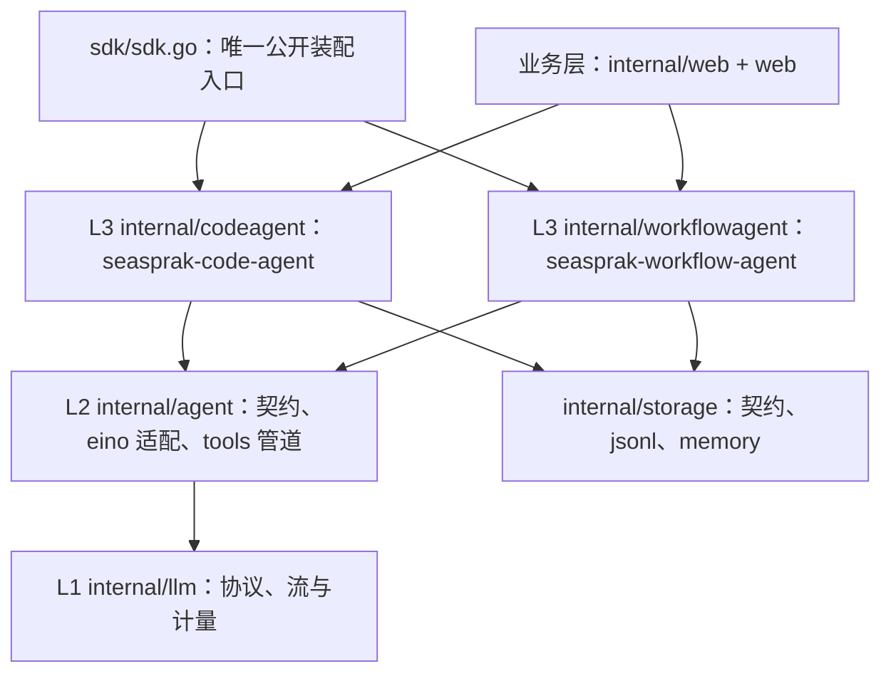
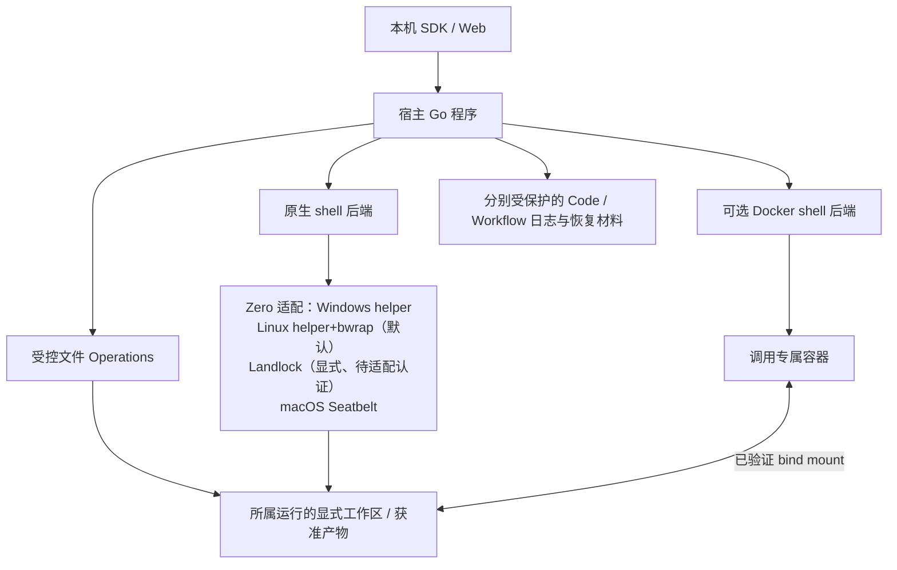

# 01 技术选型与总体架构

对应 PRD M01/M02；本章规定包依赖、装配和部署。运行行为归 [03](03-runtime-and-scheduling.md)，安全后端归 [11](11-security-and-sandbox.md)。

2026-10-01 已批准三层 SDK 与双 Agent 分层：L1 模型、L2 通用执行，以及同级且独立的 `seasprak-code-agent` / `seasprak-workflow-agent`；Web 是外侧业务应用。下文已按此决定修订正文，详细职责见 [SDK 与业务层的职责边界](../sdk-scope.md)。Code Agent 与共享存储已迁移，独立 Workflow Agent、工厂、三类 Web 资源路由及独立视图已接通，并有对应默认测试。最终认证见 [P3 验证记录](../p3-verification.md)；旧数据不迁移、不自动删除。

<a id="stack"></a>
## 1. 技术选型与版本

| 技术 | 确定选择 | 选择理由和边界 |
| --- | --- | --- |
| 工具链 | Go 1.27.0 | 与本地已通过 Eino 定向测试的工具链一致，构建和 CI 固定版本 |
| 执行 | Eino v0.9.21（本项目 `go.mod` 固定版本） | 使用 Agentic DeepAgent/TypedRunner/TurnLoop、Graph、Interrupt；不复制模型循环；前序源码调研提交 `ebd616c8291e957684ea6ca99dd54225d04e0438` 保留为证据基线 |
| 模型 | eino-ext `6752ff8da9b1ea85c8e91b27b0a64fef099f22f9` | agenticopenai / agenticclaude / agenticgemini / agenticdeepseek 各自为 module |
| 请求服务 | 标准库 net/http、encoding/json、log/slog | 本地接口和 SSE 不需要额外 Web 框架；不引入消息队列 |
| schema | github.com/santhosh-tekuri/jsonschema/v6 v6.0.3 | 本地编译工具/Workflow schema；不把模型 strict 当作本地校验 |
| 文件锁 | github.com/gofrs/flock v0.13.1 | 每个所属运行日志的跨进程排他写锁；Code/Workflow 各自串行提交，不共用写入者 |
| OS 能力 | golang.org/x/sys v0.48.0 | Windows API、Unix 进程/文件/沙箱调用 |
| 文件搜索 | ripgrep 15.2.0 | 各发布平台配套固定版本；使用受控 argv，不拼 shell 字符串 |
| 存储 | JSONL + 独立 blob | 本地可读、追加历史、符合 M10；首版不增加数据库 |
| 展示验证 | 同源静态 HTML/JS + fetch/SSE | 只验证公开能力，核心没有浏览器依赖 |

依赖通过 module 的 commit 对应版本固定在产品 go.mod/go.sum；不能对 eino-ext 根仓库执行一次 require 就认为锁定所有组件。开发可用显式 go.work 指向固定 checkout，发布不得包含作者机器的绝对 replace。上述附加库版本依据其发布 tag/go.mod；实际产品依赖编译仍进入 V-BUILD。

参考源码：pi `5cd93f688aaab89dbb6dfa4aca535f21796ae185`、DSH `ddefc45fbc7f8e46dd73185e68295696d1297887` 作为策略/审批行为参考；Zero `99721c762f37cd43ac511007a5f51d1846df959e` 作为原生三平台沙箱实现参考。独立产品工作目录采用前序工作名 pi-eino；不修改或依赖 pigo，不把相邻产品仓库作为运行依赖。Zero `internal` 包需抽取移植，不能直接 import。

<a id="layers"></a>
## 2. 代码层级

职责自下而上为模型 → 通用执行 → 上层 Agent，import 自上而下。上层包括 `internal/codeagent` 和 `internal/workflowagent`，二者互不导入，均可使用模型与共享存储。Eino/schema 是执行依赖，不拥有产品会话或业务路由。

公开入口只有 `github.com/ww1489/seasprak/sdk`，`sdk/sdk.go` 为单一生产文件。当前会话实现位于 `internal/codeagent`，存储契约及后端位于 `internal/storage`；工作流定义、编译、Eino Graph、运行与节点状态已独立归 `internal/workflowagent`，Code 旧目标/执行/恢复分支已退出。以下依赖图已在两类工厂、Web 资源与视图实际接线，并由架构默认测试约束；不据接线声明完整 P3 认证。共享错误/限额在 `internal/errors` / `internal/config`；`cmd/agentd` 仅帮助/版本，Web 服务入口为 `cmd/web`。


```mermaid
flowchart TB
    SDK["sdk/sdk.go：唯一公开装配入口"]
    Web["业务层：internal/web + web"]
    Code["L3 internal/codeagent：seasprak-code-agent"]
    Workflow["L3 internal/workflowagent：seasprak-workflow-agent"]
    Agent["L2 internal/agent：契约、eino 适配、tools 管道"]
    Model["L1 internal/llm：协议、流与计量"]
    Storage["internal/storage：契约、jsonl、memory"]
    SDK --> Code
    SDK --> Workflow
    Web --> Code
    Web --> Workflow
    Code --> Agent
    Workflow --> Agent
    Agent --> Model
    Code --> Storage
    Workflow --> Storage
```

D01-依赖图按层聚合。两类 L3 分别持有绑定、状态、日志写入者、版本引用、预算、审批与恢复；共享后端不等于共写日志。状态只依赖存储接口，不导入具体后端。L1/L2 不导入上层或 Web；存储不导入运行状态管理器；internal 不导入 sdk/cmd。internal/web 调用两类上层受控入口，不读写 manager；外部消费者仅导入 SDK。资源加载/注册返回候选，不反向调度运行对象。

| 目标包组（当前所有者与后续能力分开） | 负责 | 不负责 |
| --- | --- | --- |
| internal/llm | 有效模型选项、协议与缓存、usage、错误 | 查询上层运行、选历史、调用工具 |
| internal/agent、eino、tools | 通用 Agent、Eino 接线、消息、工具管道、执行端口与预算基础 | 工作流定义、业务路由、具体日志、HTTP |
| internal/codeagent | AgentSession 输入/Trace/维护协调、事件和生命周期 | 工作流图与节点状态、跨 Agent 编排 |
| internal/codeagent/state | 会话历史树、路径配置、持久事实及查询 | 工作流运行、具体后端 |
| internal/workflowagent | 定义/编译、Eino Graph、独立节点事实和生命周期 | 代码会话历史/队列、跨任务恢复 |
| 资源加载/扩展登记/授权策略 | 资源候选、注册版本、授权判断 | 自行替换活动运行，跨两类 Agent 冻结版本 |
| internal/storage、共用 Operations/沙箱实现 | 存储与效果契约的实现 | 决定意图或消费顶层输入 |
| sdk/sdk.go | 单入口公开类型及装配；L1/L2 仍可独立使用 | 第二个长驻运行控制器 |
| internal/web、web、cmd/web | 双 Agent 业务消费、目录/展示、资源路由、HTTP/SSE/UI | 直接写状态、绕过权限/预算、第二模型循环 |
| cmd/agentd | 帮助和版本 | 启动 HTTP 或导入 SDK/internal |

产品核心没有通用 Host/大 Environment 对象；文件、进程、产物、授权、历史来源按用途分别注入。只抽象已需要的生产实现与测试替身。

<a id="assembly"></a>
## 3. 创建入口与默认能力

```go
func CreateAgentSession(ctx context.Context, opts SessionOptions) (*AgentSession, error)
func OpenAgentSession(ctx context.Context, opts SessionOptions) (*AgentSession, error)

session, err := sdk.CreateAgentSession(ctx, sdk.SessionOptions{
    Workspace: workspace, StateRoot: stateRoot,
    Model: configuredModel, Tools: controlledTools,
    Profile: sdk.ProfileMemory, Principal: principal,
    GenerationFingerprint: buildFingerprint,
})
if err != nil {
    return err
}
```

当前 SessionOptions 是 `codeagent.Options` 的公开别名，Workspace/StateRoot/SessionID 为 string，Model 为 `model.AgenticModel`，工具与普通目标经 Tools/Agents 静态装配；另有 Store、Policy、Operations、ResourceScheduler/ResourceEnvironment、Limits、Instruction、ReadOnly、ReconcileQueries 等字段。完整资源加载与 ExtensionRegistry/通用 hook 保持未来阶段，不能在当前示例使用不存在的 OpenOptions/Extensions/Resources 配置。真实字段以 `sdk/sdk.go` 和 `internal/codeagent/options.go` 为准，不为组件命名另加重复工厂。相关语义由 02/04/07/10/11/12 主定义。

独立工作流已交付的源码入口：`WorkflowAgent`、`WorkflowOptions`、`CreateWorkflowAgent` / `OpenWorkflowAgent`。选项包括显式工作区、独立状态位置、固定工作流定义/子流程绑定、允许的模型/工具、授权策略和限额。创建只装配；结构化输入完成 schema 校验与持久受理后执行。打开保留原绑定，校验定义与实现指纹，跨运行类型或不兼容旧开发数据明确拒绝；只读不执行。工作流不创建 AgentSession、聊天历史或第二个模型循环。

Code Agent 创建顺序（独立 Workflow 的装配与受理见 06 §3.0、10 §workflows，不执行以下聊天能力装配）：

1. 校验显式工作区、真实路径、执行环境、可读写根和受保护数据根关系；不先运行模型。
2. 构造持久或显式内存后端，取得会话写锁；绑定身份、版本和初始分支。
3. ResourceLoader 读取候选资源；ExtensionRegistry 校验名称/schema/来源并生成不可变 generation。
4. 解析模型能力与凭据引用，装配受控 FileOperations、ProcessOperations、ArtifactStore、策略与审批通道。
5. 装配默认 ls/read_file/write_file/edit_file/glob/grep/execute、write_todos、general-purpose；缺少必要后端或保护条件直接失败。开发者裁剪必须显式指定，提示词只描述实际能力。
6. 构建 Agentic Agent 工厂及窄控制接口，保存创建结果；会话就绪后发布 session_start 通知。创建不自动执行旧队列。
7. 返回 AgentSession、能力状态和可查询诊断；部分构建失败释放本次资源和锁，不留下看似可执行的半成品。

默认能力保留 Eino 语义，采用显式受控装配：需要自定义 filesystem middleware 或 general-purpose 包装器时，关闭对应隐式重复装配并显式加入等价能力。这是装配实现选择，不是裁剪产品默认能力。创建后以实际工具列表验收，不能仅检查 Eino flags。

打开旧 Session 读取原工作区绑定并重新验证；不可用时可只读浏览历史，不能静默改绑定或自动 resume。换业务工作区创建/切换另一 Session。

<a id="coordination"></a>
## 4. 协调模型与执行端口

每个 AgentSession 有独立命令邮箱和串行协调 goroutine，管理本代码会话状态、去重、游标和 durable 发布。Workflow Agent 有独立协调与日志，管理自己的运行/节点事实。两者不共享邮箱或状态管理器。模型、工具、摘要、核对工作异步进行，返回带身份和预期版本的结果。

L2 定义端口：ExecutionSink 提交执行事实、ContextSource 取得固定范围、InputSource 取得本 invocation 可消费输入、ToolAuthorizer 判断冻结操作、BoundaryController 提供轮后决定。L3 的适配对象实现端口；端口参数是 L2 值类型，不传 AgentSession/SessionManager 指针。

协调者只处理短状态变更和提交，不等待执行 worker 的完成。worker 可等待某项必要提交的回执；hook 的耗时工作也不能占住协调者。分支/压缩操作先固定 precondition，工作结束后再次比较；新 follow-up 受理增加控制记录不等于历史叶子变化。

两类独立运行均可并行，不承诺跨运行事务或总预算。受控 Operations 在所属运行内按资源身份协调冲突写；业务负责独立运行之间的访问次序，同一工作区不产生 SDK 跨 Agent 联动调度。跨进程/外部编辑不承诺事务隔离，编辑复核原内容。业务工具组合显式传入允许的输入和取消，不自动继承另一运行的历史、版本、审批或恢复。任意 Go 扩展是信任代码，不能以 context 宣称强制隔离。

<a id="deployment"></a>
## 5. 宿主部署


```mermaid
flowchart TB
    C["本机 SDK / Web"] --> S["宿主 Go 程序"]
    S --> F["受控文件 Operations"]
    S --> N["原生 shell 后端"]
    S --> D["可选 Docker shell 后端"]
    N --> W["Zero 适配：Windows helper<br/>Linux helper+bwrap（默认）<br/>Landlock（显式、待适配认证）<br/>macOS Seatbelt"]
    D --> B["调用专属容器"]
    F --> WS["所属运行的显式工作区 / 获准产物"]
    W --> WS
    B <-->|已验证 bind mount| WS
    S --> DB["分别受保护的 Code / Workflow 日志与恢复材料"]
```

D02-部署图中的 Docker 只承接 shell；挂载和逻辑路径由受信配置确定。主服务不放到执行容器中。平台发布目标为 Windows、Linux、macOS；每个 OS/arch 和后端组合记录实际认证结果，不把交叉编译等同于沙箱认证。

`cmd/agentd` 保持 help/version 及不导入 SDK/internal 的限制；本机回环 HTTP 与同源 Web 在 `cmd/web` 装配。当前页面分别提供 Code 会话与独立 Workflow 定义/运行视图，两类受控资源已接线且有默认测试；真实浏览器与最终认证见验证记录。完整原生后端、多用户、分布式调度、插件市场和完整 A2UI 不因此成为本轮交付。

<a id="lifecycle"></a>
## 6. 关闭与故障

AgentSession.Close 按本代码会话的停止/取消策略安置执行，再释放引用、订阅与写锁。Workflow Agent 独立关闭其节点运行和日志；不得用关闭代码会话推断无关联工作流停止。两类都须等待实际退出；超时返回未完成且保留锁，不伪造停止。基础恢复只允许经过验证的条件；工作流节点结果复用不等于原生整图 checkpoint 或跨 Agent 恢复。

存储故障禁止新的副作用、输入 accepted 和 durable 成功；已有运行尝试停止，未知结果留待重启核对。平台后端缺失拒绝受限配置；模型缺能力拒绝请求；资源重载失败保留原 generation。

<a id="evidence"></a>
## 7. 源码依据与验收

- [Eino DeepAgent 配置和构造](../../../eino/adk/prebuilt/deep/deep.go)：Backend/Shell 条件装配、TypedConfig、SubAgents。
- [TurnLoop](../../../eino/adk/turn_loop.go)：Run/Stop/Wait 和 checkpoint，见 03 的具体接线。
- [现成 local backend](../../../eino-ext/adk/backend/local/local.go)：声明 Windows 不支持且执行 /bin/sh，不能直接作为本产品跨平台安全后端。
- [PRD 分层](../pi-eino-prd/02-architecture-boundaries.md)和[源码证据基线](../pi-eino-prd/source-evidence.md)。

验收 V-ARCH：依赖检查拒绝下层导入上层、两类 L3 互相导入、存储依赖运行管理器及 Web 直接写状态；无 HTTP 的 L1/L2 与两类 L3 均可经唯一 SDK 入口使用。独立工作流无需代码会话且主模型请求为零；两类历史、预算、审批、游标和恢复互不串用。显式工作区、真实能力、缺后端拒绝、只读零执行与关闭真实退出继续验收。原生检查点预检触发宿主全局回调仍是阻塞，分层通过不等于 P3 完成。
