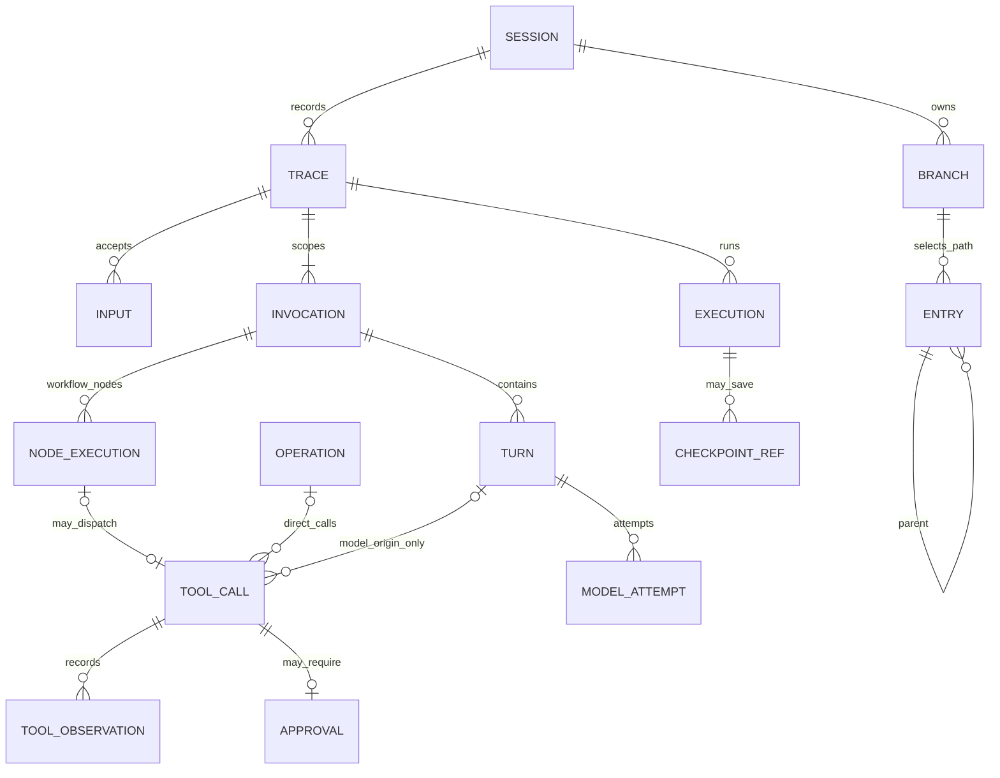
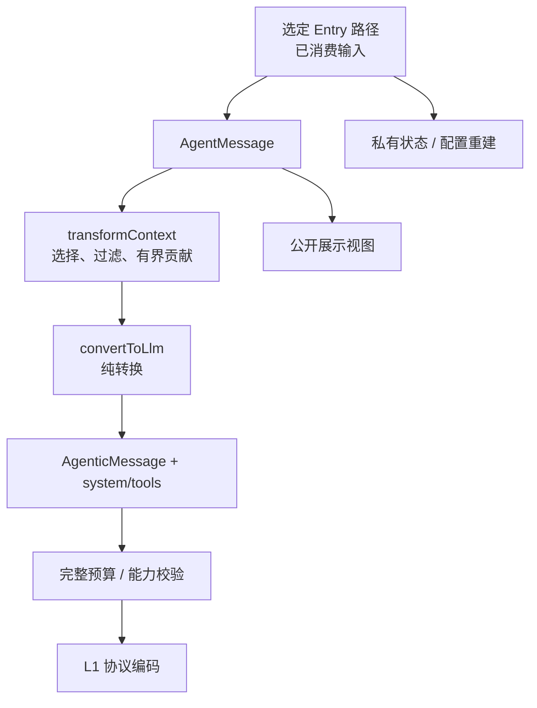

# 02 数据契约与消息

对应 PRD M06，并统一 M03/M05/M07/M10/M12 共用字段。所有类型均为待实现规格；模型内容复用 Eino，不再建立第二套供应商消息 SDK。

<a id="identities"></a>
## 1. 身份与关系

ID 由受信服务端/SDK 装配方使用随机 128-bit 值生成，作为不透明字符串；不把时间、模型文本或 provider call ID 当作全局产品身份。日志顺序由序号定义，时间仅供显示。

| 字段 | 唯一范围与生命周期 |
| --- | --- |
| sessionId | 持续会话，固定工作区绑定；分叉分支不换 Session |
| branchId / leafId | 分支头引用与当前追加游标；可恢复保存 |
| traceId | 一次完整执行，从受理独立输入到终态；follow-up/steering/resume 不换 |
| turnId | 一个 invocation 的一次逻辑模型生成及工具批次；重试/审批恢复不换 |
| executionId | 一段 Eino 执行，重建/resume 可换；agent_start/end 按它配对 |
| invocationId / parentInvocationId | 主/子执行范围；同名子 Agent 多次调用分别分配。独立 Workflow 是根 invocation，子委派关联父调用 |
| targetAgent | 本次 Trace 的执行者引用，由名称/版本/generation 表达；独立输入受理时固定并保存，queued 也保留引用。新 chat/prompt 缺省选择主 Agent；定向输入继承 targetTraceId 的原目标，错配拒绝 |
| inputId | 一次受理输入；一个 input 只能被确定作用域消费一次 |
| messageId | 一条候选/最终消息；失败与成功 attempt 使用不同候选 ID |
| toolCallId / providerCallId | 产品调用 ID 对所有来源必需；providerCallId 仅 model 来源存在，并只在 Turn/invocation 内唯一 |
| nodeExecutionId | workflow invocation + nodeId + 逻辑访问序号对应的持久节点身份；工具节点关联稳定 toolCallId，重试/恢复不换 |
| operationId / interactionId / approvalId | 维护/核对、用户交互、一次许可；同一审批交互关联同一对 ID |
| generation / selectionRevision | Trace 固定的实现资源版本、Turn 生效工具清单版本 |
| projectionRevision / modelConfigVersion | 上下文投影和有效模型配置；resume 取 checkpoint 对应值 |
| commitSeq / durableSeq | Session 内提交顺序与持久事件顺序，不能混用 |
| streamId / chunkSeq | 临时流与流内序号，重连/重启可变 |
| attempt / transportAttempt | 逻辑模型的 ADK 尝试、实际传输请求；用于防止重试叠加 |



D03-关系图表示归属。Entry 的 parent 只有一个；Branch 对 Entry 是路径选择，不意味着复制节点。queued Trace 可以尚无 invocation/Turn；开始执行时才创建顶层 invocation。无模型 Workflow 可有 invocation 和节点调用而没有 Turn。ToolCall 的 origin=model/workflow_node/direct 由受信适配器建立；图中 Turn/NodeExecution/Operation 的关联按来源适用，不要求每次调用都具有三者。工作流工具节点以 nodeExecutionId 对应稳定 toolCallId，缺省 turnId/providerCallId 不表示记录损坏；不能借用父 task 的 Turn 或虚构模型请求。Trace 记录受理时固定的 targetAgent 和 generation；独立 Workflow 的结构化结果沿用产品消息，不伪造工具结果。

摘要、Auto 等辅助模型调用使用独立 modelCallId/purpose 并关联原 Trace/invocation 或维护 operation；不为它们创建一次用户对话 Turn。它们同样保存 attempt/usage 并占共享预算，图中的 Turn→ModelAttempt 只表示主/子 Agent 的业务生成关系。

### 1.1 工作区与执行范围字段

| 值对象 | 字段与生成方 |
| --- | --- |
| WorkspaceRequest | root（必需的绝对目录）、environmentRef、shellBackendRef；来自调用方意图，不直接作为可信路径 |
| WorkspaceBinding | workspaceId、hostRealRoot、executionEnvironmentId、shellBackend、resourceMapVersion、artifactRootRef、tempRootRef；由创建函数解析/校验后生成并保存 |
| ExecutionScope | sessionId、branchId、traceId、invocationId、parentInvocationId、generation；运行时建立，传下层作为不透明身份 |
| TurnScope | ExecutionScope + turnId、selectionRevision、projectionRevision、modelConfigVersion；发送模型前固定 |
| CommandMeta | idempotencyKey、expectedRevision、服务端建立的 Principal；HTTP body 不能替换 Principal |

SDK 可以使用受信 WorkspaceBinding 构造器；HTTP 创建入口只接受 WorkspaceRequest，并在工厂内解析。SessionOptions 中的绑定仍须重新检查实际环境，不能凭调用者声称已验证而跳过。不同 shell 后端的映射不静默修改旧 Session 绑定，影响恢复的变更按 09 兼容性规则处理。

<a id="messages"></a>
## 2. 消息与持久条目

```go
type AgentMessage struct {
    ID        string
    Kind      MessageKind
    Scope     MessageScope
    Source    SourceRef
    Status    MessageStatus
    Standard  *schema.AgenticMessage // 标准 User/Assistant/ToolResult
    Custom    *CustomMessage        // 通用扩展消息
    Summary   *SummaryMessage      // 压缩/分支摘要
    Command   *CommandMessage      // 直接命令记录
    Opaque    *OpaqueMessage       // 未知特殊结构原样保存
}
type CustomMessage struct {
    CustomType string
    Content    *schema.AgenticMessage // 仅允许用户输入内容块
    Details    json.RawMessage
    Display    bool
}
```

这是带判别字段的有限联合：Kind 决定恰好一个 payload，不允许多个字段同时有效。MessageScope 按事实携带 session/trace/turn/invocation/input/toolCall 引用；导入历史或空闲自定义消息可以没有执行身份。

| Kind | 含义 | 模型转换 |
| --- | --- | --- |
| user | 用户输入或允许的结构化贡献 | Agentic user 内容块；Source 另判来源 |
| assistant | 模型响应，包含文本、公开推理及工具调用 | 保留成功接纳的标准块、顺序及必要回放 metadata |
| tool_result | 对应本地工具的结果 | user role + FunctionToolResult；CallID 配对 |
| custom | 应用提供模型可读 content | 转为 user；details 不入模型，display 不控制模型可见性 |
| command | 用户直接发起的命令及结果 | 有来源标记的 user 上下文；没有模型 call 就不伪造 tool result |
| compaction_summary / branch_summary | 主线压缩或其他分支探索材料 | 有明确语义标记的 user 内容，加有界程序附录 |
| opaque | 未知特殊数据 | 保留；必需参与模型但无转换规则则失败 |

系统指令单独由受信装配提供，在模型边界形成 system。标准三类语义不等于 Eino 的三个 role：FunctionToolResult 是 user 块，不能据 role 授权。失败、拒绝、超时等产品工具状态保存在 ToolObservation；构造 Eino result 时提供明确反馈，不能臆造 Agentic 的 isError 字段。

MessageStatus 为 complete/incomplete；candidate 是未提交聚合状态，不作为已完成历史。被失败或重试取代的 assistant 默认排除成功上下文，保留诊断；已经接纳的完整工具因果组不得只删一端。普通扩展无需为每个 customType 注册 codec，只有 Opaque 特殊结构需要明确投影规则。

SessionEntry 另有 entryId/parentId/type/version/payload：message、compaction、branch_summary 形成上下文；model_change/thinking_change 重建路径配置；session_info/label/custom_entry 仅是元数据/扩展状态。header、输入队列和 checkpoint 关联都是控制记录，不冒充树中消息。

<a id="projection"></a>
## 3. 两阶段投影与展示



D04-投影图由 07 调度。convertToLlm 不访问网络、不调用工具、不修改历史；相同输入和版本得到相同结果。display=false 的 custom 仍可入模型，明确排除上下文的消息即使可展示也不入模型。展示、模型参与与授权过滤分别处理；摘要和文件附录不能重新引入被排除内容。

标准块保留媒体、工具配对和可回放签名。跨模型无法解释的私有字段按 L1 能力拒绝或显式转换，不把签名当正文。CustomMessage 不允许通过自行填写 system/assistant role 提升信任级别。

<a id="provenance"></a>
## 4. 原始输入和派生来源

InputRecord 保存 immutable 原始内容或受保护引用、受信 Principal、来源通道、目标、时间、内容摘要和幂等键。input hook、模板、skill 展开生成 DerivedInput，关联原 inputId、转换器 ID/version 和派生内容；原文不覆盖、不再次隐式发送给主模型。

SourceKind 区分 human、direct_parent、extension、tool、model、resource、imported。接入认证与运行时委派建立身份；JSON payload、role、自填 source 不建立信任。SourceRef 可以公开脱敏描述，敏感原文只由被授权查询读取。

Auto 的授权材料仅取已消费、适用于当前作用域的受信原文、直接父委派和有效限制。pending follow-up、摘要、工具输出、项目文件、导入标签和派生 user 内容不变为人类许可。原文缺失或预算不足时不可凭摘要放行，详见 11。

<a id="records"></a>
## 5. 运行与效果记录

| 对象 | 必需字段与校验 |
| --- | --- |
| InputReceipt | inputId、traceId、actualKind、targetAgent、state、acceptedCommit；同键重试返回原值；目标不同视为异内容 |
| TraceRecord | 状态、原输入、目标 Agent、分支/起点、generation、初始/有效模型、预算累计、活动 invocation、停止原因、队列 hold |
| TurnRecord | invocation、逻辑调用、selectionRevision、投影/模型版本、attempt 记录、工具清单、结束状态 |
| ToolCall | 产品 ID、origin、实际 invocation/operation、冻结描述引用/hash、generation、父调用、资源声明；model 另有 Turn/selectionRevision/providerCallId，workflow_node 另有 nodeExecutionId/定义与绑定引用 |
| ToolObservation | observationId/version、结果状态、sideEffect、启动证据、退出/取消信息、content/details、产物、文件 facts |
| Interaction | 类型、关联调用/节点、提问/选项、待答状态、有效期、checkpointRef；审批答案不能替换冻结参数，补参答案只进入原请求指定的待补字段并重新校验 |
| Reconciliation | operationId、原 observation、证据及来源、确认/未知效果、冲突限制、恢复资格 |
| OperationReceipt | operationId、accepted/running/completed/failed/cancelled、目标、幂等关联；受理不表示执行成功 |
| GenerationManifest | 实现版本、schema/资源 hash、工作流定义/子流程/节点执行器绑定、handler 顺序、build 兼容标识 |
| CheckpointRef | blob hash、原 execution、targetAgent、未完成 Turn、模型/投影/选择/扩展状态提交位置、兼容指纹 |

ToolOutcome 枚举 succeeded/failed/denied/cancelled/timed_out/outcome_unknown；SideEffect 为 none/confirmed/unknown。waiting_approval 仅是等待态。多个文件效果可各自确认，不能用一个 failed 抹去部分写入。核对追加新 observation 关联旧记录，不覆盖原 unknown。

<a id="events"></a>
## 6. 事件信封

```go
type Event struct {
    SchemaVersion int             `json:"schemaVersion"`
    Type          string          `json:"type"`
    Scope         EventScope      `json:"scope"`
    EventID       string          `json:"eventId,omitempty"`
    DurableSeq    *uint64         `json:"durableSeq,omitempty"`
    StreamID      string          `json:"streamId,omitempty"`
    ChunkSeq      *uint64         `json:"chunkSeq,omitempty"`
    OccurredAt    time.Time       `json:"occurredAt"`
    Payload       json.RawMessage `json:"payload"`
}
```

EventScope 的 sessionId 必需，其余按事件类型提供。持久事件分配 eventId/durableSeq；临时流用 streamId/chunkSeq。attempt/blockIndex 位于相关消息 payload，观测 span 独立命名。必需关联缺失拒绝发布。事件族和发布顺序由 06 定义。

<a id="errors"></a>
## 7. 错误与兼容

公开错误为 `code/message/retryable/refs/details`；details 是允许公开的结构，不返回内部栈/凭据。固定 code：invalid_argument、unauthenticated、permission_denied、not_found、state_conflict、idempotency_conflict、unsupported_capability、budget_exhausted、storage_unavailable、incompatible_version、incompatible_resume、reconciliation_required、resync_required、resource_unavailable、internal_error。供应商错误按 04 归一化后放入公开 cause，而不是任意新增顶层状态。

schemaVersion=1；同 major 的新增可选字段可忽略。未知事件可跳过；关键状态/文件版本无法解释时明确拒绝推断成功。格式迁移由 09 整体管理，不按每个 customType 另建迁移平台。

<a id="evidence"></a>
## 8. 证据与验收

[AgenticMessage 内容块及聚合](../../eino/schema/agentic_message.go)、[pi Message](../../pi/packages/ai/src/types.ts)、[pi 应用消息转换](../../pi/packages/coding-agent/src/core/messages.ts)是参考。产品身份、原始授权来源和一致提交是新增契约。

V-MSG：三类标准、多模态、工具失败及签名往返；未知 custom/opaque；display 与模型参与的四组合；失败 attempt 独立；input 转换后原文仍可核对；导入伪造 human 无效。V-ID：同名/同 provider CallID 的不同 invocation 不串线，恢复保持原 Turn/调用而更新 executionId。
