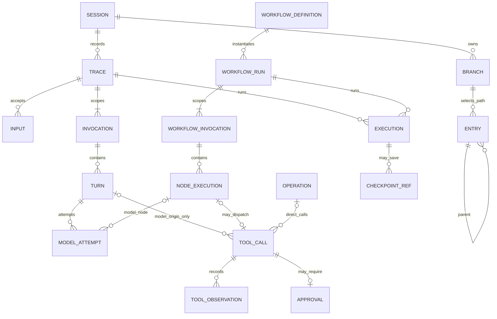
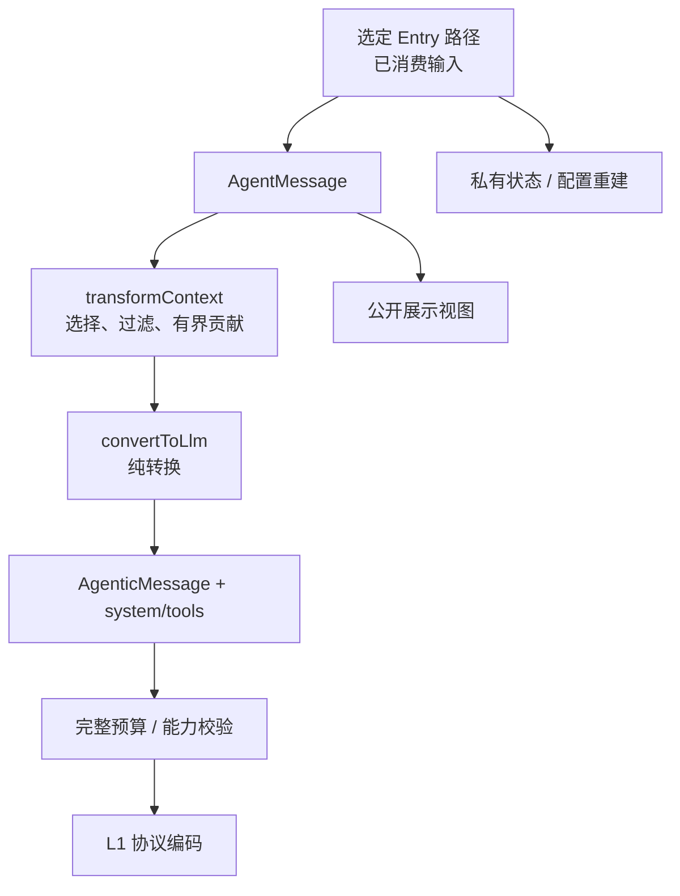

# 02 数据契约与消息

对应 PRD M06，并统一 M03/M05/M07/M10/M12 共用字段。模型内容复用 Eino，不再建立第二套供应商消息 SDK。2026-10-01 修订将 Code Agent 与 Workflow Agent 的身份、状态及事件作用域分开；独立工作流的作用域与入口已接入源码；下文完整契约仍须区分当前值类型/网络白名单与未来条目，默认测试和最终认证见 [P3 验证记录](../p3-verification.md)。现有 Code Agent 的 `AgentSession`、`CreateAgentSession` / `OpenAgentSession` 保留。

<a id="identities"></a>
## 1. 身份与关系

ID 由受信服务端/SDK 装配方使用随机 128-bit 值生成，作为不透明字符串；不把时间、模型文本或 provider call ID 当作全局产品身份。日志顺序由序号定义，时间仅供显示。

| 字段 | 唯一范围与生命周期 |
| --- | --- |
| sessionId | Code Agent 的持续会话，固定自身工作区绑定；分叉不换 Session，不用作工作流运行 ID |
| workflowId / workflowRunId | 工作流定义身份与一次独立图运行身份；运行受理时固定定义/绑定版本，工作区、日志、状态与恢复均归该运行；工作流格式/工厂当前已接线，根标识为 RunID（JSON `runId`），定义由 Name/Version 标识 |
| branchId / leafId | Code Agent 分支头引用与当前追加游标；可恢复保存，不用于工作流节点导航 |
| traceId | Code Agent 内的一次完整执行，从受理到终态；follow-up/steering/resume 不换。Workflow Agent 使用自己的 workflowRunId，不为图运行伪造聊天 Trace；业务关联不把独立执行合并为一个 Trace |
| turnId | Code Agent 一个 invocation 的一次逻辑模型生成及工具批次；重试/审批恢复不换。工作流节点不为自己或父调用伪造 Turn |
| executionId | 所属运行的一段 Eino 执行，重建/resume 可换；内部 start/end 按它配对 |
| invocationId / parentInvocationId | 所属运行内的主/普通子 Agent 或静态子流程执行范围；同名多次调用分别分配。业务工具调用另一独立 Agent 只保存业务引用，不制造跨两类状态所有者的 invocation 树 |
| targetAgent | 仅 Code Agent Trace 的普通执行者引用，名称/版本/generation 在独立输入受理时固定并保存，queued 也保留；不指向工作流定义。定向输入继承 targetTraceId，错配拒绝 |
| inputId | 一次所属运行受理输入；只能被确定作用域消费一次。工作流结构化输入不进入 Code Agent 队列 |
| messageId | 一条候选/最终消息；失败与成功 attempt 使用不同候选 ID |
| toolCallId / providerCallId | 产品调用 ID 对所有受控来源必需；providerCallId 仅 model 来源存在，并只在其逻辑调用/invocation 内唯一 |
| nodeExecutionId | workflowRunId + workflow invocation + nodeId + 逻辑访问序号对应的持久节点身份；工具节点关联稳定 toolCallId，重试/恢复不换，不写入 Code Agent Snapshot |
| operationId / interactionId / approvalId | 所属运行内的维护/核对、节点或工具交互、一次许可；同一审批交互关联同一对 ID，跨运行不可复用 |
| generation / selectionRevision | 各自运行固定的实现资源版本；selectionRevision 仅适用于模型工具清单，不让一个运行冻结另一类 Agent 的版本 |
| projectionRevision / modelConfigVersion | 所属上下文投影和有效模型配置；resume 取本运行恢复点对应值 |
| commitSeq / durableSeq | 各自日志的提交顺序与持久事件顺序，不能混用或拼成全局游标 |
| streamId / chunkSeq | 临时流与流内序号，重连/重启可变 |
| attempt / transportAttempt | 逻辑模型尝试与实际传输请求；主/子 Agent 和工作流模型节点均计量，但仅记入所属预算 |


```mermaid
erDiagram
    SESSION ||--o{ BRANCH : owns
    SESSION ||--o{ TRACE : records
    TRACE ||--o{ INPUT : accepts
    TRACE ||--|{ INVOCATION : scopes
    INVOCATION ||--o{ TURN : contains
    TURN ||--o{ MODEL_ATTEMPT : attempts
    TURN o|--o{ TOOL_CALL : model_origin_only
    BRANCH ||--o{ ENTRY : selects_path
    ENTRY ||--o{ ENTRY : parent
    WORKFLOW_DEFINITION ||--o{ WORKFLOW_RUN : instantiates
    WORKFLOW_RUN ||--|{ WORKFLOW_INVOCATION : scopes
    WORKFLOW_INVOCATION ||--o{ NODE_EXECUTION : contains
    NODE_EXECUTION o|--o{ MODEL_ATTEMPT : model_node
    NODE_EXECUTION o|--o| TOOL_CALL : may_dispatch
    OPERATION o|--o{ TOOL_CALL : direct_calls
    TOOL_CALL ||--o{ TOOL_OBSERVATION : records
    TOOL_CALL ||--o| APPROVAL : may_require
    TRACE ||--o{ EXECUTION : runs
    WORKFLOW_RUN ||--o{ EXECUTION : runs
    EXECUTION ||--o{ CHECKPOINT_REF : may_save
```

D03-关系图分别表示会话与独立工作流运行的归属，不表示两个根共享可变对象或同一日志。Entry 的 parent 只有一个；Branch 是 Code Agent 路径选择。queued Code Agent Trace 可以尚无 invocation/Turn；工作流可只有自身 invocation 和节点而无 Turn。ToolCall 的 origin=model/workflow_node/direct 由所属受信适配器建立；Turn/NodeExecution/Operation 关联按来源适用，节点缺省 turnId/providerCallId 不是损坏，也不能借用业务父工具的 Turn。工作流结果直接属于 workflowRunId；业务组合只把一条匹配原调用的结果/引用写回调用方，不把节点状态并入 Code Agent Snapshot。

Code Agent 摘要，以及两类 Agent 的 Auto 等辅助模型调用使用独立 modelCallId/purpose，分别关联 Code Trace/invocation、Workflow 节点或所属维护 operation；不为它们创建用户对话 Turn，不赋予工作流聊天压缩能力。它们保存 attempt/usage 并占所属运行预算，不能据共享 L1/L2 推导跨两类 Agent 的统一总账。工作流模型节点同样登记逻辑调用及实际请求，但不强行执行聊天循环。

### 1.1 工作区与执行范围字段

下表的 `WorkspaceRequest`、`WorkspaceBinding` 是未来部署与执行环境抽象的设计对象，所列丰富字段是设计要求；它们不是当前 SDK 公开类型或 HTTP 创建 DTO，当前也没有公开的受信绑定构造器。

| 值对象 | 字段与生成方 |
| --- | --- |
| WorkspaceRequest | root（必需的绝对目录）、environmentRef、shellBackendRef；来自调用方意图，不直接作为可信路径 |
| WorkspaceBinding | workspaceId、hostRealRoot、executionEnvironmentId、shellBackend、resourceMapVersion、artifactRootRef、tempRootRef；由创建函数解析/校验后生成并保存 |
| ExecutionScope | Code Agent 的 sessionId、branchId、traceId、invocationId、parentInvocationId、generation；Workflow Agent 使用自身 workflowRunId、invocation/节点身份和 generation，不携带另一类运行的可写指针 |
| TurnScope | Code Agent ExecutionScope + turnId、selectionRevision、projectionRevision、modelConfigVersion；发送模型前固定。工作流模型节点固定自身模型调用/节点范围，不建立虚假 Turn |
| CommandMeta | idempotencyKey、expectedRevision、服务端建立的 Principal；HTTP body 不能替换 Principal |

当前 SDK 的 `SessionOptions.Workspace` 和 `WorkflowOptions.Workspace` 均为显式目录路径字符串；两个 HTTP 创建入口使用 `workspace` 路径字符串，调用方应传入获准且已存在的绝对目录，不接收 `root/environmentRef/shellBackendRef` 对象。各自工厂仍须重新检查实际路径与环境，不能凭调用者声称已验证而跳过。不同 shell 后端的映射不静默修改原运行绑定，影响恢复的变更按 09 兼容性规则处理；业务组合也不继承调用方绑定或授权。

<a id="messages"></a>
## 2. 消息与持久条目

```go
type AgentMessage struct {
    ID        string
    Kind      MessageKind
    Scope     MessageScope
    Source    SourceRef
    Status    MessageStatus
    Standard  *schema.AgenticMessage // 标准 User/Assistant/ToolResult
    Custom    *CustomMessage        // 通用扩展消息
    Summary   *SummaryMessage      // 压缩/分支摘要
    Command   *CommandMessage      // 直接命令记录
    Opaque    *OpaqueMessage       // 未知特殊结构原样保存
}
type CustomMessage struct {
    CustomType string
    Content    *schema.AgenticMessage // 仅允许用户输入内容块
    Details    json.RawMessage
    Display    bool
}
```

这是带判别字段的有限联合：Kind 决定恰好一个 payload，不允许多个字段同时有效。MessageScope 按事实携带所属 Code Agent 的 session/trace/turn/invocation/input/toolCall 引用，或所属 Workflow Agent 的 workflowRunId/节点/模型调用/toolCall 引用；两类运行根互斥，不把工作流结果伪装成 Code Turn。工作流只在节点确有消息内容时复用消息契约，图进度和结构化结果仍是自身记录，不强制形成聊天历史。业务组合写回的唯一 tool_result 使用调用方原调用作用域，可携带业务结果引用而不合并内层节点状态。导入历史或空闲自定义消息可以没有执行身份。

| Kind | 含义 | 模型转换 |
| --- | --- | --- |
| user | 用户输入或允许的结构化贡献 | Agentic user 内容块；Source 另判来源 |
| assistant | 模型响应，包含文本、公开推理及工具调用 | 保留成功接纳的标准块、顺序及必要回放 metadata |
| tool_result | 对应本地工具的结果 | user role + FunctionToolResult；CallID 配对 |
| custom | 应用提供模型可读 content | 转为 user；details 不入模型，display 不控制模型可见性 |
| command | 用户直接发起的命令及结果 | 有来源标记的 user 上下文；没有模型 call 就不伪造 tool result |
| compaction_summary / branch_summary | 主线压缩或其他分支探索材料 | 有明确语义标记的 user 内容，加有界程序附录 |
| opaque | 未知特殊数据 | 保留；必需参与模型但无转换规则则失败 |

系统指令单独由受信装配提供，在模型边界形成 system。标准三类语义不等于 Eino 的三个 role：FunctionToolResult 是 user 块，不能据 role 授权。失败、拒绝、超时等产品工具状态保存在 ToolObservation；构造 Eino result 时提供明确反馈，不能臆造 Agentic 的 isError 字段。

MessageStatus 为 complete/incomplete；candidate 是未提交聚合状态，不作为已完成历史。被失败或重试取代的 assistant 默认排除成功上下文，保留诊断；已经接纳的完整工具因果组不得只删一端。普通扩展无需为每个 customType 注册 codec，只有 Opaque 特殊结构需要明确投影规则。

SessionEntry 另有 entryId/parentId/type/version/payload：message、compaction、branch_summary 形成上下文；model_change/thinking_change 重建路径配置；session_info/label/custom_entry 仅是元数据/扩展状态。header、输入队列和 checkpoint 关联都是控制记录，不冒充树中消息。

<a id="projection"></a>
## 3. 两阶段投影与展示


```mermaid
flowchart TB
    E["选定 Entry 路径<br/>已消费输入"] --> A["AgentMessage"]
    A --> T["transformContext<br/>选择、过滤、有界贡献"]
    T --> C["convertToLlm<br/>纯转换"]
    C --> M["AgenticMessage + system/tools"]
    M --> B["完整预算 / 能力校验"]
    B --> P["L1 协议编码"]
    A --> UI["公开展示视图"]
    E --> Meta["私有状态 / 配置重建"]
```

D04-投影图是 Code Agent 选定历史路径的例子，由 07 调度。工作流模型节点只对自身允许材料复用转换和完整预算，不继承 Code 历史、分支或压缩路径。convertToLlm 不访问网络、不调用工具、不修改历史；相同输入和版本得到相同结果。display=false 的 custom 仍可入模型，明确排除上下文的消息即使可展示也不入模型。展示、模型参与与授权过滤分别处理；摘要和文件附录不能重新引入被排除内容。

标准块保留媒体、工具配对和可回放签名。跨模型无法解释的私有字段按 L1 能力拒绝或显式转换，不把签名当正文。CustomMessage 不允许通过自行填写 system/assistant role 提升信任级别。

<a id="provenance"></a>
## 4. 原始输入和派生来源

InputRecord 保存 immutable 原始内容或受保护引用、受信 Principal、来源通道、目标、时间、内容摘要和幂等键。input hook、模板、skill 展开生成 DerivedInput，关联原 inputId、转换器 ID/version 和派生内容；原文不覆盖、不再次隐式发送给主模型。

SourceKind 区分 human、direct_parent、extension、tool、model、resource、imported。接入认证与运行时委派建立身份；JSON payload、role、自填 source 不建立信任。SourceRef 可以公开脱敏描述，敏感原文只由被授权查询读取。

Auto 的授权材料仅取已消费、适用于当前作用域的受信原文、直接父委派和有效限制。pending follow-up、摘要、工具输出、项目文件、导入标签和派生 user 内容不变为人类许可。原文缺失或预算不足时不可凭摘要放行，详见 11。

<a id="records"></a>
## 5. 运行与效果记录

| 对象 | 必需字段与校验 |
| --- | --- |
| InputReceipt | Code Agent 的 inputId、traceId、actualKind、普通 targetAgent、state、acceptedCommit；同键重试返回原值；目标不同视为异内容。独立工作流受理结果关联 workflowRunId，不当作此队列回执 |
| TraceRecord | Code Agent 执行状态、原输入、普通目标 Agent、分支/起点、generation、初始/有效模型、预算累计、活动 invocation、停止原因、队列 hold；不保存工作流节点状态 |
| TurnRecord | Code Agent invocation、逻辑调用、selectionRevision、投影/模型版本、attempt 记录、工具清单、结束状态；不用于描述整图进度 |
| ToolCall | 产品 ID、origin、所属运行/实际 invocation 或 operation、冻结描述引用/hash、generation、父调用、资源声明；model 另有逻辑调用/工具选择/providerCallId，workflow_node 另有 workflowRunId、nodeExecutionId/定义与绑定引用 |
| ToolObservation | observationId/version、结果状态、sideEffect、启动证据、退出/取消信息、content/details、产物、文件 facts；只进入所属调用账目 |
| Interaction | 所属运行类型/ID、关联调用/节点、提问/选项、待答状态、有效期、checkpointRef；一次审批请求、决定和许可仅存本实例内存，日志/checkpoint 只保留必要的调用与恢复关联，不保存可恢复批准。审批答案不能替换冻结参数。业务补参仍是未来阶段，不因拆分交付，也不把跨任务答复当作本运行许可 |
| Reconciliation | operationId、原 observation、证据及来源、确认/未知效果、冲突限制、所属运行恢复资格 |
| OperationReceipt | Code SDK 当前字段为 operationId/state/target/acceptedCommit；WorkflowOperationReceipt 另有 receiptScope/instanceId。同键返回不可变原 accepted 回执，不把最终完成状态覆盖受理事实。Workflow 审批 target=iid、instance、acceptedCommit=0；持久控制 target=rid、durable、acceptedCommit>0 且无 instanceId。操作 running/completed/failed/cancelled 由 OperationStatus/WorkflowOperation 另查；HTTP 使用 scope 并按路由补实例身份，Code acceptedCommit 为十进制字符串，Workflow 为安全整数，详见 13 |
| GenerationManifest | 各自实现版本、schema/资源 hash、handler 顺序、build 兼容标识；Code Agent 清单包含普通子 Agent，Workflow Agent 清单包含本定义/静态子流程/节点绑定，不能跨两类冻结 |
| CheckpointRef | blob hash、所属运行类型/ID、原 execution、未完成逻辑调用/节点、模型/投影/选择/扩展状态提交位置、兼容指纹；仅在所属运行内使用。图节点复用不证明原生整图 checkpoint 或跨运行全树恢复 |

Code Agent Snapshot 仅包含自身历史、控制状态和普通受控子调用事实；独立 Workflow Agent 的节点状态/日志只由自身查询返回。业务关联可以是公开结果引用，不授予跨类型读取、写入、审批或恢复权限。两类上层已独立接线；Code 的旧工作流字段/target/执行和恢复分支已退出，工作流记录由自身 journal 保存，有默认测试。SDK WorkflowSnapshot 与 HTTP 白名单 DTO 不相同；真实字段及公开端口见 06/13，最终认证见验证记录。

ToolOutcome 枚举 succeeded/failed/denied/cancelled/timed_out/outcome_unknown；SideEffect 为 none/confirmed/unknown。waiting_approval 仅是等待态。多个文件效果可各自确认，不能用一个 failed 抹去部分写入。核对追加新 observation 关联旧记录，不覆盖原 unknown。

<a id="events"></a>
## 6. 事件信封

```go
type Event struct {
    SchemaVersion int             `json:"schemaVersion"`
    Type          string          `json:"type"`
    Scope         EventScope      `json:"scope"`
    EventID       string          `json:"eventId,omitempty"`
    DurableSeq    *uint64         `json:"durableSeq,omitempty"`
    StreamID      string          `json:"streamId,omitempty"`
    ChunkSeq      *uint64         `json:"chunkSeq,omitempty"`
    OccurredAt    time.Time       `json:"occurredAt"`
    Payload       json.RawMessage `json:"payload"`
}
```

Code Agent 的 EventScope 携带 sessionId；独立 Workflow 当前沿用 `agent.Event` / schemaVersion=1，以 `EventScope.WorkflowRunID`（SDK JSON `workflowRunId`）和 NodeExecutionID 关联自身事实，不把 runId 填入 sessionId。Workflow HTTP 另投影为 runId/nodeExecutionId/cursor 等白名单字段，不直接序列化 SDK 信封；精确结构见 13。定义信息可另关联 workflowId，不作为运行游标。持久事件分配各自 eventId/durableSeq；临时流用 streamId/chunkSeq。attempt/blockIndex 位于相关消息 payload，观测 span 独立命名。必需关联缺失拒绝发布；跨两类运行的业务展示关联不构成统一事件序号或权限。事件族和发布顺序由 06 定义。

<a id="errors"></a>
## 7. 错误与兼容

公开错误为 `code/message/retryable/refs/details`；details 是允许公开的结构，不返回内部栈/凭据。固定 code：invalid_argument、unauthenticated、permission_denied、not_found、state_conflict、idempotency_conflict、unsupported_capability、budget_exhausted、storage_unavailable、incompatible_version、incompatible_resume、reconciliation_required、resync_required、resource_unavailable、internal_error。供应商错误按 04 归一化后放入公开 cause，而不是任意新增顶层状态。

schemaVersion=1；同 major 的新增可选字段可忽略。未知事件可跳过；关键状态/文件版本无法解释时明确拒绝推断成功。格式迁移由 09 整体管理，不按每个 customType 另建迁移平台。

<a id="evidence"></a>
## 8. 证据与验收

[AgenticMessage 内容块及聚合](../../../eino/schema/agentic_message.go)、[pi Message](../../../pi/packages/ai/src/types.ts)、[pi 应用消息转换](../../../pi/packages/coding-agent/src/core/messages.ts)是参考。产品身份、原始授权来源和一致提交是新增契约。

V-MSG：三类标准、多模态、工具失败及签名往返；未知 custom/opaque；display 与模型参与的四组合；失败 attempt 独立；input 转换后原文仍可核对；导入伪造 human 无效。V-ID：同名/同 provider CallID 的不同 invocation 不串线，恢复保持所属 Code Turn 或工作流逻辑节点/调用而更新 executionId；两类运行根互斥，独立日志游标不混用，工作流节点不进入 Code Snapshot，业务工具只返回一条匹配父调用的结果/引用。独立工作流断言在迁移真实接线验收前保持未验证。
