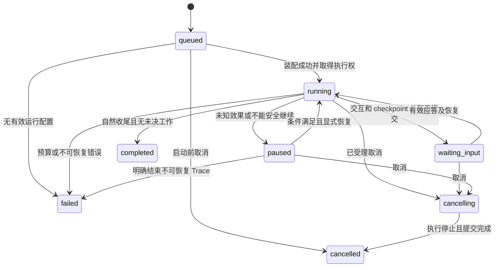
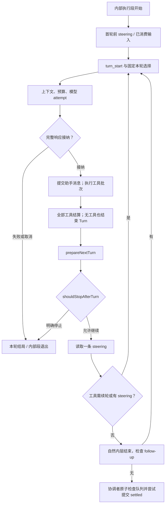
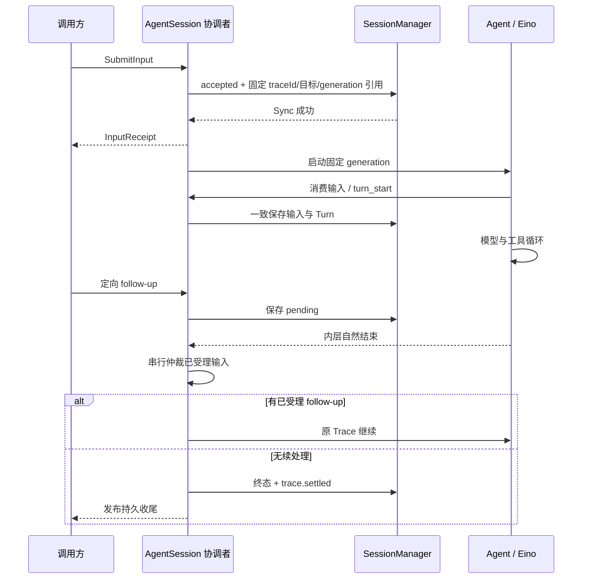
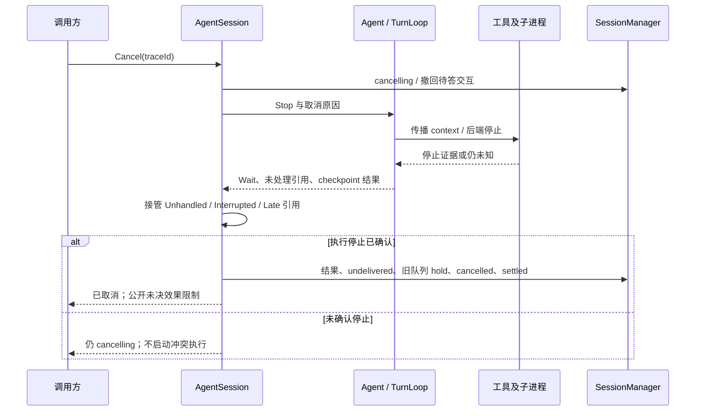

# 03 执行循环与调度

对应 PRD M03、SYS-01/02/03/05/09/10/17。AgentSession 决定产品状态，Agent 的 Eino 适配承接执行，不实现第二个 Runner.Run 轮询版 ReAct。

## 1. 输入受理与队列

SubmitInput 的 InputCommand 包含 kind、targetTraceId、targetAgent、content、idempotencyKey；来源身份从受信调用上下文取得。kind=chat/prompt/steering/follow_up。新 chat/prompt 未指定 targetAgent 时默认选择主 Agent；steering/follow_up 必须指定 targetTraceId，从该 Trace 继承原目标和版本，省略 targetAgent 不解释为主 Agent，显式错配返回 state_conflict。用户原文先保存，input hook 再产生派生内容；input=handled 时记录消费/处理结果而不启动多余模型。

| 请求 | 校验与归属 | 消费边界 |
| --- | --- | --- |
| chat | 不带 targetTraceId；协调者原子读取状态：空闲或所选 Agent 不同则转 prompt，活动且目标相同时仅在支持续输入时转 follow_up，否则返回 unsupported_capability；回执返回 actualKind | 随实际类别 |
| prompt | 不带 targetTraceId；明确新任务，受理时创建 traceId 并固定目标/版本，忙时 queued | 取得顶层写入权后 |
| steering | targetTraceId 必需；目标为 running 且声明支持的 Agent；targetAgent 缺省继承，显式错配拒绝 | 首轮前或完整 Turn 后 |
| follow_up | targetTraceId 必需；目标为未终态且声明支持的 Agent；targetAgent 缺省继承，显式错配拒绝；waiting_input/paused 可保留但不能解除等待 | 原执行合法恢复且内层自然结束后 |
| 选择独立 Agent | 经 chat 的目标变化或显式 prompt 创建独立 Trace；同一工作流忙时提交新任务用 prompt，不冒充续输入 | 串行启动，不经主模型选路 |
| interaction / cancel / resume | 独立控制命令，不当作普通 user 队列项；resume 不切换原目标 | 各自控制时机 |

受理独立输入时，协调者将 inputId、traceId、目标 Agent、已验证 generation 与依赖引用一致保存后返回 accepted。queued/hold 也保留原版本；开始执行、ContinueQueue 和重启不重新选最新版，缺原版本明确失败。后续更紧权限仍在执行前复核。定向输入先校验 kind/targetTraceId/目标一致性，不能因 targetAgent 不同改成 prompt；resume 不接受新目标。

幂等检查先于重新选目标/版本；同键同原请求返回原回执和绑定版本，不能因 reload 变成冲突或再次选版。显式不同目标仍是异内容冲突。

创建后输入是 pending；只有消费 commit 成功才形成模型可见 user。inputId 重放不重复消费。steering/follow_up/独立 Trace 分别维护有序索引，日志中的 accepted/consumed/undelivered/withdrawn 是真相，TurnLoop buffer 只存引用。

默认每类一次消费一条。不支持自由输入的独立 Workflow 明确拒绝，不受理无人消费的消息；调用方可另提 prompt 排队。扩展输入必须指定类别，不能依普通聊天映射猜测意图。界面改选不影响已受理请求；相同幂等键但目标不同视为不同请求并报冲突。

## 2. Trace 状态

D05-状态图：waiting_input/paused 仍占有顶层执行范围，不发布 settled。queued 尚未启动的失败/取消不伪造 agent_start/end/trace.settled。已开始 Trace 终态 commit 内含唯一 settled 事实；重放保留原 eventId。

取消与效果有两个维度：执行确已停止可提交 cancelled，同时保留未知效果并阻止后续冲突动作；尚不能确认执行停止则保持 cancelling。存储不可用不能伪造终态，运行诊断显示提交受阻。

## 3. Eino 装配与作用域

| 接入点 | 确定用途 |
| --- | --- |
| deep.NewTyped[*schema.AgenticMessage] | 主模型/工具循环；默认工具与子 Agent 显式受控装配 |
| adk.NewTurnLoop[InputRef, *schema.AgenticMessage] | 顶层执行调度，InputRef 可 gob 编码且仅含稳定 ID |
| GenInput | 把已分配本执行段的引用分为 Consumed/Remaining；每项必须有去向 |
| PrepareAgent | 按当前 Trace 固定的 targetAgent 与 generation 返回已构建执行实例；独立 Workflow 不装配主 DeepAgent 选路。构建失败不会落入新版本半成品 |
| GenResume | 恢复原作用域/选项，使用服务器保存的定向 ResumeParams |
| BeforeModelRewriteState | 安全输入边界、完整上下文和本轮工具清单写回 state |
| WrapModel | 04 的 attempt 聚合与完整响应接纳门；不能在此无记录地改历史 |
| AfterModelRewriteState | 完整消息与无工具轮次的处理；所有提交按身份去重 |
| WithAfterToolCallsHook | state 已回填整个工具批次后，结束 Turn 并执行轮后契约 |
| 四种工具 wrapper | 每条执行路径进入 05 的统一安全管道 |
| OnAgentEvents + Wait | 收敛真实错误、CancelError、Interrupt、checkpoint 结果及剩余输入 |

TurnLoop 的一次调度不等于产品 Turn。普通有工具续轮在同一 DeepAgent 内完成；只有自然结束后的续输入、受控暂停/恢复等需要新的内部执行段。

产品为每个主/子 invocation 注入独立作用域，使用包装 Agent 的 Run/Resume 绑定轮后 hook、预算和父子身份。显式构造受控 general-purpose，并关闭 DeepAgent 对它的重复隐式构造，避免它漏掉 ModelRetryConfig 或复用父输入来源。保持 Eino 原生 cancel/interrupt 选项传递，不用 RunPath 或 agent name 代替 invocationId。

任意 AddSubAgent 实例仍是信任代码，接入契约见 10；框架不会自动改造其私有模型客户端和裸文件调用。

## 4. 内外循环与终答竞争

D06-循环图是行为顺序；不能据此再写模型/工具循环。有工具路径使用 after-tool hook；无工具路径在完整模型处理后经过同一个 `FinishTurn` 幂等过程，框架自然返回后由协调者继续同 Trace。

工具全部 terminate 的结果由包装器归并，不使用“任一 return-direct”。有 steering 时允许续轮；无 steering 时结束当前内层，再检查 follow-up。需要提前结束 Eino 当前执行段时，适配器使用内部的有类型边界结果（在工具已提交的安全点返回），识别为受控内部结束而非模型错误；不能掩盖同时发生的存储/工具异常。新段从已提交投影继续。子 invocation 使用自己的边界，不触发父 Trace 收尾。

prepareNextTurn 先准备下一轮模型/思考/工具选择；shouldStopAfterTurn 再判预算/策略。选择请求不强制增加 Turn；若循环结束，保存未生效原因。明确停止之后不消费两类队列。

D07-时序：受理先于终态 commit 就属于原 Trace；终态先提交则迟到定向输入冲突。agent_end 不参与替代这一仲裁。失败/取消不得为了清空队列继续消费输入。

## 5. 取消、剩余输入与旧队列

D08-取消时序：Stop 非阻塞且结束实例，旧实例不能再次 Run。停止信号设置、调用实际退出和产品持久收尾是三步。退出依次接管 UnhandledItems、InterruptedItems 与 TakeLateItems，并按 InputRecord 去重；TakeLateItems 后不再 Push。协调者串行切断投递，迟到受理项仍有持久归属。

进程先尝试温和停止，再按 12 的窗口强制停止进程组/Job/container；任意 Go 代码不合作时不能强杀 goroutine或假称停止。副作用 unknown 不能靠 PID 消失解除。

取消或失败后的独立 queued 项保持 queued 并记录 schedulingHold；原 steering/follow_up 标记 undelivered。新 prompt 在无活动/待恢复 Trace 且无冲突时可独立开始；ContinueQueue 只解除明确所选旧项的 hold，保留原顺序、不抢占。取消一个尚未启动项只影响它。

## 6. 暂停与恢复

审批等待的 Turn 不提前 turn_end。Eino checkpoint 保存并经 Wait 确认后，SessionManager 才提交 canResume 和交互关联。先到的交互回答只能受理保存，未完成关联前不执行恢复。

Resume 保留 traceId、targetAgent、invocationId、未完成 turnId、工具调用身份、generation 和旧选择；新 executionId 区分内部段。GenResume 只能使用 09 校验通过的 checkpoint 及服务器映射的目标地址；拒绝客户端注入任意 Targets 或更换执行 Agent。

错误路径由 Wait/事件收敛，不能依赖只在成功运行的 AfterAgent。预算耗尽 failed；用户取消 cancelled；可恢复交互 waiting_input；未决效果 paused。模型 transient retry/受控压缩在原 Turn 内完成，不能重新执行上一批工具。

## 7. 预算记账

顶层共享 BudgetLedger，子调用、摘要、Auto（启用时）、Workflow 模型节点计入同一 Trace。逻辑模型调用在创建生成意图时占额，网络请求由实际传输占额，工具在获准进入执行器前占额；重复恢复读取已有结果不再占执行次数。拒绝/校验失败仍记录调用，不占实际执行额度。

follow-up、resume、实例重建不清零；进程重启从 durable 累计恢复。活动时长累计正在运行/内部重试/摘要等时间，人工等待和安全暂停不计；不能只依一个进程内计时器。具体限额唯一来源为 12。空闲维护有独立 operation 预算，不伪造业务 Trace。

## 8. 证据与验收

[Eino TurnLoop](../../eino/adk/turn_loop.go)、[轮后 hook](../../eino/adk/chatmodel.go)、[middleware](../../eino/adk/handler.go)、[Agentic ReAct](../../eino/adk/react.go)、[retry 输入持久化](../../eino/adk/retry_chatmodel.go)、[pi 循环](../../pi/packages/agent/src/agent-loop.ts)支撑上述接线。内部边界、去重、队列和预算是本产品适配职责。

V-LOOP：PRD LOOP-A01～17；无工具/有工具/全部 terminate；多次 retry 仍一 Turn；暂停无 settled；输入与终答两种竞争顺序；Stop/迟到 Push 不丢引用；错误和取消后旧队列 hold 可重启重建；子 hook 不消费父输入；忙时改选独立 Agent 不误投。全部断言使用确定性模型和计数工具验证。
