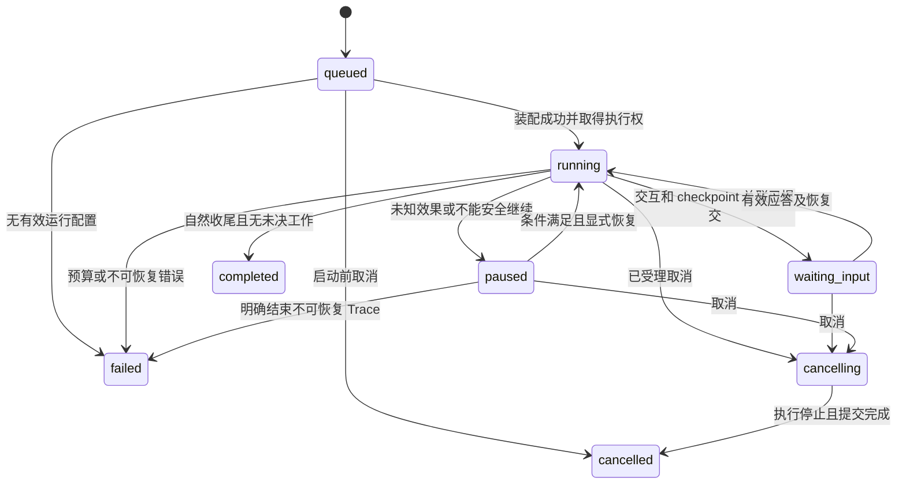
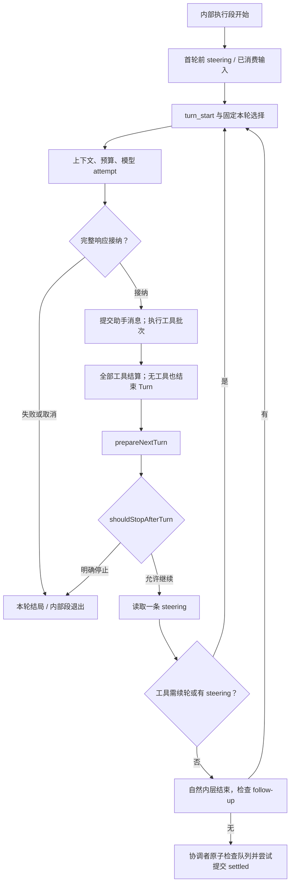
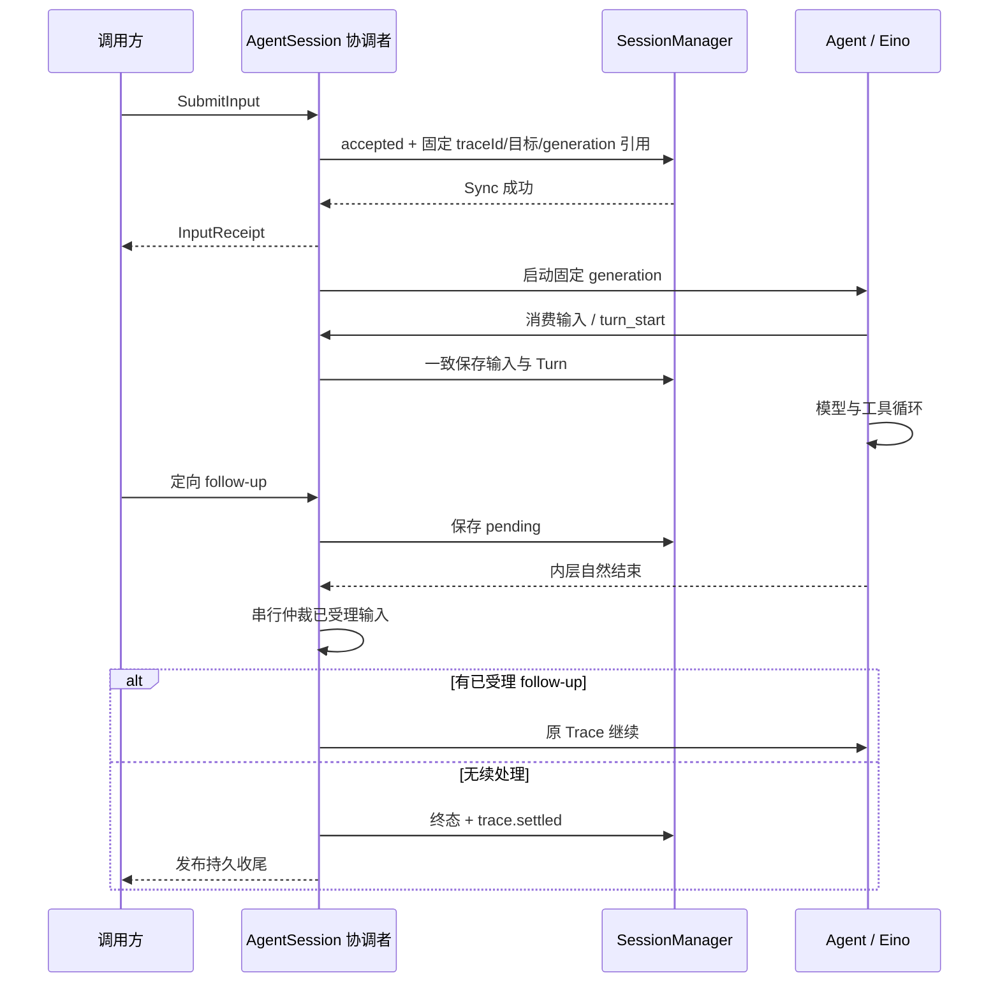
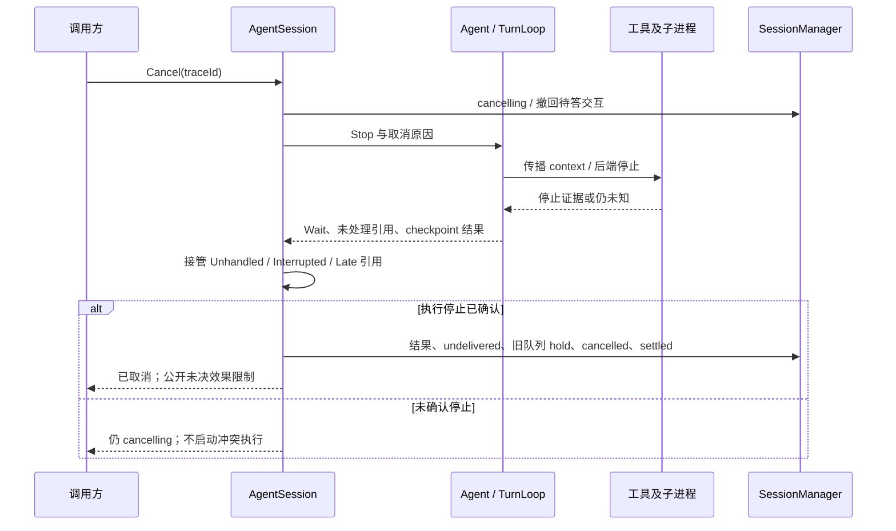

# 03 执行循环与调度

**2026-09-27 历史来源边界修订（当时标为待实现）：**本章 Agent Turn、工具预算、审批等待、资源效果去重与恢复调度不承载用户直接 shell。用户 shell 由受信宿主显式启动，不调用 BeginTurn/ClaimTool，不纳入 Agent 活动预算或自动重放队列；再次显式提交是新执行。保留超时、主动取消和真实退出状态，不把 context 取消当成已停止。工作区只是初始目录，不能宣称该入口与 Agent 受控工具之间具备文件隔离或共享排他保护；外部修改仍由模型工具的版本/前置条件检查发现。模型工具的调度与取消保护保持不变，详见 [05 §2.1](05-tools-and-operations.md)。

对应 PRD M03、SYS-01/02/03/05/09/10/17。本章只规定 Code Agent 的普通输入队列、Trace 和 Turn：`AgentSession` 保留运行对象名称，所属目录已由 `internal/sessions` 机械迁移至 `internal/codeagent`，旧内置工作流目标、节点状态与执行/恢复接线已退出；通用 `Agent` 与 Eino 适配承接执行，不实现第二个 Runner.Run 轮询版 ReAct。Workflow Agent 在同级 `internal/workflowagent` 中独立控制图运行、节点暂停/审批/显式恢复，不进入本章队列或由 `AgentSession.targetAgent` 选路，见 [10 §workflows](10-extensions-and-workflows.md#workflows)。

## 1. 输入受理与队列

SubmitInput 的 InputCommand 包含 kind、targetTraceId、targetAgent、content、idempotencyKey；来源身份从受信调用上下文取得。kind=chat/prompt/steering/follow_up。新 chat/prompt 未指定 targetAgent 时默认选择主 Agent；steering/follow_up 必须指定 targetTraceId，从该 Trace 继承原目标和版本，省略 targetAgent 不解释为主 Agent，显式错配返回 state_conflict。用户原文先保存，input hook 再产生派生内容；input=handled 时记录消费/处理结果而不启动多余模型。

| 请求 | 校验与归属 | 消费边界 |
| --- | --- | --- |
| chat | 不带 targetTraceId；协调者原子读取状态：空闲或所选 Agent 不同则转 prompt，活动且目标相同时仅在支持续输入时转 follow_up，否则返回 unsupported_capability；回执返回 actualKind | 随实际类别 |
| prompt | 不带 targetTraceId；明确新任务，受理时创建 traceId 并固定目标/版本，忙时 queued | 取得顶层写入权后 |
| steering | targetTraceId 必需；目标为 running 且声明支持的 Agent；targetAgent 缺省继承，显式错配拒绝 | 首轮前或完整 Turn 后 |
| follow_up | targetTraceId 必需；目标为未终态且声明支持的 Agent；targetAgent 缺省继承，显式错配拒绝；waiting_input/paused 可保留但不能解除等待 | 原执行合法恢复且内层自然结束后 |
| 选择普通 Code Agent 执行者 | 经 chat 的目标变化或显式 prompt 创建独立 Trace；工作流不在 targetAgent 候选中 | 仅在本 AgentSession 内串行启动 |
| interaction / cancel / resume | 独立控制命令，不当作普通 user 队列项；resume 不切换原目标 | 各自控制时机 |

受理独立输入时，协调者将 inputId、traceId、目标 Agent、已验证 generation 与依赖引用一致保存后返回 accepted。queued/hold 也保留原版本；开始执行、ContinueQueue 和重启不重新选最新版，缺原版本明确失败。后续更紧权限仍在执行前复核。定向输入先校验 kind/targetTraceId/目标一致性，不能因 targetAgent 不同改成 prompt；resume 不接受新目标。

幂等检查先于重新选目标/版本；同键同原请求返回原回执和绑定版本，不能因 reload 变成冲突或再次选版。显式不同目标仍是异内容冲突。

创建后输入是 pending；只有消费 commit 成功才形成模型可见 user。inputId 重放不重复消费。steering/follow_up/独立 Trace 分别维护有序索引，日志中的 accepted/consumed/undelivered/withdrawn 是真相，TurnLoop buffer 只存引用。

默认每类一次消费一条。扩展输入必须指定类别，不能依普通聊天映射猜测意图。界面选择独立工作流时，业务改用 `/v1/workflow-runs` 创建独立运行，不向 Code Agent SubmitInput 投递结构化参数，也不把工作流运行排入同 Session 的 prompt 队列。工作流节点审批/暂停/显式恢复按自身控制入口处理，保留静态子流程、条件及汇合，不额外加入聊天、steering 或 follow-up。界面改选不影响任何已受理请求；同一运行入口下相同幂等键但内容/目标不同报冲突。

## 2. Trace 状态

```mermaid
stateDiagram-v2
    [*] --> queued
    queued --> running: 装配成功并取得执行权
    queued --> failed: 无有效运行配置
    queued --> cancelled: 启动前取消
    running --> waiting_input: 交互和 checkpoint 关联已提交
    waiting_input --> running: 有效应答及恢复
    running --> paused: 未知效果或不能安全继续
    paused --> running: 条件满足且显式恢复
    running --> cancelling: 已受理取消
    waiting_input --> cancelling: 取消
    paused --> cancelling: 取消
    cancelling --> cancelled: 执行停止且提交完成
    running --> completed: 自然收尾且无未决工作
    running --> failed: 预算或不可恢复错误
    paused --> failed: 明确结束不可恢复 Trace
```

D05-状态图：waiting_input/paused 仍占有顶层执行范围，不发布 settled。queued 尚未启动的失败/取消不伪造 agent_start/end/trace.settled。已开始 Trace 终态 commit 内含唯一 settled 事实；重放保留原 eventId。

取消与效果有两个维度：执行确已停止可提交 cancelled，同时保留未知效果并阻止后续冲突动作；尚不能确认执行停止则保持 cancelling。存储不可用不能伪造终态，运行诊断显示提交受阻。

## 3. Eino 装配与作用域

| 接入点 | 确定用途 |
| --- | --- |
| deep.NewTyped[*schema.AgenticMessage] | 主模型/工具循环；默认工具与子 Agent 显式受控装配 |
| adk.NewTurnLoop[InputRef, *schema.AgenticMessage] | 顶层执行调度，InputRef 可 gob 编码且仅含稳定 ID |
| GenInput | 把已分配本执行段的引用分为 Consumed/Remaining；每项必须有去向 |
| PrepareAgent | 按 Code Agent 当前 Trace 固定的普通 targetAgent 与 generation 返回已构建执行实例；不持有/编译/返回 Workflow Agent。构建失败不会落入新版本半成品 |
| GenResume | 恢复原作用域/选项，使用服务器保存的定向 ResumeParams |
| BeforeModelRewriteState | 安全输入边界、完整上下文和本轮工具清单写回 state |
| WrapModel | 04 的 attempt 聚合与完整响应接纳门；不能在此无记录地改历史 |
| AfterModelRewriteState | 完整消息与无工具轮次的处理；所有提交按身份去重 |
| WithAfterToolCallsHook | state 已回填整个工具批次后，结束 Turn 并执行轮后契约 |
| Invokable / EnhancedInvokable 同步工具 wrapper | 本次 P2 两条执行路径进入 05 的统一安全管道；原生 Streamable / EnhancedStreamable 保持装配拒绝，不修改 Eino 或维护 fork |
| OnAgentEvents + Wait | 收敛真实错误、CancelError、Interrupt、checkpoint 结果及剩余输入 |

TurnLoop 的一次调度不等于产品 Turn。普通有工具续轮在同一 DeepAgent 内完成；只有自然结束后的续输入、受控暂停/恢复等需要新的内部执行段。

产品为每个主/子 invocation 注入独立作用域，使用包装 Agent 的 Run/Resume 绑定轮后 hook、预算和父子身份。显式构造受控 general-purpose，并关闭 DeepAgent 对它的重复隐式构造，避免它漏掉 ModelRetryConfig 或复用父输入来源。保持 Eino 原生 cancel/interrupt 选项传递，不用 RunPath 或 agent name 代替 invocationId。

任意 AddSubAgent 实例仍是信任代码，接入契约见 10；框架不会自动改造其私有模型客户端和裸文件调用。

## 4. 内外循环与终答竞争

```mermaid
flowchart TD
    A["内部执行段开始"] --> B["首轮前 steering / 已消费输入"]
    B --> C["turn_start 与固定本轮选择"]
    C --> D["上下文、预算、模型 attempt"]
    D --> E{"完整响应接纳？"}
    E -->|失败或取消| X["本轮结局 / 内部段退出"]
    E -->|接纳| F["提交助手消息；执行工具批次"]
    F --> G["全部工具结算；无工具也结束 Turn"]
    G --> H["prepareNextTurn"]
    H --> I{"shouldStopAfterTurn"}
    I -->|明确停止| X
    I -->|允许继续| J["读取一条 steering"]
    J --> K{"工具需续轮或有 steering？"}
    K -->|是| C
    K -->|否| L["自然内层结束，检查 follow-up"]
    L -->|有| C
    L -->|无| S["协调者原子检查队列并尝试提交 settled"]
```

D06-循环图是行为顺序；不能据此再写模型/工具循环。有工具路径使用 after-tool hook；无工具路径在完整模型处理后经过同一个 `FinishTurn` 幂等过程，框架自然返回后由协调者继续同 Trace。

工具全部 terminate 的结果由包装器归并，不使用“任一 return-direct”。有 steering 时允许续轮；无 steering 时结束当前内层，再检查 follow-up。需要提前结束 Eino 当前执行段时，适配器使用内部的有类型边界结果（在工具已提交的安全点返回），识别为受控内部结束而非模型错误；不能掩盖同时发生的存储/工具异常。新段从已提交投影继续。子 invocation 使用自己的边界，不触发父 Trace 收尾。

prepareNextTurn 先准备下一轮模型/思考/工具选择；shouldStopAfterTurn 再判预算/策略。选择请求不强制增加 Turn；若循环结束，保存未生效原因。明确停止之后不消费两类队列。

```mermaid
sequenceDiagram
    participant C as 调用方
    participant S as AgentSession 协调者
    participant H as SessionManager
    participant A as Agent / Eino
    C->>S: SubmitInput
    S->>H: accepted + 固定 traceId/目标/generation 引用
    H-->>S: Sync 成功
    S-->>C: InputReceipt
    S->>A: 启动固定 generation
    A->>S: 消费输入 / turn_start
    S->>H: 一致保存输入与 Turn
    A->>A: 模型与工具循环
    C->>S: 定向 follow-up
    S->>H: 保存 pending
    A-->>S: 内层自然结束
    S->>S: 串行仲裁已受理输入
    alt 有已受理 follow-up
        S->>A: 原 Trace 继续
    else 无续处理
        S->>H: 终态 + trace.settled
        S-->>C: 发布持久收尾
    end
```

D07-时序：受理先于终态 commit 就属于原 Trace；终态先提交则迟到定向输入冲突。agent_end 不参与替代这一仲裁。失败/取消不得为了清空队列继续消费输入。

## 5. 取消、剩余输入与旧队列

```mermaid
sequenceDiagram
    participant C as 调用方
    participant S as AgentSession
    participant A as Agent / TurnLoop
    participant X as 工具及子进程
    participant H as SessionManager
    C->>S: Cancel(traceId)
    S->>H: cancelling / 撤回待答交互
    S->>A: Stop 与取消原因
    A->>X: 传播 context / 后端停止
    X-->>A: 停止证据或仍未知
    A-->>S: Wait、未处理引用、checkpoint 结果
    S->>S: 接管 Unhandled / Interrupted / Late 引用
    alt 执行停止已确认
        S->>H: 结果、undelivered、旧队列 hold、cancelled、settled
        S-->>C: 已取消；公开未决效果限制
    else 未确认停止
        S-->>C: 仍 cancelling；不启动冲突执行
    end
```

D08-取消时序：Stop 非阻塞且结束实例，旧实例不能再次 Run。停止信号设置、调用实际退出和产品持久收尾是三步。退出依次接管 UnhandledItems、InterruptedItems 与 TakeLateItems，并按 InputRecord 去重；TakeLateItems 后不再 Push。协调者串行切断投递，迟到受理项仍有持久归属。

进程先尝试温和停止，再按 12 的窗口强制停止进程组/Job/container；任意 Go 代码不合作时不能强杀 goroutine或假称停止。副作用 unknown 不能靠 PID 消失解除。

取消或失败后的独立 queued 项保持 queued 并记录 schedulingHold；原 steering/follow_up 标记 undelivered。新 prompt 在无活动/待恢复 Trace 且无冲突时可独立开始；ContinueQueue 只解除明确所选旧项的 hold，保留原顺序、不抢占。取消一个尚未启动项只影响它。

## 6. 暂停与恢复

审批等待的 Turn 不提前 turn_end。Eino checkpoint 保存并经 Wait 确认、再按 [09 §checkpoint](09-persistence-and-recovery.md#checkpoint) 通过原生预检后，SessionManager 才提交 canResume 和交互关联。先到的交互回答只能受理保存，未完成关联前不执行恢复。

Resume 保留 traceId、targetAgent、invocationId、未完成 turnId、工具调用身份、generation 和旧选择；新 executionId 区分内部段。GenResume 只能使用 09 校验通过的 checkpoint 及服务器映射的目标地址；拒绝客户端注入任意 Targets 或更换执行 Agent。

错误路径由 Wait/事件收敛，不能依赖只在成功运行的 AfterAgent。预算耗尽 failed；用户取消 cancelled；可恢复交互 waiting_input；未决效果 paused。模型 transient retry/受控压缩在原 Turn 内完成，不能重新执行上一批工具。

当前 Code 原生预检已按批准 Step9 修正生命周期回调隔离，并获真实 Pause/审批发布、活跃可写 Snapshot、负向 Resume 和磁盘重开恢复的有界接受；唯一方法及限制见 [09 §checkpoint](09-persistence-and-recovery.md#checkpoint)。固定 Eino v0.9.21，每次新建、单次使用探针，只认证原目标根状态；宿主 codec 仍可先执行，不保证任意宿主零执行或整树认证。保留拒绝条件、修前失败和真实执行回调，不清空全局 callbacks，不反射/访问私有回调管理器、不 fork/patch/升级 Eino 或另写执行循环。Workflow Agent 当前没有原生整图 checkpoint，节点复用不证明完整子树或跨两类运行恢复；父最终冻结源两平台全仓证据见 [12 当前证据与限制](12-delivery-and-validation.md#当前证据与限制)，P3 仍未完成。

## 7. 预算记账

Code Agent 顶层 Trace 共享 BudgetLedger，普通受控子调用、摘要、Auto（启用时）计入其总账。Workflow Agent 则为自身独立运行维护节点/模型/工具及辅助调用总账；两类复用限额和计量机制，不合并账本，也不承诺业务工具组合时跨运行原子占额。逻辑模型调用在创建生成意图时占额，网络请求由实际传输占额，工具在获准进入执行器前占额；重复恢复读取已有结果不再占执行次数。拒绝/校验失败仍记录调用，不占实际执行额度。

Code Agent follow-up、resume、实例重建不清零；Workflow Agent 节点继续/显式恢复也读取自己的 durable 累计。活动时长累计所属运行/内部重试/摘要等时间，人工等待和安全暂停不计；不能只依一个进程内计时器。具体限额唯一来源为 12。空闲维护有独立 operation 预算，不伪造业务 Trace；完整子树恢复和跨运行总资源政策由业务负责。

## 8. 证据与验收

[Eino TurnLoop](../../../eino/adk/turn_loop.go)、[轮后 hook](../../../eino/adk/chatmodel.go)、[middleware](../../../eino/adk/handler.go)、[Agentic ReAct](../../../eino/adk/react.go)、[retry 输入持久化](../../../eino/adk/retry_chatmodel.go)、[pi 循环](../../../pi/packages/agent/src/agent-loop.ts)支撑上述接线。内部边界、去重、队列和预算是本产品适配职责。

V-LOOP：PRD LOOP-A01～17；无工具/有工具/全部 terminate；多次 retry 仍一 Turn；暂停无 settled；输入与终答两种竞争顺序；Stop/迟到 Push 不丢引用；错误和取消后旧队列 hold 可重启重建；子 hook 不消费父输入；忙时改选普通 Code 执行者不误投，独立工作流始终走自身资源/控制入口而不进入 Code 队列。全部断言使用确定性模型和计数工具验证；当前接线及 Step9 回调修正的有界接受见 [09 §checkpoint](09-persistence-and-recovery.md#checkpoint) 和 [12 当前证据与限制](12-delivery-and-validation.md#当前证据与限制)，修前失败保留，父最终冻结源全仓结果见同一12索引，不据 Step9 的有限范围或全仓绿色宣称整个 P3 通过。
