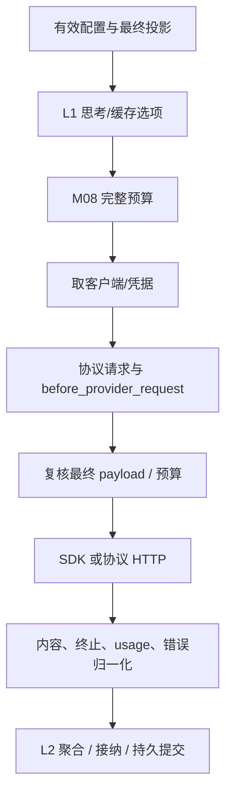
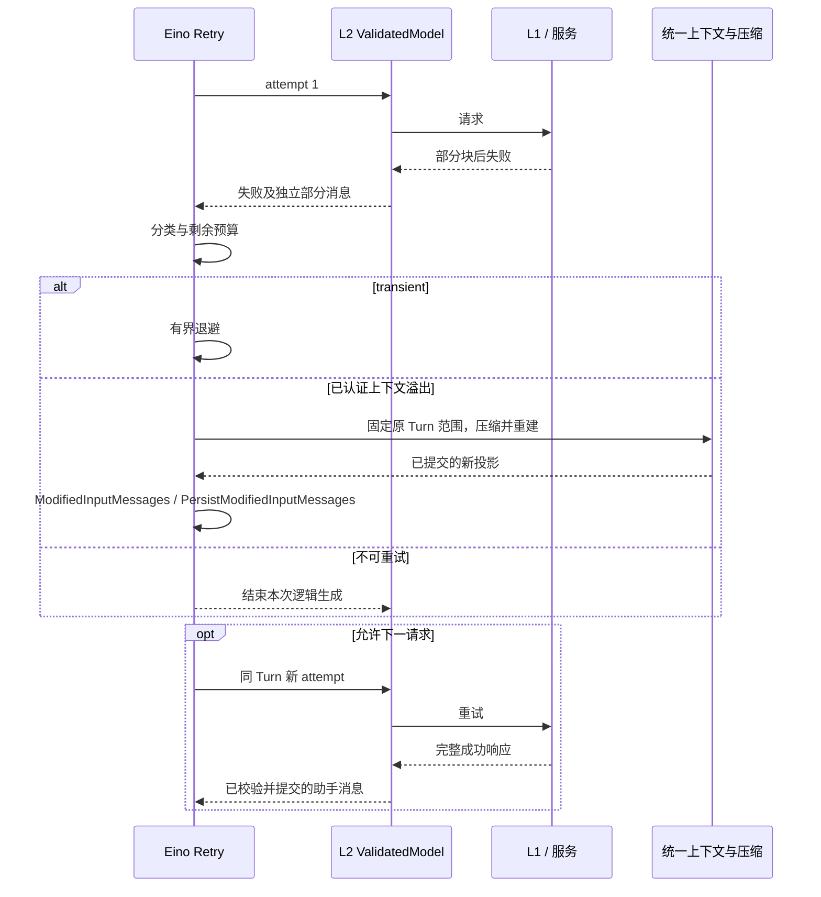

# 04 模型接入、流与缓存

对应 PRD M04；L1 负责统一协议能力，L2 负责 attempt 与响应接纳，L3 选择配置/凭据引用。源码事实不等于实际 endpoint 已认证。

<a id="catalog"></a>
## 1. 配置与模型工厂

```go
type ModelConfig struct {
    Provider, Protocol, Model, Endpoint string
    CredentialRef, Version             string
    Capabilities                       ModelCapabilities
    Parameters                         ModelParameters
}
type ModelFactory func(context.Context, ResolvedModelConfig) (model.AgenticModel, error)
type CredentialResolver interface {
    Resolve(context.Context, string) (ResolvedCredential, error)
}
```

Catalog 以 provider/protocol/model/configVersion 唯一寻址，协议构造函数由工厂装配；重复登记和缺失配置在调用前报错。已有协议新增 endpoint/模型只加配置；新协议实现 AgenticModel 与归一化契约，不改 Agent Loop。可注入已经构造的 AgenticModel，但仍需能力声明和产品计量包装。

凭据值只存在短期请求上下文；快照保留不含秘密的账号作用域标识与 credentialRef。同一引用轮换可供后续调用使用；当前流不换认证，轮换不得静默换账号/服务。撤销即时禁止下一请求。

ModelCapabilities 每项记录 verified/declared/unsupported、适配器/endpoint/模型版本和证据：文本流、工具/多调用、上下文/输出上限、输入/输出模态、ThinkingLevel、usage 明细、缓存机制、结构化输出、服务端工具。普通服务端副作用工具默认禁用；没有窗口值必须提供开发者保守上限才可执行。

<a id="thinking"></a>
## 2. 有效选项与模型选择

L1 ResolveOptions 在 M08 全量预算之前产生 immutable EffectiveOptions：requested/effective thinking、输出上限、思考预算、缓存意图、能力限制和策略版本。实际请求不能在预算后扩容。

ThinkingLevel 支持 off/minimal/low/medium/high/xhigh/max，未指定使用装配默认，不等于 off。不支持的正向档位在已认证正向档中先向上取最近档、再向下取；显式 off 无法兑现或必需精确能力不支持则拒绝。max 是该模型已认证最大强度。

思考与答案共用响应上限时只预留一次，独立限制按对应口径；不能套一个跨厂商固定 token 表。切换模型后重新映射、投影和预算。

选择操作分成 SetDefaultModel（下一独立 Trace）与 SelectNextTurnModel（当前 Trace 已获准候选，下一 Turn）。请求有 operationId，验证失败保留原配置；当前流、重试、工具批次和审批恢复不换配置。新 Trace 显式选择优先，其次待生效默认，再取选定历史路径配置/应用初值；resume 使用 checkpoint 的实际配置。

<a id="adapters"></a>
## 3. 适配器与五步调用

| 协议 | 实现 | 首批能力边界 |
| --- | --- | --- |
| openai-chat | agenticopenai Chat | 官方及每个兼容 endpoint 分别验证工具、流、usage；本地模型优先兼容接口 |
| openai-responses | agenticopenai Responses | 完整 input 回放、store=false、自动有状态续接关闭 |
| anthropic-messages | agenticclaude | 首批原生 API；Bedrock/Vertex 不因组件可配置就自动标已认证 |
| gemini-generate-content | agenticgemini | 隐式缓存默认；显式资源独立启用 |
| deepseek-chat | agenticdeepseek | 原生 endpoint 的推理、工具和缓存字段独立验证 |



D09-调用图：取得客户端/凭据 → 构建请求 → 发起 → 解析 → 关闭释放。连接池可复用。before_provider_request 只处理声明支持的字段；若改变内容/工具/输出预算相关字段，必须返回重新预算的有效描述并验证，否则拒绝请求。after_provider_response 只传脱敏诊断，不把密钥和整份响应发布给客户端。

HTTP framing 由 SDK 处理；补充元数据采集器按照完整 JSON/SSE 帧解析，不能按 TCP chunk 解 JSON。未认识的合法厂商字段保留能力诊断；不能为了兼容直接猜测结束条件。

<a id="stream"></a>
## 4. 流聚合与完整响应接纳

模型 Stream/Recv 的 error 保留 Go 语义。L2 ValidatedModel 包装器单独消费 L1 reader，以 ConcatAgenticMessages 聚合内容块，实时向临时事件端口发送增量或快照；送给 Eino 工具分支的是**通过完整响应校验后的整条消息**。这保留客户端流式体验，同时阻止框架见到早期 tool chunk 就启动工具。

Generate 使用同一检查。ADK 内部模型事件用于执行诊断，不能再作为第二路 product delta/finalized 发布。工具 wrapper 还复核该 Turn/attempt 已接纳，构成执行入口的检查。

每次 attempt 在创建请求前登记，建流失败也有唯一结局。正常结束需 adapter 声明的结束标志、完整内容、finish reason 和必要配对检查；EOF 只代表 reader 耗尽。响应块完成不等于模型结束。

| 响应类别 | 处理 |
| --- | --- |
| 正常文本 / 工具调用 | 完整校验后提交助手消息，才向 Eino 交付可执行结果 |
| length | 保留截断诊断，不执行其中任何工具调用；有界纠正或失败 |
| 服务端拒绝 | 保存真实原因，不伪装 completed |
| 建流/Recv 错误 | 关闭 reader，记录失败 attempt；有部分内容则保存 incomplete |
| 用户取消 | attempt aborted，不当网络错误重试 |
| 私有推理/签名 | 保留协议回放信息，仅允许展示的公开推理进入公开事件 |
| 服务端执行工具 | 与本地 FunctionToolCall 分开；未认证副作用能力拒绝装配 |

候选消息 ID 按 attempt 独立。message.delta 是追加，message.snapshot 是覆盖；有最终化记录后不再追加新 chunk，重放旧 chunk 可按身份丢弃。

<a id="retry"></a>
## 5. 重试、溢出与实际请求预算



D10-重试图不经过工具重执行。ADK MaxRetries=2，ShouldRetry 只重试尚未接纳的请求；已接纳消息不再由内容质量规则重新生成。参数、鉴权、必需能力、取消、审批和工具错误不自动重试；429/暂时服务故障/可恢复连接错误才进入普通退避。

实际 Eino v0.9.21 已提供模型重试循环、可取消等待、BackoffFunc 和指数抖动退避，产品不再实现这些执行机制。产品通过 ShouldRetry 判定错误、已接纳状态及剩余预算，只有为了在等待前核对 Retry-After/剩余活动时间才计算并返回显式 Backoff；该策略计算不是新增重试执行器，也不构成请求速率限制器。

SDK 支持时关闭内部重试。所有实际请求还经过 request-context 计数器，同一次逻辑调用最多 3 次物理请求；SDK 隐藏重试也计入。传输耗尽额度返回不可重试预算错误，不能以 ADK attempt 计数掩盖 3×3 请求。缓存资源/摘要等额外模型服务请求也占全 Trace 对应预算；计费与业务用途分别标记。

上下文溢出首先匹配 endpoint 认证的结构/错误码，补充认证过的文本规则；400/413、length、空文本单独都不是溢出证据。可信 inputTotal 超窗或已认证满窗零输出组合可作为证据，必须排除限流、输出上限过小以及工具/推理非空输出。

溢出恢复在原逻辑生成中最多一次，仍受总请求/压缩预算。ShouldRetry 调同一压缩服务取得已提交新投影，再设置 ModifiedInputMessages 与 PersistModifiedInputMessages；失败返回原错误和压缩诊断，不反复原样发超限请求。未发送成功消息，因而没有本轮工具可重跑。正常模型前软压缩和失败后硬压缩使用同一实现。

自动 failover 默认关闭；显式启用需预先给出获准模型、能力/费用约束和投影规则，只发生在尚未接纳的模型生成内。

<a id="cache"></a>
## 6. 缓存机制与稳定前缀

CacheIntent=none/short/long，默认 short；long 未认证回退 short并记录 requested/effective/reason。none 不注入主动标记或创建资源，不承诺关闭供应商隐式缓存。

缓存作用域由 L3 注入，在同 Session/账号权限范围内稳定；不按每次 traceId/attempt/时间重建。L1 以 provider/endpoint/账号作用域/model/策略版本和实际前缀摘要验证显式句柄，缓存键不等于权限证明。L1 只装饰请求副本，原历史不含缓存字段。

| 家族 | 默认策略与失效处理 |
| --- | --- |
| Claude | 按模型能力在 system、末尾常驻工具、转换后合法末条 user 块布置显式断点；包括合法 tool_result。遵守断点数量/TTL，顶层自动策略与显式策略不同时盲目开启 |
| Chat 兼容 | 认证能力允许才使用额外缓存参数；不按品牌推断；稳定 tools/system/history 顺序 |
| Responses | 完整 input、store=false、EnableAutoCache=false；用已认证的缓存键/保留选项。previous response 链是独立 opt-in 功能 |
| Gemini | 默认隐式缓存；启用显式资源后使用 CreatePrefixCache/WithCachedContentName，记录 system/tools/messages 覆盖范围及合法后缀 |
| DeepSeek | 服务自动缓存；不虚构创建缓存 API；读取原始 hit/miss 证据 |

显式缓存资源的创建、过期、删除和重建由 L1 管理；失败时发送完整等价请求或在已授权预算内重建。无法重建完整上下文就报错，不能只发后缀。普通未命中不是错误，不重试以强求命中。

有状态续接默认关闭；开启后只可引用正确的因果链。分叉、压缩或模型/工具变化重新验证；不得通过旧 responseId 带回未选中的兄弟分支。稳定前缀由 07 维护，安全状态更新追加到合适位置，不能回写旧 system 或靠缓存绕过撤销。

<a id="usage"></a>
## 7. usage、原始字段与费用

UsageRecord 每个字段都有 value/known/source，记录 inputTotal、uncachedInput、cacheRead、cacheWrite、outputTotal、reasoning、缓存保留时长明细及费用估算版本。累计报告覆盖旧值而非相加；reasoning 通常是 output 子项，PromptTokens 含缓存时不再次加缓存。

仅在口径明确且字段齐全时验证 inputTotal=uncachedInput+cacheRead+cacheWrite。未知字段不填 0；Claude PromptTokens-CachedTokens 可能还包含缓存写，不能推为 uncachedInput。

依赖升级后，agenticclaude v0.1.7 已在 Generate/Stream 的 PromptTokenDetails.CacheWriteTokens 中保留缓存写，并提供 GetCacheCreationInputTokens；“未单独保留缓存写”只适用于原调查基线。优先复用适配器字段；当前 getter 对缺失和明确零值都返回 (0, false)，因此仅凭该值不能判断字段是否实际返回。产品需要的字段存在性、TTL 等缺失证据，通过 Config.HTTPClient 的有界 read-through Body 包装器按完整 JSON、message_start、message_delta 补取。DeepSeek hit/miss 同样先核对实际适配器，只有缺失必需证据才补取。包装器只复制必要小字段，不替换字节、不预读耗尽 body、不重复读流、不持久化原始正文；并发请求的收集器必须独立，Close/error 一并传播。`internal/llm/p2_usage_upstream_test.go` 覆盖原 SDK 数值不变及缺失/已知零值区别，不代表产品 Claude 工厂或真实 endpoint 已认证。

采集器有限帧缓冲，超限/未知结构则相关统计 unknown 并给诊断，不能破坏原模型响应或臆造值。SDK 未暴露 HTTPClient 的路径不宣称具备补取能力；不列入本次已认证协议组合。全部采样字段要和 fake transport 原始 fixture 对照。

费用是带价格版本的估算；缓存写/存储费用与输出 token 分开。未返回的失败请求用量保持未知，不以本地估算冒充服务账单。

<a id="evidence"></a>
## 8. 证据与验收

- [agenticopenai](../../eino-ext/components/model/agenticopenai/responses_model.go)：Responses 缓存与自动续接是不同机制。
- [agenticclaude](../../eino-ext/components/model/agenticclaude/convertor.go)与[HTTPClient 入口](../../eino-ext/components/model/agenticclaude/model.go)：缓存字段与 usage 差异。
- [agenticgemini](../../eino-ext/components/model/agenticgemini/model.go)、[agenticdeepseek](../../eino-ext/components/model/agenticdeepseek/model.go)：现成入口。
- [Eino RetryDecision](../../eino/adk/retry_chatmodel.go)：修改输入并持久化 state；本产品需验证错误/预算处理。
- [PRD 厂商官方文档与能力边界](../pi-eino-prd/04-model-access.md#452-本地实现对照)。

V-MODEL/V-CACHE：逐个 M-E 用例、完整/流式双路径、中文/emoji/多块/多工具、truncated 工具零执行、SDK 隐藏重试计数、缓存命中缺失/过期/模型切换/分支切换、Claude cacheWrite 与 DeepSeek hit/miss unknown 边界。真实模型认证必须记录 endpoint、模型版本、适配 commit、fixture 和实际结果。
