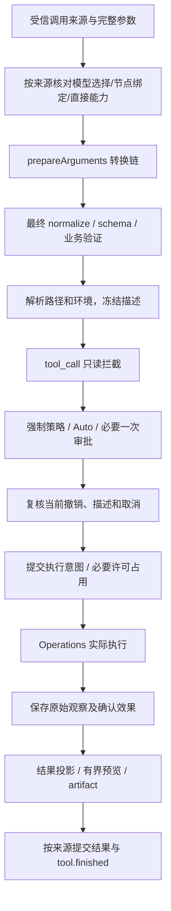
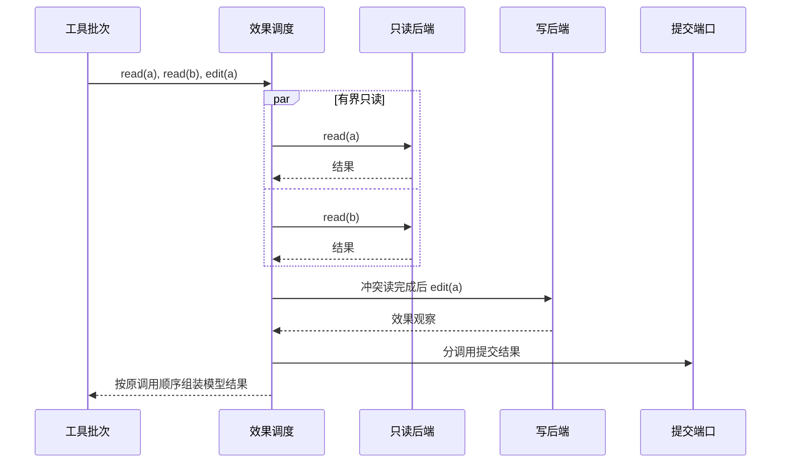

# 05 工具、Operations 与副作用

对应 PRD M05。工具定义借鉴 pi 的元信息/执行/应用三层；Eino 承接调用机制，产品管道补齐最终校验、授权、一致事实和平台效果。

<a id="definitions"></a>
## 1. 定义与调用对象

ToolDefinition 包含 name/version/source、schema.ToolInfo、label/usageGuidance、执行实例、参数规范化函数、业务验证器、资源声明、并发类别、超时和输出策略。模型看到 name/description/schema；应用定义及秘密后端不序列化进模型。

RegisterTool 重名拒绝；ReplaceTool 要求原来源/版本匹配且可替换，形成新 generation。所有调用都验证已登记实现及当前权限，但调用来源的前置条件不同。origin 由受信调度/适配器建立，客户端或导入数据不能自填来源绕过检查：

| origin | 调用身份与实现选择 | 结果去向 |
| --- | --- | --- |
| model | 使用产生它的 Turn/invocation/generation/selectionRevision；验证模型本轮可见，关联 providerCallId 与产品 toolCallId | 与原模型请求配对的 FunctionToolResult |
| workflow_node | 使用固定定义的本地工具绑定及 workflow invocation/nodeExecutionId；分配稳定产品 toolCallId；无需模型可见性、turnId、selectionRevision 或 providerCallId，不借用父 task 的 Turn | 观察和结果回填节点状态，随 workflowResult 展示，不伪造模型工具消息 |
| direct | ExecuteCommand 或获准 SDK/扩展入口建立产品调用身份，关联实际 invocation 或 operation、受信实现/能力及版本；不依赖模型本轮清单 | command 消息或对应操作结果，不伪造模型工具消息 |

三类来源复用同一个 CallExecution 的最终校验、授权、预算、许可占用、执行与效果去重。来源差异不是第三种 Workflow 产品入口。

schema 在 generation 构建时编译并缓存，默认 Draft 2020-12；显式声明其他支持版本按声明编译。外部引用只来自受信登记的本地 schema 集，不在调用中自动联网解析 $ref。最终 arguments JSON 使用规范化 bytes 做 hash；大整数按声明精度解析，不经 float64 静默舍入。

<a id="builtins"></a>
## 2. 默认能力与具体行为

| 工具 | 实现/输入规则 | 结果和失败 |
| --- | --- | --- |
| ls | Go 目录读取；路径解析、稳定排序、分页 | 文件类型/大小/路径；不可用明确错误 |
| read_file | Go 文件读取；line offset/limit；扩展 byte offset/limit 处理超长单行，两种模式互斥 | 文件头部完整行；片段有 UTF-8 边界/版本信息，不用 Bash 续读 |
| write_file | 目标规范化；写前复核真实路径及前置条件 | 确认写入事实；无法确认落盘效果则 unknown |
| edit_file | 精确 old_text 匹配；默认唯一，replace_all 必须明确；保留权限和格式 | 零/多匹配、外部内容变化返回可修复错误，不静默模糊替换 |
| glob / grep | 固定 ripgrep、参数数组、--no-config；验证 root/glob/数量和字节限额 | 路径/行号和有界预览；非法 pattern 明确返回 |
| execute | ProcessOperations；显式 shell 类型、cwd、超时；Windows 原生无需 Bash | stdout/stderr、退出码、停止证据、截断及真实产物 |
| write_todos | invocation 范围内的结构化 TODO；更新经事实提交 | 不把 TODO 勾选当作业务产物验证 |
| task / general-purpose | Eino 委派机制＋作用域包装 | 父子身份、摘要/产物、权限和预算继承 |

默认先复用 Eino filesystem.NewTyped 的工具定义和可替换 CustomTool 入口；read_file 用自定义实现补片段读取，结果统一经过本章管道。需要自定义装配时不再同时传 DeepAgent.Backend/Shell 触发第二份同名工具。通用子 Agent 由同一工厂显式构建，不重复隐式 general-purpose。

write/edit 优先在目标同目录安全创建临时文件、同步并替换，复核预期文件身份/hash；失败清理本次临时文件。符号链接/junction、硬链接、权限和 Windows 替换行为按 11 验证。外部进程并发修改不能凭进程内锁消除，冲突必须显式反馈。

直接命令入口 ExecuteCommand 使用同一冻结/授权/执行管道，保存 command 消息；它不是模型 FunctionToolCall，不能伪造模型请求。允许扩展复用 Operations 需携带产品调用身份和有效执行票据。

<a id="pipeline"></a>
## 3. 固定执行管道



D11-工具图对应 prepareArguments → validate → beforeToolCall → execute → afterToolCall 五步。初步 schema 校验可以帮助转换，但不能代替最后一次转换后的最终校验。冻结副本深拷贝可变 map/slice；hook 只拿只读视图，改变参数/环境后原授权失效。

FrozenExecution 包含：callScope、origin、tool/schema/generation、来源关联（model 的 Turn/selectionRevision/providerCallId，workflow_node 的定义/绑定/nodeExecutionId，direct 的受信调用入口）、原始/最终 arguments 摘要、规范化资源和预期版本、effect/concurrency、backend ID、argv/cwd、env/stdin 受保护引用、挂载和临时目录、常驻策略及申请许可范围。hash 覆盖全部执行相关字段；显示的授权视图从同一对象脱敏生成。

四类 Eino wrapper（Invokable、Streamable、EnhancedInvokable、EnhancedStreamable）共享一套 CallExecution，不能只有普通函数受保护。流式工具的最终结算必须等 reader 实际耗尽/关闭及后端返回；发送 progress 不表示完成。

流程失败规则：

| 阶段 | 结果 |
| --- | --- |
| 参数/业务错误 | 执行次数 0；model 返回配对 failed result，其他来源返回节点/操作失败，不制造模型消息 |
| 未满足来源选择/绑定条件、未知工具、权限拒绝 | denied；无 started |
| 必要审计/存储/沙箱设施失败 | 阻止执行并使当前执行暂停/失败，不只返回一句错误后继续危险动作 |
| 等待人工交互 | 以可恢复中断保存；model 批次不提前 turn_end，workflow_node 保存节点恢复关联，不伪造 Turn |
| 已执行而结果保存/后处理失败 | 保留执行事实，禁止重跑；可修复投影视图或进入核对 |
| 取消/超时 | 保留实际观察及 sideEffect；不推断回滚 |

<a id="operations"></a>
## 4. 窄 Operations 与执行票据

```go
type FileOperations interface {
    List(context.Context, ListRequest) (ListResult, error)
    Read(context.Context, ReadRequest) (ReadResult, error)
    Write(context.Context, AuthorizedFileWrite) (FileEffect, error)
    Edit(context.Context, AuthorizedFileEdit) (FileEffect, error)
    Search(context.Context, SearchRequest) (SearchResult, error)
}
type ProcessOperations interface {
    Execute(context.Context, AuthorizedProcess, ProgressSink) (ProcessObservation, error)
    Stop(context.Context, ExecutionRef) (StopObservation, error)
}
type ArtifactStore interface {
    Save(context.Context, ArtifactInput) (ArtifactRef, error)
    Open(context.Context, ArtifactRead) (io.ReadCloser, error)
}
```

Authorized 类型是内部有效票据引用＋FrozenExecution，不是客户端可通过 JSON 自填的 boolean。当前策略、取消和执行环境变化仍在启动前复核，不能持旧票据穿过撤销。Operations 使用已解析路径，不重新从全局 cwd/env 补默认值。

原生文件和 shell 共享 WorkspaceBinding/ResourceMap。容器 shell 只映射受信配置的挂载根，文件工具对相应逻辑资源访问同一宿主文件；未映射的容器路径明确不支持文件直读，需在容器执行结束前导出产物。见 11。

测试使用内存 FileOperations、可控 ProcessOperations 和 ArtifactStore；同样经过工具管道，不能测试时完全绕开权限和去重后宣称生产行为已覆盖。

<a id="selection"></a>
## 5. 工具选择和搜索

首轮前及完整工具批次后的下一 Turn 可从固定 generation 的获准集合 SetActiveTools。验证全部名称、来源和作用域后一次提交 selectionRevision；失败保留原集合。多请求按受理顺序处理，取代尚未生效请求需记录 superseded 关系。

Eino BeforeAgent 装配实际执行 inventory；BeforeModelRewriteState 更新 ToolInfos/DeferredToolInfos。模型来源的工具 wrapper 仍按本轮清单防止调用隐藏实现；工作流节点使用第 1 节的固定绑定，不借此开放模型工具全集。选择改变同时更新说明、skill 自动加载索引、预算和缓存诊断。

普通 search_tools 只返回本 generation 候选并申请下一 Turn 开放；同批提前调用新工具拒绝。供应商原生 deferred search 仅在认证后开启，清单分别记录直接可见和允许检索集合，仍逐调用授权。

恢复采用原清单和 pending 选择请求；不能默认为全工具。父子 invocation 的清单独立，权限不因选择而扩大。

<a id="concurrency"></a>
## 6. 并发、停止与未知效果

资源键包含执行环境、真实工作区、规范化文件身份；路径按平台大小写/别名规则处理。默认只读最多并行 4；写操作对冲突资源排他。不能可靠声明副作用范围的命令/自定义工具按独占该工作区处理；父子共享锁域。纯控制/委派工具不占整个工作区写锁再等待子工具，避免父持锁导致子调用死锁。



D12-并发图：进度/完成事件按实际发生顺序，模型结果按原 call 顺序归并且 CallID 不变。审批中不长期持有文件锁，真正执行前重新获取并验证前置条件；变化后旧描述/许可不可直接使用。

取消通知所有已启动 worker，未启动项停止派发并配对取消结果。子进程依据后端停止证据结算；任意 Go 工具不合作时保留仍在运行/未知，禁止宣布 Session 可进行冲突工作。超时并不证明没写入。

outcome_unknown 的核对使用 09 Reconcile，不再执行原动作，也不从 stderr/PID 缺失推断 no-start。已确认已有结果可在兼容恢复点返回，保持同一个有效 tool result。

<a id="outputs"></a>
## 7. 结果、文件事实与产物

ToolObservation 保存原始状态、content、details、退出/耗时、截断、取消确认、sandbox mode/enforcement 和副作用事实。后处理可以调整脱敏模型投影；原始成功/失败、审批和文件效果不可修改。

FileFact 为操作种类、规范化资源身份、confirmed/unknown/none、toolCallId/observationId、作用域及可选版本。失败但已确认部分写入仍保留；shell/自定义工具没有结构化证据就不猜文件清单。08 只合并选定范围的真实 facts。

read 给源文件续读位置，不默认复制全文件。命令输出从执行开始即流式保存完整日志，另生成尾部预览；保存成功才返回 artifactId。产物和可信状态分区，正文属于不可信业务材料；ArtifactRef 包含 Session、环境、大小/hash、可用状态。读取复核权限和内容版本；产物丢失不能伪装空日志或重跑命令补日志。

预览限制、UTF-8 边界、行/字节和 grep 单行策略由 07 定义；大型结构化 JSON 使用摘要字段/引用，禁止按字节截成无效 JSON。

<a id="evidence"></a>
## 8. 证据与验收

[pi 工具流水线](../../pi/packages/agent/src/agent-loop.ts)、[Eino 四类 wrapper](../../eino/adk/handler.go)、[filesystem 自定义工具](../../eino/adk/middlewares/filesystem/filesystem.go)、[Operations 接口基础](../../eino/adk/filesystem/backend.go)、[DeepAgent](../../eino/adk/prebuilt/deep/deep.go)。安全采用 [PRD M12](../pi-eino-prd/12-security-sandbox.md) 的 DSH 策略边界与 Zero 原生沙箱适配。

V-TOOL：全部 T-E 用例；转换后校验、同名/同 ID 调用隔离、四类 wrapper、批次等待和取消、结果投影失败不重执行、未知效果锁冲突、read/edit/grep Unicode 边界、原生/容器同一产物。V-DEFAULT：工作区必填，默认能力可真实调用，显式裁剪不留下错误提示词。
