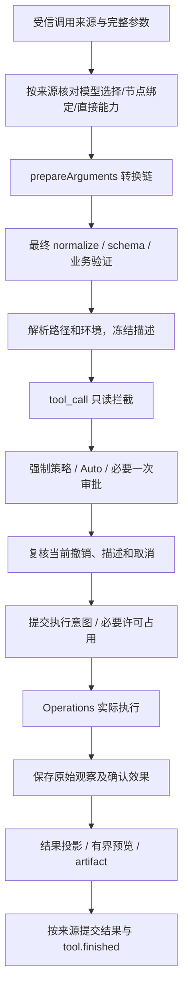
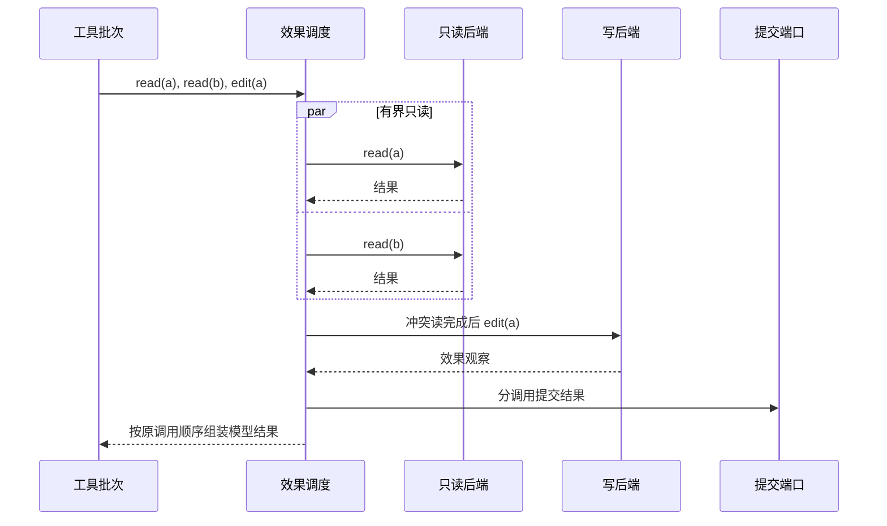

# 05 工具、Operations 与副作用

对应 PRD M05。工具定义借鉴 pi 的元信息/执行/应用三层；Eino 承接调用机制，产品管道补齐最终校验、授权、一致事实和平台效果。

<a id="definitions"></a>
## 1. 定义与调用对象

ToolDefinition 包含 name/version/source、schema.ToolInfo、label/usageGuidance、执行实例、参数规范化函数、业务验证器、资源声明、并发类别、超时和输出策略。模型看到 name/description/schema；应用定义及秘密后端不序列化进模型。

RegisterTool 重名拒绝；ReplaceTool 要求原来源/版本匹配且可替换，形成新 generation。所有调用都验证已登记实现及当前权限，但调用来源的前置条件不同。origin 由受信调度/适配器建立，客户端或导入数据不能自填来源绕过检查：

| origin | 调用身份与实现选择 | 结果去向 |
| --- | --- | --- |
| model | 使用产生它的 Turn/invocation/generation/selectionRevision；验证模型本轮可见，关联 providerCallId 与产品 toolCallId | 与原模型请求配对的 FunctionToolResult |
| workflow_node | 使用固定定义的本地工具绑定及 workflow invocation/nodeExecutionId；分配稳定产品 toolCallId；无需模型可见性、turnId、selectionRevision 或 providerCallId，不借用父 task 的 Turn | 观察和结果回填节点状态，随 workflowResult 展示，不伪造模型工具消息 |
| direct | 获准 SDK/扩展的受控工具入口建立产品调用身份，关联实际 invocation 或 operation、受信实现/能力及版本；不包含用户直接 shell | 对应操作结果，不伪造模型工具消息 |

三类受控来源的最终设计复用同一个 CallExecution 的最终校验、授权、预算、许可占用、执行与效果去重；用户直接 shell 不在三类工具来源中，见 §2.1。来源差异不是第三种 Workflow 产品入口。

**2026-09-27 维护者确认的交付边界：**P2 仅接线和验收 model/direct 来源。workflow_node 的受信绑定登记、节点身份接纳、实际执行接线及验收整体移至 P5，与工作流 invocation、节点状态、审批等待和恢复一起实现。上表 workflow_node 是 P5 目标契约，不代表 P2 已交付。P2 保留明确拒绝：不提供工作流节点执行入口，不放宽冻结来源校验，不以调用自填来源、模型 Turn 或 direct operation 冒充节点授权；预留字段不构成可执行能力。该延期不阻塞 P2 步骤完成，也不削弱 model/direct 的安全验收。

schema 在 generation 构建时编译并缓存，默认 Draft 2020-12；显式声明其他支持版本按声明编译。外部引用只来自受信登记的本地 schema 集，不在调用中自动联网解析 $ref。最终 arguments JSON 使用规范化 bytes 做 hash；大整数按声明精度解析，不经 float64 静默舍入。

<a id="builtins"></a>
## 2. 默认能力与具体行为

| 工具 | 实现/输入规则 | 结果和失败 |
| --- | --- | --- |
| ls | 受控目录读取；路径解析、稳定排序、条目及字节限额；不要求游标分页 | 文件类型/大小/路径；超限明确提示截断及缩小目录，不可用明确错误 |
| read_file | Go 文件读取；line offset/limit；扩展 byte offset/limit 处理超长单行，两种模式互斥 | 文件头部完整行；片段有 UTF-8 边界/版本信息，不用 Bash 续读 |
| write_file | 目标规范化；写前复核真实路径及前置条件 | 确认写入事实；无法确认落盘效果则 unknown |
| edit_file | 精确 old_text 匹配；默认唯一，replace_all 必须明确；保留权限和格式 | 零/多匹配、外部内容变化返回可修复错误，不静默模糊替换 |
| glob / grep | 优先复用 Eino 匹配/输出模式语义，经受控 FileOperations 执行；验证 root/pattern/数量和字节限额；grep 可简单 offset/limit 截取 | 稳定排序、路径/行号和有界预览；非法 pattern 明确返回，超限提示缩小查询；不承诺后端按页扫描 |
| execute | ProcessOperations；显式 shell 类型、cwd、超时；Windows 原生无需 Bash | stdout/stderr、退出码、停止证据、截断及真实产物 |
| write_todos | invocation 范围内的结构化 TODO；更新经事实提交 | 不把 TODO 勾选当作业务产物验证 |
| task / general-purpose | Eino 委派机制＋作用域包装 | 父子身份、摘要/产物、权限和预算继承 |

**2026-09-28 10:05 已批准调整，实施中：**目录/搜索优先复用框架已有能力，P2 不增加复杂游标或目录快照分页；采用稳定排序、有界输出和明确截断提示。框架能力存在不代表本项目已接线，验收须经过真实受控执行链。grep 的简单 offset/limit 是结果截取，不保证后端只扫描一页。若宿主选择 ripgrep 后端，仍使用固定可用版本、参数数组和 `--no-config`；P2 不强制所有后端依赖外部命令。文件 read 的版本绑定续读契约不变。

默认先复用 Eino filesystem.NewTyped 的工具定义和可替换 CustomTool 入口；read_file 用自定义实现补片段读取，结果统一经过本章管道。需要自定义装配时不再同时传 DeepAgent.Backend/Shell 触发第二份同名工具。通用子 Agent 由同一工厂显式构建，不重复隐式 general-purpose。

write/edit 优先在目标同目录安全创建临时文件、同步并替换，复核预期文件身份/hash；失败清理本次临时文件。符号链接/junction、硬链接、权限和 Windows 替换行为按 11 验证。外部进程并发修改不能凭进程内锁消除，冲突必须显式反馈。

### 2.1 用户直接 shell

**2026-09-28 审批恢复保护补充（已批准，修复中）：**模型任务等待工具审批时，SDK 的 ExecuteCommand 拒绝新手动命令，返回 state_conflict，不启动进程、不追加命令历史。审批已答复但任务尚未恢复的间隙继续保护原恢复点；状态/历史查询、审批答复和取消仍可用。不采用待消费命令上下文方案，不放宽 checkpoint 一致性校验。命令已启动后任务进入审批的竞争必须另有确定性测试及安全处理，不能只检查尚未答复的审批数量。此限制是会话状态兼容性检查，不是将用户 shell 纳入模型工具审批或预算。

ExecuteCommand 的用户 shell 场景改为由受信宿主显式调用的独立入口。**2026-09-27 16:05 补充确认：**直接修改现有 ExecuteCommand 的公开契约，删除任意已登记工具调用、Name/Arguments 与持久化幂等/回执等不再适用的能力，不新增 ExecuteShell，也不保留旧通用入口作为兼容别名；允许调用方按新的 shell 请求/结果迁移。它不进入 tools.Executor 的模型工具管道：不进行人工审批、不计 Agent 工具/活动预算、不签发执行票据、不做持久化执行去重，不创建模型 Turn、FunctionToolCall 或 FunctionToolResult。相同命令被用户再次显式提交就是新执行；SDK 不自动重试，Open、Resume、日志重放和日志保存失败都不得启动或重跑它。

Session 仍必须显式绑定工作区；命令 cwd 可显式指定，否则使用该绑定而不是进程 cwd。工作区只是用户 shell 的初始目录，不是访问限制；命令以宿主操作系统账户权限执行，不承诺沙箱或运行数据写保护。保留输出、退出码、超时、主动取消和真实退出状态；取消请求不等于进程已退出。超时数值沿用现有明确配置，本次不照搬 Zero 的 30 秒常量。

入口由宿主接线区分，模型、工具参数、扩展 hook 或导入记录不能通过自填 origin/user 标记取得该能力；普通扩展受控 Operations 仍需要原权限与票据。此区分不是取消模型工具的审批、预算、工作区边界和效果去重。Zero 的 unsafe 启动开关是参考实现事实，本次未决定新增同名开关；SDK 受信宿主调用不等于向模型或未来 HTTP 客户端开放裸执行。

旧直接命令审批恢复方案被本节替代，已有代码和测试仅作为迁移基线，不代表新语义已实现。旧 command/direct 等待记录不得解释成用户重新提交或自动授权；实施时保留历史可读、禁止自动执行，明确不兼容恢复的处理，不顺带放宽模型 Resume。

<a id="pipeline"></a>
## 3. 固定执行管道


```mermaid
flowchart TD
    A["受信调用来源与完整参数"] --> B["按来源核对模型选择/节点绑定/直接能力"]
    B --> C["prepareArguments 转换链"]
    C --> D["最终 normalize / schema / 业务验证"]
    D --> E["解析路径和环境，冻结描述"]
    E --> F["tool_call 只读拦截"]
    F --> G["强制策略 / Auto / 必要一次审批"]
    G --> H["复核当前撤销、描述和取消"]
    H --> I["提交执行意图 / 必要许可占用"]
    I --> J["Operations 实际执行"]
    J --> K["保存原始观察及确认效果"]
    K --> L["结果投影 / 有界预览 / artifact"]
    L --> M["按来源提交结果与 tool.finished"]
```

D11-工具图对应 prepareArguments → validate → beforeToolCall → execute → afterToolCall 五步。初步 schema 校验可以帮助转换，但不能代替最后一次转换后的最终校验。冻结副本深拷贝可变 map/slice；hook 只拿只读视图，改变参数/环境后原授权失效。

FrozenExecution 包含：callScope、origin、tool/schema/generation、来源关联（model 的 Turn/selectionRevision/providerCallId，workflow_node 的定义/绑定/nodeExecutionId，direct 的受信调用入口）、原始/最终 arguments 摘要、规范化资源和预期版本、effect/concurrency、backend ID、argv/cwd、env/stdin 受保护引用、挂载和临时目录、常驻策略及申请许可范围。hash 覆盖全部执行相关字段；显示的授权视图从同一对象脱敏生成。

本次 P2 仅接入 Invokable、EnhancedInvokable 两类同步 Eino wrapper，共享一套 CallExecution；`Definition.ToolInterface` 对应 `invokable`（空值等价）和 `enhanced-invokable`。原生 Streamable、EnhancedStreamable 不在本次 P2 范围，`streamable`、`enhanced-streamable` 保持装配期 `resource_unavailable` 拒绝；不修改 Eino、不维护 fork，也不以同步执行后返回单块 reader 冒充原生流式能力。

保留已有 SDK 实际输出回调，只报告工具实际产生的内容；本次不要求动态百分比、阶段提示或其他工具进度，输出回调也不是原生 Streamable 验收。调用结束须关闭输出入口并结清已受理输出，再保存最终观察；输出片段不证明后端停止或执行成功。取消、后端收敛、unknown、授权/审批和 checkpoint 约束不变，模型流式响应仍按 04 验收。

流程失败规则：

| 阶段 | 结果 |
| --- | --- |
| 参数/业务错误 | 执行次数 0；model 返回配对 failed result，其他来源返回节点/操作失败，不制造模型消息 |
| 未满足来源选择/绑定条件、未知工具、权限拒绝 | denied；无 started |
| 必要审计/存储/沙箱设施失败 | 阻止执行并使当前执行暂停/失败，不只返回一句错误后继续危险动作 |
| 等待人工交互 | 以可恢复中断保存；model 批次不提前 turn_end，workflow_node 保存节点恢复关联，不伪造 Turn |
| 已执行而结果保存/后处理失败 | 保留执行事实，禁止重跑；可修复投影视图或进入核对 |
| 取消/超时 | 保留实际观察及 sideEffect；不推断回滚 |

<a id="operations"></a>
## 4. 窄 Operations 与执行票据

```go
type FileOperations interface {
    List(context.Context, ListRequest) (ListResult, error)
    Read(context.Context, ReadRequest) (ReadResult, error)
    Write(context.Context, AuthorizedFileWrite) (FileEffect, error)
    Edit(context.Context, AuthorizedFileEdit) (FileEffect, error)
    Search(context.Context, SearchRequest) (SearchResult, error)
}
type ProcessOperations interface {
    Execute(context.Context, AuthorizedProcess, ProgressSink) (ProcessObservation, error)
    Stop(context.Context, ExecutionRef) (StopObservation, error)
}
type ArtifactStore interface {
    Save(context.Context, ArtifactInput) (ArtifactRef, error)
    Open(context.Context, ArtifactRead) (io.ReadCloser, error)
}
```

Authorized 类型是内部有效票据引用＋FrozenExecution，不是客户端可通过 JSON 自填的 boolean。当前策略、取消和执行环境变化仍在启动前复核，不能持旧票据穿过撤销。Operations 使用已解析路径，不重新从全局 cwd/env 补默认值。

原生文件和 shell 共享 WorkspaceBinding/ResourceMap。容器 shell 只映射受信配置的挂载根，文件工具对相应逻辑资源访问同一宿主文件；未映射的容器路径明确不支持文件直读，需在容器执行结束前导出产物。见 11。

测试使用内存 FileOperations、可控 ProcessOperations 和 ArtifactStore；同样经过工具管道，不能测试时完全绕开权限和去重后宣称生产行为已覆盖。

<a id="read-snapshot-migration"></a>
### 4.1 read_file 注入后端迁移（2026-09-28 已批准的兼容性例外）

维护者已明确批准调整读取契约，现有注入后端必须迁移为完整快照语义；不提供可选能力探测或旧行为回退。`sdk.ReadRequest` / `sdk.ReadResult` 仍通过现有单文件 SDK 别名公开，新增 `Mode` 字段可能影响未使用字段名的结构体字面量，调用方应使用具名字段。

- 内置工具始终传入 `Mode=lines` 或 `Mode=bytes`。`Offset/Limit` 表示模型请求的零基行范围或字节范围，用于冻结请求绑定校验，后端不得按它们预裁剪 `ContentRef` 对应内容。保留空 `Mode` 的后端私有旧行为不等于兼容新内置工具。
- `Read` 返回可由注入 `ArtifactStore` 读取的完整、不可变文件快照引用及非空稳定 `Version`。请求携带版本时，后端必须检查，不匹配返回 `state_conflict`，不得悄悄切换到最新内容。完整快照指引用的内容语义，不要求复制全文件或一次性读入内存。
- 工具以 `ArtifactRead.Offset=0`、`Limit=0` 打开该快照；`Open` 校验原冻结资源、模式、范围、版本及执行票据，并消费一次性读取授权后暴露正文。实际行/字节定位、UTF-8 安全投影和上限控制由工具执行，避免双重裁剪。模型策略、取消与票据约束不变。
- 行和 byte 模式均受 2000 行及 50 KiB 上限约束；byte 模式非空末尾片段计一行，文件末尾无换行仍计一行，末尾换行不增加虚构空行。首个完整行超过字节上限时返回 byte 片段读取入口。
- 工具返回完整结构化 JSON，包含正文、版本、模式、编码、实际字节起止、行数、截断原因、部分行标记及 `nextRead`。续读参数带原版本并对应实际返回位置；工具不使用旧 `ReadResult.NextOffset` 生成续读参数。不可读引用或缺少版本不能报告成功。

代码与当前测试已接入该契约；外部后端是否完成迁移仍需各宿主验证。`sdk/testdata/consumer/read_snapshot_test.go` 通过公开 Session 的真实模型工具调用验证行/byte 续读、完整 JSON、版本冲突和后端调用次数；它不是原生文件后端或操作系统安全认证。

<a id="selection"></a>
## 5. 工具选择和搜索

首轮前及完整工具批次后的下一 Turn 可从固定 generation 的获准集合 SetActiveTools。验证全部名称、来源和作用域后一次提交 selectionRevision；失败保留原集合。多请求按受理顺序处理，取代尚未生效请求需记录 superseded 关系。

Eino BeforeAgent 装配实际执行 inventory；BeforeModelRewriteState 更新 ToolInfos/DeferredToolInfos。模型来源的工具 wrapper 仍按本轮清单防止调用隐藏实现；工作流节点使用第 1 节的固定绑定，不借此开放模型工具全集。选择改变同时更新说明、skill 自动加载索引、预算和缓存诊断。

普通 search_tools 只返回本 generation 候选并申请下一 Turn 开放；同批提前调用新工具拒绝。供应商原生 deferred search 仅在认证后开启，清单分别记录直接可见和允许检索集合，仍逐调用授权。

恢复采用原清单和 pending 选择请求；不能默认为全工具。父子 invocation 的清单独立，权限不因选择而扩大。

<a id="concurrency"></a>
## 6. 并发、停止与未知效果

资源键包含执行环境、真实工作区、规范化文件身份；路径按平台大小写/别名规则处理。默认只读最多并行 4；写操作对冲突资源排他。不能可靠声明副作用范围的命令/自定义工具按独占该工作区处理；父子共享锁域。纯控制/委派工具不占整个工作区写锁再等待子工具，避免父持锁导致子调用死锁。


```mermaid
sequenceDiagram
    participant A as 工具批次
    participant Q as 效果调度
    participant R as 只读后端
    participant W as 写后端
    participant H as 提交端口
    A->>Q: read(a), read(b), edit(a)
    par 有界只读
        Q->>R: read(a)
        R-->>Q: 结果
    and
        Q->>R: read(b)
        R-->>Q: 结果
    end
    Q->>W: 冲突读完成后 edit(a)
    W-->>Q: 效果观察
    Q->>H: 分调用提交结果
    Q-->>A: 按原调用顺序组装模型结果
```

D12-并发图：进度/完成事件按实际发生顺序，模型结果按原 call 顺序归并且 CallID 不变。审批中不长期持有文件锁，真正执行前重新获取并验证前置条件；变化后旧描述/许可不可直接使用。

取消通知所有已启动 worker，未启动项停止派发并配对取消结果。子进程依据后端停止证据结算；任意 Go 工具不合作时保留仍在运行/未知，禁止宣布 Session 可进行冲突工作。超时并不证明没写入。

outcome_unknown 的核对使用 09 Reconcile，不再执行原动作，也不从 stderr/PID 缺失推断 no-start。已确认已有结果可在兼容恢复点返回，保持同一个有效 tool result。

<a id="outputs"></a>
## 7. 结果、文件事实与产物

ToolObservation 保存原始状态、content、details、退出/耗时、截断、取消确认、sandbox mode/enforcement 和副作用事实。后处理可以调整脱敏模型投影；原始成功/失败、审批和文件效果不可修改。

FileFact 为操作种类、规范化资源身份、confirmed/unknown/none、toolCallId/observationId、作用域及可选版本。失败但已确认部分写入仍保留；shell/自定义工具没有结构化证据就不猜文件清单。08 只合并选定范围的真实 facts。

read 给源文件续读位置，不默认复制全文件。命令日志采用 Zero 式简化处理：短输出直接返回，超长输出自动尝试保存脱敏后的完整日志，再返回 UTF-8 安全的头尾预览；保存成功才返回文件/产物引用。保存失败仍返回预览并明确日志未保存，不改变真实退出码、执行成功/失败或已确认文件效果，也不重跑命令。不再要求所有命令从启动起强制流式持久保存全文。

日志保存是内部后处理，不新增人工审批或独立结果授权票据，也不能复用已被进程消费的一次执行票据。实施时沿现有输出/产物接口作最小调整；结果与日志保存错误分别表达，先保留模型工具原始观察和 FileFacts，再处理预览与产物。产物正文先脱敏再保存，仍属于不可信业务材料；保留既有 Session/环境绑定、大小/hash、可用状态与读取校验，不把“不新增审批”解释成任意路径读取或跨 Session 开放。文件丢失/变化明确 unavailable/changed，不返回空日志假装成功。复用现有产物生命周期，不照搬 Zero 的共享临时目录和七天清理常量。

这是对 Zero 日志工具行为与用户 shell 独立入口的组合设计；Zero 用户 `!命令` 本身只有 CombinedOutput，并未接入该保存链。新契约待 Step 16 真实实现和故障测试验收。

预览限制、UTF-8 边界、行/字节和 grep 单行策略由 07 定义；大型结构化 JSON 使用摘要字段/引用，禁止按字节截成无效 JSON。

<a id="evidence"></a>
## 8. 证据与验收

[pi 工具流水线](../../pi/packages/agent/src/agent-loop.ts)、[Eino wrapper 机制（上游四类不等于本次 P2 支持范围）](../../eino/adk/handler.go)、[filesystem 自定义工具](../../eino/adk/middlewares/filesystem/filesystem.go)、[Operations 接口基础](../../eino/adk/filesystem/backend.go)、[DeepAgent](../../eino/adk/prebuilt/deep/deep.go)。安全采用 [PRD M12](../pi-eino-prd/12-security-sandbox.md) 的 DSH 策略边界与 Zero 原生沙箱适配。

V-TOOL：全部 T-E 用例；转换后校验、同名/同 ID 调用隔离、Invokable / EnhancedInvokable 两类同步 wrapper、原生 Streamable / EnhancedStreamable 装配拒绝、实际输出入口关闭与晚到输出拒绝、批次等待和取消、结果投影失败不重执行、未知效果锁冲突、read/edit/grep Unicode 边界、原生/容器同一产物。V-DEFAULT：工作区必填，默认能力可真实调用，显式裁剪不留下错误提示词。
