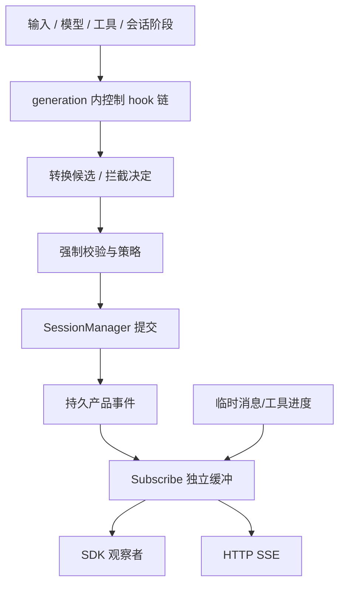
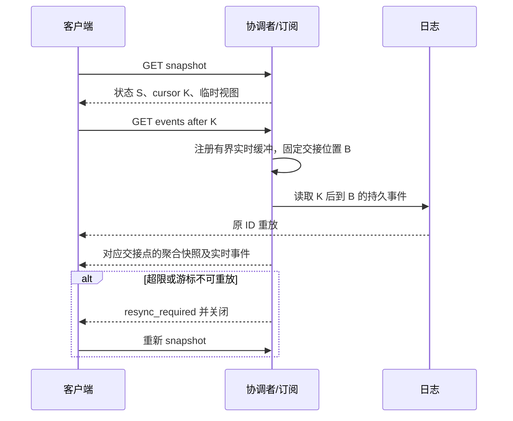

# 06 事件、控制 hooks 与外部接口

对应 PRD M07/M11 接入部分。本章是 SDK、HTTP、订阅与 hook 组合规则的主定义；状态和提交分别引用 03/09。

<a id="pipelines"></a>
## 1. 对应 pi 的两条管道

| pi | 产品入口 | 语义 |
| --- | --- | --- |
| session.subscribe | AgentSession.Subscribe | 已发生事实的只读观察；不决定执行 |
| pi.on | ExtensionRegistry.OnInput / OnContext / OnToolCall 等类型化注册 | 执行阶段主动调用并等待的控制链 |

Go 使用有明确参数/返回类型的注册函数，不把所有 handler 装进任意字符串 + any 的万能入口。原始 Eino callbacks 位于内部适配层；不能假定它等价于任一产品管道。



D13-两条管道图：输入/context/tool_call 等控制点不从 Subscribe 分发。L2 内部 ExecutionSink 可以等待必要提交；外部观察者再慢也不能阻止工具执行和持久化。

<a id="hooks"></a>
## 2. 控制链和生命周期

| 类别 | 组合 | 异常 |
| --- | --- | --- |
| 通知 | generation 注册顺序串行调用，忽略返回值 | extension.error 后继续；不能承担唯一落库 |
| 拦截 | 第一个 deny/cancel/block 短路，allow 不覆盖强制策略 | 安全前置失败关闭；维护 before 失败不提交 |
| 转换 | 后一个接收前一个候选，无变更则沿用 | 失败丢弃候选，不发送半成品请求 |

阶段：input、before_agent_start、context、prepareArguments、tool_call、tool_result、before_provider_request、after_provider_response；支持 turn/message 通知、prepareNextTurn、shouldStopAfterTurn。各修改范围遵循 PRD：input 保留原文；tool_call 只读冻结描述；tool_result 只改投影视图；provider 扩展归 L1。

before_agent_start 在 Trace 首个模型循环前执行，其结果与原作用域关联保存；同 Trace 的 follow-up、内部执行段重建或 resume 不重复注入。子 invocation 使用显式委派准备，不重放父级输入转换和准备结果。

生命周期：
- session_start：创建/打开/成功切换/资源上下文激活后通知；不自动执行历史。
- session_before_switch：目标基本校验且旧 Session 可离开后调用；取消保留原绑定。
- session_before_fork / session_before_tree：固定目标与范围后调用，单次操作只走对应一个 before 链。
- session_tree：分支/游标和可选摘要提交后通知。
- session_before_compact：允许追加重点、取消或一个替代候选；第二个替代候选冲突。
- session_compact / session_compact_failed：明确 committed/cancelled/failed。
- session_shutdown：执行已安置后有界清理；不能否决关闭。

统一顺序：校验与固定操作 → before → 校验候选及 precondition → 提交 → durable 事件 → after。before 期间不能另写改变相同范围的消息/私有状态或递归维护；允许请求 abort。after 失败不回滚、不自动重做。用户取消和权限撤销不受 hook 否决。

hook context 仅有只读作用域、能力、历史查询、取消信号和受控运行入口，不给 reader/HTTP/SessionStore。超时受 context 控制；不合作的信任 Go handler 不能被安全强杀，也不能再被当作完成继续冲突工作。超时窗口见 12。

<a id="sdk"></a>
## 3. Go SDK 面

```go
func CreateAgentSession(context.Context, SessionOptions) (*AgentSession, error)
func OpenAgentSession(context.Context, OpenOptions) (*AgentSession, error)

func (s *AgentSession) SubmitInput(context.Context, InputCommand) (InputReceipt, error)
func (s *AgentSession) Cancel(context.Context, CancelCommand) (OperationReceipt, error)
func (s *AgentSession) RespondInteraction(context.Context, InteractionResponse) (OperationReceipt, error)
func (s *AgentSession) Resume(context.Context, ResumeCommand) (OperationReceipt, error)
func (s *AgentSession) ContinueQueue(context.Context, ContinueQueueCommand) (OperationReceipt, error)
func (s *AgentSession) Reconcile(context.Context, ReconcileCommand) (OperationReceipt, error)
func (s *AgentSession) Snapshot(context.Context) (SessionSnapshot, error)
func (s *AgentSession) Subscribe(context.Context, SubscribeOptions) (Subscription, error)
func (s *AgentSession) Close(context.Context) error
```

另提供 GetTrace/GetOperation/ListMessages/ListBranches、ForkBranch/NavigateBranch/Compact、SetDefaultModel/SelectNextTurnModel/SetActiveTools、ReloadResources、ExecuteCommand、InvokeCommand。它们使用相同 CommandMeta（幂等键、预期版本、受信 caller），不通过直接写 Store 实现。`ExecuteWorkflow` 不再作为第三种公开产品入口；独立工作流通过 SubmitInput 指定 targetAgent 执行。

Subscription 提供只读 Events channel 和幂等 Close。SDK callback 便利层逐订阅调用并隔离 panic/error；达到缓冲边界注销或要求 resync。关闭后不再投新事件，正在执行的 callback 可结束。SessionSnapshot 包含 durable cursor、active trace/turn、interactions、pending/undelivered/held queue、operation 和聚合消息视图，按权限脱敏。

会话切换是外层协调函数 SwitchSession(current, target)，先准备目标再走旧会话 before_switch，成功后返回新的 AgentSession 引用；不把原对象 sessionId/工作区改成另一个。目标失败保持旧引用。两个 Session 的日志各自独立，切换不承诺跨文件事务；以预分配 targetId 和原 operationId 去重恢复目标创建。

<a id="http"></a>
## 4. HTTP 路由与 DTO

协议前缀 /v1；JSON 字段 lowerCamelCase。修改请求使用 Idempotency-Key，预期资源版本通过 expectedRevision 字段表达；传输层认证后的 Principal 放入受信 context，不从 body 取身份。

| 方法 / 路由 | 请求要点 | 成功及状态约束 |
| --- | --- | --- |
| POST /v1/sessions | workspace、公开模型选择、能力裁剪；后端/秘密配置引用受信装配 | 201 SessionSnapshot；缺工作区拒绝 |
| GET /v1/sessions | 分页/工作区过滤 | 可访问会话清单；不自动打开执行 |
| GET /v1/sessions/{sid} | 无 | 会话元信息及能力 |
| POST /v1/sessions/{sid}/inputs | kind、targetTraceId、targetAgent、content | 202 InputReceipt；actualKind/targetAgent/traceId 已持久 |
| GET /v1/sessions/{sid}/traces/{tid} | 无 | 状态、结果、待答及恢复资格 |
| POST /v1/sessions/{sid}/traces/{tid}/cancel | 原因 | 202 OperationReceipt；重复返回现状 |
| POST /v1/sessions/{sid}/traces/{tid}/resume | expectedRevision | 202；仅非终态且恢复条件满足 |
| POST /v1/sessions/{sid}/interactions/{iid}/responses | answer/decision、expectedRevision | 202；校验来源、期限和目标，不接受替换参数 |
| POST /v1/sessions/{sid}/queue/continue | traceIds | 202；只解除所选 hold、不抢占 |
| POST /v1/sessions/{sid}/traces/{tid}/reconcile | invocationId/toolCallId/observationId；queryId 或 evidenceRef | 202；paused/收敛取消/终态未决效果可受理 |
| GET /v1/sessions/{sid}/operations/{oid} | 无 | 受理/完成状态、证据、结论及 canResume |
| GET /v1/sessions/{sid}/messages | branchId、before/after、limit | 稳定分页；不按当前数组下标当游标 |
| GET /v1/sessions/{sid}/branches | 无 | parent 路径和头引用 |
| POST /v1/sessions/{sid}/branches | fromEntryId、可选摘要意图 | 202；空闲且无队列/写入/效果冲突 |
| POST /v1/sessions/{sid}/branches/{bid}/activate | leafId、可选摘要意图 | 202；同上，不回滚文件 |
| POST /v1/sessions/{sid}/compactions | scope、reason | 202；空闲维护或登记下一安全边界 |
| POST /v1/sessions/{sid}/switch | targetSessionId 或新工作区目标 | 202；目标先就绪，查询操作取得新 sid |
| PATCH /v1/sessions/{sid}/metadata | name / label 及目标 | 提交后 200；不触发模型 |
| POST /v1/sessions/{sid}/model-selections | scope=next_trace/next_turn、model/thinking | 202；记录 requested 与 effective |
| POST /v1/sessions/{sid}/tool-selections | invocationId、names | 202；固定 generation 内选择 |
| POST /v1/sessions/{sid}/resources/reload | 受信资源配置引用 | 202；pending generation，不改旧 Trace |
| GET /v1/sessions/{sid}/capabilities | 无 | 模型/工具/后端/限制、可选择 Agent 和版本 |
| GET /v1/sessions/{sid}/workflows | 无 | 已装配定义、输入输出、导入诊断及恢复能力 |
| POST /v1/sessions/{sid}/commands/{name} | schema 参数 | 202；权限/空闲条件按登记 |
| POST /v1/sessions/{sid}/executions/commands | command、cwd、shell 配置引用 | 202；直接命令仍走工具管道 |
| GET /v1/sessions/{sid}/artifacts/{aid} | range | 授权读取；未知/变更明确报错 |
| GET /v1/sessions/{sid}/snapshot | 无 | 一致快照、durableSeq、临时流位置 |
| GET /v1/sessions/{sid}/events | cursor / traceId | text/event-stream |

受信 SDK 可直接传模型/后端实现，HTTP 只能选装配方批准的配置引用，不上传 Go 代码或任意 Docker 挂载。新输入的多模态附件先使用受限附件保存入口取得 artifactRef，再按已装配模型能力提交；附件保存不触发模型。

幂等作用域=(Principal, sessionId, operationKind, key)，创建时无 sessionId，提前生成并保存目标 ID。保存规范化请求摘要与原回执；同键异内容 409，同键同内容返回原 ID/结果及原目标版本，幂等查重先于 chat 分类和 generation 选择。记录随 Session 保留，不能因 HTTP 超时另建 Trace。参数 JSON 对象键顺序不同不应构成不同请求，数组顺序仍保留。

### 4.1 输入与回执示例

```json
{
  "kind": "follow_up",
  "targetTraceId": "trace_opaque",
  "content": [{"type": "text", "text": "完成当前检查后再解释测试结果"}]
}
```

content 是类型化用户输入块：text，以及引用已保存 artifactId/mimeType 的 image/audio/video/file；媒体须通过能力和资源授权检查。可选 targetAgent 对新 chat/prompt 表示本次选择，省略时选择主 Agent；对 steering/follow_up 只是原目标一致性校验，省略时从 targetTraceId 继承，显式错配返回 409 state_conflict。targetAgent 请求字段是可选名称引用，版本与 generation 由服务端受理时解析保存，回执/Trace 查询提供最终绑定；resume 只使用原保存目标。禁止客户端提交 system、assistant、FunctionToolResult、任意 provider Extra 或自填来源来冒充历史/授权。调用键来自 Idempotency-Key；服务器返回：

```json
{
  "inputId": "input_opaque",
  "traceId": "trace_opaque",
  "actualKind": "follow_up",
  "targetAgent": {"name": "main", "version": "main-v1", "generation": "gen_opaque"},
  "state": "pending",
  "acceptedCommit": 42
}
```

普通 chat 的实际类别也由回执返回，网络重试不重新做映射或选版。只有新 chat/prompt 的 Agent 选择才影响新任务路由；chat/prompt 不带 targetTraceId，steering/follow_up 必须带 targetTraceId，组合不合法返回 invalid_argument。定向输入目标错配返回 state_conflict，不另建 Trace；工作流不支持续输入时返回 unsupported_capability。新独立请求在 accepted 提交中固定目标版本及 generation，包括 queued 项；随后 reload、重启和 ContinueQueue 不替换它。重做终态 Trace 的 undelivered 输入需新 key/inputId，并以 sourceInputId 记录原输入引用，不把旧 inputId 再消费一次。OperationReceipt 统一为 operationId/state/target/acceptedCommit；最终 result/error 在 GetOperation 中查询。

### 4.2 交互与核对输入

InteractionResponse 包含 answer 或 decision、expectedRevision，不同时提供两者；审批 decision 只接受 allowed-once/rejected/cancelled，unavailable 是服务端设施结局。interactionId 从路由取得，approvalId/描述/checkpoint target 均从保存映射取得；审批回复不能提交新 arguments、env 或 grant。补参使用 answer，仅填原交互指定的待补字段，由原 WorkflowAgent 合并后重新完成 schema/业务校验，再为实际副作用冻结并授权，不把补参答案当作批准。

ReconcileCommand 包含 invocationId/toolCallId/observationId/expectedRevision，以及 queryId 或 evidenceRef 二选一。queryId 指向已装配的只读实现，参数只允许该实现 schema 的定位字段；人工“已执行/未执行”可随材料提交但不作为最终结论。响应 result 分为 evidenceRefs、confirmedEffects、remainingUnknown、conflictRestrictions、canResume/reason，调用方不能把 operation completed 当作 Trace 已恢复。

错误映射：400 invalid_argument；401 unauthenticated；403 permission_denied；404 not_found；409 状态/幂等/恢复/版本冲突；410 过期 cursor 或确已失效资源；422 unsupported_capability/budget_exhausted；503 storage_unavailable；500 internal_error。先受理后发生失败在 operation/trace 中报告，不能把过去的 202 改解释成执行成功。

<a id="events"></a>
## 5. 事件族与顺序

持久事件包括 input.accepted/consumed/cancelled、trace.state_changed/settled、agent_start/end、turn_start/end、message.finalized、tool.requested/started/finished/state_changed、interaction.requested/resolved、approval.asked/decided、security.policy_changed/review_decided、context.compacted、session.branch_changed、extension.generation_changed/error、tools.selection_changed、model.changed、compaction.started/finished/failed、retry.started/finished、queue.changed。

message.started/delta/snapshot、tool.progress 为临时事件；diagnostic 区分持久故障和临时信息。一次审批用同一 interaction/approval 映射，不弹两次问题。tool.started 需要实际启动事实，许可占用不提前发 started。

顺序：accepted 先于 consumed；model 来源先提交助手工具请求，workflow_node/direct 先提交对应节点/受信调用事实，再产生工具结局，后两者不伪造模型请求或配对消息；finalized 后无新 delta；有模型 Turn 时 turn_end 在批次结算后；终态消息、效果、队列去向和 Trace 终态先一致提交，随后 settled。agent_end 只关闭执行段。回放可重复，按 eventId 去重，不承诺网络 exactly-once。

<a id="sse"></a>
## 6. 快照、重放与慢订阅



D14-SSE 图：在协调者处固定 B 并注册后续缓冲，重放期间接住 B 之后的事件；最终按 durableSeq 去重拼接。临时快照与 streamId/chunkSeq 定位，先交付重放事实再用当前快照覆盖局部显示；已经 finalized 的流不复活。

持久 SSE id 为不透明 Session cursor，临时事件不写 id。Last-Event-ID 和显式 cursor 同时存在且不一致则拒绝。按 traceId 过滤仍使用 Session 全局游标，不把其他 Trace 的空档误判为丢失。服务端声明 earliestReplayCursor；默认持久事件与 Session 日志同保留，缩短窗口的开发者策略必须同时支持 resync。

订阅缓冲与写入窗口有界，详见 12；不能阻塞执行器。SDK 和 HTTP 慢消费者分别得到停止/重同步诊断。SSE 使用逐次写期限和心跳，不设置会误杀长连接的总响应超时。断连、EOF、页面关闭和请求 context 取消都不取消已受理 Trace。

<a id="access"></a>
## 7. 本地认证与 Web 验证

默认回环地址，启动生成随机 bearer 凭据，在受控启动输出/本地受保护配置中提供给使用者。页面在内存中使用凭据，通过 fetch 请求和读取 SSE，不把秘密放入 URL/localStorage；不依赖无法设置 Authorization 的原生 EventSource。

校验 Host 和存在时的 Origin，只允许配置的本地同源；CORS 默认关闭。SDK Principal 由嵌入程序提供，不自动当作 HTTP 用户。快照、附件、事件、审批与写操作使用同一 Session 授权。

测试页展示可选择 Agent、current Trace/Turn、临时/最终消息、工具结果、pending/held queue、interaction、操作与恢复资格；操作调用公开 API。验证选择独立 Agent 后提交、结果归属和忙时不误投；同一工作流忙时的新任务明确提交 prompt。覆盖定向输入目标省略/匹配/错配，以及 queued 项在 reload、重启、ContinueQueue 后保持原版本。内容按文本/结构化数据渲染，不执行工具返回的 HTML。A2UI 仅预留外层映射位置，不进入 L2。

<a id="evidence"></a>
## 8. 证据与验收

[pi 扩展事件](../../pi/packages/coding-agent/src/core/extensions/types.ts)、[pi AgentSession](../../pi/packages/coding-agent/src/core/agent-session.ts)、[Eino typed events](../../eino/adk/interface.go)为参考。路由、bearer、cursor、幂等和产品事件是本产品契约。

V-EVENT/V-API：两条管道不混用；慢/异常观察者不影响执行；before 取消、候选冲突、after 错误；同键重复与异内容冲突；提交响应丢失；SSE 交接无漏、临时缺口快照覆盖；前端只认 settled；明确撤销/取消不被 hooks 阻止。
