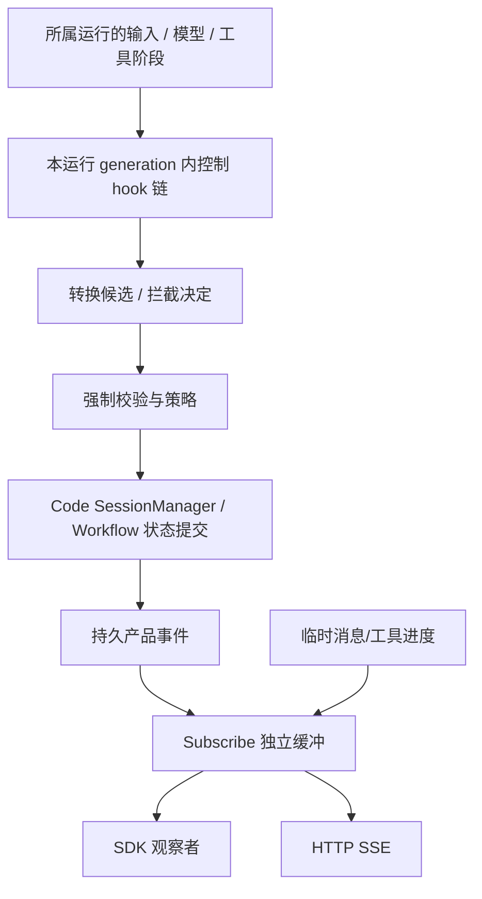
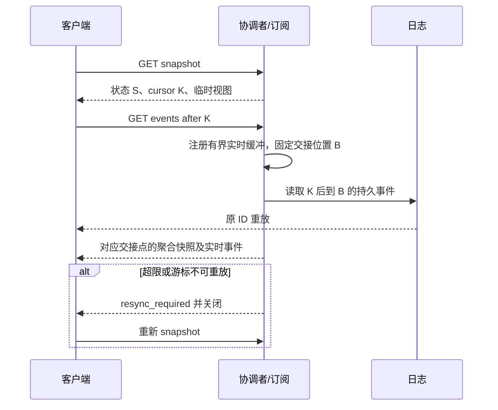

# 06 事件、控制 hooks 与外部接口

## 2026-09-29 P3 已批准范围（实施中）

P3 新增独立 `cmd/web --web` 本机入口，保留 `cmd/agentd` 限制；采用 Eino 官方示例 A2UI v0.8 子集，替换本章原“A2UI 仅预留”的阶段限制，但不将 UI 协议放入 L2。网络契约细化、审批实例回执例外、固定来源及阶段边界见 [13 P3 Web 接入契约](13-p3-web-contract.md)。仅启动注册的多 Agent/静态工作流和真实分支/压缩前移；动态导入、业务补参、热重载及完整扩展生命周期仍属后续。网页不开放宿主 shell。以下完整目标面不等于当前已交付列表。

对应 PRD M07/M11 接入部分。本章是 SDK、HTTP、订阅与 hook 组合规则的主定义；状态和提交分别引用 03/09。

<a id="pipelines"></a>
## 1. 对应 pi 的两条管道

| pi | 产品入口 | 语义 |
| --- | --- | --- |
| session.subscribe | Code Agent 的 AgentSession.Subscribe；Workflow Agent 的 SubscribeFrom（已接线） | 各自已发生事实的只读观察；独立游标/缓冲，不决定执行 |
| pi.on | Code Agent 的 ExtensionRegistry.OnInput / OnContext；两类执行各自装配的受控模型/工具 hooks | 执行阶段主动调用并等待的控制链；不让 Workflow 获得聊天输入或会话生命周期 |

Go 使用有明确参数/返回类型的注册函数，不把所有 handler 装进任意字符串 + any 的万能入口。原始 Eino callbacks 位于内部适配层；不能假定它等价于任一产品管道。


```mermaid
flowchart TB
    Stage["所属运行的输入 / 模型 / 工具阶段"] --> Hook["本运行 generation 内控制 hook 链"]
    Hook --> Decide["转换候选 / 拦截决定"]
    Decide --> Validate["强制校验与策略"]
    Validate --> Commit["Code SessionManager / Workflow 状态提交"]
    Commit --> Facts["持久产品事件"]
    Facts --> Sub["Subscribe 独立缓冲"]
    Sub --> SDK["SDK 观察者"]
    Sub --> SSE["HTTP SSE"]
    Delta["临时消息/工具进度"] --> Sub
```

D13-两条管道图：输入/context/tool_call 等控制点不从 Subscribe 分发。L2 内部 ExecutionSink 可以等待必要提交；外部观察者再慢也不能阻止工具执行和持久化。

<a id="hooks"></a>
## 2. 控制链和生命周期

| 类别 | 组合 | 异常 |
| --- | --- | --- |
| 通知 | generation 注册顺序串行调用，忽略返回值 | extension.error 后继续；不能承担唯一落库 |
| 拦截 | 第一个 deny/cancel/block 短路，allow 不覆盖强制策略 | 安全前置失败关闭；维护 before 失败不提交 |
| 转换 | 后一个接收前一个候选，无变更则沿用 | 失败丢弃候选，不发送半成品请求 |

阶段按所有者区分：Code Agent 的 input、before_agent_start、context、turn/message 通知、prepareNextTurn、shouldStopAfterTurn 只作用于自身聊天执行；两类受控执行可复用 prepareArguments、tool_call、tool_result、before_provider_request、after_provider_response，但由所属运行装配和提交。各修改范围遵循 PRD：input 保留原文；tool_call 只读冻结描述；tool_result 只改投影视图；provider 扩展归 L1。完整通用扩展 hooks 仍按未来阶段验收，不因迁移声明已交付。

before_agent_start 在 Trace 首个模型循环前执行，其结果与原作用域关联保存；同 Trace 的 follow-up、内部执行段重建或 resume 不重复注入。子 invocation 使用显式委派准备，不重放父级输入转换和准备结果。

Code Agent 会话生命周期（不用于 Workflow Agent 图控制）：
- session_start：创建/打开/成功切换/资源上下文激活后通知；不自动执行历史。
- session_before_switch：目标基本校验且旧 Session 可离开后调用；取消保留原绑定。
- session_before_fork / session_before_tree：固定目标与范围后调用，单次操作只走对应一个 before 链。
- session_tree：分支/游标和可选摘要提交后通知。
- session_before_compact：允许追加重点、取消或一个替代候选；第二个替代候选冲突。
- session_compact / session_compact_failed：明确 committed/cancelled/failed。
- session_shutdown：执行已安置后有界清理；不能否决关闭。

统一顺序：校验与固定操作 → before → 校验候选及 precondition → 提交 → durable 事件 → after。before 期间不能另写改变相同范围的消息/私有状态或递归维护；允许请求 abort。after 失败不回滚、不自动重做。用户取消和权限撤销不受 hook 否决。

hook context 仅有只读作用域、能力、历史查询、取消信号和受控运行入口，不给 reader/HTTP/SessionStore。超时受 context 控制；不合作的信任 Go handler 不能被安全强杀，也不能再被当作完成继续冲突工作。超时窗口见 12。

<a id="sdk"></a>
## 3. Go SDK 面

```go
func CreateAgentSession(context.Context, SessionOptions) (*AgentSession, error)
func OpenAgentSession(context.Context, SessionOptions) (*AgentSession, error)

func (s *AgentSession) SubmitInput(context.Context, InputCommand) (InputReceipt, error)
func (s *AgentSession) Cancel(context.Context, string) error
func (s *AgentSession) CancelTrace(context.Context, CancelTraceRequest) (OperationReceipt, error)
func (s *AgentSession) RespondInteraction(context.Context, InteractionResponse) (OperationReceipt, error)
func (s *AgentSession) Resume(context.Context, ResumeCommand) (OperationReceipt, error)
func (s *AgentSession) ContinueQueue(context.Context, string) error
func (s *AgentSession) ContinueQueued(context.Context, ContinueQueueRequest) (OperationReceipt, error)
func (s *AgentSession) Reconcile(context.Context, ReconcileCommand) (OperationReceipt, error)
func (s *AgentSession) Snapshot(context.Context) (Snapshot, error)
func (s *AgentSession) Subscribe(Limits) (<-chan Event, func())
func (s *AgentSession) SubscribeEvents(Limits) *Subscription
func (s *AgentSession) Close(context.Context) error
```

2026-09-27 历史确认（当时待实现）：ExecuteCommand 的用户 shell 场景采用独立宿主入口，不进入工具审批、Agent 预算、执行票据或持久化执行去重；保留 command/output/exitCode、超时和主动取消，不制造工具调用或可 Resume checkpoint。每次显式调用是新执行，调用方不能依赖通用 CommandMeta 幂等键防止重复启动；SDK 不自动重试。旧 direct 审批记录不得经此入口自动恢复；模型 RespondApproval/Resume 保持原契约。旧接口迁移与外部消费者验证当时列入 Step 16.1/22；后续用户 shell 的产品分项证据见 [P2 验证记录](../p2-verification.md)，不能继续用历史“尚未实现”代表当前状态，也不以 P2 证据认证此次分层迁移。2026-09-27 16:05 已获准直接修改 ExecuteCommand 公开请求/结果契约，移除按 Name/Arguments 调用任意已登记工具及其幂等操作回执，不新增 ExecuteShell 或旧通用入口兼容别名；本项是明确批准的 SDK 兼容性例外，其他公开接口的兼容要求不变。

另提供 GetTrace/GetOperation/ListMessages/ListBranches、ForkBranch/NavigateBranch/Compact、SetDefaultModel/SelectNextTurnModel/SetActiveTools、ReloadResources、ExecuteCommand、InvokeCommand。除上述用户 shell 入口外，使用对应运行的 CommandMeta，不直接写 Store。上述完整目标面与当前实现区分，不能据此扩展本轮范围。

### 3.0 独立 Workflow Agent（已实现的公开入口）

唯一 SDK 入口已导出 `WorkflowAgent`、`WorkflowOptions`、`CreateWorkflowAgent` / `OpenWorkflowAgent`。结构化输入经 schema 校验后持久受理；本运行提供 Snapshot、独立事件、暂停、取消、审批、显式恢复和关闭。其选项/状态来自 `internal/workflowagent`，不接收 SessionOptions，不返回普通 AgentDefinition，也不进入 AgentSession.Agents。普通 `CreateAgentSession` / `OpenAgentSession` 及 L1/L2 独立使用方式保留。

以下签名已在源码接入；两种工厂均接收工作流自己的选项，打开时必须指定原 RunID，不能从会话配置猜测运行类型：

```go
func CreateWorkflowAgent(context.Context, WorkflowOptions) (*WorkflowAgent, error)
func OpenWorkflowAgent(context.Context, WorkflowOptions) (*WorkflowAgent, error)
func (w *WorkflowAgent) SubmitInput(context.Context, WorkflowInputCommand) (WorkflowInputReceipt, error)
func (w *WorkflowAgent) Snapshot(context.Context) (WorkflowSnapshot, error)
func (w *WorkflowAgent) SubscribeFrom(context.Context, WorkflowSubscribeOptions) (*WorkflowSubscription, error)
func (w *WorkflowAgent) Pause(context.Context, WorkflowControlCommand) (WorkflowOperationReceipt, error)
func (w *WorkflowAgent) Cancel(context.Context, WorkflowControlCommand) (WorkflowOperationReceipt, error)
func (w *WorkflowAgent) Resume(context.Context, WorkflowControlCommand) (WorkflowOperationReceipt, error)
func (w *WorkflowAgent) RespondInteraction(context.Context, WorkflowInteractionResponse) (WorkflowOperationReceipt, error)
func (w *WorkflowAgent) Close(context.Context) error
```

`WorkflowAgent` 表示一个独立持久运行，不是管理多个运行的目录服务。`WorkflowOptions` 包括显式 Workspace、StateRoot/Store、RunID、Definition、获准 Models/Tools、固定 Subflows、Policy/Operations、Principal、Limits、ReadOnly 与可信构建指纹；复用已有值类型，但不接收 Code Agent runtime/manager。创建仅装配并保存初始记录；`SubmitInput` 用结构化 JSON 对象、幂等键和可选 expectedRevision 受理一次运行输入，重复同键返回原回执，不为终态另开执行。新独立执行另建 WorkflowAgent。公开 JSON 以 `runId` 表示开发方案 02 的 workflowRunId。

输入与回执固定工作流定义/绑定版本和独立运行身份。非法输入零受理、零模型/工具调用；纯工具图主模型调用为零。工作流拥有独立日志、游标、预算、交互和恢复资格，节点状态仅出现在其快照。Code Agent 的 Snapshot 不包含工作流节点。目标方法的最终验证须实际调用这些入口及受控节点路径，不能以声明或编译通过代替。

业务可以通过既有受控工具接口组合调用独立工作流，返回与外层工具请求配对的一个结果或业务引用。批准外层工具不代替内层授权，取消需显式关联并等待退出；SDK 不提供跨 Agent 联动调用框架、原子总预算或整树恢复。旧 `CompileWorkflowTarget` 和会话内工作流 target 退出，旧数据或跨运行类型 Open 明确拒绝，不自动删除。

以下完整 SDK 生命周期/扩展目标与当前签名分开；已交付的普通 Code 能力以源码为准，SwitchSession、资源 reload 和通用 callback/hook 便利层没有因独立工作流接线而自动交付。Subscription 提供只读 Events channel、Err 与幂等 Close，慢消费者停止并要求 resync。未来 SDK callback 便利层须逐订阅隔离 panic/error，不承担提交。Code Snapshot 的完整历史/队列/操作等只属于自身；Workflow Snapshot 有本运行 ModelAttempts/Observations/WorkflowNodes/Interactions/Operations、Usage/Result/Transient，网络层只用 13 白名单，不序列化全部 SDK 字段。

未来外层会话切换协调契约为 SwitchSession(current, target)，先准备目标再走旧会话 before_switch，成功后返回新的 AgentSession 引用；不把原对象 sessionId/工作区改成另一个。目标失败保持旧引用。两个 Session 的日志各自独立，切换不承诺跨文件事务；以预分配 targetId 和原 operationId 去重恢复目标创建。当前 Web 选择资源只换查询目标，显式 open 取得 writer，不实现该生命周期切换。

### 3.1 注入读取后端的 SDK 迁移

2026-09-28 维护者已明确批准 `read_file` 的读取契约兼容性例外：现有注入 `FileOperations` / `ArtifactStore` 后端迁移为完整、不可变、版本绑定的快照语义，不采用可选能力回退。准确执行定义见 [05 §4.1](05-tools-and-operations.md#read-snapshot-migration)。本例外仅针对读取后端及读取结果语义，不放宽其他公开接口、模型权限或执行票据。

`ReadRequest` 与 `ReadResult` 继续由 `sdk/sdk.go` 通过类型别名提供，不增加其他公有生产文件。调用方需要适配新增 `Mode` 字段；使用具名字段可避免结构体字段数量变化导致的编译问题。内置工具总是传 `lines/bytes`，其 `Offset/Limit` 用于冻结请求绑定而非让后端预裁剪正文；空 `Mode` 不是新内置工具的旧后端兼容入口。

后端返回完整快照的可读 `ContentRef` 和非空稳定 `Version`；已有版本请求不匹配时返回 `state_conflict`。`ArtifactStore.Open` 收到零 `Offset/Limit`，验证并消费原执行授权后暴露完整快照，工具负责流式定位和有界投影。仍按旧行为裁剪的后端必须迁移，否则会发生双重定位；SDK 不自动猜测其语义。

模型及宿主保存的读取结果为完整结构化 JSON，而非裸正文或引用字符串；正文、范围、UTF-8 编码、行数、截断和 `nextRead` 从同一次投影产生。续读带原版本，实际位置由工具计算，不依赖旧 `ReadResult.NextOffset`。公开消费者已覆盖 Session→模型工具→注入后端→模型结果的行/byte 续读与版本冲突；此测试仅认证受控内存后端契约，不认证任意外部后端已完成迁移。

### 3.2 P2 当前公开快照与核对入口

当前公开类型为 `sdk.Snapshot`。`ModelAttempts` 按尝试 ID 提供 `ModelAttemptView`，将初始尝试与已提交的终态结果合并，包含 started/accepted/failed/incomplete/aborted 等实际状态，不把已结束的尝试仍显示为 started。`Observations` 按观察 ID 提供 `ObservationView`，保留 call ID、version、previous ID 及执行/效果/退出事实；此新增投影不携带原工具正文、后端错误文本或内部证据引用。两者与其他快照字段来自同一次已提交 View，返回副本修改不影响会话状态。

受信调用方从快照获取原 trace/invocation/call/observation 身份，将 `Revision` 作为 `ReconcileCommand.ExpectedRevision`，并提供已注册的只读取证 `QueryID` 或证据引用。核对通过 `GetOperation` 查询结果，成功后追加观察版本，不覆盖原 unknown 事实，不自动 Resume 或重跑工具；陈旧版本返回 `state_conflict`，同键同请求重试不重复取证。关闭重开保留版本链和 operation 结果。测试见 `sdk/testdata/consumer/reconcile_pipeline_test.go`。

P2 保留现有 `Cancel(ctx, string) error`、`ContinueQueue(ctx, string) error`、`Subscribe(Limits)` 和 `SubscribeEvents(Limits)`；当前另有 `CancelTrace` / `ContinueQueued` 操作回执入口。`AgentSession.SubscribeFrom(ctx, after uint64, Limits) (*codeagent.ReplaySubscription, error)` 已供 Web 重放交接使用；SDK 未新增 ReplaySubscription 的公开别名，外部调用方可通过返回值推断使用，不能声明不存在的 `sdk.ReplaySubscription`。网络 typed cursor/SSE 已接线，不能将 SDK 的 uint64 位置当 HTTP cursor。慢订阅以 `resync_required` 停止，宿主重新加载快照。

<a id="http"></a>
## 4. HTTP 路由与 DTO

协议前缀 /v1；JSON 字段 lowerCamelCase。受控修改请求使用 Idempotency-Key，预期资源版本通过 expectedRevision 表达；两类显式 open 是例外，发送 JSON `{}`、不要求幂等键且不自动 Resume。传输层认证后的 Principal 放入受信 context，不从 body 取身份。

下表保留完整产品网络目标面并注明当前独立 Workflow DTO。当前 Code 路由已挂载创建/列表/详情、open、inputs、Trace/交互/队列/核对/operation、历史/分支/压缩/metadata、capabilities、snapshot、events 与会话 render/ui/events，以及受限附件；SDK 的模型/工具选择不等于 HTTP 接线。表中 switch、model-selections、tool-selections、resources/reload、commands/{name} 和 executions/commands 仍是后续目标，当前未挂载。Workflow 表中列出的全部路由已挂载；无工作流附件、核对、render/ui/events 路由，不能空成功。

| 方法 / 路由 | 请求要点 | 成功及状态约束 |
| --- | --- | --- |
| POST /v1/sessions | 当前只收 workspace/model（默认 default），不从 HTTP 注入工具/后端或秘密 | 首次 201、同键重复 200，返回原受理快照；缺工作区拒绝 |
| GET /v1/sessions | 当前 after/limit 分页 | 可访问会话清单；不自动打开执行 |
| GET /v1/sessions/{sid} | 无 | 会话元信息及能力 |
| POST /v1/sessions/{sid}/open | JSON `{}`，无 Idempotency-Key | 显式取得 writer；返回 snapshot，不自动 Resume |
| POST /v1/sessions/{sid}/inputs | kind、targetTraceId、targetAgent、content | 202 InputReceipt；actualKind/targetAgent/traceId 已持久 |
| GET /v1/sessions/{sid}/traces/{tid} | 无 | 状态、结果、待答及恢复资格 |
| POST /v1/sessions/{sid}/traces/{tid}/cancel | 原因 | 202 OperationReceipt；重复返回现状 |
| POST /v1/sessions/{sid}/traces/{tid}/resume | expectedRevision | 202；仅非终态且恢复条件满足 |
| POST /v1/sessions/{sid}/interactions/{iid}/responses | answer/decision、expectedRevision | 202；校验来源、期限和目标，不接受替换参数 |
| POST /v1/sessions/{sid}/queue/continue | traceIds | 202；只解除所选 hold、不抢占 |
| POST /v1/sessions/{sid}/traces/{tid}/reconcile | invocationId/toolCallId/observationId；queryId 或 evidenceRef | 202；paused/收敛取消/终态未决效果可受理 |
| GET /v1/sessions/{sid}/operations/{oid} | 无 | 受理/完成状态、证据、结论及 canResume |
| GET /v1/sessions/{sid}/messages | branchId、before/after、limit | 稳定分页；不按当前数组下标当游标 |
| GET /v1/sessions/{sid}/branches | 无 | parent 路径和头引用 |
| POST /v1/sessions/{sid}/branches | fromEntryId、可选摘要意图 | 202；空闲且无队列/写入/效果冲突 |
| POST /v1/sessions/{sid}/branches/{bid}/activate | leafId、可选摘要意图 | 202；同上，不回滚文件 |
| POST /v1/sessions/{sid}/compactions | scope、reason | 202；空闲维护或登记下一安全边界 |
| POST /v1/sessions/{sid}/switch | targetSessionId 或新工作区目标 | 202；目标先就绪，查询操作取得新 sid |
| PATCH /v1/sessions/{sid}/metadata | name / label 及目标 | 提交后 200；不触发模型 |
| POST /v1/sessions/{sid}/model-selections | scope=next_trace/next_turn、model/thinking | 202；记录 requested 与 effective |
| POST /v1/sessions/{sid}/tool-selections | invocationId、names | 202；固定 generation 内选择 |
| POST /v1/sessions/{sid}/resources/reload | 受信资源配置引用 | 202；pending generation，不改旧 Trace |
| GET /v1/sessions/{sid}/capabilities | 无 | 模型/工具/后端/限制、可选择 Agent 和版本 |
| GET /v1/workflows | 无 | `workflows[]`：name/version/description?/inputSchema；不公开整份定义或绑定 |
| POST /v1/workflow-runs | workspace/workflow/version/input；Idempotency-Key 必须 | 202 原受理时的不可变 Workflow snapshot，不是 SDK WorkflowInputReceipt；schema 校验先于受理 |
| GET /v1/workflow-runs | after/limit | `runs[]` 与可选 next；只读分页，不取得 writer |
| GET /v1/workflow-runs/{rid} 或 /snapshot | 无 | 本运行白名单 snapshot；非 SessionSnapshot |
| POST /v1/workflow-runs/{rid}/open | JSON `{}`，无 Idempotency-Key | 显式取得本运行 writer，返回 snapshot；不自动执行/Resume |
| POST /v1/workflow-runs/{rid}/cancel | expectedRevision、可选 reason；Idempotency-Key | 202 durable receipt，target=rid；取消等待实际退出，超时不视为停止 |
| POST /v1/workflow-runs/{rid}/pause | expectedRevision；Idempotency-Key | 202 durable receipt，target=rid；只在已支持节点边界暂停 |
| POST /v1/workflow-runs/{rid}/resume | expectedRevision；Idempotency-Key | 202 durable receipt，target=rid；按原定义/授权/效果检查显式恢复 |
| POST /v1/workflow-runs/{rid}/interactions/{iid}/responses | decision、expectedRevision、instanceId；Idempotency-Key | 202 instance receipt，target=iid、acceptedCommit=0；不自动 Resume |
| GET /v1/workflow-runs/{rid}/operations/{oid} | 无 | operationId/state/revision；不修改原受理回执 |
| GET /v1/workflow-runs/{rid}/events | cursor 或 Last-Event-ID | 本运行独立 SSE，不接受代码会话 cursor |
| POST /v1/sessions/{sid}/commands/{name} | schema 参数 | 202；权限/空闲条件按登记 |
| POST /v1/sessions/{sid}/executions/commands | command、cwd、shell 配置引用 | P3 适配待设计；不得把宿主用户 shell 入口直接开放给未受信远程调用方，不能用客户端来源字段绕过模型工具权限 |
| GET /v1/sessions/{sid}/attachments/{aid} | range | 授权读取；未知/变更明确报错（P3 实现路径，见 13 §4；原 `artifacts/{aid}` 名称不再使用） |
| GET /v1/sessions/{sid}/snapshot | 无 | 一致快照、durableSeq、临时流位置 |
| GET /v1/sessions/{sid}/events | cursor / traceId | text/event-stream |

受信 SDK 可直接传模型/后端实现，HTTP 只能选装配方批准的配置引用，不上传 Go 代码或任意 Docker 挂载。新输入的多模态附件先使用受限附件保存入口取得 artifactRef，再按已装配模型能力提交；附件保存不触发模型。

幂等作用域为 Principal、资源类型、资源身份、operationKind 与 key；Code Agent 用 sessionId，Workflow Agent 用独立 runId，二者不串用。创建先持久预分配所属类型目标 ID。规范化摘要保留 JSON 数字和数组顺序；同键异内容冲突，同键同内容返回原身份/回执。查重先于分类、revision 和版本选择，断连不另建执行。已受理工作由所属运行管理，HTTP 取消不隐式取消它。

### 4.1 输入与回执示例

```json
{
  "kind": "follow_up",
  "targetTraceId": "trace_opaque",
  "content": [{"type": "text", "text": "完成当前检查后再解释测试结果"}]
}
```

当前 HTTP content 只接纳 `{"type":"text","text":...}` 或 `{"type":"attachment","artifactId":...}`，附件先经本会话保存/授权，再由 Code 输入路径按模型能力展开；image/audio/video/file 是完整目标中的媒体语义，不能直接把这些类型当当前 body 块。当前图片/文本附件展开及数量/UTF-8 限制见 13。可选 targetAgent 对新 chat/prompt 表示本次选择，省略时选择主 Agent；对 steering/follow_up 只是原目标一致性校验，省略时从 targetTraceId 继承，显式错配返回 409 state_conflict。targetAgent 请求字段是可选名称引用，版本与 generation 由服务端受理时解析保存，回执/Trace 查询提供最终绑定；resume 只使用原保存目标。禁止客户端提交 system、assistant、FunctionToolResult、任意 provider Extra 或自填来源来冒充历史/授权。调用键来自 Idempotency-Key；服务器返回：

```json
{
  "inputId": "input_opaque",
  "traceId": "trace_opaque",
  "actualKind": "follow_up",
  "targetAgent": "main",
  "state": "pending",
  "acceptedCommit": "42"
}
```

普通 chat 的类别由回执返回，网络重试不重新分类或选版。新 chat/prompt 的 targetAgent 只选择 Code Agent 内已装配的普通执行目标，不包含 Workflow Agent；steering/follow_up 从原 Trace 继承目标，错配拒绝、不另建任务。chat/prompt 不带 targetTraceId，定向输入必须带它。独立工作流通过 `/v1/workflow-runs` 提交 JSON 对象，不接受会话续输入或用主模型猜参。各所属运行受理时固定版本，排队/重启/继续不升级。OperationReceipt 只证明本资源操作受理，最终结局另查；退出契约不能用空成功代替。

### 4.2 交互与核对输入

InteractionResponse 包含 answer 或 decision、expectedRevision，不同时提供两者；本轮静态工作流只支持原有工具审批，不增加业务补参。审批 decision 只接受 allowed-once/rejected/cancelled，unavailable 为设施结局。interaction 从所属资源解析原冻结描述；回复不接受新 arguments/env/grant。一次批准只在当前实例有效，重开重新判断；批准不隐式 Resume。未来补参由业务提供输入并重新通过 schema/授权，不作为批准或跨运行授权。

ReconcileCommand 包含 invocationId/toolCallId/observationId/expectedRevision，以及 queryId 或 evidenceRef 二选一。queryId 指向已装配的只读实现，参数只允许该实现 schema 的定位字段；人工“已执行/未执行”可随材料提交但不作为最终结论。响应 result 分为 evidenceRefs、confirmedEffects、remainingUnknown、conflictRestrictions、canResume/reason，调用方不能把 operation completed 当作 Trace 已恢复。

错误映射：400 invalid_argument；401 unauthenticated；403 permission_denied；404 not_found；409 状态/幂等/恢复/版本冲突；410 过期 cursor 或确已失效资源；422 unsupported_capability/budget_exhausted；503 storage_unavailable/resource_unavailable；500 internal_error。先受理后发生失败在 operation/trace 中报告，不能把过去的 202 改解释成执行成功。

<a id="events"></a>
## 5. 事件族与顺序

Code Agent 持久事件包括 input.accepted/consumed/cancelled、trace.state_changed/settled、agent_start/end、turn_start/end、message.finalized、tool.requested/started/finished/state_changed、security.policy_changed/review_decided、context.compacted、session.branch_changed、extension.generation_changed/error、tools.selection_changed、model.changed、compaction.started/finished/failed、retry.started/finished、queue.changed。Workflow Agent 的独立事件记录自身输入受理、运行/节点状态和终态，并复用适用的模型/工具事实；归本 workflowRunId 日志，不产生 Code Trace/Turn、queue、branch 或 compaction 事件。其独立事件已从运行提交、重放与订阅接入 Web SSE，模型/工具/审批临时事实不进入持久日志；有对应默认测试，HTTP 白名单与 dispatcher 见 13，最终认证见验证记录。

恢复关联、调用意图和等待态持久提交；一次审批请求/决定及其 interaction.requested/resolved、approval.asked/decided 只作为当前实例临时事实，不分配 durableSeq、不进入 journal/checkpoint。重开重新判断权限并按需询问，实例回执及 instanceId 规则见 [13 §3.1](13-p3-web-contract.md#31-审批实例回执例外)。

message.started/delta/snapshot、tool.progress 为临时事件；diagnostic 区分持久故障和临时信息。本次 P2 保留 SDK 实际输出回调，不要求动态百分比或阶段进度；图中“工具进度”和 tool.progress 是事件语义，不要求启用原生 Streamable / EnhancedStreamable，也不替代最终观察或后端停止证据。模型流式消息契约不变。同一资源的一次审批用同一 interaction/approval 映射，不弹两次问题；临时审批展示不等于 durable 发布成功。tool.started 需要实际启动事实，许可占用不提前发 started。

顺序：所属输入的 accepted 先于 consumed；model 来源先提交助手工具请求，workflow_node/direct 先提交对应节点/受信调用事实，再产生工具结局，后两者不伪造模型请求或配对消息；finalized 后无新 delta。Code turn_end 在批次结算后，终态消息、效果、队列去向和 Trace 终态先一致提交，随后 settled；Workflow 先在本日志提交节点结果、效果与运行终态，再发布自己的终态事件，不等待或制造 Code settled。agent_end 只关闭执行段。回放可重复，按 eventId 去重，不承诺网络 exactly-once。

<a id="sse"></a>
## 6. 快照、重放与慢订阅


```mermaid
sequenceDiagram
    participant C as 客户端
    participant S as 协调者/订阅
    participant H as 日志
    C->>S: GET snapshot
    S-->>C: 状态 S、cursor K、临时视图
    C->>S: GET events after K
    S->>S: 注册有界实时缓冲，固定交接位置 B
    S->>H: 读取 K 后到 B 的持久事件
    H-->>C: 原 ID 重放
    S-->>C: 对应交接点的聚合快照及实时事件
    alt 超限或游标不可重放
        S-->>C: resync_required 并关闭
        C->>S: 重新 snapshot
    end
```

D14-SSE 图：在协调者处固定 B 并注册后续缓冲，重放期间接住 B 之后的事件；最终按 durableSeq 去重拼接。临时快照与 streamId/chunkSeq 定位，先交付重放事实再用当前快照覆盖局部显示；已经 finalized 的流不复活。

持久 SSE id 为所属资源的不透明 cursor：代码会话定位 sessionId，工作流定位独立 runId，编码显式区分资源类型；跨类型错配拒绝。临时事件不写 id。Last-Event-ID 与 query cursor 不同拒绝。过滤仍使用本资源全局位置，不把其他任务空档当丢失；声明 earliestReplayCursor，缩短窗口必须支持 resync。工作流事件与节点投影不能发布到无关联会话日志。

订阅缓冲与写入窗口有界，详见 12；不能阻塞执行器。SDK 和 HTTP 慢消费者分别得到停止/重同步诊断。SSE 使用逐次写期限和心跳，不设置会误杀长连接的总响应超时。断连、EOF、页面关闭和请求 context 取消都不取消已受理的 Code Trace 或独立工作流运行。

<a id="access"></a>
## 7. 本地认证与 Web 验证

默认回环地址，启动生成随机 bearer 凭据，在受控启动输出/本地受保护配置中提供给使用者。页面在内存中使用凭据，通过 fetch 请求和读取 SSE，不把秘密放入 URL/localStorage；不依赖无法设置 Authorization 的原生 EventSource。

校验 Host 和存在时的 Origin，只允许配置的本地同源；CORS 默认关闭。SDK Principal 由嵌入程序提供，不自动当作 HTTP 用户。快照、附件、事件、审批与写操作使用所属资源的同一授权规则；会话 sessionId 与工作流 runId 分别检查，不能跨类型复用访问许可。

Web 分别展示 Code Agent 会话和独立工作流运行；前者显示 Trace/Turn、历史、工具、队列和交互，后者显示结构化输入、节点、结果及自己的控制/交互。选择视图只查询/订阅，不执行。两类资源的 cursor、instanceId、批准、取消和迟到响应不得串用；同一工作流创建独立运行不排入 Code Agent 队列。业务工具组合只保存允许的外层结果/引用，不复制内层节点状态。内容按纯文本/结构化数据渲染，不执行 HTML。P3 按 13 的固定示例子集投影 A2UI，仍属外层；未接线能力明确缺失。

<a id="evidence"></a>
## 8. 证据与验收

[pi 扩展事件](../../../pi/packages/coding-agent/src/core/extensions/types.ts)、[pi AgentSession](../../../pi/packages/coding-agent/src/core/agent-session.ts)、[Eino typed events](../../../eino/adk/interface.go)为参考。路由、bearer、cursor、幂等和产品事件是本产品契约。

V-EVENT/V-API：两条管道不混用；慢/异常观察者不影响执行；before 取消、候选冲突、after 错误；同键重复与异内容冲突；提交响应丢失；各自 SSE 交接无漏、临时缺口快照覆盖；Code 前端只认所属 trace.settled，Workflow 前端只认本运行已提交终态；运行根/cursor/instanceId 和审批不串用，实例审批不落持久事件；明确撤销/取消不被 hooks 阻止。Workflow 工厂、节点执行、独立事件及双类型 Web 接线已实现，并有对应默认测试与 SDK 消费者；以上完整验收目标的最终结果见 [P3 验证记录](../p3-verification.md)，不据本章或测试存在标整体 PASS。
