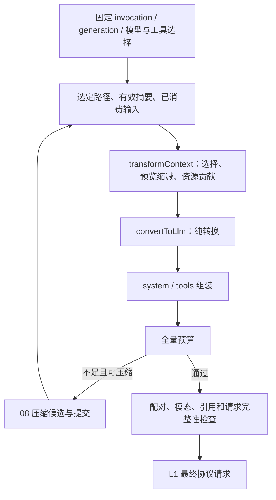
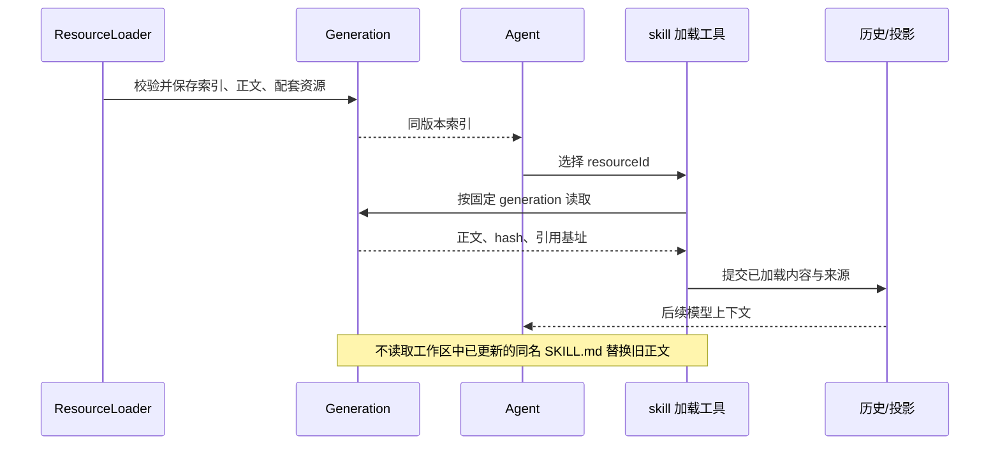

# 07 上下文、项目规范与 Skills

对应 PRD M08，并实现 M06 的转换阶段。L2 负责唯一上下文处理管道，L3 提供固定范围、资源与授权，L1 提供有效选项和协议开销。

## 1. 单一管道

D15-上下文图：工具输出在生产时已保存有界预览，不能等模型超窗才处理巨大结果。新建 Turn 时固定 ScopeSnapshot：branch/leaf、trace/turn/invocation、targetAgent、generation、selectionRevision、modelConfig/effectiveOptions、projectionRevision、已消费 inputIds、资源清单和约束版本。独立 Workflow 只组装显式输入及允许的上下文，不自动注入全部聊天历史。

ContextSource 返回所选路径及子 invocation 自身历史；pending 输入不在其中。从持久历史或本次消费集合合并时按 messageId/inputId 去重，不能各追加一份。transformContext 在 AgentMessage 副本工作，不能删未闭合工具组或改变原授权来源。convertToLlm 不再追加业务贡献。

请求诊断保存范围/内容摘要、各预算分项、被排除项及原因；默认只公开元信息，不广播全部提示词/原始用户授权。

## 2. 系统指令与项目规范

固定组装顺序：基础角色 → 实际工具使用说明 → append 指令 → 项目规范 → 自动可用 skill 索引 → 必要工作区信息。tools schema 作为工具选项，不重复铺进 system。应用自定义 system 替换基础角色，不暗自取消已启用规范和执行策略。

ResourceLoader 在受信发现根内按全局、获准祖先从外到内、当前目录读取。每目录 AGENTS.md 优先，无则 CLAUDE.md；其他名称/大小写别名仅在显式固定配置中启用。以规范化真实资源身份去重，超出发现根和循环链接拒绝；不递归读取整个项目内容。

每份规范进入模型时带来源位置、作用域和转义后的正文分隔。局部细化并不产生更高授权；安全约束由 11 处理。冻结指令资源，不冻结正在编辑的业务文件；发现可关闭或由显式内存资源替换，但产品 Session 工作区仍必填。

安全模式变化使用带可信来源的完整当前状态追加在保留历史之后，不每轮改稳定 system 前缀。后续执行仍即时受收紧策略约束；追加说明不是授权凭据。

## 3. Skills 的发现、冻结和加载

ResourceManifest 包含 skill 名称/描述、resourceId、generation/hash、正文与引用基址、加载方法、自动可用性和来源。构建 generation 时可读取并保存全文用于固定版本；只有索引预付模型 token。

索引固定只放 system 的 skill 区域，不同时塞到加载工具描述。没有加载器、位置不可用或 explicit-only 的 skill 不进入自动索引，能力查询说明原因。

D16-skill 时序：复用 Eino skill Backend.List/Get，Backend 是不可变 generation 的资源读取适配。skill_read 为受控加载工具，按目录/资源基址解析相对引用；业务文件读取仍返回真实当前内容。

同版本正文已经在投影内不重复注入；压缩移出后保存 hash/加载状态和可定位引用，需要时从同 generation 重载。正文过预算可明确分段或拒绝，分段不能标成完整 skill。资源丢失报 resource_unavailable，索引描述不等于已经阅读正文。加载 skill 不新增工具权限。

## 4. 工具预览和继续读取

| 类型 | 默认方向 | 行/字节边界与续读 |
| --- | --- | --- |
| read_file | 选定范围从头保留完整行 | 同时受行/字节上限；首行过长返回片段读入口，不伪装空文件 |
| execute stdout/stderr | 保留尾部 | 最后一行可取 UTF-8 安全尾片并标 partialLine；完整日志产物先保存 |
| grep | 命中数量、总字节，再单行限字符 | 保留源路径/行号；超长行给片段读信息 |
| 结构化工具 | 选择声明的摘要字段 | details/artifact 引用，不截坏 JSON |

工程值见 12。字符数按 Unicode code point，字节上限单独计算；源文件编码错误和截断造成的边界错误分开报告。

PreviewMetadata 至少有原始/显示范围、触发限额、partialLine、可用的 nextRead 参数或 artifactRef。提示使用实际装配工具名，不输出不存在的 bash/sed 命令。文件续读复核资源版本，不能保证多次读取拼成静态快照；稳定证据由工具另存产物。

只有保存成功的日志才给可读 artifactId。容器私有 /tmp 等路径必须先导出，不能让宿主 read_file 读同名路径。产物丢失明确标识，禁止重跑副作用以补输出。

## 5. 完整请求预算

BudgetBreakdown 包括 system、普通历史、摘要、工具 schema/说明、媒体、协议包装、输出预留和安全余量。L1 先解析 thinking/output，预算判定：

`estimatedInput + reservedOutput + safetyMargin <= effectiveContextWindow`

思考/答案共用限制只预留一次。适配器最终 payload 扩展后再次校验；不能在请求发送前偷偷追加指令或增大 maxTokens。

TokenEstimate 带 method/version/confidence：优先模型专用估算，再使用同模型/投影/工具版本的可信 usage 基线加增量；缺少专用算法时使用明确标记的保守通用近似。中文、emoji、代码和图片不可一概按四字符一个 token。未知窗口要求开发者能力配置中的保守上限；未知媒体成本且属于必需输入时拒绝，不假装零成本。

压缩、模型/工具切换后原 usage 基线失效。软阈值触发 08；硬限制禁止发送；固定 system/schema/必需 skill 本身超限时直接说明分项，不无限压缩无关历史。请求溢出后的恢复由 04 转回同一管道。

## 6. 缓存协作与摘要来源

稳定 system、规范、schema 和工具顺序由本章负责。运行 ID、时间、计数默认留 metadata；确需模型知道的动态信息追加在明确输入位置。已提交历史保持因果顺序，不能为缓存率重排 tool result。

压缩/分支切换取真实所选历史；共同祖先的合法前缀可复用，显式句柄/responseId 由 L1 验证。缓存失败不从外部取另一分支的上下文。

Compaction 与 BranchSummary 共用消息序列化和模型能力但来源不同：前者为当前路径已消费旧历史，后者仅为旧叶子到最近公共祖先之外的独有后缀。分支摘要需显式请求，不能每次 fork 都自动调用模型。范围、文件事实和提交规则分别归 08/09。

## 7. 失败与观测

投影转换失败、配对断裂、必需引用不可读或模型能力不足时不发送请求。可选资源跳过需要明确配置及诊断，不能静默删必需材料。压缩候选失败且旧投影仍满足硬预算时可沿用；否则返回 budget_exhausted/明确 cause。

公开诊断包含资源清单摘要、排除原因、估算来源、预算分项和生效版本；内容正文沿用授权查询。observability 的 span 不决定 Trace/投影是否存在，采样故障不改变执行状态。

## 8. 证据与验收

[pi 消息转换](../../pi/packages/coding-agent/src/core/messages.ts)、[Eino skill backend](../../eino/adk/middlewares/skill/skill.go)、[Eino 上下文 hook](../../eino/adk/handler.go)、[PRD M08](../pi-eino-prd/08-context-engineering.md)。

V-CONTEXT：全部 CTX-A；fake model 捕获最终 payload 断言顺序/内容/版本/预算。覆盖 pending follow-up 排除、父子隔离、未知媒体、模型变小、超长单行/Unicode、缺加载器、相对路径、重载后旧 skill、稳定前缀，以及被排除消息不经摘要或附录泄露。
