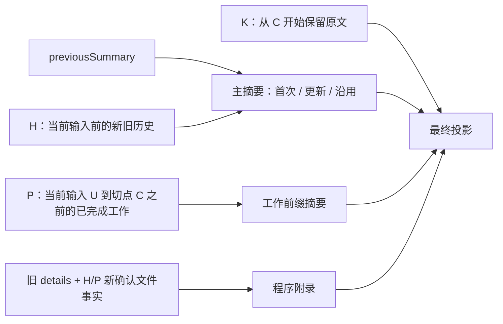
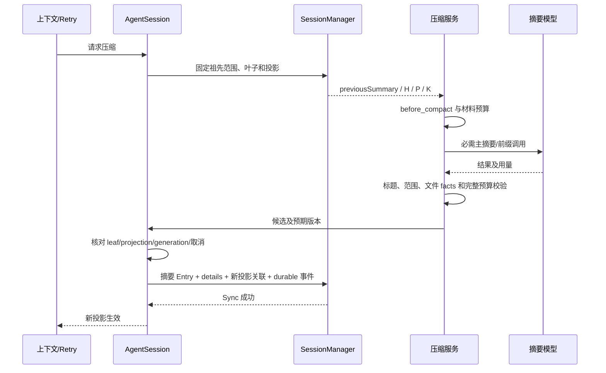

# 08 上下文压缩与摘要

对应 PRD M09；输入构造归 07，模型调用归 04，持久化归 09。产品只有一个压缩服务，不在 DeepAgent、middleware 和 Session 各自开启独立压缩器。

## 1. 入口、范围与预算

CompactRequest 包含 operationId、reason=manual/soft_threshold/overflow/extension、invocationId 和预期投影。空闲手动压缩要求无活动/待恢复 Trace、未消费输入或写操作冲突；活动压缩只登记在该 invocation 下一安全模型边界，不能切开工具批次或后台修改 waiting_input checkpoint。

自动软压缩在完整请求预算触发；overflow 由 04 的已认证证据触发；扩展请求不强制增加 Turn。没有新增可压缩范围返回 no_op，不调用模型或追加重复摘要。

Scope 固定 session/branch/leaf、trace/turn/invocation、generation、selection/model/effectiveOptions、projectionRevision、来源 Entry 与排除规则。先冻结范围再调用 before_compact；该操作不能悄悄扩大来源。新受理但未消费的 follow-up 不改变范围，不因无关 commitSeq 增长就误判投影过期。

主/子摘要、分支摘要均使用当前获准模型和 04 调用能力，禁用业务工具及服务端副作用工具；独立大窗口模型只在开发者策略显式选择时使用。摘要计入原 Trace 或空闲维护 operation 的预算。

## 2. 切点与 H/P/K

从所选有效上下文的最近消息向前累计近期保留目标，选最近合法起点 C。工具 result 不是独立切点，禁止把一个 assistant 工具批次及对应结果拆开。未结算组不可压缩；元数据不冒充消息切点。

`firstKeptEntryId=C` 包含 C 本身。范围引用使用稳定 Entry ID 与祖先关系，不用数组下标。工作前缀可跨多个产品 Turn，不重新定义 Turn。

D17-分区图：H/P/K 不重叠；previousSummary 已覆盖原文不重新展开。U 已被旧摘要覆盖时，使用原输入引用和旧请求背景，P 从当前有效未覆盖范围开始。H 为空且 previousSummary 存在时直接保留，不能以“没有历史”占位覆盖它。

近期目标只用于选点，合法工具配对和必需用户限制优先。没有合法切点或固定内容过大时明确失败，不删除 pending call 强行压缩。

## 3. 摘要生成策略

CompactionCandidate 由 mainSummary、可选 workPrefixSummary、sourceRanges、firstKeptEntryId、fileDetails、模型/模板/策略版本、usage、候选诊断构成。主摘要采用以下 Markdown 标题，缺项拒绝，无内容明确写“无/未知”：

| 标题 | 内容约束 |
| --- | --- |
| Goal | 原目标与明确范围变化 |
| Constraints & Preferences | 有效约束及偏好，不能由模型新增授权 |
| Progress | Done / In Progress / Blocked；完成项带证据 |
| Key Decisions | 当前有效决定及被替代关系 |
| Next Steps | 尚未执行的后续步骤 |
| Critical Context | 路径、符号、关键错误、产物、未决效果引用 |

工作前缀包含 Original Request / Early Progress / Context for Suffix。分支摘要采用探索目的模板，区分尝试、发现、失败及引用，不写成目标分支已执行事实。

首次：只输入当前选定 H。增量：previousSummary + 本次新覆盖 H，不重复输入已覆盖全部原文。需要 P 时单独生成工作前缀；默认按序生成，任一必需部分失败不能激活另一半。

材料从 AgentMessage 语义序列化，保留用户/助手/工具种类、CallID、状态和引用；FunctionToolResult 即使 role=user 也标为工具材料。超大工具正文用有提示的预览；必需多模态保留内容或使用获准模型，不能静默抹除。历史材料有清晰边界，不能被摘要模型当作新执行指令。

使用 Eino summarization.NewTyped、GenModelInput、Finalize 和 TypedMiddleware.Summarize。产品按 H/P 分别构建调用，Finalize 仅生成受检候选并组合近期区；所有部分成功后才经 SessionManager 提交。Callback 是通知，不承担提交。正常模型前触发和 overflow 恢复显式调用同一服务，不再把默认自动触发 middleware 额外挂两遍。

## 4. 确定性的文件清单

FileDetails 的权威来源为上一有效、受信摘要的 details，加本次 H/P 范围覆盖的已确认工具 FileFact。每项保留 resourceId/path、operation、toolCallId/observationId 和来源范围，便于核对。

| 情况 | 合并规则 |
| --- | --- |
| 确认 read | 加入 read 集 |
| 确认 write/edit，含失败但已确认部分写入 | 加入 modified 集，并从 read 显示集合移除 |
| denied/未执行/确认无效果 | 不加成功文件事实 |
| unknown | 保留未决调用引用，不冒充 modified |
| shell/自定义/子 Agent | 仅纳入可关联到本范围的结构化事实，不解析命令猜路径 |
| imported/不明格式旧摘要 | 不升级为受信文件事实，保留来源限制 |

去重按执行环境、工作区及平台资源身份；不全局转小写。modified 优先于 read；集合稳定排序。它表示历史曾发生的操作，不证明当前文件内容、Git diff 或测试通过。

模型正文不负责写文件清单。代码在结构校验后追加有界 read-files/modified-files 附录，完整集合留在 details/受控引用；移除模型伪造的同名保留标记。被排除内容的路径不经附录泄漏。新核对事实通过原调用关联更新后续有效视图，不修改原 unknown 记录。

连续例：read(a)、read(b)、edit(a) → read=[b], modified=[a]；再 write(c)、denied edit(d) → read=[b], modified=[a,c]。保留区 K 的事实等以后被覆盖才纳入摘要 details。

## 5. 验证、提交与重建

D18-提交图：比较决定材料的叶子/投影/版本，不比较所有控制记录的最后序号。候选生成期间取消、导航或相关历史改变则拒绝候选；先提交成功的压缩不会因随后取消被删除。

验证包含来源祖先关系、H/P/K 无重叠、第一保留点包含自身、完整工具组、六部分和必要工作前缀、有效 skill 版本引用、有界文件附录，以及重新构造后的完整请求预算。自由摘要语义质量通过评测集验证，不宣称程序可证明事实完全正确。

CompactionEntry 的 parent 是提交时原 leaf，提交后 active leaf 指向它；后续消息的 parent 接到它。重建遍历选定路径，找覆盖合法的最新祖先 compaction，投影“主摘要 + 必需前缀 + 程序附录 + C..K + 后续消息”。不把整个旧历史再输入摘要，也不以创建 branchId 必须等于当前 branchId 判断继承。

## 6. 失败、扩展与恢复

before 取消/异常、模型失败/截断、候选不合格、预算失败、提交失败分别记录 compaction.failed；不激活半份内容。旧投影满足硬预算时可继续，超过硬限制停止原请求。模板修复重试有界且使用同模型预算；不得默默截摘要后发布。

等待审批期间只登记压缩意图；恢复原 checkpoint、完成交互及关联批次后才能在下一边界压缩。压缩不改变 generation、一次许可和原授权原文。子 Agent 压缩只更新自身 invocation 的投影，父任务只接收正常委派输出。

before hook 可追加重点或返回一个替代候选；候选仍过同一验证和文件事实生成，不能换范围或伪造修改。after 通知失败只记录 extension.error。空闲手动取消只结束维护 operation，不取消无关 Trace。

## 7. 证据与验收

[Eino summarization](../../eino/adk/middlewares/summarization/summarization.go)、[pi 压缩实现](../../pi/packages/coding-agent/src/core/compaction/compaction.ts)、[PRD M09](../pi-eino-prd/09-compaction.md)。

V-COMPACT：CMP-A01～23，首次/增量/无新增、合法切点/工具对、H/P/K、旧摘要保留、confirmed/denied/unknown 文件、跨分支/父子隔离、取消/落盘前后崩溃、替代摘要和超大附录。模型质量集验证目标、限制、关键错误和引用是否保留；与确定性结构测试分别报告。
