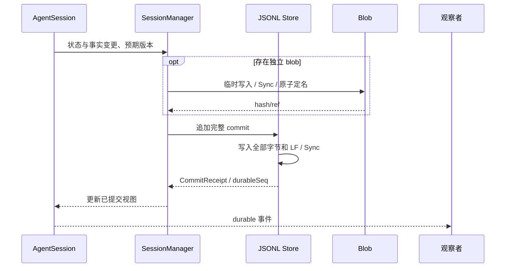
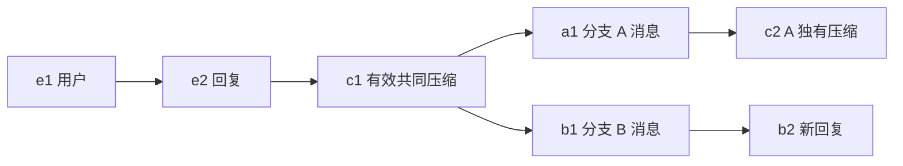
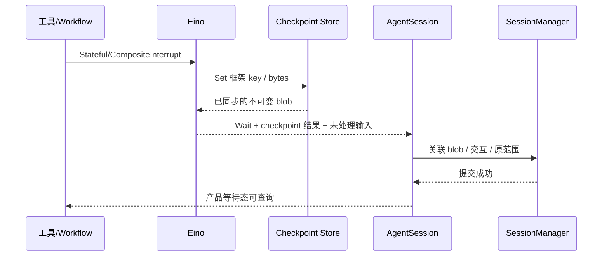
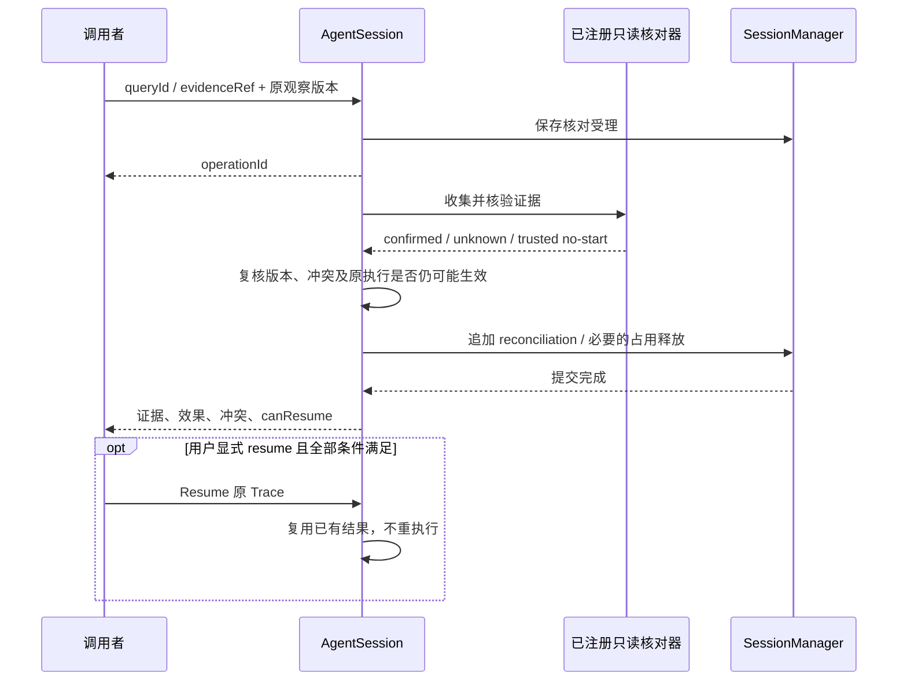

# 09 会话、提交、历史树与执行恢复

对应 PRD M10，并承担 M03/M05/M07/M09/M12 的一致提交。SessionManager 是语义所有者，SessionStore 是后端契约；checkpoint 是执行快照，不是 Session 历史。

<a id="layout"></a>
## 1. 数据布局与 Store

默认 stateRoot 使用操作系统用户配置目录下 pi-eino/state，由受信应用可覆盖；不能放进未受保护的业务可写根。创建前依据实际平台验证。布局：

```text
stateRoot/
  sessions/<sessionId>/
    journal.jsonl
    writer.lock
    checkpoints/<sha256>.bin
    resources/<generation>/manifest.json + 指令资源
    protected-inputs/<id>
  catalog/                      # 可重建查询索引，不是 Session 真相
artifactRoot/<sessionId>/<executionEnvironment>/...
tempRoot/<sessionId>/<callId>/...
```

artifact/temp 与 stateRoot 分区，不能把业务日志输出写入审批/checkpoint 目录。私有 tmpfs 不是持久产物根。需要读取 runtime 正文时通过受控 API，不给模型直接查询敏感文件。

```go
type SessionStore interface {
    Load(context.Context, string) (StoredSession, error)
    Append(context.Context, string, ExpectedCommit, Commit) (CommitReceipt, error)
    ReadAfter(context.Context, string, uint64) (CommitReader, error)
}
type CheckpointBlobs interface {
    Put(context.Context, []byte) (BlobRef, error)
    Get(context.Context, BlobRef) ([]byte, error)
}
```

锁由打开 Store 的会话实例持有并在关闭时释放，第二个写者返回 conflict；内存后端保留相同语义但明确不承诺重启恢复。本地数据库/分布式事务不在首版范围。

<a id="commit"></a>
## 2. JSONL 事务格式与确认点

header 是首行：formatVersion=1、sessionId、创建信息、WorkspaceBinding；不作为 Entry。其后每行是一项 Commit：

```json
{
  "recordType": "commit",
  "version": 1,
  "commitId": "opaque",
  "commitSeq": 42,
  "expectedPreviousSeq": 41,
  "entries": [],
  "controlRecords": [],
  "branchUpdates": [],
  "events": []
}
```

上例展示形状，不是已有文件。每个 entries/controlRecords 项有 type/version/stable ID；events 使用 02 的信封。一次逻辑状态变化及对应事件放在同一行，避免多行半提交。大 payload 先保存不可变 blob，再在 commit 中引用，控制行有明确大小上限，不能依 bufio.Scanner 默认 64 KiB 限制。

提交顺序：检查预期版本/身份和 writer lock → 生成完整 UTF-8 行并校验 → 写全部字节与换行 → File.Sync → 更新内存索引和发布资格 → 返回回执。新文件/blob 的创建/替换还要按 OS 能力完成目录元数据持久化；不把普通 Write 返回值称为掉电无损。



D19-提交图：崩溃后磁盘上完整且校验通过但响应尚未送达的 commit 可以被恢复，重试返回原回执。尾部未完成行不生效；不能从仅有内存事件倒推提交。外部效果与本地提交无法同一原子化，见许可/核对。

commitSeq 按 commit 连续递增；一 commit 可包含多个 durableSeq。事件存储与事实一起提交，不依赖 Subscribe 落库。缺失必要原文/blob/版本的记录不能宣称可恢复；无引用 blob 只是孤儿，后续受控清理不影响日志真相。

<a id="tree"></a>
## 3. 历史树、游标与配置

Entry 只存 parentId，children/ID 索引从已提交记录重建。branches 保存命名 head，activeBranchId/activeLeafId 单独持久化。导航到旧 leaf 不删除原后缀；若从历史位置开始新尝试，最迟在受理输入的同一 commit 建立新 branchId，再向它追加，原分支头保持可选回。显式 ForkBranch 立即登记新分支；切换已有分支沿用其身份，纯浏览不改变游标、不运行 hooks。



D20-树图：B 继承 c1 的合法覆盖，不能读 c2；c1 的创建 branchId 不等于 B 也不影响继承。摘要在所选 parent 路径上且覆盖合法才生效。

重建顺序：选定 parent 路径 → 从完整路径提取模型/思考及扩展私有状态 → 选择有效压缩/分支摘要 → 投影消息。不能先丢压缩前缀再找配置，也不能用文件末行或响应模型别名覆盖配置。next_trace 的 pending 默认值是控制记录，尚未生效不加入历史配置 Entry。

Fork/Navigate 需要 Session 空闲、无 pending 写/未消费输入/冲突效果；先固定目标和共同祖先，before_fork/tree 可取消或提供已请求的摘要候选。BranchSummary 仅来自旧路径到共同祖先之外的独有后缀，写入新选定路径后方可见；不回滚任何工作区文件。明确携带探索摘要与自动继承共同 compaction 是不同动作。

名称、书签和 CustomEntry 使用对应 Entry/控制契约，压缩不删除；私有状态按路径/commit 位置读取，不取整个文件最后值。导出包含格式/必要工作区信息和选定历史，默认排除秘密、一次许可可执行状态与私有凭据。

<a id="checkpoint"></a>
## 4. 不可变 checkpoint 与产品关联

Eino CheckPointStore.Get/Set 接收框架逻辑 key。适配器每次 Set 把 bytes 保存为不可变 hash blob，并保留本次执行的 key→blob 映射；Wait 确认 CheckpointAttempted/CheckpointErr 后提交 CheckpointRef。Get 只按当前绑定读取，Delete 仅清理框架别名，不删除仍被产品引用的 blob。

CheckpointRef 包含 session/branch/trace/execution/invocation、targetAgent、未完成 Turn/call、generation、有效模型/思考/selection、projectionRevision、历史 leaf/commit、扩展状态提交位置、待答交互、Eino/应用序列化版本和执行环境指纹。byte 哈希、资源清单和这些关联共同校验；“文件存在”不等于 canResume。新选择不能替换旧 checkpoint 对应的 Agent 或工作流定义。



D21-恢复点时序：asked 可以先保存但交互在 checkpoint 关联前不宣称可恢复。blob 落盘后关联前崩溃：不凭孤儿 blob 自动执行。产品关联完成后崩溃：从日志恢复同一等待态。任意错误/进程崩溃不保证 Eino 有最新 checkpoint。

<a id="resume"></a>
## 5. 打开、继续与 resume

三种动作分开：
1. Open：恢复历史、控制视图及 queued/hold 的原版本引用，不执行。
2. 新 prompt：在允许状态下受理为新 Trace，固定目标/generation 及依赖引用；执行时使用原绑定并复核当前权限，不重新选版。
3. Resume：原非终态 Trace 的兼容 checkpoint；不新建 Trace，不重放已完成副作用。

Resume 前依次校验当前状态/权限、未知效果冲突、blob 完整性、工作区和 backend 映射、build/Eino/序列化兼容、generation 可重建、原 targetAgent 与工作流定义/绑定、有效模型/工具选择和扩展状态、日志与 checkpoint 的进度一致性。

checkpoint 之后存在新的未表示模型/Turn 历史时，旧点不直接恢复；仅允许适配器明确支持的 pending 输入、已保存交互决定、原待执行工具的已有结果/核对结论合并。等待时不改 checkpoint 的投影。跨 OS/工作区/容器镜像的执行恢复默认不兼容；历史仍可读。

有效应答映射成服务端保存的 Interrupt target，再使用 ResumeWithParams；不让 HTTP 自填 Eino 地址。恢复包装器先查原调用账目：已提交结果返回同一结果，未占用有效批准可原子占用；已占用且未知则阻止执行，不能重新取额度。

旧资源正文可以按清单保存；Go 函数代码不能仅靠资源 hash 在新二进制里重建。缺少相同已编译实现/兼容声明则 incompatible_resume，不能加载新 generation 代替。

<a id="reconcile"></a>
## 6. 核对未知效果

Reconcile 可针对 paused、正在收敛取消或终态但仍有未知效果的调用；它不是普通空闲维护，不启动主模型、不新建业务 Trace，也不再次运行原动作。

请求含原 invocation/toolCall/observationVersion、相关 grantRef、注册的只读 queryId 或 evidenceRef、幂等键。查询实现来自受信注册，不接受任意 shell；人工判断只是材料，不能直接释放许可。



D22-核对图中的四项结果分别保存：证据是什么、效果哪些已确认、冲突是否解除、是否存在能承接结果的兼容恢复点。原进程仍可能继续生效时，瞬时查询不能下最终 no-start 结论。矛盾材料保留诊断，不能用后到消息覆盖已确认事实。

只有受信执行器的未启动证明可以解除占用，释放自身先提交。人工“没执行”、stderr 或查不到 PID 不足以证明。确认已执行/已有结果保持许可消费；业务失败也不恢复额度。无兼容 checkpoint 时 canResume=false，明确结束旧非终态 Trace 后才另提 prompt；终态不复活，旧队列不自动继续。

<a id="corruption"></a>
## 7. 损坏、版本和保留

打开时验证 header、ID/parent 引用、序号、记录版本、关键 blob。截断尾部可只读恢复有效前缀，进入 repair_required；受控修复复制完整有效前缀到新文件、保留原件及诊断，验证后原子切换。不能直接在破损尾部后续写。中段坏记录/断链不跳过后继续执行。

支持的旧格式经显式迁移生成新文件并保留原件；未知关键版本只读或拒绝追加，未知非关键条目保留 raw payload。迁移失败原件不变；迁移不重放工具/审批。

默认日志、幂等键和持久事件随 Session 保存。被已受理 Trace（包括 queued/hold）或 checkpoint 引用的 generation/blob 不自动过期；受理记录与版本引用一致提交，重启从原记录重建引用，ContinueQueue 不重新选版。缺失原版本明确失败/不兼容，不用最新版替代；无引用临时数据按受控清理策略处理。产物内容与可信 manifest 分开，读取核对 Session/环境/hash；可写业务产物发生变化时如实返回 changed/unavailable，不假称旧证据。

删除 Session、跨后端数据迁移和第三方外部事务不是本轮隐式承诺。底层 OS 掉电语义、文件系统/设备保证和实测故障记录进入 12，不以 File.Sync 宣称跨所有存储绝对无损。

<a id="evidence"></a>
## 8. 证据与验收

[pi SessionManager](../../pi/packages/coding-agent/src/core/session-manager.ts)、[Eino checkpoint](../../eino/internal/core/interrupt.go)、[TurnLoop 退出/保存](../../eino/adk/turn_loop.go)、[定向 Resume](../../eino/adk/runner.go)。

V-STORE/V-RESUME：SESSION-A01～23；单写锁、完整行/尾截断/中段损坏、响应丢失去重、parent/配置/公共摘要、blob 保存/关联之间崩溃、过时 checkpoint、未知效果核对、占用并发、旧版本缺失、旧队列 hold、终态不复活。逐个崩溃点检查原动作执行计数，而不只看最终文本。
