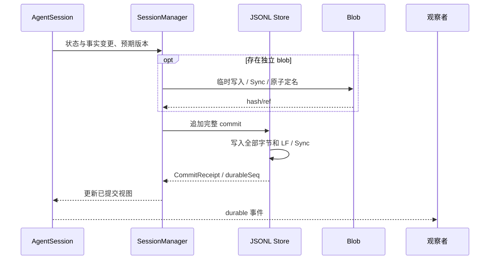
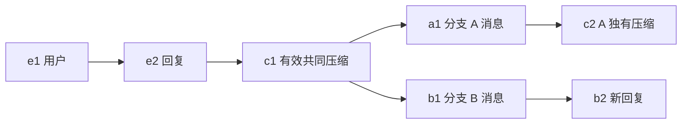
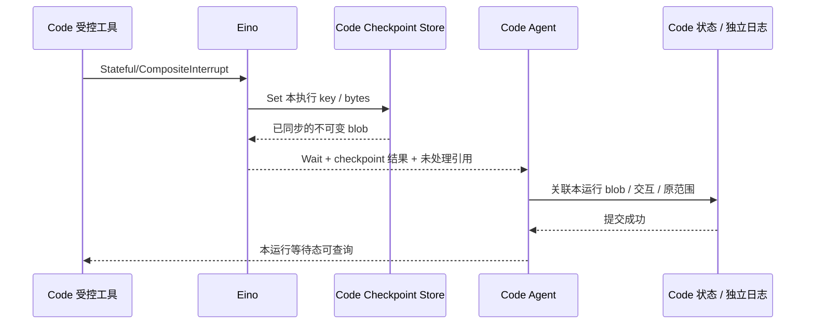
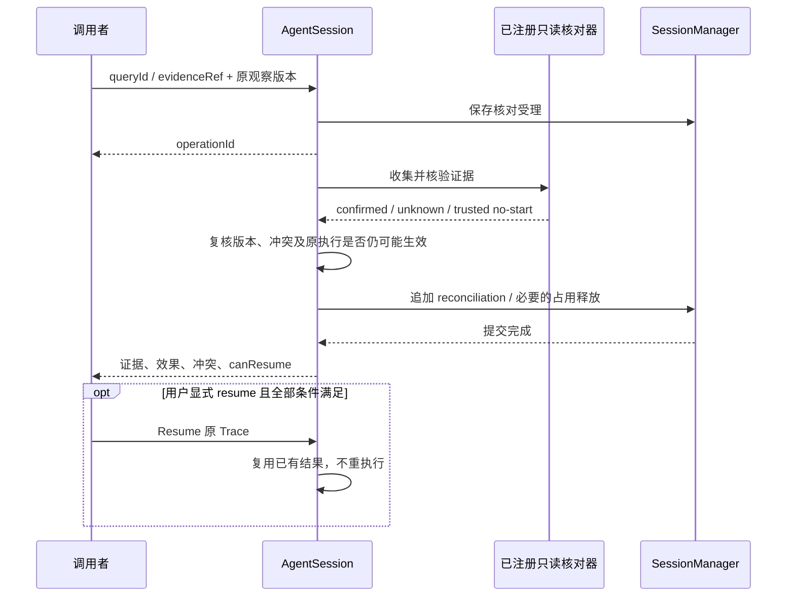

# 09 会话、提交、历史树与执行恢复

对应 PRD M10，并承担 M03/M05/M07/M09/M12 在各自运行内的一致提交。Code Agent 的 SessionManager 拥有会话历史/控制语义；Workflow Agent 独立拥有图运行、节点状态及生命周期。共享 `internal/storage` 只承载存储契约与 JSONL/memory 后端，两类 Agent 互不导入，各自是所属日志的唯一写入者。中立存储与独立工作流持久化已接入两类实际工厂、运行及重开路径，有相应默认测试；最终认证见 [P3 验证记录](../p3-verification.md)。checkpoint 是所属执行快照，不是会话历史，也不证明两类运行可全树原子恢复。

<a id="layout"></a>
## 1. 数据布局与 Store

默认 stateRoot 使用操作系统用户配置目录下 `seasprak/state`，由受信应用可覆盖；不能放进未受保护的业务可写根。创建前依据实际平台验证。当前 JSONL 后端将两类运行分区，Code 保持原 `sessions` 名称，不迁移成 `code-sessions`：

```text
stateRoot/
  sessions/<sessionId>/
    journal.jsonl
    writer.lock
    checkpoints/<sha256>.bin      # Code 的可选不可变框架 blob
  workflow-runs/<runId>/
    journal.jsonl                # 初始记录含工作流 manifest
    writer.lock
```

Code 的资源快照按其 generation 保存；Workflow 当前 manifest 在初始 journal 记录中保存定义/静态子流程 hash、模型/工具声明、构建指纹和 TODO 后端归属，不声称有 `resources/<generation>/manifest.json` 或原生整图 checkpoint 目录。Web 自己维护可重建目录索引、创建去重登记、名称标签和附件展示；它们不是 SDK 运行真相。后续 `protected-inputs`、完整资源生命周期及 artifact/temp 统一布局仍是原阶段目标，不据此声称已实现。

artifact/temp 与 stateRoot 分区，不能把业务日志输出写入 claim/checkpoint 目录。私有 tmpfs 不是持久产物根。需要读取 runtime 正文时通过所属运行的受控 API，不给模型直接查询敏感文件。

共享存储已保留 Load、Append、ReadAfter 及不可变 blob 的窄契约；由所属运行类型和 ID 定位日志、校验预期提交，传入可序列化记录，不由后端选择 Agent、解释节点或持有 manager 指针。契约与 JSONL/memory 实现归 `internal/storage`，不反向 import `internal/codeagent` / `internal/workflowagent`。业务状态和提交候选各由两类上层维护，不把现有 SessionManager 整体移入共享后端。

```go
// 当前 internal/storage 的可选能力；不是新增公开 SDK 别名。
type CheckpointBlobs interface {
    Put(context.Context, string, []byte) (BlobRef, error)
    Get(context.Context, string, BlobRef) ([]byte, error)
}
```

blob 的 string 参数绑定所属资源 ID；不能用另一运行的引用读取或恢复。

当前文件访问的有界实现以受信 `stateRoot` 及其祖先为部署边界：有限目录句柄在同一已检查根下打开受检子目录，保留完整重解析点检查和 `os.SameFile` 身份校验。owned 句柄由所属实例关闭，borrowed 句柄只借用、不另行关闭；`Path` 仅用于诊断，不据失效路径回退重新绑定，也不提供泛用文件系统。默认 Code／Workflow 工厂已将同一资源目录和同一 journal 文件贯穿 inspection/header、完整只读兼容预检、journal、writer lock 及只读打开；nil／注入后端保持原契约，不将默认后端加固外推至任意实现。

默认 JSONL 的长期 journal／writer.lock 在 Windows 保持 READ／WRITE 共享（share=3），拒绝 DELETE；同目录 `SyncRoot` 仅对实际 `FlushFileBuffers` 返回 `ERROR_INVALID_FUNCTION` 的平台不支持情况采用已批准例外，`ACCESS_DENIED` 及其他失败均不能吞掉。默认 Store 的 Unlock 失败后独立 File.Close 责任已在有界复核中关闭，不代表 Repair 的旧锁清理也已加固。

清单读取、Code 附件准入/展开、附件子目录及 Web 发布目录同步已有有界接受证据。Blob 按真实创建文件身份清理的 H1/M1 修正已独立规格/质量复审关闭并获父两平台完整 storage 证据的13.2c有界接受；观察身份到 Remove 的非原子窗口等原限制不变。13.2e清单生产 publisher 已接线，作者两平台限定结果、独立规格/质量复核及父完整上层组合共同支持有界接受；通用失败阶段旧目标 ID/mode 的非阻断测试补强建议与报告§9覆盖精度更正仍保留，文字更正不代表这些 assert 已补强。Repair 的旧 WRITE_THROUGH 替换迁移仍暂停，详见本章 §corruption；父最终冻结源全仓结果见 [12 当前证据与限制](12-delivery-and-validation.md#当前证据与限制)，不据测试绿色宣称所有持久写路径完成。

可写创建的 `OpenResourceRoots` 在 checked namespace 打开后对同一 actual state 句柄调用 `SyncRoot`，在 checked resource 打开后对同一 actual namespace 句柄调用 `SyncRoot`；已有目录的 create retry 仍执行这两次父同步，readonly/create=false 零同步。失败清理已取得的 owned 句柄，不重新打开诊断 Path；实际方法已独立有界接受。此顺序不保证真实断电无损或所有文件系统语义，不改变 Repair、registry 或旧 WRITE_THROUGH 方法。

公开 `Workflow.Close` 在真实 `frame.done` 后唯一调用 backend.Close；停止提交返回错误、actual backend.Close 错误及 broken 三个输入 cause 仅保存在私有 `closeCause`，公开返回直接可由 `sdk.AsError` 识别的固定 `storage_unavailable` / `"workflow close failed"`，或按原优先级直接返回 context sentinel（Canceled 优先于 DeadlineExceeded）。关闭完成后重复调用返回同一已保存 error 对象；调用方等待超时仍不证明真实退出，权限、unknown 与取消规则不变。该安全关闭方法已有默认及公开 SDK 消费者 RED→GREEN 和独立有界接受，不把私有 cause 暴露为公开错误链。

锁由打开所属日志的运行实例持有并在关闭时释放，第二个写者返回现有 `state_conflict`；独立 Code Agent 和 Workflow Agent 不共享一个写入者或日志锁。内存后端保留相同进程内语义但明确不承诺重启恢复。共享实现不提供跨日志事务、跨运行预算原子提交或完整子树 checkpoint；本地数据库/分布式事务不在首版范围。

<a id="commit"></a>
## 2. JSONL 事务格式与确认点

header 是首行，保留 formatVersion=1；Code 使用 SessionID，允许历史空 ResourceType 的 Code header，Workflow 使用 `ResourceType="workflow"` 与 RunID，两种身份不混填。各自 WorkspaceBinding 保持原绑定；工作流定义/静态子流程 hash、模型/工具声明、构建指纹与 TODO 后端版本在初始 journal 记录的 manifest 中固定，不放进虚构目录或共用会话 header。以下展示 Code Agent commit 形状；Workflow Agent 使用相同提交机制保存自己的节点/控制/事件，不把节点放入 Code Agent 的 entries/branchUpdates：

```json
{
  "recordType": "commit",
  "version": 1,
  "commitId": "opaque",
  "commitSeq": 42,
  "expectedPreviousSeq": 41,
  "entries": [],
  "controlRecords": [],
  "branchUpdates": [],
  "events": []
}
```

上例展示形状，不是已有文件。每个 entries/controlRecords 项有 type/version/stable ID；events 使用 02 的信封。一次逻辑状态变化及对应事件放在同一行，避免多行半提交。大 payload 先保存不可变 blob，再在 commit 中引用，控制行有明确大小上限，不能依 bufio.Scanner 默认 64 KiB 限制。

提交顺序：检查预期版本/身份和 writer lock → 生成完整 UTF-8 行并校验 → 写全部字节与换行 → File.Sync → 更新内存索引和发布资格 → 返回回执。新文件/blob 的创建/替换还要按 OS 能力完成目录元数据持久化；不把普通 Write 返回值称为掉电无损。


```mermaid
sequenceDiagram
    participant S as AgentSession
    participant H as SessionManager
    participant J as JSONL Store
    participant B as Blob
    participant O as 观察者
    S->>H: 状态与事实变更、预期版本
    opt 存在独立 blob
        H->>B: 临时写入 / Sync / 原子定名
        B-->>H: hash/ref
    end
    H->>J: 追加完整 commit
    J->>J: 写入全部字节和 LF / Sync
    J-->>H: CommitReceipt / durableSeq
    H-->>S: 更新已提交视图
    S-->>O: durable 事件
```

D19 展示 Code Agent 的提交图；Workflow Agent 由自己的状态所有者通过共享存储契约执行相同顺序，不调用 SessionManager、不与会话合并 commit。崩溃后磁盘上完整且校验通过但响应尚未送达的 commit 可以被恢复，重试返回原回执。尾部未完成行不生效；不能从仅有内存事件倒推提交。外部效果与本地提交无法同一原子化，见许可/核对。

commitSeq 按 commit 连续递增；一 commit 可包含多个 durableSeq。事件存储与事实一起提交，不依赖 Subscribe 落库。缺失必要原文/blob/版本的记录不能宣称可恢复；无引用 blob 只是孤儿，后续受控清理不影响日志真相。

<a id="tree"></a>
## 3. 历史树、游标与配置

Entry 只存 parentId，children/ID 索引从已提交记录重建。branches 保存命名 head，activeBranchId/activeLeafId 单独持久化。导航到旧 leaf 不删除原后缀；若从历史位置开始新尝试，最迟在受理输入的同一 commit 建立新 branchId，再向它追加，原分支头保持可选回。显式 ForkBranch 立即登记新分支；切换已有分支沿用其身份，纯浏览不改变游标、不运行 hooks。


```mermaid
flowchart LR
    E1["e1 用户"] --> E2["e2 回复"]
    E2 --> C1["c1 有效共同压缩"]
    C1 --> A1["a1 分支 A 消息"]
    A1 --> C2["c2 A 独有压缩"]
    C1 --> B1["b1 分支 B 消息"]
    B1 --> B2["b2 新回复"]
```

D20-树图：B 继承 c1 的合法覆盖，不能读 c2；c1 的创建 branchId 不等于 B 也不影响继承。摘要在所选 parent 路径上且覆盖合法才生效。

重建顺序：选定 parent 路径 → 从完整路径提取模型/思考及扩展私有状态 → 选择有效压缩/分支摘要 → 投影消息。不能先丢压缩前缀再找配置，也不能用文件末行或响应模型别名覆盖配置。next_trace 的 pending 默认值是控制记录，尚未生效不加入历史配置 Entry。

Fork/Navigate 需要 Session 空闲、无 pending 写/未消费输入/冲突效果；先固定目标和共同祖先，before_fork/tree 可取消或提供已请求的摘要候选。BranchSummary 仅来自旧路径到共同祖先之外的独有后缀，写入新选定路径后方可见；不回滚任何工作区文件。明确携带探索摘要与自动继承共同 compaction 是不同动作。

名称、书签和 CustomEntry 使用对应 Entry/控制契约，压缩不删除；私有状态按路径/commit 位置读取，不取整个文件最后值。导出包含格式/必要工作区信息和选定历史，默认排除秘密、一次许可可执行状态与私有凭据。

<a id="checkpoint"></a>
## 4. 不可变 checkpoint 与产品关联

以下不可变框架 blob 路径适用于 Code Agent，不代表 Workflow 已接入原生整图 checkpoint。Eino CheckPointStore.Get/Set 接收框架逻辑 key；Code 适配器每次 Set 保存不可变 hash blob，并保留本执行的 key→blob 映射，Wait 确认 CheckpointAttempted/CheckpointErr 后由 SessionManager 提交 CheckpointRef。Get 仅按所属绑定读取，Delete 只清框架别名，不删除仍被引用的 blob。

Code Agent CheckpointRef 包含 session/branch/trace/execution/invocation、普通 targetAgent、未完成 Turn/call、generation、有效模型/思考/selection、projectionRevision、历史 leaf/commit、扩展状态提交位置、待答交互、Eino/应用序列化版本和执行环境指纹。Workflow 当前运行调用 `BuildWorkflowGraph(..., nil)`，不传原生 checkpoint store；自己的 journal 固定 runId、定义/静态子流程/绑定、nodeExecutionId、冻结输入/调用账目及已提交结果，显式 Resume 重建图并复用这些事实，不借用会话 branch/Turn。已有节点/结果复用不证明原生整图、完整子树或跨运行 checkpoint。各自资源清单和恢复关联都须校验；“文件存在”不等于 canResume，新选择不能替换旧绑定。

以下框架 byte checkpoint 时序只表示 Code Agent 的原生恢复路径，Workflow 当前不按此写整图 blob：


```mermaid
sequenceDiagram
    participant T as Code 受控工具
    participant E as Eino
    participant B as Code Checkpoint Store
    participant S as Code Agent
    participant H as Code 状态 / 独立日志
    T->>E: Stateful/CompositeInterrupt
    E->>B: Set 本执行 key / bytes
    B-->>E: 已同步的不可变 blob
    E-->>S: Wait + checkpoint 结果 + 未处理引用
    S->>H: 关联本运行 blob / 交互 / 原范围
    H-->>S: 提交成功
    S-->>T: 本运行等待态可查询
```

D21-恢复点时序分别在一个所属运行内成立，不是跨 Agent 全树 checkpoint。一次审批的 asked/decided 只存在当前实例内存，checkpoint 不保存可恢复批准。blob 落盘后关联前崩溃不自动执行；关联完成后只恢复执行位置与调用事实，不能恢复旧批准。显式 Resume 遇尚未执行且仍需审批的调用重新询问；已有结果复用，unknown 先核对。工作流已有节点级暂停/审批/显式恢复保留，业务补参仍是未来阶段。

任意错误/崩溃不保证 Eino 有最新 checkpoint。复用节点状态、Interrupt 或“已完成前节点不重跑”的探针不证明原生整图 checkpoint，更不证明完整子树/跨运行恢复；只能声明经真实路径验证的具体节点恢复能力。

**现行原生预检方法（Step9 已批准并获有界接受）：**生产 `validateNativeCheckpoint` 每次新建私有惰性探针，保持 fresh／single-use；其私有 `validate(store)` 不可复用、池化或并发共享同一接收对象。外层产品 envelope/InputRef 关联检查不变，私有只读 store 复制入参及每次 Get 的 bytes，Set 拒绝；只执行一次公开 `ResumeWithParams` 原生加载，不消费执行迭代器、不第二次加载或恢复。

固定 Eino v0.9.21 的实际顺序为原生加载/宿主 codec → 惰性代理 `Name` → 框架生命周期回调。Name 使用公开 `adk.AppendAddressSegment` 进入原 targetAgent 地址，并用公开 `compose.GetInterruptState[[]byte]` 要求 `wasInterrupted && hasState && len(state)>0`，随后始终以本次加载私有的非零大小 stop 对象同步停止。recover 仅在具体指针类型、完全同一对象 identity、checked 和合法根状态 valid 均满足时成功；加载错误、正常落空、异源对象或其他 panic 一律以固定 `incompatible_resume` 拒绝，不暴露异常值、native bytes 或 stack。地址读取已消费本次中断映射，停止后丢弃该上下文，不能继续 `buildResumeInfo` 或复用探针。

该方法隔离预检中的 framework Needed/生命周期 callbacks 及惰性代理执行，保持宿主 handlers 和真实执行回调，不清空 callbacks、不使用反射/私有 callback manager、不 fork/patch/升级 Eino，也不新增第二执行循环。宿主 GobDecoder/UnmarshalBinary 等 codec 仍可能先执行，不能据此保证任意宿主零副作用、无阻塞、资源有界或同步解码可取消。成功只认证原目标根的具体非空 `[]byte` interruption state，不认证整个原生树、内层 bytes 业务语义或所有历史格式；升级 Eino 或改变单次探针用法须重新验证，不能沿用固定版本结论。

真实 Pause/审批发布、活跃可写会话 Snapshot、负向 Snapshot/Resume 与模型后/工具后磁盘重开恢复已有有限认证：合法预检生命周期回调增量为零；恢复校验在接受提交/worker 启动前完成；负向查询不 Append/Put，发布失败仍允许既有失败收尾而不得关联合法恢复点。父 Windows／实际 Linux 的完整 Eino、Code Agent/state、SDK 及显式 consumer 普通/race 四条命令均 exit 0，范围与预算/实际调用断言见 [P3 验证记录](../p3-verification.md)。这些是 Step9 生产行为门槛，不代替后续文件集的最终全仓认证。Workflow 当前没有原生整图 checkpoint，不据 Code 修正扩大节点、完整子树或跨运行恢复。未来原生 Workflow checkpoint 若接入仍须单独满足 D21。

**修前历史保留：**旧预检继承宿主全局 callbacks，确曾阻塞基础暂停/恢复；永久生产回归记录 Needed=2、OnStart=1、OnEnd=1，恶意 OnEnd 子进程退出 2。Step8 候选通过当时不能关闭生产缺陷，Step9 实施时独立文件边界 RED 导致整包普通/race 失败的记录也保留。上述历史不删除或改写为通过；现行有限修正/复核及父受影响范围结果与之分开，父最终冻结源两平台全仓结果见 [12 当前证据与限制](12-delivery-and-validation.md#当前证据与限制)，P3 仍未完成。

<a id="resume"></a>
## 5. 打开、继续与 resume

三种动作按所属运行分开；两类工厂与独立日志打开路径已接线，最终签名见 06：
1. Open：`OpenAgentSession` 恢复 Code Agent 历史、控制视图及 queued/hold 的原版本引用；`OpenWorkflowAgent` 恢复 Workflow Agent 的原定义/绑定、节点输入与已提交结果、调用账目和控制视图。二者均不执行、不自动恢复，不改变原工作区绑定；跨类型打开明确拒绝。
2. 新执行：Code Agent 的新 prompt 受理为新 Trace，固定普通目标/generation 及依赖引用；Workflow Agent 的结构化输入在自身独立运行受理，不进入会话 prompt/steering/follow-up 队列。各自执行使用原绑定并复核当前权限，不重新选版。
3. Resume：显式继续本运行的非终态执行，使用兼容 checkpoint 或经真实路径验证的节点/专用恢复绑定；保留原逻辑调用身份，不重放已完成副作用。Code Agent 不承接另一独立 Workflow Agent 的节点恢复；历史 direct 绑定不扩展成新用户 shell 能力，完整子树/跨运行联合恢复由业务负责。

**用户 shell 的恢复边界（2026-09-27 历史确认，当时待实现）：**用户直接 shell 不生成审批等待、工具 claim 或恢复绑定，不参与模型 checkpoint 和持久化执行去重；command 历史只用于展示/上下文，不是可重放执行队列。Open、Resume、回放、结果或日志保存失败均不得启动或自动重跑命令。旧 direct 审批/恢复记录须保持历史可读，不得静默解释为新用户请求；迁移时明确拒绝不相容恢复，不再扩展旧 direct 恢复能力。模型工具的审批、原调用去重、unknown 核对及全部 blob/Turn/版本校验保持不变。详细迁移和验收见 P2 计划 Step 16.1。

Resume 前依次校验所属运行类型/ID及当前状态/权限、未知效果冲突、blob 完整性、工作区和 backend 映射、build/Eino/序列化兼容、自己的 generation 可重建，以及日志与恢复材料的进度一致性。Code Agent 校验原普通 targetAgent、有效模型/工具选择、投影及扩展状态；Workflow Agent 校验原定义/静态子流程/节点绑定、节点输入与已提交结果、模型完整响应接纳和调用账目。业务父调用、外层批准及另一个运行的 checkpoint 不能替代任何校验。

checkpoint 之后存在新的未表示 Code Agent 模型/Turn 历史或 Workflow Agent 节点/调用事实时，旧点不直接恢复；仅允许所属适配器明确支持的本运行 pending 输入、当前运行实例仍在内存中的有效审批决定、原待执行工具的已有结果/核对结论合并。一次性审批决定不写入 checkpoint 或 journal，重开后必须重新判断权限并按需询问。等待时不改 checkpoint 的投影。跨 OS/工作区/容器镜像的执行恢复默认不兼容；历史仍可读。

有效应答映射成服务端保存的 Interrupt target，Code 原生恢复路径再使用 ResumeWithParams，不让 HTTP 自填 Eino 地址。Workflow 当前按原 journal 节点/冻结调用和本实例批准重建图，不将业务答复变成框架恢复地址。恢复包装器先查原调用账目：已提交结果返回同一结果，未占用有效批准可原子占用；已占用且未知则阻止执行，不能重新取额度。

旧资源正文可以按清单保存；Go 函数代码不能仅靠资源 hash 在新二进制里重建。缺少相同已编译实现/兼容声明则 incompatible_resume，不能加载新 generation 代替。

<a id="reconcile"></a>
## 6. 核对未知效果

Reconcile 当前公开入口及下述 D22 属于 Code Agent，可针对 paused、正在收敛取消或终态但仍有未知效果的调用；它不是普通空闲维护，不启动主模型、不新建业务 Trace，也不再次运行原动作。Workflow 同样必须保留 unknown、不盲重跑、不借用另一日志释放票据；当前 WorkflowAgent 没有公开 Reconcile 方法或 HTTP 核对路由，未决调用会阻止 Resume，不能把 Code 的核对入口套给它。工作流独立只读取证/追加核对仍是待交付目标，安全承诺不因入口未实现而缩减。

请求含原 invocation/toolCall/observationVersion、相关 grantRef、注册的只读 queryId 或 evidenceRef、幂等键。查询实现来自受信注册，不接受任意 shell；人工判断只是材料，不能直接释放许可。


```mermaid
sequenceDiagram
    participant C as 调用者
    participant S as AgentSession
    participant Q as 已注册只读核对器
    participant H as SessionManager
    C->>S: queryId / evidenceRef + 原观察版本
    S->>H: 保存核对受理
    S-->>C: operationId
    S->>Q: 收集并核验证据
    Q-->>S: confirmed / unknown / trusted no-start
    S->>S: 复核版本、冲突及原执行是否仍可能生效
    S->>H: 追加 reconciliation / 必要的占用释放
    H-->>S: 提交完成
    S-->>C: 证据、效果、冲突、canResume
    opt 用户显式 resume 且全部条件满足
        C->>S: Resume 原 Trace
        S->>S: 复用已有结果，不重执行
    end
```

D22-核对图中的四项结果分别保存：证据是什么、效果哪些已确认、冲突是否解除、是否存在能承接结果的兼容恢复点。原进程仍可能继续生效时，瞬时查询不能下最终 no-start 结论。矛盾材料保留诊断，不能用后到消息覆盖已确认事实。

只有受信执行器的未启动证明可以解除占用，释放自身先提交。人工“没执行”、stderr 或查不到 PID 不足以证明。确认已执行/已有结果保持许可消费；业务失败也不恢复额度。无兼容 checkpoint 时 canResume=false，明确结束旧非终态 Trace 后才另提 prompt；终态不复活，旧队列不自动继续。

<a id="corruption"></a>
## 7. 损坏、版本和保留

打开时验证 header、ID/parent 引用、序号、记录版本、关键 blob。截断尾部可只读恢复有效前缀，进入 repair_required；受控修复复制完整有效前缀到新文件、保留原件及诊断，验证后原子切换。不能直接在破损尾部后续写。中段坏记录/断链不跳过后继续执行。

上述修复是目标提交语义。当前 `Repair(path)` 的任意 parent 不能当作可信 stateRoot 锚点；完整保留旧 WRITE_THROUGH 的 ReplaceFile/Repair 替换迁移仍暂停，未采用 File.Sync→相对 Rename→目录 Sync 替代来宣称等价。Repair 中既有 raw-path 与旧 flock 清理未据默认 JSONL 接受结果认证为已加固，目标身份检查后换位及按名字清理的非原子窗口仍保留；清单发布的有限方法批准不扩展到 Repair。

此次拆分不要求兼容迁移旧开发数据。不兼容格式、未知关键版本或 Code/Workflow 运行类型不匹配时，使用 02 既有错误码明确拒绝可写打开/恢复；允许的历史只读兼容仅展示原事实，不改写为新类型或执行请求。未知非关键条目保留 raw payload。拒绝不会自动清理目录、覆盖原件或重放工具/审批；未来格式迁移须另行批准，不作为当前承诺。

默认日志、幂等键和持久事件随各自运行保存。Code Agent 被已受理 Trace（包括 queued/hold）或 checkpoint 引用的 generation/blob 不自动过期；受理记录与版本引用一致提交，重启从原记录重建引用，ContinueQueue 不重新选版。Workflow Agent 独立保留被节点/恢复点引用的定义、绑定、generation/blob，不借用会话队列来恢复引用。缺失原版本明确失败/不兼容，不用最新版替代；无引用临时数据按受控清理策略处理。产物内容与可信 manifest 分开，读取核对所属运行/环境/hash；可写业务产物发生变化时如实返回 changed/unavailable，不假称旧证据。

删除 Session、跨后端数据迁移和第三方外部事务不是本轮隐式承诺。底层 OS 掉电语义、文件系统/设备保证和实测故障记录进入 12，不以 File.Sync 宣称跨所有存储绝对无损。

<a id="evidence"></a>
## 8. 证据与验收

[pi SessionManager](../../../pi/packages/coding-agent/src/core/session-manager.ts)、[Eino checkpoint](../../../eino/internal/core/interrupt.go)、[TurnLoop 退出/保存](../../../eino/adk/turn_loop.go)、[定向 Resume](../../../eino/adk/runner.go)。

V-STORE/V-RESUME：SESSION-A01～23；单写锁、完整行/尾截断/中段损坏、响应丢失去重、parent/配置/公共摘要、blob 保存/关联之间崩溃、过时 checkpoint、未知效果核对、占用并发、旧版本缺失、旧队列 hold、终态不复活。新增迁移断言分别验证两类独立日志/写入者/游标，跨类型 Open 明确拒绝且原目录不变，工作流节点不进入 Code Snapshot，节点结果复用不计作原生整图 checkpoint 通过；原生预检按本章 §checkpoint 的 fixed/fresh/single-use、原目标根及生命周期回调隔离方法执行，实际生产入口、codec 交叠/并发信号和真实 Pause/审批/可写 Snapshot/Resume/Diskopen 组合获 Step9 有界接受，宿主 codec 仍可先执行。修前回调和文件边界失败保留，Blob 及清单 publisher 均获独立复核和父两平台实际证据的有界接受，Workflow.Close 安全错误与可写创建父目录同步方法见本章 §layout；清单通用失败阶段旧 ID/mode 补强建议保留，Repair 及整树/全部持久写路径不自动关闭，父最终冻结源全仓结果见 [12 当前证据与限制](12-delivery-and-validation.md#当前证据与限制)。逐个崩溃点检查原动作执行计数，而不只看最终文本。
