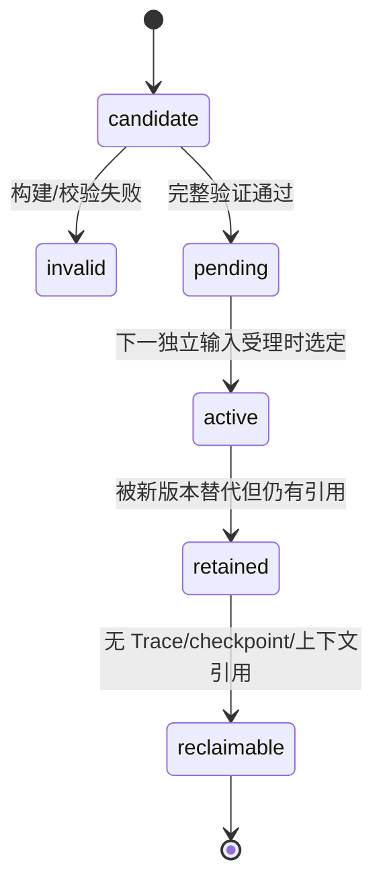
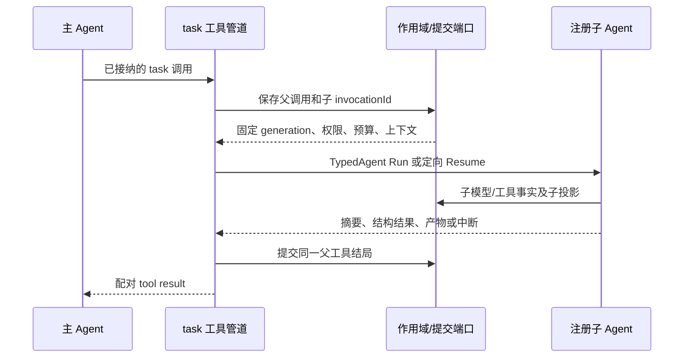
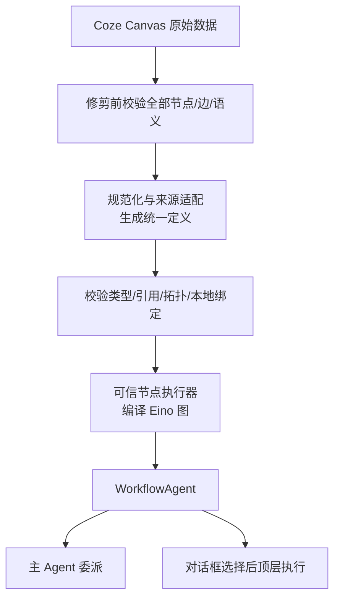
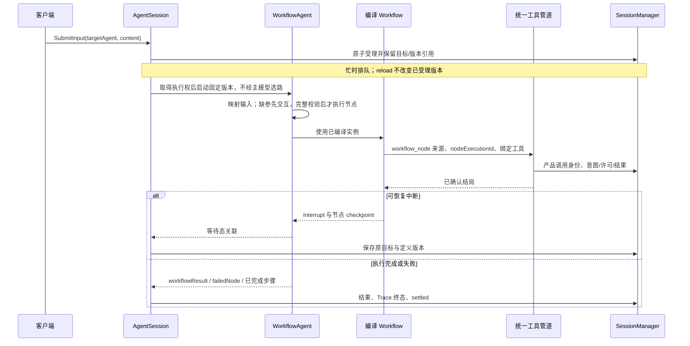

# 10 扩展、generation、子 Agent 与 Workflow

对应 PRD M11。ExtensionRegistry 登记能力，ResourceLoader 读取资源，AgentSession 选择版本及协调运行操作；本章不新增插件容器或运行时 Go 编译平台。工作流保存为声明式数据，运行时编译为 Eino 图，再统一适配为 `WorkflowAgent`。

<a id="registration"></a>
## 1. 登记 API 与校验

```go
func NewExtensionRegistry() *ExtensionRegistry
func (r *ExtensionRegistry) RegisterTool(ToolDefinition) error
func (r *ExtensionRegistry) ReplaceTool(ToolReplacement) error
func (r *ExtensionRegistry) AddSubAgent(
    adk.TypedAgent[*schema.AgenticMessage], ...SubAgentOption,
) error
func (r *ExtensionRegistry) RegisterWorkflow(WorkflowDefinition) error
func (r *ExtensionRegistry) RegisterCommand(CommandDefinition) error
func (r *ExtensionRegistry) RegisterProjection(SpecialMessageProjection) error
```

另提供 OnInput/OnContext/OnToolCall/OnToolResult/OnPrepareNextTurn/OnShouldStopAfterTurn 及会话生命周期的类型化 hook 注册。普通 CustomMessage 使用通用 content，不要求 RegisterProjection。

定义至少包含名称、用途、来源/实现版本、输入输出和能力约束；工作流还包含来源格式版本、节点、字段引用、资源绑定及副作用声明。注册阶段校验 schema、重名、保留名称，以及工作流的原始节点能力、字段类型、引用、拓扑和资源绑定；具体拒绝条件见第 5 节。ReplaceTool 需要 expectedSource/version，只有应用允许替换的目标才成功。运行期登记成功只形成 candidate，不改活动对象或可见工具清单。

`RegisterWorkflow` 只接收统一声明式定义；来源适配器先完成原始数据校验并输出该定义，不要求调用方持有编译后的 Runnable。原有 Go 可执行实例可继续经 `WorkflowAgent` 包装后用 `AddSubAgent` 登记，不放入持久化的 WorkflowDefinition，也不增加第三种产品使用方式。未知节点、未知语义、非法类型/拓扑或缺绑定给出节点/边/字段级诊断，不形成可激活 candidate。

示例为待实现 SDK 形态，错误必须处理：

```go
registry := NewExtensionRegistry()
if err := registry.AddSubAgent(customAgent); err != nil {
    return err
}
session, err := CreateAgentSession(ctx, SessionOptions{
    Workspace: workspace,
    Model: modelSelection,
    Extensions: registry,
})
```

用户自行创建符合 Agentic 接口的子 Agent；声明式工作流由适配器加载后登记为同一契约。当前不提供编排界面或预算配置。注册不要求修改核心循环。

<a id="generation"></a>
## 2. 版本生命周期



D23-generation 图是资源生命周期，不是新的业务任务状态机。Manifest 包含工具实现/schema/说明、handlers 顺序、工作流定义/子流程依赖/节点执行器与资源绑定版本、子 Agent 版本、system/项目规范、skill 正文与配套指令资源 hash、二进制兼容标识。业务工作区文件不冻结。

资源 reload 工作异步构建候选；成功后 pending。协调者在受理新的独立输入时原子选择已验证版本，将 targetAgent（名称/版本/generation）、定义及依赖清单引用与 inputId/traceId 一致保存后才返回 accepted；忙时 queued 也在此固定，开始执行、ContinueQueue 或重启后不重新选择最新版本。当前 follow-up、steering、子调用、恢复固定原 generation。构建失败保留旧版并报告未生效；原版本中不存在请求目标时拒绝受理，不改投主 Agent 或同名其他版本。初次无可用版本明确失败；受理后的版本不可重建则明确失败/不兼容，不由 PrepareAgent 静默回退到另一版本。

retained 版本必须保留相关资源和清理句柄，引用计数含 queued（包括 hold）、活动 Trace、待恢复 checkpoint 和扩展上下文。受理与引用保留一致提交；引用未释放前不得回收。资源可保存但旧 Go 函数需要当前 binary 内可重建；缺失明确 incompatible_resume。关闭旧上下文只在引用释放后触发 session_shutdown。紧急撤销权限是独立即时策略，不等待 generation 升级；版本固定不冻结权限。

<a id="runtime-ops"></a>
## 3. ExtensionContext 与受控操作

| 能力 | 返回/行为 | 边界 |
| --- | --- | --- |
| ReadContext / QueryHistory | 作用域内只读视图 | 子调用不获得父私有历史/队列消费权 |
| SendMessage | CustomMessage、是否触发、投递模式，返回 input/operation 身份 | 默认不触发；活动时下一安全输入边界，空闲时持久追加 |
| SubmitInput | 显式 prompt/steering/follow_up | 保留 extension Source，不变成人类授权 |
| AppendEntry / ReadEntries | 带命名空间的 CustomEntry | 按路径/commit 位置恢复，不入模型 |
| SetDefaultModel / SelectNextTurnModel | 分别设下一 Trace 默认和当前下一 Turn | 获准候选内选择，不改当前流和旧 checkpoint |
| GetAllTools / GetActiveTools / SetActiveTools | 当前 generation 候选、生效选择及请求 | 成功受理不等于立即生效 |
| Abort / RequestCompaction | 取消或下一安全边界请求 | 不重入 Runner/压缩；取消不受其他 hook 否决 |
| ContinueQueue / Reconcile | 经应用授予的对应能力 | 不自动解除许可或继续旧任务 |

ExtensionCommandContext 在应用命令执行时增加创建/打开/切换 Session、分叉/导航、名称/书签和空闲维护。要求空闲的命令忙时 conflict，不等待自己所在工具结束。命令登记定义 schema、所需能力和是否 idleOnly；slash 文本只是外层映射，扩展发的普通文本默认不执行管理命令。

写操作先保存 accepted 再返回身份；真正投递/生效另查状态。转换/维护 before 用返回值贡献候选，不同时发同范围写操作；after 可以请求下一操作，但不能追溯撤销。hook 中不能同步等待依赖自身退出的结果。

未投递消息在 Trace 终结后保留原归属和原因；明确另行投递使用新身份，不跨 Trace 自动转移。CustomEntry 和 CustomMessage 的保存/模型意义分开。

<a id="subagents"></a>
## 4. 子 Agent 接入与作用域



D24-委派图：子 Agent 的输入是显式委派和允许上下文，不自动复制全部主历史；Agentic AgentTool 不使用旧 Message 的 fullChatHistoryAsInput 功能。Eino RunPath 仅诊断，实际 ID 由 task 管道分配并在恢复时复用。

通用子 Agent 由产品用 TypedChatModelAgent 显式构建，注入与主 Agent 同等的模型重试、控制 hooks、受控工具和恢复包装；DeepAgent 关闭对应隐式重复创建但仍提供 general-purpose 名称与能力。专家实例复用 adk.TypedAgent，声明恢复时必须满足 TypedResumableAgent 和产品 checkpoint 契约。同一 `WorkflowAgent` 适配对象既可作为子执行者，也可作为顶层独立 Agent。

受控边界结束（例如本批工具全部 terminate 且无子作用域续输入）在该 invocation 包装器中归一为正常的内部结束和有效委派输出；不能把内部边界标记直接泄漏成父 task 的业务失败。真正模型/工具/存储错误与审批中断仍按 Eino 的 error/Interrupt 传播，包装器不得吞掉它们。与此相关的边界用例列入 V-EXT，而不是假定任意 TypedAgent 都天然具备相同行为。

子作用域持有共享总预算和收窄权限、自身工具选择/TODO/投影/扩展状态，不能消费顶层 steering。父取消递归传递；子压缩不覆盖父主线；输出文件 facts 关联子调用和父委派来源。嵌套深度/并发和委派时限由 12 控制。

第三方 Go Agent 实例属于信任代码，必须使用提供的模型/工具/效果端口并声明可恢复性。包装器只能管理其公开 Run/Resume、身份和事件，不能保证拦截任意内部 HTTP/os 调用。未满足受控效果契约的实例不能标记为已认证 sandboxed；可注册用于受信嵌入场景，能力查询明确边界。每实例不支持并发时按声明串行调用，不共享可变 invocation 状态。

<a id="workflows"></a>
## 5. 动态工作流与两种使用方式

WorkflowDefinition 包含 name/version/description、source/formatVersion、input/output schema、nodes/edges/bindings、supportsFreeText、resumable、节点效果声明。定义不包含 Go 函数或编译后的 Runnable。当前不提供编排界面，但运行时支持加载声明式工作流。



D25a-定义编译图：来源适配器只负责格式语义；执行器、模型、工具和凭据使用本项目受信端口。本地 Coze 依赖较旧的 Eino，采用格式适配而非直接引入整个后端。

| 使用方式 | 输入与身份 | 模型和结果 |
| --- | --- | --- |
| 主 Agent 的子 Agent | task 委派描述 → 显式参数映射/补参；父 toolCallId + 子 invocationId | 映射器可为获准模型节点；缺参在副作用前交互，不猜参数；摘要回到原父调用 |
| 对话框选择的独立 Agent | 用户指定 targetAgent；新顶层 Trace、根 invocation | 跳过主模型路由；内部模型节点仍计量；结果直接进入对话，不伪造父工具消息 |



D25-独立执行图：两种使用方式共用规范化执行函数和输入/输出契约。独立固定流程若不支持自由文本则拒绝 steering/follow_up，不能插入一个主模型节点来“处理一下”。子委派仍走第 4 节 D24。

首个适配器读取指定版本的 Coze Canvas JSON。首批节点：开始/结束、字面量与节点输出引用、基础大模型、条件分支、本地固定版本子流程。本项目已登记工具可作为受控节点；Coze 插件引用只有显式绑定后才可执行。循环/批处理、代码、HTTP、知识库和平台全局变量列为后续能力，不因嵌在已支持节点的字段中就自动支持。原始导出包另用真实文件认证，Canvas JSON 跑通不等于任意导出包可运行。

激活前按以下顺序校验，失败保留旧版并返回来源及节点/边/字段定位，不以 panic 或静默删节点代替诊断：
1. 反序列化后，先检查全部原始节点（包括未连线节点）、唯一节点 ID、边端点、节点类型及执行字段；未知节点/语义、批处理开关、全局变量引用或未绑定的插件/子流程均拒绝。基础模型节点不隐式启用函数调用或平台历史注入。该检查必须在任何修剪之前完成。
2. 通过原始校验后才允许规范化、修剪已确认合法的孤立节点，并记录被移除的节点；转换字段引用和条件端口为统一定义。修剪后重新检查引用，不能把引用被删节点当作空值。
3. 校验恰好一个开始节点和一个结束节点、节点/字段/端口引用可解析、字面量及上下游输入输出类型相容、必需输入可满足、首批图无环且存在合法开始到结束路径；分支及汇合不能在所选路径上读取未产生的输出。固定版本子流程依赖也必须存在且无递归引用环。类型或拓扑错误阻止编译和激活。
4. 模型、工具、子流程和凭据只解析到受信本地绑定；编译使用已登记可信执行器。编译失败同样阻止激活。外部资源 ID 仅作为来源标识，不据此查找或启用宿主能力。

每个节点调用身份由 workflow invocation + nodeId + 逻辑访问序号持久分配，重试/resume 保持原 nodeExecutionId；后续支持循环时，新的合法访问才使用新序号。副作用节点以 `workflow_node` 来源进入 05/11：由 nodeExecutionId 关联稳定的产品 toolCallId，按固定定义的本地工具绑定校验，而不是检查模型本轮可见性。节点没有模型轮次时不要求 turnId/selectionRevision/providerCallId，也不借用父 task 的 Turn；统一保留授权、预算、意图/许可和结果去重。结果回填节点状态，不制造模型 FunctionToolResult。子委派的外层 task 仍只生成与父请求配对的一条工具结果；独立入口直接展示 workflowResult。

错误提供失败节点、类别、已完成步骤和 confirmed/unknown 效果。只有支持并测试过 Interrupt/Resume 的流程宣称可恢复；否则保存进度诊断并明确不可恢复，不推断跨任意外部服务 exactly-once。采用 Eino 不等于任意图可恢复。

`ExecuteWorkflow` 不再作为第三种公开产品入口；内部可复用同一规范化执行函数。公开路径是能力查询列出可选择 Agent，再由 `SubmitInput` 携带目标引用。默认仅对新 `chat/prompt` 在未选择时使用主 Agent。排队后改变界面选择，不能改变已受理请求及其版本。相同幂等键但目标不同视为不同请求内容并报冲突。`steering/follow_up` 从 targetTraceId 继承原目标，显式目标不匹配则拒绝，不转成独立任务；resume 只恢复原保存目标。

<a id="lifecycle"></a>
## 6. 生命周期和失效处理

会话 hooks 的组合、可取消点及提交顺序以 06 为唯一规范。分叉是同 Session 分支，不能照搬 pi 复制成新 Session 的 fork。before 取消保留原绑定/游标/投影；替代摘要经 08 的结构、范围、预算和程序文件 facts 验证。

扩展缺失时普通 CustomMessage 仍可读取；特殊必需消息缺投影则阻断模型。私有条目原样保留，不能为了启动而删除。已接受的独立扩展写操作不会因稍后 hook 失败回滚。

<a id="evidence"></a>
## 7. 证据与验收

[pi 扩展类型](../../pi/packages/coding-agent/src/core/extensions/types.ts)、[pi loader](../../pi/packages/coding-agent/src/core/extensions/loader.ts)、[Eino typed agent](../../eino/adk/interface.go)、[DeepAgent task](../../eino/adk/prebuilt/deep/task_tool.go)、[AgentTool](../../eino/adk/agent_tool.go)、[Coze 执行入口](../../coze-studio/backend/domain/workflow/service/executable_impl.go)、[Canvas 转换](../../coze-studio/backend/domain/workflow/internal/canvas/adaptor/to_schema.go)、[Eino 图装配](../../coze-studio/backend/domain/workflow/internal/compose/workflow.go)。

V-EXT/V-WORKFLOW：EXT/WF/API/EVT 场景；新增四类扩展无需改执行核心；重名/显式替换；旧 Trace 与 next generation；父子选择/预算/压缩；等待审批期间 reload 后重启；两种使用方式 schema 一致、独立方式主模型选路为零；无模型工具节点不伪造 Turn/模型请求且经过完整授权；原始孤立未知节点、悬空引用、类型/拓扑错误均拒绝；动态导入失败保留旧版、缺绑定不激活；排队期间 reload/重启/ContinueQueue 仍用受理时版本；定向输入缺省继承目标、不匹配拒绝；忙时改选不误投；节点部分成功后失败与 resume 不重复副作用；生命周期取消/候选冲突/after 抛错。
