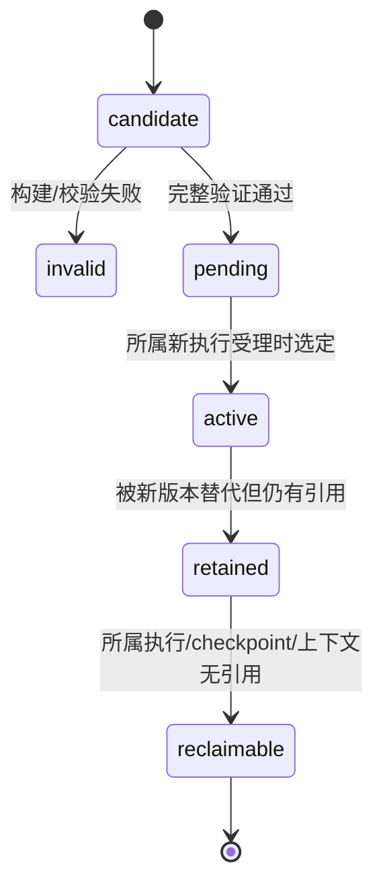
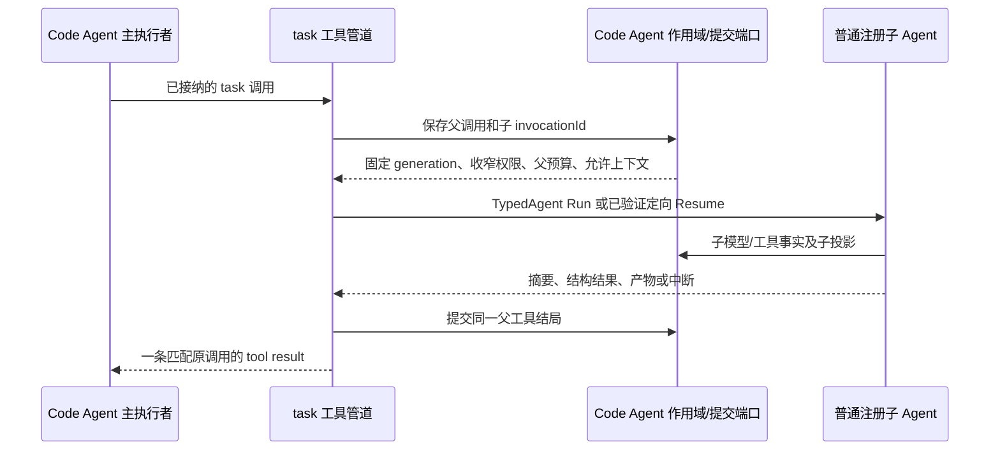
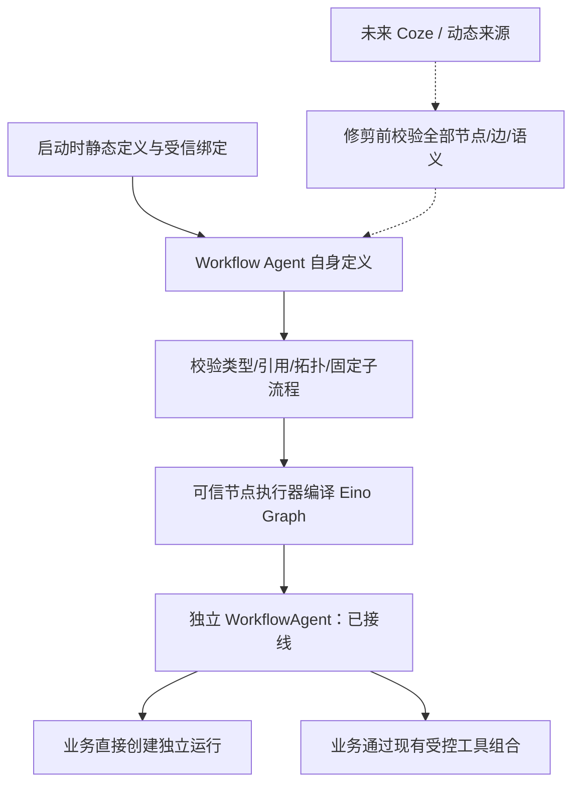
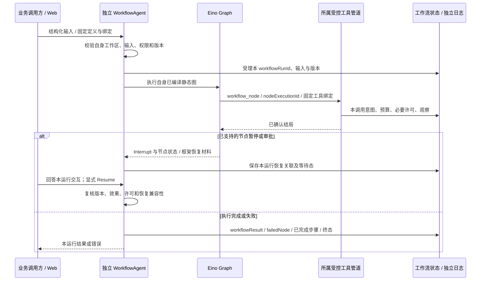

# 10 扩展、generation、子 Agent 与 Workflow

对应 PRD M11。Code Agent 保留完整的能力登记/资源生命周期设计，其中 ExtensionRegistry/ResourceLoader/通用 hooks 仍是未来阶段目标，当前 Tools/Agents 静态装配已经可用。AgentSession 选择自身版本及协调运行操作。Workflow Agent 是同级独立运行对象，负责声明式定义、编译、Eino Graph、节点状态、日志和生命周期，不再由普通注册表持有并作为 `AgentSession.targetAgent` 执行。本章不新增插件容器、运行时 Go 编译平台或跨 Agent 调度框架。

`internal/codeagent`（原 `internal/sessions`）及共享 `internal/storage` 契约与 JSONL/memory 后端已迁移；旧会话内工作流 target、定义、编译、图、执行及节点状态已退出 Code Agent。`internal/workflowagent` 现拥有单份工作流实现；独立公开 `WorkflowAgent`、`WorkflowOptions`、`CreateWorkflowAgent` / `OpenWorkflowAgent` 与 Web 三类资源路由及独立视图已接线，有对应默认测试与 SDK 消费者。最终认证见 [P3 验证记录](../p3-verification.md)，不据文档或局部测试声明整体通过。普通 `Agent`、`AgentSession`、`CreateAgentSession` / `OpenAgentSession` 保留；同 module 唯一公开生产入口仍为 `sdk/sdk.go`。Coze、动态加载、热重载和业务补参仍在未来阶段，本轮不启动 P4/P5。

<a id="registration"></a>
## 1. 登记 API 与校验

Code Agent 的完整 ExtensionRegistry 登记契约保留普通工具和子 Agent，不登记独立 Workflow Agent。以下注册器及通用 hook API 仍是未来目标，当前 `sdk/sdk.go` 没有 `NewExtensionRegistry`、`ExtensionRegistry` 或 `AddSubAgent`；当前静态装配使用 `SessionOptions.Tools` / `Agents`：

```go
func NewExtensionRegistry() *ExtensionRegistry
func (r *ExtensionRegistry) RegisterTool(ToolDefinition) error
func (r *ExtensionRegistry) ReplaceTool(ToolReplacement) error
func (r *ExtensionRegistry) AddSubAgent(
    adk.TypedAgent[*schema.AgenticMessage], ...SubAgentOption,
) error
func (r *ExtensionRegistry) RegisterCommand(CommandDefinition) error
func (r *ExtensionRegistry) RegisterProjection(SpecialMessageProjection) error
```

另提供 OnInput/OnContext/OnToolCall/OnToolResult/OnPrepareNextTurn/OnShouldStopAfterTurn 及会话生命周期的类型化 hook 注册。普通 CustomMessage 使用通用 content，不要求 RegisterProjection。完整扩展 hooks 仍按原阶段验收，不因分层提前宣称可用。

定义至少包含名称、用途、来源/实现版本、输入输出和能力约束。Code Agent 注册检查 schema、重名、保留名称、普通子 Agent 的能力及恢复声明；ReplaceTool 需要 expectedSource/version，只有应用允许替换的目标才成功。运行期登记成功只形成 candidate，不改活动对象或可见工具清单。通用 `general-purpose` 名称和受控能力保留，拆分工作流不删普通委派。

工作流定义及其来源格式、节点、字段引用、静态子流程和本地资源绑定由 Workflow Agent 自身校验/编译，拒绝条件见第 5 节。普通 ExtensionRegistry 不持有工作流定义/运行实例，也不将编译图经 AddSubAgent 当作普通 target。已有 Go 可执行代码仍可接入普通受信 Agent 契约；独立图运行的状态、审批和恢复不能因此合并到 Code Agent。旧 `RegisterWorkflow` / 会话工作流 target 已退出；它们只描述历史迁移基线，不是现行独立公开入口或兼容装配方式。

外部 consumer 只 import `github.com/ww1489/seasprak/sdk`。以下是当前 Code Agent 静态普通目标装配；`primaryModel` / `reviewModel` 是受信调用方已构建的模型，`workspace` / `stateRoot` 是互不重叠的已存在绝对目录。显式 `ProfileMemory` 裁剪尚不可用的默认文件／进程后端，不取消工作区绑定或 JSONL 持久历史；错误必须处理：

```go
session, err := sdk.CreateAgentSession(ctx, sdk.SessionOptions{
    Workspace: workspace, StateRoot: stateRoot,
    Profile: sdk.ProfileMemory,
    Model: primaryModel,
    Agents: []sdk.AgentDefinition{{
        Name: "reviewer", Version: "review-v1", Description: "审阅结果",
        Instruction: "仅在受信委派范围内检查结果。",
        Model: reviewModel, Delegable: true,
    }},
})
if err != nil {
    return err
}
```

`AgentDefinition` 当前仅有普通目标字段 Name/Version/Description/Instruction/Model/Delegable/Kind/Tools，没有 Workflow 字段；Kind="workflow" 返回 `invalid_argument`，未知普通目标返回 `unsupported_capability`。旧工作流 target 或不兼容保存绑定明确拒绝，不回退主 Agent。

以下独立工作流示例使用当前定义和选项。纯静态图不需要模型/工具；模型节点使用 `WorkflowOptions.Models` 的受信绑定，启动默认名为 `"default"`，工具和固定子流程分别经 Tools/Subflows 装配，不放进定义的虚构 bindings 字段：

```go
definition := sdk.WorkflowDefinition{
    Name: "echo", Version: "v1", Source: "local", FormatVersion: sdk.WorkflowFormatV1,
    InputSchema: json.RawMessage(`{"type":"object","properties":{"text":{"type":"string"}},"required":["text"],"additionalProperties":false}`),
    Nodes: []sdk.WorkflowNode{
        {ID: "start", Type: "start"},
        {ID: "end", Type: "end", Inputs: map[string]sdk.WorkflowValue{
            "text": {Ref: &sdk.WorkflowRef{Node: "start", Field: "text"}},
        }},
    },
    Edges: []sdk.WorkflowEdge{{From: "start", To: "end"}},
}
workflow, err := sdk.CreateWorkflowAgent(ctx, sdk.WorkflowOptions{
    Workspace: workspace, StateRoot: stateRoot, Definition: definition,
    Principal: principal, GenerationFingerprint: buildFingerprint,
})
if err != nil {
    return err
}
receipt, err := workflow.SubmitInput(ctx, sdk.WorkflowInputCommand{
    Input: json.RawMessage(`{"text":"检查结果"}`), IdempotencyKey: "echo-input-1",
    Principal: principal,
})
if err != nil {
    return err
}
_ = receipt // 受理不是完成；继续 Snapshot / SubscribeFrom 查询本运行。
```

示例额外使用标准库 `encoding/json`。`OpenWorkflowAgent` 使用原 RunID；可写或只读打开均不自动执行/Resume。只读可省略定义/模型/构建指纹和工作区，恢复原绑定并校验 Principal；可写打开须重建原定义及受信绑定。创建仅保存初始记录，SubmitInput 接受一个 JSON 对象及单次输入；同键同内容先于 revision 检查返回不可变原回执，同键异内容或新键另提输入冲突。新独立执行需另建运行。

创建/登记不启动模型或外部副作用。业务需要组合两类 Agent 时登记一个已有受控工具，由受信业务持有独立对象并显式调用；SDK 不增加专用跨 Agent 端口，结果与许可边界见第 5 节。

<a id="generation"></a>
## 2. 版本生命周期


```mermaid
stateDiagram-v2
    [*] --> candidate
    candidate --> invalid: 构建/校验失败
    candidate --> pending: 完整验证通过
    pending --> active: 所属新执行受理时选定
    active --> retained: 被新版本替代但仍有引用
    retained --> reclaimable: 所属执行/checkpoint/上下文无引用
    reclaimable --> [*]
```

D23-generation 图表示各自资源生命周期，不是跨两类 Agent 的共同状态机。Code Agent Manifest 包含工具实现/schema/说明、handlers 顺序、普通子 Agent 版本、system/项目规范、skill 正文与配套指令资源 hash、二进制兼容标识。Workflow Agent Manifest 独立包含本定义、静态子流程、节点执行器、模型/工具/资源绑定版本及构建兼容标识。业务工作区文件不冻结；一个 Agent 的 generation 不冻结另一个独立 Agent。

Code Agent 协调者在受理新的独立输入时原子选择自身已验证版本，将普通 targetAgent（名称/版本/generation）、依赖清单与 inputId/traceId 一致保存后才返回 accepted；queued/hold 也在此固定，开始执行、ContinueQueue 或重启不重新选版。当前 follow-up、steering、普通子调用和恢复固定原 generation。Workflow Agent 在独立运行受理时保存自己的定义/绑定、输入、工作区及版本，节点继续和显式恢复沿用原版本，不进入 Code Agent 队列，也不读取其待生效配置。

资源 reload 的 candidate → pending → 新执行选定仍是未来阶段契约，不因这次拆分启动热重载或动态加载。构建失败保留所属旧版并报告未生效；初次无可用版本明确失败。原版本中不存在请求目标/节点绑定时拒绝，不改投主 Agent 或同名新版；已受理版本不可重建则失败/不兼容，不由 PrepareAgent 或图编译器静默替换。

retained 引用分别包含 Code Agent 的 queued/hold、活动 Trace、待恢复 checkpoint/扩展上下文，或 Workflow Agent 的所属运行、静态子流程依赖及节点恢复关联。各自受理与引用保留一致提交；引用未释放前不得回收。资源可保存但旧 Go 函数需要当前 binary 内可重建；缺失明确 incompatible_resume。关闭旧上下文只在引用释放后清理。紧急撤销权限是独立即时策略，不等待 generation 升级；版本固定不冻结权限，也不形成跨日志原子提交。

<a id="runtime-ops"></a>
## 3. ExtensionContext 与受控操作

以下普通会话操作只作用于所属 Code Agent。Workflow Agent 提供自身结构化运行、节点查询、暂停/审批/显式恢复、取消与关闭控制，不强行提供聊天队列、历史分支或压缩循环。

| 能力 | 返回/行为 | 边界 |
| --- | --- | --- |
| ReadContext / QueryHistory | 作用域内只读视图 | 子调用不获得父私有历史/队列消费权 |
| SendMessage | CustomMessage、是否触发、投递模式，返回 input/operation 身份 | 默认不触发；活动时下一安全输入边界，空闲时持久追加 |
| SubmitInput | 显式 prompt/steering/follow_up | 保留 extension Source，不变成人类授权 |
| AppendEntry / ReadEntries | 带命名空间的 CustomEntry | 按路径/commit 位置恢复，不入模型 |
| SetDefaultModel / SelectNextTurnModel | 分别设下一 Trace 默认和当前下一 Turn | 获准候选内选择，不改当前流和旧 checkpoint |
| GetAllTools / GetActiveTools / SetActiveTools | 当前 generation 候选、生效选择及请求 | 成功受理不等于立即生效 |
| Abort / RequestCompaction | 取消或下一安全边界请求 | 不重入 Runner/压缩；取消不受其他 hook 否决 |
| ContinueQueue / Reconcile | 经应用授予的对应能力 | 不自动解除许可或继续旧任务 |

ExtensionCommandContext 在应用命令执行时增加创建/打开/切换 Session、分叉/导航、名称/书签和空闲维护。要求空闲的命令忙时 conflict，不等待自己所在工具结束。命令登记定义 schema、所需能力和是否 idleOnly；slash 文本只是外层映射，扩展发的普通文本默认不执行管理命令。

写操作先保存 accepted 再返回身份；真正投递/生效另查状态。转换/维护 before 用返回值贡献候选，不同时发同范围写操作；after 可以请求下一操作，但不能追溯撤销。hook 中不能同步等待依赖自身退出的结果。

未投递消息在 Trace 终结后保留原归属和原因；明确另行投递使用新身份，不跨 Trace 自动转移。CustomEntry 和 CustomMessage 的保存/模型意义分开。两类 Agent 互不导入；业务组合不直接写任一 manager、重造票据或用一个控制答复恢复另一运行。

<a id="subagents"></a>
## 4. 子 Agent 接入与作用域


```mermaid
sequenceDiagram
    participant P as Code Agent 主执行者
    participant T as task 工具管道
    participant S as Code Agent 作用域/提交端口
    participant A as 普通注册子 Agent
    P->>T: 已接纳的 task 调用
    T->>S: 保存父调用和子 invocationId
    S-->>T: 固定 generation、收窄权限、父预算、允许上下文
    T->>A: TypedAgent Run 或已验证定向 Resume
    A->>S: 子模型/工具事实及子投影
    A-->>T: 摘要、结构结果、产物或中断
    T->>S: 提交同一父工具结局
    T-->>P: 一条匹配原调用的 tool result
```

D24-委派图保留普通 Code Agent 子执行；不是独立 Workflow Agent 的 SDK 内置调用框架。子输入是显式委派和允许上下文，不自动复制全部主历史；Agentic AgentTool 不使用旧 Message 的 fullChatHistoryAsInput 功能。Eino RunPath 仅诊断，实际 ID 由 task 管道分配并在已支持恢复路径中复用。

通用子 Agent 由产品用 TypedChatModelAgent 显式构建，注入与主 Agent 同等的模型重试、控制 hooks、受控工具和恢复包装；DeepAgent 关闭对应隐式重复创建但仍提供 general-purpose 名称与能力。专家实例复用 adk.TypedAgent，声明恢复时必须满足 TypedResumableAgent 和产品 checkpoint 契约。独立 WorkflowAgent 不在此注册，也不作为普通 Code Agent target。

受控边界结束（例如本批工具全部 terminate 且无子作用域续输入）在该 invocation 包装器中归一为正常的内部结束和有效委派输出；不能把内部边界标记直接泄漏成父 task 的业务失败。真正模型/工具/存储错误与审批中断仍按 Eino 的 error/Interrupt 传播，包装器不得吞掉它们。与此相关的边界用例列入 V-EXT，而不是假定任意 TypedAgent 都天然具备相同行为。

子作用域持有同一 Code Agent Trace 的共享总预算和收窄权限、自身工具选择/TODO/投影/扩展状态，不能消费顶层 steering。父取消递归传递并等待真实退出；子压缩不覆盖父主线；输出文件 facts 关联子调用和父委派来源。嵌套深度/并发和委派时限由 12 控制。上述保护保留，但不承诺完整持久子树、多个 interrupted 根的联合恢复或跨任务审批联动；这些编排归业务，历史条件恢复证据仍保留。

第三方 Go Agent 实例属于信任代码，必须使用提供的模型/工具/效果端口并声明可恢复性。包装器只能管理其公开 Run/Resume、身份和事件，不能保证拦截任意内部 HTTP/os 调用。未满足受控效果契约的实例不能标记为已认证 sandboxed；可注册用于受信嵌入场景，能力查询明确边界。每实例不支持并发时按声明串行调用，不共享可变 invocation 状态。

<a id="workflows"></a>
## 5. 独立工作流与业务组合两种使用方式

当前 `WorkflowDefinition` 字段为 Name/Version/Description、Source/FormatVersion、InputSchema、Nodes/Edges、Resumable，JSON 为对应 lowerCamelCase，格式必须为 `seasprak-workflow/v1`。当前没有 outputSchema/bindings 字段；输出由 END.inputs 选定，模型/工具/固定子流程在 `WorkflowOptions.Models` / Tools / Subflows 中受信绑定。Workflow Agent 自己定义、校验、编译和运行 Eino Graph，持有节点状态、日志、generation、预算、审批及恢复。保留已有静态子流程、条件分支、并行汇合和节点级暂停/审批/显式恢复，不新增聊天循环。

节点类型为 start/end/literal/model/condition/tool/subflow；WorkflowValue 必须是 literal 或 ref{node,field} 之一，条件边显式 true/false 端口，并行汇合使用 DAG 的 AllPredecessor 语义。模型/工具节点只产出一个 string 字段（默认 text/result）；持久 NodeRun 只记 model/tool/subflow 的执行，不把纯 start/end/literal/condition 当副作用账目。模型节点经 `NewAuxiliaryModel` 校验与计量，工具节点经 `NewExecutor` / `RunWorkflowNode` 执行。

默认 TODO：未注入 `Operations.Todos` 时，WorkflowAgent 安装自己的 journal 后端，manifest 标识为 `workflow-journal-v1`；注入时由宿主完全替换，标识为 `host-injected`，不镜像写默认日志。恢复时切换归属返回 `incompatible_version`。写入消费一次授权，并在实际执行处复核原冻结参数、call/invocation、generation 和策略，TODO 版本按 invocation 单调增加；Append、效果或观察确认丢失保持 unknown/storage_unavailable，不自动重执行、重开或退款。私有 TODO 不进入 HTTP snapshot/SSE；业务若通过 END 选择公开最终结果，只公开该选定结果，不公开私有快照。


```mermaid
flowchart TB
    Static["启动时静态定义与受信绑定"] --> Def["Workflow Agent 自身定义"]
    Src["未来 Coze / 动态来源"] -.-> Raw["修剪前校验全部节点/边/语义"]
    Raw -.-> Def
    Def --> Val["校验类型/引用/拓扑/固定子流程"]
    Val --> Comp["可信节点执行器编译 Eino Graph"]
    Comp --> Agent["独立 WorkflowAgent：已接线"]
    Agent --> Ind["业务直接创建独立运行"]
    Agent --> Biz["业务通过现有受控工具组合"]
```

定义编译流程（与下方独立执行时序共同构成 D25）区分静态迁移与未来来源适配。来源适配器只负责格式语义；执行器、模型、工具和凭据使用本项目受信能力。本地 Coze 依赖较旧的 Eino，未来仍采用格式适配而非直接引入整个后端；这次分层不提前实现 Coze 或动态加载。

| 使用方式 | 输入与身份 | 模型和结果 |
| --- | --- | --- |
| 业务直接使用独立 Workflow Agent | 通过目标 CreateWorkflowAgent / OpenWorkflowAgent 及工作流运行控制；结构化输入、workflowRunId、自身绑定/定义版本 | 主 Code Agent 模型选路次数为 0；节点模型独立计量；结果属于本运行，不伪造父工具消息 |
| 业务通过已有受控工具组合 | 业务工具显式映射允许输入并创建/调用独立 Agent，关联父 toolCallId 与公开业务结果引用；两类日志/预算/恢复各自独立 | 只返回匹配原父调用的一条结果或业务引用；外层批准不授权内层，SDK 不新增跨 Agent 端口或联动调度 |


```mermaid
sequenceDiagram
    participant C as 业务调用方 / Web
    participant W as 独立 WorkflowAgent
    participant R as Eino Graph
    participant T as 所属受控工具管道
    participant H as 工作流状态 / 独立日志
    C->>W: 结构化输入 / 固定定义与绑定
    W->>W: 校验自身工作区、输入、权限和版本
    W->>H: 受理本 workflowRunId、输入与版本
    W->>R: 执行自身已编译静态图
    R->>T: workflow_node / nodeExecutionId / 固定工具绑定
    T->>H: 本调用意图、预算、必要许可、观察
    T-->>R: 已确认结局
    alt 已支持的节点暂停或审批
        R-->>W: Interrupt 与节点状态 / 框架恢复材料
        W->>H: 保存本运行恢复关联及等待态
        C->>W: 回答本运行交互；显式 Resume
        W->>W: 复核版本、效果、许可和恢复兼容性
    else 执行完成或失败
        W->>H: workflowResult / failedNode / 已完成步骤 / 终态
        W-->>C: 本运行结果或错误
    end
```

D25-定义编译与独立执行图：上方流程和本时序共同说明工作流自身的编译及执行，不经过 AgentSession 队列或 SessionManager。两种使用方式共享工作流自身输入/输出契约，但业务工具只做受控组合；Workflow Agent 和 Code Agent 不相互 import，也不直接追加对方历史。Web 的代码会话资源为 `/v1/sessions`，工作流定义与独立运行目标为 `/v1/workflows`、`/v1/workflow-runs`；仓库内 Web 不 import sdk 或写 manager，外部 consumer 只 import sdk。

缺参/非法结构化输入在副作用前明确拒绝；业务补参仍属未来阶段，不能借“支持交互”提前实现。节点级审批/暂停与显式恢复保留，审批回答只作用于本运行原冻结调用，不能修改参数或唤起另一运行。只读打开不执行；Close/Cancel 保留停止意图、传播取消并等待真实退出，调用方超时不是停止证明。

静态支持范围及已有测试必须分别保留条件、并行汇合、本地固定版本子流程、模型节点和受控工具节点。未来 Coze 首个来源适配器读取指定版本 Canvas JSON，开始/结束、字面量/节点引用、基础模型、条件和固定子流程的来源兼容仍需真实文件认证。循环/批处理、代码、HTTP、知识库、平台全局变量等未认证节点保持后续能力，不因嵌在已支持节点字段中自动支持。Canvas JSON 跑通不等于任意导出包可运行。

激活前按以下顺序校验，失败保留所属旧版并返回来源及节点/边/字段定位，不以 panic 或静默删节点代替诊断：
1. 对静态定义检查全部节点、唯一 ID、边端点、节点类型及执行字段；未来来源适配同样在修剪前检查全部原始节点（包括未连线节点）。未知语义、未支持开关、全局变量引用或未绑定插件/子流程拒绝。基础模型节点不隐式启用函数调用或 Code Agent 历史注入。
2. 原始校验通过后才允许规范化、修剪已确认合法的孤立节点并记录移除项；转换字段引用和条件端口。修剪后重新检查引用，不能把引用被删节点当作空值。
3. 校验恰好一个开始/结束节点、节点/字段/端口引用、字面量及上下游类型、必需输入、无环和合法开始到结束路径；条件/并行汇合不能读取所选路径上未产生的输出。固定子流程依赖存在且无递归引用环。类型或拓扑错误阻止编译和激活。
4. 模型、工具、静态子流程和凭据只解析到所属运行的受信本地绑定，编译使用可信执行器；外部资源 ID 仅作来源标识，不据此启用宿主能力。编译失败不激活。

节点调用身份按 02 的 workflowRunId/invocation/nodeId/逻辑访问序号持久分配，重试/显式 resume 保持原 nodeExecutionId。副作用节点以 workflow_node 来源进入 05/11，关联稳定 toolCallId 并校验固定绑定，不检查虚假的 Code Agent 模型清单，不借用业务父工具的 Turn。工作流模型节点的 Generate/Stream 使用 04 同一完整响应校验；失败、截断、取消或配对不完整时后续工具实际调用为零，早期流块不能先启动工具。逻辑模型调用和实际物理请求（包括 SDK 隐藏重试、缓存资源等请求）分别计量；每次请求和节点工具仅在所属预算占额，已有结果复用不重复占额，并行节点在本运行总账原子占额。冻结、票据、授权、取消和 unknown 不盲重放维持，但不承诺跨两类运行的原子总预算。

错误保留 failedNode、类别、已完成步骤和 confirmed/unknown 效果；节点结果进入自己的状态/日志，不制造 Code Agent FunctionToolResult 或 Snapshot 节点。只有实际验证过的节点 Interrupt/Resume 可声明可恢复；Workflow 当前没有原生整图 checkpoint，图节点复用与已有完成节点不重跑不证明完整子树或跨运行恢复。Code 原生预检生命周期回调隔离已按批准 Step9 获有界接受，唯一方法见 [09 §checkpoint](09-persistence-and-recovery.md#checkpoint)：固定 Eino v0.9.21、每次新建且单次使用探针、原目标根状态资格，宿主 codec 仍可先执行。该修正不扩大 Workflow 或普通 child 的恢复范围，也不认证任意宿主零执行、整树或最终 P3。

目标公开路径是独立 WorkflowAgent 创建/打开和所属运行控制，不再使用 AgentSession.targetAgent、会话内 workflow queue 或普通注册表工作流 target。普通 Code Agent 的 prompt/steering/follow_up 仍按 03 原作用域执行。完整持久子树恢复、跨任务审批、补偿、业务重试和跨运行总费用/资源政策由业务负责；SDK 不承诺任意第三方副作用 exactly-once。

<a id="lifecycle"></a>
## 6. 生命周期和失效处理

普通会话 hooks 的组合、可取消点及提交顺序以 06 为唯一规范。分叉是同 Code Agent Session 分支，不能照搬 pi 复制成新 Session 的 fork。before 取消保留原绑定/游标/投影；替代摘要经 08 的结构、范围、预算和程序文件 facts 验证。Workflow Agent 生命周期独立，不复用聊天树导航或自动压缩，也不关闭另一类运行。

扩展缺失时普通 CustomMessage 仍可读取；特殊必需消息缺投影则阻断模型。私有条目原样保留，不能为了启动而删除。已接受的独立扩展写操作不会因稍后 hook 失败回滚。两类 Open 保持自身原绑定且只读不执行；跨类型、旧开发格式不兼容时明确拒绝，不自动迁移或清目录。

<a id="evidence"></a>
## 7. 证据与验收

[pi 扩展类型](../../../pi/packages/coding-agent/src/core/extensions/types.ts)、[pi loader](../../../pi/packages/coding-agent/src/core/extensions/loader.ts)、[Eino typed agent](../../../eino/adk/interface.go)、[DeepAgent task](../../../eino/adk/prebuilt/deep/task_tool.go)、[AgentTool](../../../eino/adk/agent_tool.go)、[Coze 执行入口](../../../coze-studio/backend/domain/workflow/service/executable_impl.go)、[Canvas 转换](../../../coze-studio/backend/domain/workflow/internal/canvas/adaptor/to_schema.go)、[Eino 图装配](../../../coze-studio/backend/domain/workflow/internal/compose/workflow.go)。这些参考及 [P3 历史验证记录](../p3-verification.md) 保留，不认证新目录/入口迁移。

V-EXT/V-WORKFLOW 沿用 EXT/WF/API/EVT 编号：当前独立工厂及 Web 接线有默认测试；`sdk/testdata/consumer/workflow_agent_test.go`、`workflow_model_test.go`、`business_composition_test.go` 实际调用唯一公开入口及既有受控工具，分别覆盖结构化执行/重开、模型节点和业务组合。以下完整验收仍逐项由最终记录认证，不能以测试存在声明全部通过。普通子 Agent 注册、受控边界、父子权限/预算/版本/取消继续验收；独立工作流验证自身创建/打开、结构化输入、节点日志和结果、条件/汇合/静态子流程及节点暂停/审批/显式恢复。两种业务使用方式保持工作流 schema/结果含义一致；直接方式主 Code Agent 模型调用为零；组合只生成一条配对结果/引用，外层批准不放行内层。两类日志、Snapshot、版本和预算不得串用；跨类型 Open 和旧格式拒绝且不删除数据；已有结果不重执行、取消等待真实退出、unknown 先核对。Coze/动态加载/reload/补参测试仍属未来阶段；完整子树与跨任务联动退出 SDK 范围但不标 PASS。原静态子流程与条件/汇合、节点暂停/审批/恢复已有独立默认测试，Code 原生预检回调修正按 [09 §checkpoint](09-persistence-and-recovery.md#checkpoint) 获有界接受；原拒绝、codec/单次探针限制及 Workflow 无原生整图 checkpoint 的边界保持。迁移和修后最终认证见验证记录，不据测试存在、节点结果复用或 Step9 有界通过记整体 P3 完成。
