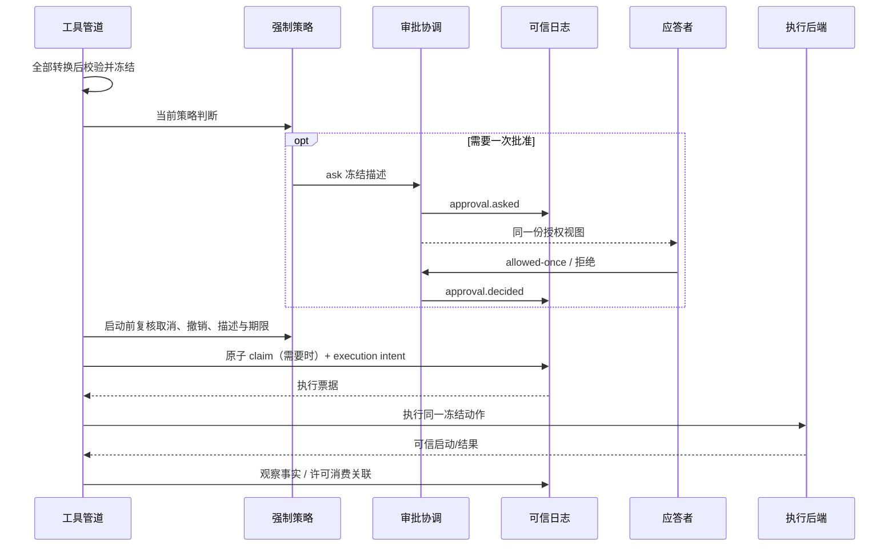
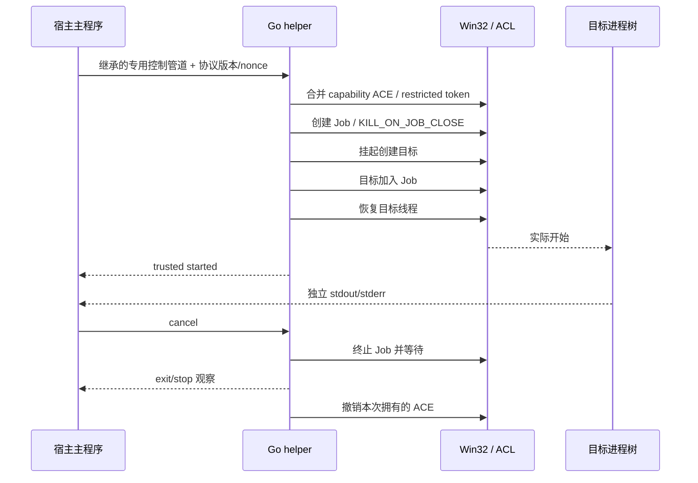
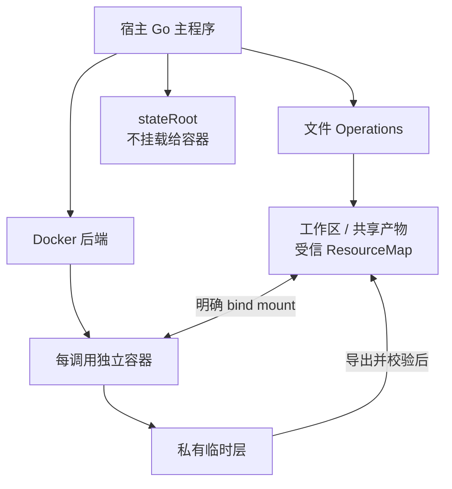

# 11 安全策略、一次许可与沙箱

对应 PRD M12。DSH 继续作为文件效果策略、审批和审核职责的参考；Zero 作为 Go 原生三平台沙箱的主要实现来源，按本产品冻结描述、一次许可和运行数据保护契约适配。策略判断不等于 OS 隔离，文件写限制不表示网络/读取/任意 Go 代码已隔离。Zero `internal/sandbox` 不能直接 import，采用必要抽取/移植并保留许可声明。

## 1. 模式、策略与配置

默认 sandboxMode=workspace-write、approvalPolicy=ask、Auto=false。read-only、workspace-write、danger-full-access 与 ask/never 分成两个维度；never 的意思是需要询问就拒绝，不是全部允许。

ResolvedPolicy 包含版本、模式、有效可写根、禁止写的运行数据、必要临时根、backend、minimumEnforcement、网络声明、取消/撤销状态。常驻变更经受信操作提交并发布 security.policy_changed；旧 generation 不绕过最新收紧规则。

ToolAuthorizer 接收只读 FrozenExecution 和可信授权材料，返回 allow/deny/cancel/ask 及原因；ordinary hook allow 不越过强制策略。ask 的闭合结果为 allowed-once/rejected/cancelled/unavailable。没有应答者/必要审核或审计失败不放行。

full/partial/none/unavailable 是实际后端能力等级，和模式不同；full 只指后端承诺的文件效果范围。partial 仅在 runtimeDataWriteProtected 等必要能力通过时可用。未满足拒绝配置，不退化到 Full access。

## 2. 冻结描述、一次批准与占用

批准关联 approvalId、interactionId、原调用、描述 hash、generation、资源范围、权限版本、有效期和决定者。批准只适用于同一冻结操作，不能把工具名或“用户说可以”作为通行证。

D26-授权时序：审批等待的 checkpoint 关联见 09。常驻策略/Auto 直接 allow 不制造 approvalId，但仍先提交调用意图和必要审计。claim 不等于 tool.started；helper 已启动也不等于目标命令已启动。

| 已有事实 | 许可和恢复行为 |
| --- | --- |
| 未批准/拒绝/取消/过期/决定未提交 | 不执行 |
| 已批准未 claim | 描述、当前权限和恢复条件满足才原子 claim |
| 已 claim，可信后端证明目标未开始 | 保存证据和 release 后重新评估原调用 |
| 已 claim，目标启动不明 | 保留占用，outcome_unknown，核对 |
| 已启动，结果未提交 | 不重跑，以核对判断 |
| 已有结果/确认已执行 | 复用结果；业务失败不返还额度 |

参数、实际资源、环境引用、挂载、模式/许可范围变化需要重新验证和批准。冻结对象深拷贝，执行器不可在最后取全局最新默认值。取消使等待请求撤回，迟到批准无效。

## 3. 单次扩大许可

工具可声明 sandbox_permissions 与非空 justification，必须同时提供且相对当前解析模式严格扩大。一次扩大不修改 Session 常驻模式，不自动改变 backend/镜像/挂载。

模型/用户申请“重试原操作”时关联原调用，比较目标、参数和效果。已有 partial/unknown 效果先核对或证明幂等；检测到 sandbox denied 不等于完全没执行。新执行使用新调用身份及原调用关联，旧批准不转移。禁止先裸跑后补审批。

容器的 danger-full-access 只去掉该执行环境的文件模式约束，不自动切回宿主裸 shell，也不开放 Docker socket/任意宿主挂载；环境改变必须是新的受信装配与冻结操作。

## 4. 运行数据和产物保护

Session 日志、审批/claim、checkpoint、原授权原文、可信 manifest 位于 stateRoot；artifactRoot 和 tempRoot 是业务材料。创建时用真实路径/文件身份检查重叠、junction/symlink、硬链接和挂载别名，不仅比较字符串前缀。

默认 stateRoot 在业务可写根之外；有包含关系时只有后端真正落实子目录写禁止才允许。文件 Operations 和进程后端都要验证，不能只隐藏工具描述。探测报告单独列 runtimeDataWriteProtected，generic partial 标签不是证明。

每 Session/环境有共享产物根及调用临时根，文件工具与 shell 的映射一致；read-only 不因为“临时目录”就获得任意业务写权限，仅允许后端声明且受控的必要临时/sink。私有 tmpfs 需先导出才能持久引用。产物内容可被业务修改，manifest/审批等可信元数据不能放在产物根。

受信进程内 Go 代码或 danger-full-access 不具备上述模型工作负载隔离保证；不能宣称它们也被文件沙箱强制约束。

## 5. 原生进程后端

SandboxProvider 的 Probe 返回 backend/version、支持的 mode、实际 enforcement、限制、runtimeDataWriteProtected 和临时映射。Plan 返回被冻结 argv/环境/可写根的 LaunchPlan；Launch 只接受已占用执行票据。Probe/缓存选择不等于这次启动成功，每次实际启动仍检查配置和故障。三平台底层实现已有，可基于 Zero 移植；产品模式、拒绝降级、可信启动、一次许可与运行数据保护按本产品契约适配，并逐平台验证。

| 平台 | Zero 已有实现 | 产品启动策略 | 必须报告 |
| --- | --- | --- | --- |
| Linux | 默认 helper + bubblewrap：只读绑定 `/`、写根可写 bind、user/PID namespace、私有 `/proc`。Landlock helper 已实现，但拒绝 deny-read/write、写根只读子路径/受保护元数据及非全盘可读布局；Zero 默认写根带保护字段，不能原样作为其回退画像 | 优先复用 helper+bwrap。若产品另增 Landlock 自动回退，须验证能满足 stateRoot 保护；缺必要能力则不可用，不裸跑 | 内核/ABI、helper 来源/版本、namespace 可用性、未覆盖文件效果；不把 Zero 默认 NetworkDeny 写成产品已默认断网 |
| macOS | sandbox-exec + Seatbelt，`deny default` 后允许读根/写根，并可 `(deny network*)` | 复用 profile 转义与路径规则，再按产品 mode 收窄写根和必要 sink。Seatbelt 不可用则拒绝受限配置 | profile/系统能力探测；读取、同用户进程和外部服务不在写限制保证内；网络实际生效值单独报告 |
| Windows | command-runner/setup helper、restricted token、capability ACL；管理员 setup 后可装 WFP。目标直接 CreateProcessAsUser，无 Job 启动时序 | 基于 Zero helper 适配 token/ACL/环境块；Job Object、挂起启动和可信控制通道按第 6 节补足 | unelevated/native/unavailable、DenyRead 不支持、硬链接/junction 风险和实际状态保护 |

Linux/Mac 取消作用于可确认进程树/隔离域；只有普通 process group 的覆盖不承诺任意脱离进程都已结束，无法确认时保留 unknown。Zero Windows 取消使用 `taskkill /T`，根进程退出后无法找回后代，因此本产品仍需 Job 补足。宿主 shell 默认 Unix /bin/sh；Windows 默认已定位的 Windows PowerShell，以参数数组启动并明确标识，开发者可指定已验证 pwsh。execute 的 command 是有意交给指定 shell 解释的代码，路径与控制参数不能额外拼入 shell 字符串。

Zero 默认 `enforce + NetworkDeny`、读全盘写约束，并可在 backend 不可用时 degraded 直接执行。本产品默认仍是 `workspace-write + ask`，原生网络默认保持环境既有网络；受限后端不可用或无法落实显式 deny/`stateRoot` 保护时拒绝，不采用该降级。Zero 的 `native/unelevated/degraded/disabled` 不直接翻译成产品 `full/partial/none/unavailable`。

## 6. Windows Go 辅助 exe（基于 Zero 适配）

setup 是初始化条件，unelevated/native 是 Zero 的执行模式标记，产品 full/partial 是实际能力报告，三者不能合并为一个“三级”枚举。按以下条件组合验收：

| 初始化与请求条件 | Zero 路径 | 本产品判断 |
| --- | --- | --- |
| 已 setup 且必要 helper 可用 | 可选择 native，setup 提供 ACL/WFP 基础设施 | 逐次验证文件/网络实际约束和运行数据保护；marker 存在不等于 full 或认证通过 |
| 未 setup、文件系统受限 | unelevated：command runner + 受限令牌/ACL；没有管理员 WFP 保证 | 原生保持既有网络且文件/运行数据保护通过时，可按实际能力接纳；若显式要求断网而后端不能保证则拒绝 |
| 未 setup、仅要求网络隔离 | 上游可能 degraded 并直接执行 | 需要的隔离不可用，拒绝，原始裸命令执行次数为 0 |
| 任意 setup 状态，但必要 helper 缺失/版本不符或保护失败 | 探测/启动失败或上游可能降级 | 拒绝相应受限配置，不以已 setup 绕过，也不沿用 degraded |

D27-Windows 时序：这是本产品目标设计，不是 Zero 已实现。Zero 已提供固定 helper、CreateRestrictedToken、工作区 capability SID、显式 UTF-16 环境块、ACL 合并和 setup/WFP；可抽取移植，并保留 MIT 许可声明。当前 runner 通过 argv/`--permission-profile` 传配置，目标直接启动后等待退出，没有专用 nonce 控制通道，也没有先挂起再加入 Job。

产品适配后：Go 编译的固定安装路径 helper 与主程序协议版本匹配；启动隐藏窗口。控制通道使用显式继承句柄，只给 helper，不传给目标进程；stdout/stderr 不能伪装可信控制消息。nonce/callId/描述 hash 绑定本次启动，协议限制大小和允许消息序列。不照搬 Node/Koffi 的环境传递 workaround。剥离不需要的组/特权并设置所需默认 DACL；必要管道/stdio 能被子进程使用。Windows API 实现通过 x/sys/windows 和局部 syscall 封装。

创建目标挂起，加入不允许 breakaway 的 Job 后才恢复；失败在目标线程恢复前可通过控制通道报告可信 no-start。恢复成功后即使 started 消息未送达也不能重执行。helper 异常退出关闭 Job 的句柄，目标树应被结束，但主程序仍须按实际证据结算。主进程重启不能仅靠旧 PID 判定身份或结果。

ACL 修改对规范化路径加互斥，读取当前 ACL、合并自有 ACE、退出时只撤销自有 ACE，保留其他修改。Zero 按 root 持久复用 capability SID，成功后通常保留 ACL，unelevated 还会丢弃 rollback；这与本产品“本次调用所有权/只撤销自有 ACE”不同，不能标成上游已有。写保护对象不得自动添加可被工作负载使用的写 SID。清理失败/崩溃残留记录在受保护日志，重启只清理可证明属于本部署且无人引用的条目，不重置整目录 ACL。

Zero 当前 `WRITE_RESTRICTED` 路径默认不加入 Everyone，不能把 DSH 的 Everyone 已知缺口不加区分地复制成 Zero 事实。硬链接、junction、未来路径和运行数据保护仍须本产品验收。专门测试工作负载能否写 Session/approval/checkpoint；不满足则该配置拒绝，不能以用户选择 Windows 为由跳过。Windows DenyRead 在 Zero runner 中直接拒绝，默认凭据 deny-read 基线在 Windows 跳过。

## 7. 宿主主程序与 Docker shell

首版使用本机 Docker Engine 与受控 docker CLI，命令参数数组由后端产生，不将模型 command 拼入 docker 控制字符串。每个 execute 创建一个调用专属容器；image 由应用预配置为不可变 digest，默认不在工具调用中自动 pull。镜像必须具备声明的 shell；缺失是环境错误。

ResourceMap 每项包含 logicalRoot、hostRealRoot、containerRoot、mode、资源身份；工作区和会话共享产物作为显式 bind mount。文件工具解析同一 logicalRoot 到宿主真实文件；shell cwd/路径转换到 containerRoot。Windows Docker Desktop 等共享文件机制只有验证读写同一文件后才认证，不能凭字符串推断。

D28-容器部署图。默认只读根、cap-drop=ALL、no-new-privileges、非 privileged；按 mode 授予工作区/临时挂载写权限。没有 Docker socket、stateRoot 或无关宿主目录挂载。环境只传已批准 allowlist 和必要值，不继承整个主进程环境；秘密不放普通事件和启动命令诊断。

网络单独记录：原生保持环境既有网络；容器默认 bridge，应用可明确选 none/指定获准网络。本模式不宣称网络隔离或自动域名授权；网络改变属于冻结描述，不能让工具临时自己换 host network。

启动采用 create → 保存 containerId/调用关联 → start/attach → wait/inspect 的可核对流程；容器标签含部署/Session/call 非秘密 ID。Docker CLI 超时后通过本机 daemon 查询精确 containerId/标签，不重新 run。create/start 与日志之间仍有未知窗口，不从 CLI exit code 猜未执行。

取消先 stop，再按确认窗口 kill并等待；结束后保存状态、完整日志和必要私有产物，最后清理该调用容器。未导出私有路径不返回可读 artifactRef。失败/崩溃保留容器关联供 Reconcile；清理只能针对已验证属于该调用的容器，不全局删除容器。

## 8. 可选 Auto 审核与授权来源

Auto 默认关闭，保留显式装配的审核接口和完整行为。开启也不自动改变 sandboxMode 或 approvalPolicy；不能照搬 DSH 插件卸载后转 Full access。

审核独立读取受保护原始输入、直接父委派和有效限制，分 human-instruction/direct-parent-instruction/constraint/checkpoint/fact。只有已经消费且适用于本操作范围的原文可授权；input/context 改写、项目规范、摘要、工具输出与导入标签不能升级身份。

审核对象是冻结后的完整动作，包括内层 Workflow/子工具；只批准外层 task 不能无限批准内部效果。结构化结果包含 risk/decision/reason/授权证据引用，闭合校验：
- low：常规低风险且符合当前限制时可 allow；
- medium：需要明确目标/范围授权，否则 ask 或 deny；
- high：硬拒绝，普通批准不能覆盖。
非法字段组合、材料不足、超时或流失败不放行。审核模型走 L1 并计入预算，禁业务工具；其推理不进入普通 SSE。能力消失时暂停受影响操作，不自动放宽。

## 9. 故障分类与审计

分类为 sandbox_unavailable/runner_failed、sandbox_denied、ordinary_failure、unknown。先检查可信设施故障证据，再解释 stderr；业务程序可以伪造错误文本，退出码/PID 缺失不足以证明 no-start。开始业务操作后不能自动换 backend 重试。

最小审计链：原始输入/委派来源引用 → 参数转换来源 → 冻结描述 → 策略/审核/审批决定 → claim+intent → 可信启动 → 结果/效果 → 核对/释放。每步关联原调用，秘密值仅在受保护引用中；缺必要持久事实就不启动新副作用。

## 10. 证据与验收

策略与审核：[DSH sandbox-local](../../deepseek-harness/packages/sandbox/sandbox-local/src/index.ts)、[profiles](../../deepseek-harness/packages/sandbox/sandbox-local/src/profiles.ts)、[Auto](../../deepseek-harness/packages/experimental/auto-review/src/index.ts)。原生实现：[Zero 平台选择](../../zero/internal/sandbox/manager.go)、[命令计划](../../zero/internal/sandbox/runner.go)、[Linux helper](../../zero/internal/sandbox/linux_helper.go)、[Landlock](../../zero/internal/sandbox/landlock_linux.go)、[Windows 启动](../../zero/internal/sandbox/windows_process_windows.go)、[Windows ACL](../../zero/internal/sandbox/windows_acl.go)、[Windows runner](../../zero/internal/sandbox/windows_runner.go)。

V-SEC/V-PLATFORM：SEC-A01～26；转换后冻结、普通 allow 不跳过策略、ask/never/过期/迟到批准、claim 并发及每个崩溃窗、假 stderr、运行数据路径别名与硬链接、原生实际限制、Docker 同一文件/私有产物、取消子进程、Auto 原文/缺材料/卸载不放宽；helper 可信来源、拒绝 Zero auto degraded、Windows 初始化/文件限制/网络要求的条件组合、文件工具与 shell 实际一致性。按 OS/arch/backend/mode 记录实际 full/partial/unavailable；未运行平台不标通过。Zero 真沙箱测试需显式环境开关，普通 `go test` 或交叉编译不能替代本产品认证。
