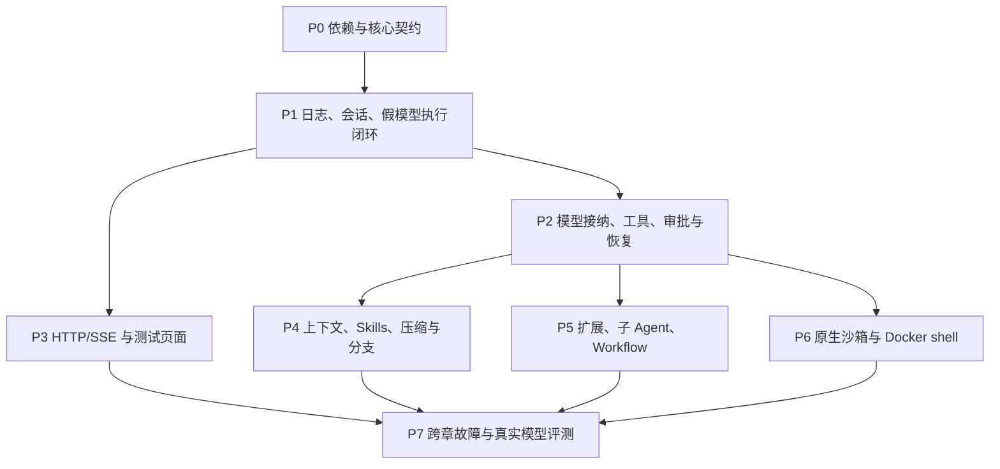

# 12 开发顺序、默认策略与验收

状态：2026-09-24。P0～P1 已有 Go 实现及审查缺陷回归：显式工作区、JSONL 提交、假模型/内存工具闭环、串行调度、取消关闭和持久事件。普通测试与竞态检查仅证明相应已覆盖场景，不代表本章全部出口条件已通过。默认文件/命令/子 Agent、真实供应商认证、审批恢复、HTTP/SSE 和沙箱仍未交付。本轮未读取 `.test_env` 或执行 live 调用，该文件不进入 Git。

本章是全方案的工程默认值、任务依赖和完成条件主定义。文档已经给出实现选择；以下产品任务尚未实施。真实平台/模型认证不能用文档覆盖率或上游测试替代。

<a id="delivery"></a>
## 1. 实施依赖与交付批次



D29-实施依赖图：阶段顺序不裁剪完整 PRD；P7 全部条件满足才交付完整底座。可在不同模块并行实现，但同一契约先固定并由所有使用方引用。

| 批次 | 具体产物 | 出口条件 |
| --- | --- | --- |
| P0 | 独立 module/go.mod/go.sum、包边界、02 的身份/消息/错误、假模型和故障注入基础 | 固定依赖可构建；无下层 import 上层；真实 Agentic 类型贯通 |
| P1 | JSONL/内存 Store、SessionManager、AgentSession 协调、TurnLoop 输入、事实与预算 | accepted 可重启恢复；普通模型/工具/无工具/收尾/取消轨迹成立 |
| P2 | 模型协议与响应接纳、四类工具管道、checkpoint/审批/claim/Reconcile | 部分响应零工具执行；每个崩溃窗无自动重跑；定向恢复原调用 |
| P3 | 06 的路由/DTO/错误、幂等、SSE/快照、回环认证、测试页 | UI 仅调公开入口；可选择 Agent 后触发；响应丢失/重连/慢客户端不改变业务 |
| P4 | 资源发现、skill 快照、唯一上下文、H/P/K、文件 facts、历史导航 | 全量预算、连续压缩、共同祖先摘要、旧分支可回选 |
| P5 | 注册/替换/选择、generation 生命周期、运行操作、子 Agent、动态工作流与两种使用方式 | 新扩展无需改核心；声明式定义可加载；旧 Trace 不升级；节点 resume 不重复效果 |
| P6 | 受控文件后端、基于 Zero 适配的 Windows/Linux/macOS 原生沙箱、Docker shell、可信数据保护 | 各声明平台真实运行测试；partial/不可用如实标注且拒绝裸跑；不采用 Zero auto degraded |
| P7 | 系统 38 场景、全部章节用例、真实模型固定任务集、发布文档 | 所有必需需求有通过证据；未认证组合不宣称支持 |

最小纵向闭环也通过同一保存和工具管道，不先写临时裸执行版本。跨章发现真实框架缺口时记录具体源码/失败用例并修正适配，不以自写 ReAct 或削弱安全规则填补。

<a id="defaults"></a>
## 2. 开发者默认策略

以下是本次确认的初始工程保护值，不是实测性能指标。终端用户无需配置，开发者用 SessionOptions/工具定义替换；实际生效值写入 Trace/operation 快照，恢复不重置。

| 策略 | 初始默认 | 记账和覆盖规则 |
| --- | --- | --- |
| 单次逻辑模型实际请求 | 3 次 | 包含 SDK 隐藏重试；ADK MaxRetries=2，不叠加放大 |
| Trace 逻辑模型调用 | 128 次 | 主/子 Agent、摘要、Workflow 模型节点及启用 Auto 共用 |
| Trace 实际模型服务请求 | 256 次 | 传输前占额；缓存资源等额外请求注明用途并计入 |
| Trace 实际工具调用 | 512 次 | 执行器前占额；已有结果恢复不重复占，拒绝另计诊断 |
| Trace 压缩操作 | 8 次 | 每个合法候选操作计数，H/P 子模型调用另计模型预算 |
| 一次逻辑生成的 overflow 恢复 | 1 次 | 必须有新的已提交投影，仍受 3 次请求限制 |
| Trace 活动执行时间 | 30 分钟 | 共享活动壁钟，子并发不重复累加；人工等待/paused 不计 |
| 普通重试退避 | 100ms 起，指数上限 10s，加 0～50% jitter | Retry-After 可解析且不超剩余预算时采用；不等待超预算后再请求 |
| 普通工具超时 | 120 秒 | 从实际执行起，审批等待不计；task/Workflow 委派默认用父剩余活动预算 |
| 进程停止窗口 | 温和停止 5s，再强制停止/确认 5s | 仍不确认则保持相应未停止/unknown，不假称已杀死 |
| 只读并发 / 冲突写 | 4 / 串行 | 资源身份锁；未知副作用范围独占工作区，委派不持父写锁 |
| 子 Agent 并发 / 嵌套 | 4 / 4 层 | 和父 Trace 共用总预算；达到边界明确返回 |
| 一次审批有效期 | 24 小时 | 决定/占用前均检查；过期不自动执行，可显式新交互 |
| 普通 hook 超时 | 10 秒 | 摘要/模型请求使用专门调用预算；任意不合作 Go 代码不能强杀 |
| 观察订阅 | 最多 256 事件且 2 MiB 待送数据 | 达任一限制就停止并要求 resync，不能反压 Agent |
| SSE 心跳 / 单次写期限 | 15 秒 / 15 秒 | 心跳不是任务进展；长连接不使用总响应 WriteTimeout |
| 单次 JSON API 输入 | 4 MiB | 大附件经受限产物入口；公开事件使用有界内容/引用 |
| read 预览 | 2,000 行且 50 KiB | 超长首行通过有界片段读取；不截坏 UTF-8 |
| shell 预览 | 尾部 2,000 行且 50 KiB | 完整日志单独保存，允许明确标记尾部部分行 |
| grep 预览 | 100 命中、50 KiB、每行 500 字符 | 三种限额分别标注；源位置可续读 |
| 片段读取 | 每次最多 50 KiB | byte 模式有 UTF-8 安全边界/编码说明 |
| 上下文安全余量 | max(1,024 tokens, 窗口的 5%) | 作为保守估算裕量，不宣称精确 token |
| 自动软阈值 | 可用于输入预算的 80% | 输入容量先扣有效输出预留及安全余量 |
| 近期保留目标 | min(20,000 tokens, 可用输入容量的 40%) | 合法工具组/必需约束优先，不强切范围 |
| 主摘要/前缀输出 | 每次 min(4,096 tokens, 可用窗口的 20%, 模型输出上限) | thinking 与答案共限时按有效选项再核算；最终组合重新预算 |
| 日志、幂等与持久事件 | 随 Session 保留 | 改事件保留窗口须支持 earliest cursor 与 resync |
| 被引用 checkpoint/generation | 不自动过期 | 解除引用后才可清理；不能为省空间破坏等待恢复 |
| 缓存意图 / failover / Auto | short / 关闭 / 关闭 | 显式缓存资源、有状态续接分别 opt-in |

逻辑调用额度耗尽不把工具已写入事实丢弃；实际请求次数未知不编成 0。权限和取消即时生效，不能以固定预算/版本为由忽略。摘要自身的材料和输出必须能放入窗口，上述公式不保证所有窗口都可压缩。

<a id="tests"></a>
## 3. 确定性测试目录与断言

测试按子系统组织，使用假 AgenticModel、fake transport、可控制的时钟/随机源/工具进度和临时工作区。每项测试要验证状态与实际调用次数，不能只比输出文字。

| 测试组 | 覆盖 | 必需断言 |
| --- | --- | --- |
| V-BUILD / V-ARCH | module、包依赖、SDK 装配 | 无上层反依赖；默认能力真实存在；独立 L1/L2 不绑 UI |
| V-ID / V-MSG | 身份、标准/自定义/未知消息 | 作用域不串线、块保真、display 不当权限、工具 user 非人类 |
| V-LOOP | LOOP-A、终答竞争、取消队列 | 同 Trace、正确轮后顺序、一次 settled、旧队列 hold 可恢复 |
| V-MODEL | M-E、thinking/错误/流 | 唯一 attempt 结局；截断/失败工具次数 0；SDK 重试不超额 |
| V-CACHE | 厂商请求及 usage fixture | 合法断点/作用域、未知字段不填零、分支不错误续接 |
| V-TOOL / V-DEFAULT | T-E、四类执行接口及基础能力 | 最后转换后校验、结果匹配、失败后处理不重执行 |
| V-EVENT / V-API | EVT/API、HTTP、SSE、hooks | 先提交再发布、无反压、幂等、重放实时交接无遗漏 |
| V-CONTEXT | CTX-A、skill/规范/截断 | pending 不入模型、真实续读、完整预算和稳定前缀 |
| V-COMPACT | CMP-A、首次/增量/H/P/K | 因果组完整、六标题、程序文件集合、候选整体提交 |
| V-STORE | SESSION-A、JSONL/分支/版本 | 单写、尾修复/中损坏、路径配置、共同祖先摘要 |
| V-RESUME | checkpoint/审批/核对 | 旧点兼容、定向响应、已有结果复用、终态不复活 |
| V-EXT / V-WORKFLOW | EXT/WF、注册/版本/委派 | 两种使用方式同 schema；无模型节点按绑定授权且不伪造 Turn；修剪前拒绝未知节点及非法类型/拓扑；queued/hold 在 reload/重启/继续队列后不换版；定向输入目标省略/匹配/错配规则一致 |
| V-SEC | SEC-A、许可与原文 | 冻结描述不漂移、claim 原子、未知不重跑、原文信任不提升 |
| V-PLATFORM | 各 OS/backend/mode | 实际限制、真实路径、后端不可用零裸执行 |
| V-SYS | SYS-A01～38 | 按原 PRD 的跨章断言验证，不以章节单测替代 |
| V-WEB | 最小页面 | 公开 API 完成选择 Agent、提交/停止/审批/恢复/分支/压缩/核对，页面无内部状态捷径 |

每个 PRD 编号的测试子案例采用 `组名/PRD-ID`；无编号约束采用覆盖表中的 U-ID。覆盖表保留原条款链接和检查重点，不能把同一个“能调用”测试算作多个不同语义的通过证明。

<a id="faults"></a>
## 4. 崩溃、竞争和资源故障注入

至少在这些位置终止测试进程并重启读取：

| 故障点 | 恢复预期 |
| --- | --- |
| accepted 写入/Sync/响应之间 | 原 input/trace 身份可去重，未确认的完整提交允许被发现 |
| 助手消息提交前后 | 未接纳工具不执行；已接纳事实不重复 |
| approval asked/decided/claim/目标启动/结果之间 | 区分无许可、未占用、占用未知、已执行；不自动重跑 |
| checkpoint blob 与关联 commit 之间 | 孤儿不自动恢复；匹配关联方可 canResume |
| compaction 两份候选/commit/投影激活之间 | 无半摘要；已提交候选可重建，无重复覆盖 |
| 输出保存与 artifactRef commit 之间 | 不发布不存在产物；原结果不靠重跑补日志 |
| settled commit 与网络发送之间 | 回放原事件身份；不第二次收尾 |
| reload pending/active 与旧引用释放之间 | 旧 Trace 可恢复或明确不兼容，不偷换版本 |

并发竞争覆盖：自然终答与输入；cancel 与批准；多个 claim；多次 SetActiveTools；核对与迟到结果；快照/重放与实时事件；导航与压缩候选；不同 Session 的同工作区写冲突。

错误注入覆盖：磁盘满/Sync 失败/损坏尾部、秘密引用不可用、资源缺失、hook 超时/异常、不合作 Go 工具、沙箱探测成功但实际启动失败、伪造 stderr、容器 daemon 断开与目标仍运行。

<a id="certification"></a>
## 5. 平台与模型认证

平台记录字段：OS/版本/arch、Go/build、backend/version、mode、enforcement、runtimeDataWriteProtected、工作区/产物映射、执行/取消/重启测试、已知限制。目标覆盖 Windows 原生、Linux、macOS 和宿主 Docker shell；发布一个二进制不等于该组合全部模式通过。

- Windows：基于 Zero helper 的受限 token、ACL 增删/残留；按已 setup/未 setup × 文件/网络要求与设施可用性组合验收，不把未 setup 与 unelevated 当成互斥等级；覆盖 junction/硬链接、本产品补足的 Job/控制通道、无 Bash、状态目录保护。Zero 源码存在不等于已认证。
- Linux：Zero helper+bwrap 为默认；Landlock 分开认证，包括 namespace 受限/旧 ABI/运行数据别名及停止范围。自动回退若启用须单独验证。
- macOS：真实 Seatbelt profile 允许/拒绝、设施不可用行为、写限制与实际网络生效值。
- Docker：固定 image digest、本机 daemon、host/container 同文件、只读/可写挂载、取消、私有产物导出、重启后精确核对。

模型记录字段：provider/protocol/endpoint/model、适配 commit/config、认证日期、工具/流/思考/模态/窗口、结束/错误/缓存策略/usage 样本。OpenAI Chat/Responses、Claude、Gemini、DeepSeek 和兼容 endpoint 分别认证，不能从品牌推断。

真实模型任务集固定为：解释示例代码；限定文件修改并跑测试；非编码内存工具；skill 加载；自定义子 Agent；同一工作流分别由主 Agent 委派和对话框选择触发；导入指定 Coze Canvas 子集；长会话压缩后继续。按 diff、退出码、schema、产物和引用判定，不按模型自述 completed 判定业务成功。效果/延迟/成本测量与底座确定性测试分开，无预设伪造基线。

<a id="coverage"></a>
## 6. 需求覆盖与文档门槛

[逐条覆盖表](requirements-coverage.md)纳入十二章的功能编号、验收编号、系统 SYS-01～19/SYS-A01～38、总纲 K 指标，以及每个技术小节的无编号约束入口。映射包含具体技术锚点、接口/图和测试断言。

文档验收：
1. 编号定义全部有映射，不把正文引用误当定义，也不只统计 38 个 SYS-A。
2. 每个技术小节有落点，重点复核无编号的来源、预算、边界和失败规则。
3. 所有本地链接/源码行范围存在；Markdown 表格、代码围栏和 Mermaid 可解析。
4. 身份、状态、接口、事件和图中顺序一致；从每个场景追踪到真实保存点。
5. 原三篇方案退出有效导航，不保留冲突默认；PRD 只同步已确认部署/工程默认引用。
6. 本轮仅文档与验证资源；产品源码没有实现时不得写成已交付。

<a id="evidence"></a>
## 7. 已运行证据与尚未完成项

规划阶段已在本地 Go 1.27.0 / Windows 运行：

```powershell
go test ./adk ./adk/prebuilt/deep -run '^(TestTurnLoop_(StopBetweenTurnsAndResume|BusinessInterrupt_PersistAndResume|ResumeWithParams|Push_WithoutPreempt_DoesNotCancel|OnAgentEventsError)|TestAfterToolCallsHook|TestAfterAgent|TestAgenticDeepAgentEmitInternalEventsFromSubAgent)$' -count=1
```

结果：两个包均通过。来源为固定 Eino checkout 的测试；部分 hook 测试仍用旧 Message，不能据此声称产品的整条 Agentic 适配已验证。产品须补自己的 Agentic 流接纳、子作用域、组合恢复和安全测试。

本次文档结构、链接、覆盖与 Mermaid 验证结果汇总在覆盖表末尾。2026-09-24 动态工作流与沙箱调整只修改文档；既往覆盖表/图渲染记录不冒充本次结果。厂商真实 API、产品存储/HTTP、Coze Canvas 真实文件、各平台沙箱和容器运行尚未认证；这些是后续实施任务，不是悬而未定的产品默认选择。不把 Zero 源码存在或 Canvas JSON 语义写通写成已实现。
