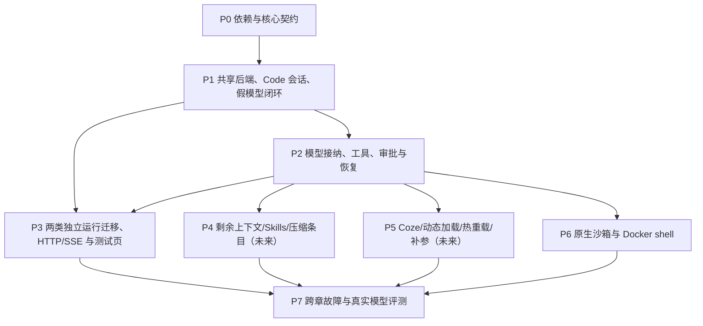

# 12 开发顺序、默认策略与验收

## 2026-10-02 两类独立 Agent 迁移（源码已接线，最终认证见记录）

本轮按 [SDK 职责边界](../sdk-scope.md) 同步原正文及验收条件。L1 `internal/llm`、L2 `internal/agent` / `internal/agent/eino` / `internal/agent/tools` 保留通用 `Agent`；同级 L3 为 Code Agent（`internal/codeagent`，原 `internal/sessions`）和 Workflow Agent（`internal/workflowagent`），两类互不导入。共享 `internal/storage` 契约及 JSONL/memory 后端不持有 manager，不提供跨运行事务或调度。单 module、唯一公开 import `github.com/ww1489/seasprak/sdk` 和唯一公开生产文件 `sdk/sdk.go` 不变。

`AgentSession`、`CreateAgentSession` / `OpenAgentSession` 保留；`WorkflowAgent`、`WorkflowOptions`、`CreateWorkflowAgent` / `OpenWorkflowAgent` 已公开接线。Web 分别消费 `/v1/sessions`、`/v1/workflows`、`/v1/workflow-runs`，有独立视图，不再用会话 target/queue/Snapshot 保存工作流定义与节点。应用目录、创建去重、metadata 和附件上传归 Web；Code 保留输入附件准入/模型展开和原授权。外部 consumer 仅 import `sdk`；仓库内 Web 仅调用两类受控入口，不 import `sdk` 或直接写 manager。

普通受控 Code 子 Agent，以及工作流静态子流程、条件/并行汇合、已有节点级暂停/审批/显式恢复继续验收。业务通过既有受控工具组合两类独立运行，返回与父调用匹配的一条结果或业务引用，外层批准不授权内层效果；SDK 不新增跨 Agent 端口或联动调度框架。完整子树恢复、跨任务审批/补偿及跨运行总预算归业务，不记 SDK PASS。旧开发数据无需迁移，不兼容/跨类型打开明确拒绝且不自动清目录。

P3 尚未完成；本轮不启动 P4/P5，Coze、动态加载、热重载和业务补参仍为未来阶段。Code 原生 `checkpoint_validation` 的生命周期回调隔离已按批准 Step9 修正并获有界接受；唯一方法与 codec、fresh/single-use、固定 Eino v0.9.21 及原目标根资格限制见 [09 §checkpoint](09-persistence-and-recovery.md#checkpoint)。保留修前失败和拒绝保护，不清空 callbacks、不 fork/patch/升级 Eino、不使用反射/私有回调管理器或第二循环；Workflow 无原生整图 checkpoint，不扩张其恢复能力。下列历史结果不自动认证后续文件集。Code Agent 与共享存储已迁移；旧会话内工作流 target、定义/编译/图、执行/恢复及节点状态已退出，独立 Workflow Agent、公开工厂、Web 三类资源路由及独立视图已接线，有对应默认测试和 SDK 消费者。本步骤的运行证据由 [P3 验证记录](../p3-verification.md) 汇总；最终冻结源两平台全仓结果已由父收齐并见本章“当前证据与限制”；Repair 等开放路径仍未闭合，不把目录移动、局部检查或最终绿色视为 P3 完成。

## 2026-09-29 P3 范围前移（历史批准记录，P3 仍未完成）

P3 增加 `cmd/web --web`，单用户本机回环服务，Eino 示例 A2UI v0.8 子集前后端，不开放宿主 shell。除原 HTTP/SSE 外，当时批准前移 P4 的历史分支、完整上下文预算及 Eino 中间件压缩接线，以及 P5 的启动时注册、普通受控子委派与静态工作流执行恢复。2026-10-01 改为两类独立上层运行与 Web 资源，不继续扩展会话内工作流 target。具体网络契约见 [13 P3 Web 接入契约](13-p3-web-contract.md)。

P4 仍保留完整资源/Skills 发现加载及未覆盖上下文条目；P5 仍保留 Coze 导入、业务补参、热重载、多 generation 生命周期和通用扩展 hooks；P6/P7 不变。下文批次表和依赖图按当前所有权修订，既往前移不等于新阶段启动或交付；P3 必须完成迁移后的独立资源、安全与基础恢复验收，不能把只完成 HTTP 页面当作出口。

## 2026-09-27 历史确认：用户 shell 与日志简化（当时待实现）

- 用户 shell 由受信宿主独立调用；不走模型工具审批、Agent 预算、执行票据、持久化执行去重和工作区访问限制。保留显式 Session 工作区绑定及初始 cwd、超时、主动取消、输出、退出码；不自动重试或恢复重跑。模型及受控工具的原安全管道保持不变。
- 命令短输出直接返回；超长时自动尝试保存脱敏完整日志，输出 UTF-8 安全头尾预览和成功保存的引用。保存失败保留真实执行结果和预览，独立提示日志未保存；不新增日志审批或独立结果票据。既有产物隔离、读取内容校验、生命周期不变。
- Step 16.1 改为用户 shell 独立接线及旧直接审批数据的只读兼容/不执行迁移；Step 22 验证 SDK 宿主入口不能由模型来源冒用。原 direct 审批恢复历史测试不代表新契约通过，原待办不自动完成。
- 必测：用户 shell 在无 Agent 审批/预算/票据时实际执行；模型同类动作仍受原规则约束；同一命令两次显式提交执行两次，Open/Resume/日志失败不产生第三次；取消、超时与真实退出；非零退出日志保存失败不丢原退出码；完整日志读取、缺失/变化、中文/emoji/超长单行；旧等待记录重开零启动。
- P2 用户 shell 可使用明确的宿主执行路径，这不是提前认证 P6 原生沙箱。Windows/Linux 提供实际运行证据；macOS 按维护者决定延期记录，不阻塞当前步骤，也不记 PASS。实施后仍执行 AGENTS.md 全套验证，测试筛选先确认确有命中。


历史状态：2026-09-24。P0～P1 当时已有 Go 实现及审查缺陷回归：显式工作区、JSONL 提交、假模型/内存工具闭环、串行调度、取消关闭和持久事件。普通测试与竞态检查只证明当时覆盖场景；当时记录的默认文件/命令/子 Agent、真实供应商认证、审批恢复、HTTP/SSE 和沙箱未交付状态，不替代此后 [P2](../p2-verification.md) / [P3](../p3-verification.md) 的分项证据。上述历史检查点未读取或探测 `.test_env`、未执行 live 调用；本次文档同步同样不接触该文件，父后来唯一授权执行的实际结果见下文，该文件不进入 Git。

本章是全方案的工程默认值、任务依赖和完成条件主定义。下列实施产物与断言是验收目标，不是整体完成清单；当前迁移接线已有相应默认测试及 SDK 消费者，最终文件集认证由父验证记录汇总。真实平台/模型认证不能用文档覆盖率或上游测试替代。

## 当前证据与限制

已实现调用链与默认测试位置如下；此索引不替代父流程对最终文件集的实际认证，也不把测试存在计作全部验收通过：

- 层级与单份所有权：`internal/architecture/dual_agent_layers_test.go`、`shared_layers_test.go`、`workflow_ownership_test.go`；Code 旧 target/节点退出与跨类型只读预检由 `internal/codeagent/workflow_exit_test.go`、`workflow_header_test.go` 及 state 对应默认测试覆盖。
- 独立工厂、结构化输入、节点与重开：`internal/workflowagent/factory_test.go`、`runtime_test.go`、`frozen_recovery_test.go`；默认/宿主 TODO 的归属、授权消费与确认丢失由 `todos_ownership_test.go`、`todos_fault_test.go`、`todos_ticket_test.go` 覆盖，不镜像或自动重跑。
- Web 目录/创建回执、控制与 HTTP 白名单：`internal/web/workflow_catalog_test.go`、`workflow_routes_test.go`、`workflow_control_test.go`、`workflow_snapshot_independent_test.go`；`review_workflow_sse_contract_test.go` 实际检查固定 `event` dispatcher；typed cursor 和私有内容隔离分别有 workflow SSE/snapshot 默认回归。
- 外部 SDK 消费者：`sdk/testdata/consumer/workflow_agent_test.go`、`workflow_model_test.go`、`business_composition_test.go`；分别调用公开工厂/控制、模型节点和既有受控工具组合，不新增跨 Agent 框架。
- Step9 原生预检：`internal/agent/eino/checkpoint_validation.go` 的实际生产入口及 `p3_checkpoint_callback*_test.go`，Code 的 `internal/codeagent/p3_checkpoint_callback_test.go`。固定版本的原根矩阵、每调用对象 identity、codec 交叠/并发、永久零生命周期回调，以及真实 Pause/审批发布、活跃可写 Snapshot、负向 Snapshot/Resume 和模型后/工具后磁盘重开恢复已有有界证据；方法/限制唯一见 [09 §checkpoint](09-persistence-and-recovery.md#checkpoint)。父在 Windows 与实际 Linux 分别运行完整 `go test ./internal/agent/eino ./internal/codeagent/... ./sdk ./sdk/testdata/consumer -count=1` 及相同范围 `-race`，四条均 exit 0；保留实施早期整包 FileBoundary RED，不把这些受影响范围结果作为最终全仓 PASS。
- 文件访问有界接受：可信状态根及入口错误码保持、运行时条件读取、默认 JSONL 的同目录 journal/私有锁/SyncRoot、Code/Workflow 默认工厂连续绑定，以及附件子目录/Web 发布目录同步已有独立复核和 Windows／实际 Linux 相应范围证据。默认 Store 的 Unlock 失败后独立 Close 责任已关闭。Blob 按真实创建文件身份清理的 H1/M1 修正已独立规格/质量复审关闭；父修后 Windows／实际 Linux 完整 `go test ./internal/storage/... -count=1`、同范围 `-race`、`go vet ./internal/storage/...` 和 `go build ./internal/storage/...` 均 exit 0，仅属13.2c有界接受，不认证跨上层最终组合。清单生产 publisher 已接线，作者两平台限定证据、独立规格/质量复核与父完整上层组合共同支持13.2e有界接受；通用失败阶段旧 ID/mode 的非阻断测试补强建议和报告§9覆盖精度更正保留，不记这些 assert 已补强。Workflow.Close 公开安全错误与可写创建父目录同步的最终跨任务修正亦经默认/公开SDK消费者 RED→GREEN 和独立规格/质量有界关闭；方法唯一见09。Repair 完整旧 WRITE_THROUGH 替换仍暂停、旧 raw-path/flock 清理未据此认证。范围和限制见 [09 §layout](09-persistence-and-recovery.md#layout) / [§corruption](09-persistence-and-recovery.md#corruption)，不把修前组合绿色或所有包测试存在当成全部写路径完成。
- 前端源码路径：`web/src/App.tsx` 分别选择两类资源，`api/workflow.ts` 与 `WorkflowView.tsx` 使用独立 DTO/控制；对应默认 unit 在 App/WorkflowView/api 的 `*.test.ts(x)`，嵌入资源构建及真实 browser 认证由父流程最终记录。

最终命令/平台/失败/未验统一见 [P3 验证记录](../p3-verification.md)；以下为2026-10-02父实际验收结果，文档同步子项未亲跑产品测试。最终冻结源采用 Go 1.27.0 Windows/amd64 与实际 WSL Ubuntu 24.04 Linux/amd64（uid1000），不是交叉编译；先 Windows 完整链 exit0，再 Linux 完整链 exit0，未并行运行两平台 full race。两平台 `gofmt -l .` 均 exit0且无输出；`go vet ./...`、`go build ./...`、`go test ./... -count=1`、`go test -race ./... -count=1`、`go test ./sdk/testdata/consumer -count=1`、`go test -race ./sdk/testdata/consumer -count=1` 均 exit0，无 DATA RACE。修正后的最初 Windows 全仓 exit1（仅旧 Web raw Workflow 错误成员断言）保留，获准校准公开安全错误契约后才重跑取得最终结果；WSL localhost/NAT warning 保留。

原 Step14 目标命令 `go test -json ./internal/storage/... ./internal/codeagent ./internal/web ./sdk -run 'Test.*(Header|Symlink|Junction|Attachment|Manifest|Writer|Lock|ReadOnly|PathsOverlap|FileBoundary|DefaultStateRoot)' -count=1`：最终 Windows 649/649、实际 Linux 429/429 具名父/子 actions PASS，skip/fail/unpaired均0，不把该计数说成独立叶行为数。memory 对此 filter 无 tests，不记该包目标 PASS，其完整默认 suite 另有全仓证据。Windows file symlink/dynamic link/junction/header 实际执行，历史1314 skip及旧632/412、639/419检查点保留，不外推其它文件系统/平台。macOS 按批准延期未验；权限故障测试要求非root且 mode 生效的 Linux 或可恢复 DACL 的 Windows，root/DAC bypass、ACL不生效或不能恢复 DACL 的环境明确 NEEDS_CONTEXT/FAIL，不偷换为 skip。受信 stateRoot/祖先、有限 same-root 检查及观察式清理/非原子窗口保持，不认证强沙箱、全部 ABA/挂载/硬链接/设备或真实断电语义。

两平台固定 `go run golang.org/x/vuln/cmd/govulncheck@v1.8.0 -show verbose ./...` 均 exit0：21 root、95 module，源码可达0、受影响 imported package 0；required module OpenPGP 的 GO-2026-5932 / fixed N/A 仍在，不能称全部依赖零告警。原 gRPC 告警已消失，固定 Eino v0.9.21、gRPC `v1.85.0-dev.0.20260825072537-93e31b48545e` 与 x/crypto v0.57.0 不变。最终前端在原 `web` 路径运行 `npm run typecheck`、`npm run test -- --run`、`npm run build` 均 exit0，11文件239/239；嵌入构建保持 `index-BhXUGGiz.js` / `index-DWwsvm-M.css`。这些离线结果不自动代替真实调用验收。

本轮已授权且唯一执行的四协议 live 命令是 `go test -tags live ./internal/llm -run '^TestLocalCompatibleModel$/(OpenAIChat|OpenAIResponses|DeepSeekChat|AnthropicMessages)$' -count=1 -v`：父实际 exit0、25.619s、fail/skip均0；24真实请求/24 HTTP200，四协议各6，保留原流/非流三步断言、每笔 observed/physical=1 与 usage known。Responses/DeepSeek/Anthropic 使用已授权同源 gateway 派生，不冒充三个独立供应商账户。live 执行在 Workflow.Close 安全错误/父目录同步修正之前，父实际 `deps-test-tagslive` 核对其 LLM/依赖闭包与后续 storage/workflow/code/SDK 修改交集为0，因此按未变闭包保留证据，不声称修后上层 live 已重跑。仅测试本身加载配置，不预读/搜索/存在探测环境秘密文件或输出值；没有自动重跑、额外探测或追加调用。

最终源码冻结、两平台全仓、独立复核、安全/前端/preflight通过后，父沿原 `web` 路径唯一执行原样完整 `npm run test:e2e`，exit0、18/18 PASS（1.9m），无定向替代/重试/跳过。已授权工作区外 Node 原生 `--env-file` 只一次桥接必要3个 OpenAI 字段，整行过滤脱敏、不文件工具预读/搜索/存在探测、不持久化配置或环境、不转发额外模型配置。stream重载3.3s保原 trace completed且settled、marker默认5s、request delta=1；其它原case包括幂等、角色切换、HTML惰性、附件、独立Workflow零主模型/显式审批resume一次、分支/summary/compaction及4项visual布局均实际通过。E2E代理20请求、20 upstream responses、20 successful responses，HTTP statuses均200；外部 runner `terminated=false`、`suppressed_diagnostic_lines=4`、`extra_model_configuration_forwarded=false`。4行是未解析内容的非白名单诊断过滤数，不是失败用例数，也不猜其原因或隐藏验收退出码。四协议live24+完整E2E20合计44真实请求/44 HTTP200，Gemini0；两项均只执行一次，没有诊断 overlay、自动重跑或追加模型调用。历史完整E2E配置失败及后续历史成功保留；本次真实结果不将 Repair、macOS 或 P3 改为完成。

<a id="delivery"></a>
## 1. 实施依赖与交付批次


```mermaid
flowchart TD
    A["P0 依赖与核心契约"] --> B["P1 共享后端、Code 会话、假模型闭环"]
    B --> C["P2 模型接纳、工具、审批与恢复"]
    B --> D["P3 两类独立运行迁移、HTTP/SSE 与测试页"]
    C --> D
    C --> E["P4 剩余上下文/Skills/压缩条目（未来）"]
    C --> F["P5 Coze/动态加载/热重载/补参（未来）"]
    C --> G["P6 原生沙箱与 Docker shell"]
    D --> H["P7 跨章故障与真实模型评测"]
    E --> H
    F --> H
    G --> H
```

D29-实施依赖图：阶段顺序不裁剪完整 PRD；P7 全部条件满足才交付完整底座。可在不同模块并行实现，但同一契约先固定并由所有使用方引用。

| 批次 | 具体产物 | 出口条件 |
| --- | --- | --- |
| P0 | 同一 module/go.mod/go.sum、唯一 sdk/sdk.go、L1/L2/两类同级 L3 与共享存储边界、02 的身份/消息/错误、假模型和故障注入基础 | 固定依赖可构建；下层不 import 上层；两类 L3 互不 import；storage 不持 manager；真实 Agentic 类型贯通，迁移边界待验 |
| P1 | JSONL/内存 Store、Code Agent 的 SessionManager/AgentSession 协调、TurnLoop 输入、事实与预算 | accepted 可重启恢复；普通模型/工具/无工具/收尾/取消轨迹成立；历史结果不认证迁移目录 |
| P2 | 模型协议与响应接纳、Invokable / EnhancedInvokable 两类同步工具管道、checkpoint/审批/claim/Reconcile | 部分响应零工具执行；每个崩溃窗无自动重跑；定向恢复原调用；原生 Streamable / EnhancedStreamable 装配拒绝；基础恢复的 Step9 有界修正见 09 §checkpoint，最终文件集仍须复验 |
| P3 | 06/13 的路由/DTO/错误、幂等、SSE/快照、回环认证/A2UI；已批准普通子委派与静态工作流能力改接两类独立运行、独立日志/预算/审批 | 外部 consumer 只 import sdk，内部 Web 只调受控入口且不写 manager；分别创建/打开/输入/观察/停止两类资源；工作流不进入 Code target/queue/Snapshot；节点级恢复及实际调用数仍按当前范围复验；Code 回调隔离已有 Step9 有界接受，文件访问当前有界接受及父最终两平台全仓/目标/live/E2E结果见本章“当前证据与限制”，不外推所有写路径或整树；Repair 暂停和旧边界保持，P3 尚未完成 |
| P4 | 未前移的资源发现、skill 快照、上下文/H/P/K/文件 facts 条目 | 全量预算、连续压缩、共同祖先摘要、旧分支可回选；本轮不启动 |
| P5 | 动态定义/Coze 加载、热重载、多 generation 生命周期、通用运行 hooks 与业务补参的未来接入 | 新扩展无需改核心；失败候选不混合生效；所属运行不偷换旧版本；两类独立执行/既有工具组合边界保留；本轮不启动，不增跨 Agent 调度或完整子树恢复 |
| P6 | 受控文件后端、基于 Zero 适配的 Windows/Linux/macOS 原生沙箱、Docker shell、可信数据保护 | 各声明平台真实运行测试；partial/不可用如实标注且拒绝裸跑；不采用 Zero auto degraded |
| P7 | 系统 38 场景、当前范围章节用例、真实模型固定任务集、发布文档 | 必需需求有当前通过证据；未来/业务责任/未认证项明确列出，不记 PASS；未认证组合不宣称支持 |

历史范围决定（2026-09-27）：workflow_node 的受信登记、节点接纳、实际接线及验收当时整体移至 P5，P2 仅交付 model/direct，工作流来源保持拒绝；该延期当时不阻塞 Step 9 或 P2 出口。2026-09-29 已批准静态工作流前移 P3，2026-10-01 再调整为独立 Workflow Agent 所有者；其节点来源、安全管道与日志必须经新真实路径验收，不能把 P2 的预留字段或历史范围决定计为已交付，也不因此启动 P5。

2026-09-27 范围调整：本次 P2 仅要求 Invokable、EnhancedInvokable 两类同步工具接口。保留已有 SDK 实际输出回调，不要求动态百分比/阶段进度；原生 Streamable、EnhancedStreamable 不在本次范围并保持装配拒绝，不修改 Eino 或维护 fork。Step 12 的工具前置条件按两类同步接口及原有安全断言验收，两类原生流式能力缺失不再阻塞 Step 12 或 P2 出口；Step 11 不因范围调整自动完成。模型流式响应、取消、后端收敛、unknown、审批/checkpoint，以及其余平台、协议与故障窗验收要求均不变。

最小纵向闭环也通过同一保存和工具管道，不先写临时裸执行版本。跨章发现真实框架缺口时记录具体源码/失败用例并修正适配，不以自写 ReAct 或削弱安全规则填补。

<a id="defaults"></a>
## 2. 开发者默认策略

以下是本次确认的初始工程保护值，不是实测性能指标。终端用户无需配置，开发者用 SessionOptions/工具定义以及WorkflowOptions 按所属运行替换；实际生效值写入各自 Trace/节点运行/operation 快照，恢复不重置。两类使用相同数值默认和记账机制，不表示共享总账。

| 策略 | 初始默认 | 记账和覆盖规则 |
| --- | --- | --- |
| 单次逻辑模型实际请求 | 3 次 | 包含 SDK 隐藏重试；ADK MaxRetries=2，不叠加放大 |
| 所属运行逻辑模型调用 | 128 次 | Code Trace 的主/普通子 Agent、摘要及启用 Auto 共用；Workflow Agent 的本运行模型节点/审核使用自己的账本，不与业务父调用原子合账 |
| 所属运行实际模型服务请求 | 256 次 | 传输前在本运行占额；SDK 隐藏重试、缓存资源等额外请求注明用途并计入 |
| 所属运行实际工具调用 | 512 次 | 执行器前在本运行占额；已有结果恢复不重复占，拒绝另计诊断 |
| Code Trace 压缩操作 | 8 次 | 每个合法候选操作计数，H/P 子模型调用另计模型预算；工作流不自动取得聊天压缩能力 |
| 一次逻辑生成的 overflow 恢复 | 1 次 | 必须有新的已提交投影，仍受 3 次请求限制 |
| 所属运行活动执行时间 | 30 分钟 | 本运行共享活动壁钟，普通 child 或图节点并发不重复累加；人工等待/paused 不计；不承诺跨独立运行累计 |
| 普通重试退避 | 100ms 起，指数上限 10s，加 0～50% jitter | Retry-After 可解析且不超剩余预算时采用；不等待超预算后再请求 |
| 普通工具超时 | 120 秒 | 从实际执行起，审批等待不计；普通 task 委派默认用父剩余活动预算，静态子流程使用所属 Workflow 运行剩余预算；业务组合另受外层调用取消/期限约束，不共享内层账本 |
| 进程停止窗口 | 温和停止 5s，再强制停止/确认 5s | 仍不确认则保持相应未停止/unknown，不假称已杀死 |
| 只读并发 / 冲突写 | 4 / 串行 | 资源身份锁；未知副作用范围独占工作区，委派不持父写锁 |
| 子 Agent 并发 / 嵌套 | 4 / 4 层 | 和父 Trace 共用总预算；达到边界明确返回 |
| 一次审批有效期 | 24 小时 | 决定/占用前均检查；过期不自动执行，可显式新交互 |
| 普通 hook 超时 | 10 秒 | 摘要/模型请求使用专门调用预算；任意不合作 Go 代码不能强杀 |
| 观察订阅 | 最多 256 事件且 2 MiB 待送数据 | 达任一限制就停止并要求 resync，不能反压 Agent |
| SSE 心跳 / 单次写期限 | 15 秒 / 15 秒 | 心跳不是任务进展；长连接不使用总响应 WriteTimeout |
| 单次 JSON API 输入 | 4 MiB | 大附件经受限产物入口；公开事件使用有界内容/引用 |
| read 预览 | 2,000 行且 50 KiB | 超长首行通过有界片段读取；不截坏 UTF-8 |
| shell 预览 | 头尾合计 2,000 行且 50 KiB | 超长时尽力保存脱敏全文；失败保留预览和原结果，允许明确标记部分行 |
| grep 预览 | 100 命中、50 KiB、每行 500 字符 | 三种限额分别标注；源位置可续读 |
| 片段读取 | 每次最多 50 KiB | byte 模式有 UTF-8 安全边界/编码说明 |
| 上下文安全余量 | max(1,024 tokens, 窗口的 5%) | 作为保守估算裕量，不宣称精确 token |
| 自动软阈值 | 可用于输入预算的 80% | 输入容量先扣有效输出预留及安全余量 |
| 近期保留目标 | min(20,000 tokens, 可用输入容量的 40%) | 合法工具组/必需约束优先，不强切范围 |
| 主摘要/前缀输出 | 每次 min(4,096 tokens, 可用窗口的 20%, 模型输出上限) | thinking 与答案共限时按有效选项再核算；最终组合重新预算 |
| 日志、幂等与持久事件 | 随所属运行保留 | Code Session 与 Workflow run 独立保存；改事件保留窗口须支持各自 earliest cursor 与 resync |
| 被引用 checkpoint/generation | 不自动过期 | 解除引用后才可清理；不能为省空间破坏等待恢复 |
| 缓存意图 / failover / Auto | short / 关闭 / 关闭 | 显式缓存资源、有状态续接分别 opt-in |

逻辑调用额度耗尽不把工具已写入事实丢弃；实际请求次数未知不编成 0。权限和取消即时生效，不能以固定预算/版本为由忽略。摘要自身的材料和输出必须能放入窗口，上述公式不保证所有窗口都可压缩。

<a id="tests"></a>
## 3. 确定性测试目录与断言

测试按子系统组织，使用假 AgenticModel、fake transport、可控制的时钟/随机源/工具实际输出和临时工作区。每项测试要验证状态与实际调用次数，不能只比输出文字。

| 测试组 | 覆盖 | 必需断言 |
| --- | --- | --- |
| V-BUILD / V-ARCH | module、包依赖、SDK 装配 | sdk/sdk.go 为唯一公开生产入口；外部 consumer 只 import sdk，内部 Web 不 import sdk/cmd 或写 manager；L1/L2 无上层反依赖；两类 L3 互不 import，共享 storage 不 import 状态 manager/调度；新目录/入口实际接线待验 |
| V-ID / V-MSG | 身份、标准/自定义/未知消息 | sessionId 与 workflowRunId 不串线，节点状态不进 Code Snapshot；各自游标/版本/审批/恢复引用独立；块保真、display 不当权限、工具 user 非人类 |
| V-LOOP | Code Agent 的 LOOP-A、终答竞争、取消队列 | 同 Trace、正确轮后顺序、一次 settled、旧普通队列 hold 可恢复；独立工作流不消费 prompt/steering/follow-up，不成为 targetAgent |
| V-MODEL | M-E、thinking/错误/流、两类运行模型路径 | 唯一 attempt 结局；Code 与工作流模型节点均校验完整响应，截断/失败工具次数 0；逻辑/实际请求包括隐藏重试，在所属运行占额；并行节点不超本运行总额，不伪造跨运行原子预算 |
| V-CACHE | 厂商请求及 usage fixture | 合法断点/作用域、未知字段不填零、分支不错误续接 |
| V-TOOL / V-DEFAULT | T-E、两类同步执行接口、两类原生流式接口装配拒绝及基础能力 | 最后转换后校验、结果匹配、实际输出关闭与晚到拒绝、失败后处理不重执行 |
| V-EVENT / V-API | EVT/API、HTTP、SSE、hooks | 各自先提交再发布、无反压、幂等、重放实时交接无遗漏；审批仅实例临时事实；Code settled 与 Workflow 已提交终态分开，cursor/instanceId 不串用；独立工作流接线待验，不标 PASS |
| V-CONTEXT | CTX-A、skill/规范/截断 | pending 不入模型、真实续读、完整预算和稳定前缀 |
| V-COMPACT | CMP-A、首次/增量/H/P/K | 因果组完整、六标题、程序文件集合、候选整体提交 |
| V-STORE | SESSION-A、JSONL/分支/版本、独立工作流日志 | 分别单写且日志/游标/版本引用不混；尾修复/中损坏、路径配置、共同祖先摘要仅用于 Code；跨类型/不兼容 Open 明确拒绝，旧目录不变 |
| V-RESUME | checkpoint/审批/核对及本运行节点恢复 | 定向响应、已有结果复用、未知先核对、终态不复活；节点复用不认证原生整图或全树 checkpoint。Code 原生预检实际入口、每调用 stop identity、根矩阵、codec 并发与真实恢复组合按 [09 §checkpoint](09-persistence-and-recovery.md#checkpoint) 获 Step9 有界接受；固定版本、fresh/single-use 及宿主 codec 仍可先执行的限制保持，修前失败保留，不弱化保护或代替最终全仓认证 |
| V-EXT | EXT、普通注册/版本/受控子委派 | Code child 保留权限交集、预算、版本及取消真实退出；queued/hold 在未来 reload/重启/继续队列后不换版，定向输入省略/匹配/错配规则一致；Code registry 不持有工作流 target |
| V-WORKFLOW | WF、独立运行与现有工具业务组合 | 目标 Create/Open 接线、显式工作区、结构化输入/自身事件/日志/节点结果、条件/并行汇合/静态子流程、节点暂停/审批/显式恢复；无主模型路由、无 Code Turn/队列；修剪前拒绝未知节点及非法类型/拓扑；预算/批准/冻结/取消仅在所属运行有效，已有结果实际执行一次；工具组合仅向父返回一个匹配结果/引用，SDK 无专用跨 Agent 框架；动态导入/补参/reload 仍未来，完整子树及跨运行总预算列业务责任 |
| V-SEC | SEC-A、许可与原文 | 冻结描述不漂移、claim 原子、未知不重跑、原文信任不提升；外层工具批准不替代 Workflow/Code 内层策略或许可 |
| V-PLATFORM | 各 OS/backend/mode | 实际限制、真实路径、后端不可用零裸执行 |
| V-SYS | SYS-A01～38 | 对照原 PRD 按所属 Code/Workflow 运行验证当前 SDK 范围，不以章节单测替代；完整子树/跨任务审批/补偿及跨运行总预算标业务责任，不算 SDK PASS；未来或未认证项保留待验 |
| V-WEB | 最小页面与三类资源路由 | `/v1/sessions` 完成普通选择/输入/停止/审批/恢复/分支/压缩/核对；`/v1/workflows` 与 `/v1/workflow-runs` 完成独立定义/运行/输入/事件/节点控制；不经会话 target 或内部状态捷径，打开/浏览零模型和工具启动 |

每个 PRD 编号的测试子案例采用 `组名/PRD-ID`；无编号约束采用覆盖表中的 U-ID。覆盖表保留原条款链接和检查重点，不能把同一个“能调用”测试算作多个不同语义的通过证明。

<a id="faults"></a>
## 4. 崩溃、竞争和资源故障注入

至少在这些位置终止测试进程并重启读取：

| 故障点 | 恢复预期 |
| --- | --- |
| accepted 写入/Sync/响应之间 | 原 input/trace 身份可去重，未确认的完整提交允许被发现 |
| 助手消息提交前后 | 未接纳工具不执行；已接纳事实不重复 |
| approval asked/decided/claim/目标启动/结果之间 | 一次审批仅实例内存、崩溃失效；区分无许可、未占用、占用未知、已执行；未执行按需重询，已有结果复用，unknown 先核对，不自动重跑 |
| checkpoint blob 与关联 commit 之间 | 孤儿不自动恢复；匹配关联方可 canResume |
| compaction 两份候选/commit/投影激活之间 | 无半摘要；已提交候选可重建，无重复覆盖 |
| 输出保存与 artifactRef commit 之间 | 不发布不存在产物；原结果不靠重跑补日志 |
| settled commit 与网络发送之间 | 回放原事件身份；不第二次收尾 |
| reload pending/active 与旧引用释放之间 | 旧 Trace 可恢复或明确不兼容，不偷换版本 |

并发竞争覆盖：Code 自然终答与普通输入；各自运行 cancel 与批准、多个 claim、多次 SetActiveTools、核对与迟到结果、快照/重放与实时事件；Code 导航与压缩候选；Workflow 并行节点请求占额与工具效果；不同实例同工作区写冲突。业务组合不能持外层写锁等待内层运行，不能串用另一运行的审批或重置其预算；共享机制不作为跨日志事务证明。

错误注入覆盖：磁盘满/Sync 失败/损坏尾部、秘密引用不可用、资源缺失、hook 超时/异常、不合作 Go 工具、沙箱探测成功但实际启动失败、伪造 stderr、容器 daemon 断开与目标仍运行。

<a id="certification"></a>
## 5. 平台与模型认证

平台记录字段：OS/版本/arch、Go/build、backend/version、mode、enforcement、runtimeDataWriteProtected、工作区/产物映射、执行/取消/重启测试、已知限制。目标覆盖 Windows 原生、Linux、macOS 和宿主 Docker shell；发布一个二进制不等于该组合全部模式通过。

- Windows：基于 Zero helper 的受限 token、ACL 增删/残留；按已 setup/未 setup × 文件/网络要求与设施可用性组合验收，不把未 setup 与 unelevated 当成互斥等级；覆盖 junction/硬链接、本产品补足的 Job/控制通道、无 Bash、状态目录保护。Zero 源码存在不等于已认证。
- Linux：Zero helper+bwrap 为默认；Landlock 分开认证，包括 namespace 受限/旧 ABI/运行数据别名及停止范围。自动回退若启用须单独验证。
- macOS：真实 Seatbelt profile 允许/拒绝、设施不可用行为、写限制与实际网络生效值。
- Docker：固定 image digest、本机 daemon、host/container 同文件、只读/可写挂载、取消、私有产物导出、重启后精确核对。

模型记录字段：provider/protocol/endpoint/model、适配 commit/config、认证日期、工具/流/思考/模态/窗口、结束/错误/缓存策略/usage 样本。OpenAI Chat/Responses、Claude、Gemini、DeepSeek 和兼容 endpoint 分别认证，不能从品牌推断。

真实模型固定任务集保留原目标：解释示例代码；限定文件修改并跑测试；非编码内存工具；skill 加载；自定义普通子 Agent；同一工作流分别独立直接执行和通过既有受控业务工具组合；未来阶段导入指定 Coze Canvas 子集；长 Code 会话压缩后继续。工作流直接执行不先调用 Code 主模型，业务组合只把一条匹配结果/引用返回父调用，内层仍独立授权与记账。任务集不是本轮全部能力已交付或调用许可；Coze/完整 Skills 等依原阶段验收，不前移。

按 diff、退出码、schema、产物和引用判定，不按模型自述 completed 判定业务成功。效果/延迟/成本测量与底座确定性测试分开，无预设伪造基线。当前真实模型范围遵循 [P3 验证记录](../p3-verification.md) 的批准四协议，历史 Gemini 分项证据保留；本轮 Gemini 请求为零且不新增任何 Gemini 模型调用，其它真实调用只在已批准四协议及原样完整 E2E 范围内，两项已各唯一执行一次，没有自动重跑或追加调用，结果与顺序见本章“当前证据与限制”；macOS 已批准延期并记未验证，不从交叉编译推导 PASS。

<a id="coverage"></a>
## 6. 需求覆盖与文档门槛

[逐条覆盖表](requirements-coverage.md)纳入十二章的功能编号、验收编号、系统 SYS-01～19/SYS-A01～38、总纲 K 指标，以及每个技术小节的无编号约束入口。映射包含具体技术锚点、接口/图和测试断言。

文档验收：
1. 编号定义全部有映射，不把正文引用误当定义，也不只统计 38 个 SYS-A。
2. 每个技术小节有落点，重点复核无编号的来源、预算、边界和失败规则。
3. 所有本地链接/源码行范围存在；Markdown 表格、代码围栏和 Mermaid 可解析。
4. 身份、状态、接口、事件和图中顺序一致；从每个场景追踪到真实保存点。
5. 原三篇方案退出有效导航，不保留冲突默认；PRD 只同步已确认部署/工程默认引用。
6. 本轮仅修订已批准的文档文件；产品源码没有实现时不得写成已交付，人工文档核对不代替运行验收。

<a id="evidence"></a>
## 7. 已运行证据与尚未完成项

规划阶段已在本地 Go 1.27.0 / Windows 运行：

```powershell
go test ./adk ./adk/prebuilt/deep -run '^(TestTurnLoop_(StopBetweenTurnsAndResume|BusinessInterrupt_PersistAndResume|ResumeWithParams|Push_WithoutPreempt_DoesNotCancel|OnAgentEventsError)|TestAfterToolCallsHook|TestAfterAgent|TestAgenticDeepAgentEmitInternalEventsFromSubAgent)$' -count=1
```

结果：两个包均通过。来源为固定 Eino checkout 的测试；部分 hook 测试仍用旧 Message，不能据此声称产品的整条 Agentic 适配已验证。产品须以自己的 Agentic 流接纳、普通子作用域、所属运行已支持恢复及安全测试验收；这不新增完整子树或跨运行联合恢复承诺。

上述规划阶段文档正文、图与映射仅作人工核对，记录在覆盖表原日期条目；当时未运行链接扫描、Mermaid 渲染、产品测试或构建。2026-09-24 动态工作流与沙箱调整仅修改文档，既往覆盖表/图渲染记录保留原日期，不冒充此次迁移结果。此后产品分项结果见 P2/P3 验证记录；未认证的平台、模型能力、Coze Canvas 和沙箱组合仍需实际验收，不把上游源码或 JSON 语义写通写成已实现。Code 原生预检的 Step9 生命周期回调修正已有有界接受，方法及 codec/单次探针/固定版本/原根限制见 [09 §checkpoint](09-persistence-and-recovery.md#checkpoint)。修前失败和历史节点恢复证据保留，Step9有限结果本身不认证 Workflow 原生整图、任意宿主零执行或最终全仓；父最终冻结源两平台全仓及显式消费者实际结果见本章“当前证据与限制”。Blob H1/M1与13.2e清单 publisher已独立有界接受，Workflow.Close安全错误及可写创建父目录同步的方法见09，清单通用失败阶段旧ID/mode补强建议仍在；Repair 完整旧 WRITE_THROUGH 替换暂停不变。唯一授权四协议live与原样完整E2E已各执行一次并通过，外部Node原生env-file必要3OpenAI字段桥接、安全条件和未变LLM闭包的证据顺序如前；macOS未验、整体P3未完成，不由最终绿色自动关闭。
