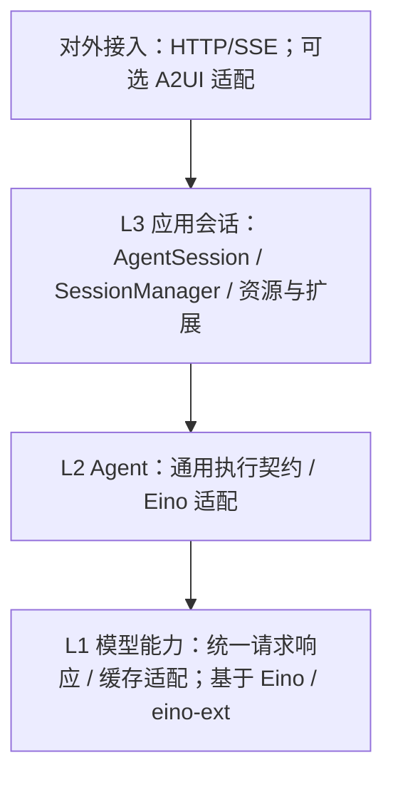

# 第 2 章：分层、职责与扩展边界

状态：讨论稿。对应教程 [M02 三层架构](https://dg-ai-notes.pages.dev/modules/ch02-three-layer-arch)。用户已确认参考 pi 逐层组织、下层不依赖上层；本章细化职责与验收，具体 Go API 留给对应章节。

## 1. 执行摘要

### 1.1 要解决的问题

如果执行核心依赖具体页面或传输协议，更换前端就会牵动底座；如果产品直接把 Eino Checkpoint 当作 Session，历史分支、任务取消和版本更新就会混在一起。

采用三条规则：**AgentSession 控制会话内任务，SessionManager 管理历史与分支，Agent 通过 Eino 承担执行。** 创建与扩展注册放在装配入口，交互入口消费同一套产品消息和事件。一个正常任务执行期间使用稳定的扩展版本。

### 1.2 教程与实际 pi 的区别

教程的三层思想可借鉴，但本地 pi 0.84.2 的 agent-core 已导出 harness、tools、skills、compaction 和 session；新 `AgentHarness.prompt` 等入口仍有未实现占位，实际 coding-agent SDK 继续装配 `Agent + AgentSession`。因此本产品学习已实现的调用路径，不把新接口或包名当作成熟行为。证据见 [P-01～P-03](source-evidence.md#pi-证据)。

## 2. 用户体验与功能

### 2.1 三层核心与对外接入

参考 pi 的职责递进组织三层核心：底层提供模型能力，中层利用模型运行通用 Agent，上层组装 AgentSession 及其历史和扩展能力。对外接入在核心之外组合应用能力，前端是接口调用者。

| 层级 | 类比 pi 的职责 | 本产品负责的功能 | 依赖限制 |
| --- | --- | --- | --- |
| L1 模型能力层 | pi-ai：统一请求、响应及供应商差异 | 以 Eino/eino-ext 为基础，提供请求兼容、文本/推理/工具流归一化、终止/错误语义、usage 与缓存计量，以及供应商前缀缓存策略 | 不依赖 AgentSession 或任务调度；只接收模型输入、能力参数及上层传入的不透明缓存作用域 |
| L2 通用 Agent 层 | pi-agent-core 的执行职责 | Agent 执行契约与 Eino 适配；通用消息、工具和事件；内部复用 DeepAgent/TurnLoop | 使用 L1；不导入 AgentSession、SessionManager、ResourceLoader 或接入实现 |
| L3 应用会话层 | pi-coding-agent 的应用装配职责 | CreateAgentSession、AgentSession、SessionManager、ResourceLoader、扩展注册与策略 | 使用 L2/L1；不导入 HTTP/SSE、A2UI 或 Web 页面实现 |
| 对外接入（外侧） | SDK/RPC 等使用入口的职责 | 基于应用 SDK 暴露操作、查询和事件；首个适配建议 HTTP/SSE，按需增加 A2UI 映射 | 依赖应用公开能力；不得让传输 DTO、连接对象或 UI 描述进入核心契约 |

模型层优先复用现有 Eino 接口和 eino-ext 供应商实现，在缺失处补适配。**复用组件不等于已经满足 pi 的模型能力设计**：L1 仍须对外提供一致的请求/响应语义，并落实各供应商缓存能力；既有能力直接使用，差异通过适配补齐，不另造整套 HTTP SDK。各层先置于同一 Go module；包名是建议，职责和依赖方向是约束。

下图箭头表示代码依赖；Web 页面到服务端为协议调用，不属于 Go 包依赖。

依赖规则：

1. 上层组合下层，下层不导入上层，也不通过全局对象查找 AgentSession 或前端连接。上层可直接引用底层公共类型，不要求所有调用机械穿过每一层。
2. L2 需要持久化、上下文投影或策略时，依赖自己定义的窄接口/回调，由 L3 注入实现；回调发生在运行期间不构成反向代码依赖。
3. 通用契约不导入 Eino 的具体适配实现；SessionManager、ResourceLoader、ExtensionRegistry 不反向导入 AgentSession。CreateAgentSession 在初始化时组合它们；AgentSession 在会话运行中消费资源候选和注册结果，再决定何时切换执行实例。
4. 具体业务工具和工作流由 L3 装配，通过 L2 的工具/执行契约提供给内核；执行内核不按业务工具名写特殊分支。
5. HTTP 请求、SSE 连接和 A2UI 消息只在对外接入层映射。会话内的执行生命周期由 AgentSession 管理，历史由 SessionManager 保存，浏览器组件或单条连接不拥有两者。

这些规则细化了原方案的包列表。资源加载成功只产生候选数据；登记、激活和执行分别有自己的负责对象，不能再归入一个含糊的“宿主对象”。

### 2.2 可验收的架构需求

| 编号 | 用户价值 | 验收条件 |
| --- | --- | --- |
| ARCH-01 | 应用能无头嵌入底座 | 无终端测试完成一条任务；更换输出消费者不影响任务结果 |
| ARCH-02 | 业务扩展无需改循环 | 新工具及工作流通过 ExtensionRegistry 注册接入，AgentSession 协调代码和 Agent 执行循环无改动 |
| ARCH-03 | 会话不会随运行实例消失 | Abort、模型错误和热换后保留同一 session ID、cwd 及已提交历史 |
| ARCH-04 | 同一会话的状态可推理 | 普通任务、独立 Workflow Agent 和新输入竞争时，只有一个顶层写入者；输入无静默丢失 |
| ARCH-05 | 扩展变更不会影响半途任务 | 任务 A 运行中登记 B 版本；A 的工具/skill/handler 一直为 A 版本，后续正常任务才用 B |
| ARCH-06 | 历史数据不受插件缺失破坏 | 未加载自定义消息插件时仍可读取、保留并重新保存原始 payload；不伪造模型角色 |
| ARCH-07 | 独立工作流路径确定 | 用户选择独立 Workflow Agent 时主模型调用次数为 0；工作流自己的模型节点按其定义计数 |
| ARCH-08 | 恢复旧任务不串用新拓扑 | 中断后有扩展更新，恢复仍绑定旧版本或明确拒绝不兼容恢复；不得静默使用新工具实现 |
| ARCH-09 | 层级可以独立使用 | 检查包依赖图无下层到上层的边；L1 可独立调用模型，L2 用假工具及内存替身运行，L3 在无接入服务/页面时通过 SDK 使用 |
| ARCH-10 | 前端可以独立替换 | Web 验证页仅调用公开接口完成提交、订阅、取消与继续；移除页面后后端和 SDK 仍可构建运行 |
| ARCH-11 | 供应商差异有唯一处理边界 | 更换供应商后 L2 不解析厂商流事件或缓存字段；L1 提供统一结果/usage，缓存请求与稳定上下文分别通过 M04/M08 验收 |

这些是待实现的要求，不是上游自动保证。

### 2.3 与 pi 对齐的对象名称与职责

用户已明确确认本节职责与依赖关系，包括将 AddSubAgent 放在独立的 ExtensionRegistry 注册入口；后续设计以此为基线，具体 Go 签名仍在开发方案阶段确定。

本节是全套文档的术语来源。“与 pi 一致”指沿用其名称和职责边界，执行内核仍使用 Eino；本产品新增的任务/事件保证和扩展方法不据此变成 pi 的现成功能。旧称 `Host`、`AgentHost` 和曾建议的 `AgentApp` 不再作为当前设计对象。

| 名称 | 一句话职责 | 负责什么 | 职责边界 |
| --- | --- | --- | --- |
| `CreateAgentSession`（pi：`createAgentSession`） | 把部件装成可用会话 | 校验必需的工作区，接收模型、SessionManager、ResourceLoader 和注册结果，装配默认基础能力并创建 Agent 与 AgentSession | 是创建函数，创建后不持续调度任务；不要求再造一个 Builder |
| `AgentSession` | 控制当前会话中的 Agent 工作 | 受理输入、Trace 与输入队列、Prompt/Steer/Abort、交互恢复、配置快照、压缩协调、事件订阅 | 通过 Agent 执行，通过 SessionManager 保存；不包办文件格式、模型协议或插件发现 |
| `Agent` | 根据输入调用模型和工具 | 通用执行接口，使用 DeepAgent/TurnLoop，返回执行消息、事件和中断结果 | 不依赖 AgentSession、历史存储或 HTTP；不再实现第二套 ReAct |
| `SessionManager` | 管好历史树和会话记录 | 保存/读取消息、分支头、摘要及相关提交记录，提供历史上下文视图 | 不调用模型，不决定工具是否执行，不负责 HTTP 活动会话路由 |
| `ResourceLoader` | 找到并读取资源 | 发现与加载 skills、项目规范、提示词和扩展来源，返回候选资源与诊断 | 不激活活动任务配置，不直接改历史，不启动请求 |
| `ExtensionRegistry`（本产品补充） | 登记可用能力 | 校验和登记工具、消息处理器、子 Agent、工作流及明确替换，生成可装配版本 | 承接原文 Registry 的职责；借鉴 pi 扩展注册，但不是声称 pi 有同名通用注册类 |

pi 的对应实现依据见 [P-02](source-evidence.md#p-02可运行-sdk-的装配路径) 与 [P-08](source-evidence.md#p-08名称与职责边界)。本产品中 `SessionStore` 仅指 SessionManager 内部使用的存储后端契约，不是第二个会话控制器，也不声称是 pi coding-agent 的同名接口。

`Session` 表示可持久化的对话身份和历史；`AgentSession` 表示当前操作它的运行对象。关闭运行对象不删除 Session；换掉 Agent/TurnLoop 也不创建另一份历史。服务端同时接入多个会话时，外层按 sessionId 找到相应 AgentSession，不把一个 AgentSession 或 SessionManager 定义为全局服务管理器。

pi 另有 `AgentSessionRuntime` 管理当前 AgentSession 及 cwd 相关服务的整体替换，见 P-08。它与本文的 Eino 执行适配是不同含义；本产品若需要这种整体替换职责再沿用该名称，不为了名称对齐新增无用途对象。

协作顺序：创建函数组装对象 → AgentSession 受理操作 → Agent 执行 → AgentSession 协调 SessionManager 提交 → 提交成功后发布产品事件。运行中注册新能力时，ExtensionRegistry 产生候选版本，AgentSession 在既定任务边界激活；固定版本内逐 Turn 的工具选择是执行状态，扩展通过受控上下文请求、由 AgentSession 协调 L2 应用。会话 before/after hooks 由应用会话层触发，窄接口注入下层；加载器、注册表与存储层都不反向调度 AgentSession。

## 3. AI 系统需求

### 3.1 装配边界

| 能力 | Eino 提供的部分 | 产品需补足的部分 |
| --- | --- | --- |
| 模型请求/响应与缓存 | Eino 消息/流接口、eino-ext 供应商转换及部分缓存能力 | L1 的统一响应语义、协议兼容策略、缓存能力矩阵、缓存统计和失效回退；具体见 M04 |
| 模型与工具往返 | DeepAgent 基于 ChatModelAgent 装配执行 | 模型配置选择、应用指令、验收用例 |
| 子 Agent | DeepAgent 的 `task` 与 general-purpose 子 Agent | 业务子 Agent 注册、权限及父子任务归属 |
| 工具 | 工具元信息、执行接口、ToolsNode | 默认能力、策略、产品级结果和扩展管理 |
| 安全审核/沙箱 | middleware 与文件/Shell 接口提供组合位置，并非完整安全实现 | 参考 DSH 的按调用策略、一次批准与审计，以及 Zero 的三平台原生后端；见 M05 和安全补充篇 |
| skills | Skill middleware 与 backend 访问 | 搜索路径、可信来源、内容版本与重载规则 |
| 工作流 | Workflow/Graph 编译后执行 | 声明式定义加载、来源适配、两种 Agent 使用方式、输入校验、会话归属 |
| 暂停恢复 | Interrupt/Resume 与 checkpoint | 产品上的等待状态、恢复请求、版本兼容 |

依据见 [E-01～E-07](source-evidence.md#eino-证据)。工具封装是产品适配工作；不把示例仓库中的 Graph Tool helper 当作当前本地已提供的稳定核心 API。

工具层按 pi 分为模型元信息、可执行能力和应用定义，通过窄 Operations/后端接口切换环境。安全不修改上述分层：应用注入审核与审批策略，Agent 工具管道调用接口，文件/进程后端实施约束，AgentSession 协调 SessionManager 留痕。具体职责、DSH 策略和 Zero 平台实现见[安全补充篇](12-security-sandbox.md#41-策略执行器与后端分工)。

产品默认装配文件读写/搜索、命令执行、TODO 与 general-purpose 子 Agent；CreateAgentSession 根据明确的工作区/执行环境提供受控 Backend 与 Shell/StreamingShell。Eino 的文件/命令能力仍依赖这些配置，不是零配置就能运行；见 [配置](../../eino/adk/prebuilt/deep/deep.go#L65) `[VERIFY: eino/adk/prebuilt/deep/deep.go:65]`。开发者可以显式裁剪；默认所需后端或保护条件不满足时明确报错，不静默裸跑或减少能力。

工作区必填是 L3 产品 Session 的规则。独立调用 L1 模型或使用 L2 测试替身不因此依赖 AgentSession；通过产品 SDK 创建测试 Session 时仍提供明确测试工作区。

### 3.2 子 Agent 作用域

DeepAgent 默认子 Agent 会继承工具和 handlers。由此推导的产品要求：主任务 steering 队列、主会话写入器及权限上下文要按执行来源隔离，不能让子 Agent 消费主 Agent 的输入队列。具体如何识别来源与分派事件留到第 3、7 章；这里只固定隔离行为。证据见 E-02。

### 3.3 模型响应与前缀缓存分别由谁负责

前缀缓存复用供应商已处理的模型输入；模型每次仍生成新输出。它与应用保存最终答案、Eino checkpoint、供应商保存会话并通过响应 ID 续接是不同能力，不能用一个 `cache=true` 混为一谈。

| 职责 | 所属位置 | 具体边界 |
| --- | --- | --- |
| 请求/响应归一化 | L1，详见 M04 | 处理厂商角色/参数差异，统一文本、公开推理、工具参数流、结束原因和 usage；保留必要回放 metadata |
| 厂商缓存请求 | L1，详见 M04 | 根据供应商/模型/API/endpoint 能力选择断点、缓存键、保留选项或显式缓存资源；不向所有兼容接口盲传同一字段 |
| 可复用的输入前缀 | L2 Agent 的上下文管道，详见 M08 | 稳定指令、工具顺序与 schema、资源内容和既有历史；新增输入放到合适的后缀；不因无关时间戳或随机 ID 重写前缀 |
| 会话、分支与权限范围 | L3 AgentSession | 向下传入稳定的不透明作用域与版本信息，通知模型切换、分叉、压缩等语义变化；L1 不反向访问会话对象 |
| 命中与成本事实 | L1 归一化，L3 保存，M07 展示 | 缓存读/写和未知状态分开；未报告不等于零；请求配置了缓存不等于实际命中 |

例如 Claude 的断点放在哪个请求字段，由 L1 的供应商适配处理；连续两轮的系统指令和工具定义是否保持稳定，由 M08 保证。两者结合才形成有效优化。本地 pi 与 eino-ext 的具体差异、可复用实现及验收见 [M04 缓存契约](04-model-access.md#45-供应商前缀缓存与续接契约)。

## 4. 技术规格

### 4.1 Session、Trace 与 Turn

| 名词 | 本 PRD 的含义 |
| --- | --- |
| Session | 用户可持续恢复的对话及分支，拥有稳定身份和创建时必需的工作区/执行环境绑定 |
| Trace | 一次完整运行/回复过程，包含多个 Turn；运行中受理的 steering/follow-up 在同一 Trace 中消费，暂停恢复也保持其身份 |
| Turn | 沿用 pi：一次模型回复及其触发的工具执行；工具结果结算后本轮结束，需要继续推理时开始下一轮 |
| 输入 | 一条 prompt、steering 或 follow-up，使用 inputId 去重；一个 Trace 可消费多条输入 |
| 一次执行尝试 | 执行器从启动到返回、暂停或失败的一段运行；恢复可产生新尝试，是内部运行记录 |
| TurnLoop 实例 | Agent 内的 Eino 调度对象；AgentSession 决定会话何时执行、停止或恢复，并通过 Agent 重建已关闭的循环 |
| 扩展版本 | 当前任务绑定的工具、handler、skill 资源和工作流定义集合 |

主线采用 Session → Trace → Turn。traceId 是完整运行身份；执行尝试仅是内部记录。观测 span、日志采样与供应商请求 ID 属于附属诊断，不改变 Trace 生命周期。Turn 沿用 pi 的模型/工具轮次，不等同于 Eino TurnLoop 调度的一次 Runner 执行；详细流程见 M03。

### 4.2 普通任务轨迹

1. CreateAgentSession 完成初始装配，入口将输入交给目标 AgentSession，分配可去重的输入身份。
2. AgentSession 经 SessionManager 保存 inputId、目标 Agent 与 traceId 归属；普通忙时输入为当前 Trace 的 follow-up，显式独立 prompt 或选择另一 Agent 的新请求则预留另一 Trace 并排队。
3. `GenInput` 消费确定的输入；AgentSession 协调 SessionManager 按输入身份去重提交用户消息，Agent 接收投影后的输入。
4. `PrepareAgent` 使用受理时已固定的目标/generation 返回或重建同版本实例，并复核当前执行条件；ResourceLoader 和 ExtensionRegistry 不参与任务调度。
5. Agent 适配框架执行事件；AgentSession 协调 SessionManager 保存产品历史，并在提交成功后发布产品事实。
6. 每轮结算后处理轮后钩子和 steering；内层自然停下后消费同 Trace 的 follow-up。确实无需继续且历史提交完成后，AgentSession 结束该 Trace，再允许下一独立 Trace 启动。

Eino 的 `GenInput` 先于 `PrepareAgent`，后者失败会退出循环；因此 AgentSession 必须协调 SessionManager 的去重提交，并处理同版本实例不可用/构建失败；新候选失败的旧版保留发生在受理选版之前，受理后不静默换版，不能只照搬回调顺序。证据见 E-03。

本章不冻结全部事件名、消息字段或工具错误结构；这些分别由第 5～7 章统一定义。

### 4.3 Abort 与实例重建

Eino `Stop(WithImmediate())` 关闭 TurnLoop；再次 `Run()` 不会启动同一对象。产品应保证 Session 持续存在，而非要求对象持续存在。证据见 E-04。

已确认行为：停止活动任务 → 等待退出并保留未处理输入 → 提交 cancelled → 无未决副作用冲突时，用户新 prompt 可由新执行实例承接。当时已排队的独立 Trace 暂停自动启动，用户显式继续才恢复；旧 Trace 的未消费 steering/follow-up 不自动迁移，重做需作为新 prompt 受理。具体队列规则以 M03 为准。

**取消后新任务不等于恢复被取消任务。** 不应因存在旧 Checkpoint 就自动继续已取消的副作用。恢复检查点和开启新任务需使用不同的明确意图；具体 ID 与清理策略在第 3、10 章设计。

这里重建的是生命周期实例，内部仍使用 TurnLoop 调度，不引入另一套手写推理循环。

### 4.4 扩展延迟生效

工具、skill、工作流定义/执行器和相关资源在独立输入受理时固定 generation；follow-up 不属于新 Trace，不能触发热更新。逐 Turn 选择已装配模型的代码策略单独由 M03/M04 定义。

1. 扩展加载器读入并验证待启用内容，形成候选版本。
2. 当前任务继续使用其已绑定版本。
3. 候选先完成校验与执行实例编译；AgentSession 在受理下一独立输入时原子选定已验证版本，将目标、generation 和依赖引用与 inputId/traceId 一致保存后才返回 accepted。
4. 构建失败且存在旧版本时保留旧版本，并报告“新能力未生效”；旧版没有请求目标时拒绝受理，不改投其他 Agent。初次无可用版本时明确失败。
5. 已受理 queued 项与活动任务都保留版本引用；开始执行、ContinueQueue、重启和恢复旧 Checkpoint 不重新选最新版。原版本不能重建则明确失败/不兼容，不能在受理后静默换版本。

需要固定的不仅是 Agent 对象，还包括 skill 内容与工具实现等可变资源。Eino skill backend 在调用时 `Get`，直接指向实时磁盘可能让旧任务读取新内容。内容快照/版本读取的具体实现留给扩展篇。证据见 E-06。

回退不能绕过 M12 已定义的权限撤销：当前限制仍优先，立即拒绝相应后续启动或传播取消，不能以“保留旧版本”继续使用已撤销权限。

### 4.5 工作流使用方式

- **主 Agent 的子 Agent**：将声明式工作流适配成 `WorkflowAgent`，由主 Agent 的 `task` 委派；需要恢复时还要实现 Resume 语义，不能只有 Run。
- **对话框选择的独立 Agent**：用户为下一条新请求指定目标 Agent；AgentSession 在同一 Trace 调度规则下启动顶层执行，跳过主模型选路。历史通过 SessionManager 提交，不能旁路并发写入。选择变化不影响已受理、排队或恢复中的任务。

不提供第三种 workflow-as-tool 产品入口。完整需求覆盖动态定义加载、两种使用方式与 HITL；其交付阶段在全套 PRD 评审后确定。工作流中的非确定性节点与外部副作用仍需各自验证，不能把使用 DAG 等同于业务结果必然成功。

### 4.6 消息、存储及模型接口

内部 AgentMessage 包含三类标准消息语义及必要的应用消息，普通扩展使用通用 content/details；只有特殊结构需要自定义转换。先 transformContext，再 convertToLlm，契约见 M06。产品历史与模型上下文不是同一份持久化对象，UI 隐藏也不等于不送给模型。

消息选型已确认使用 `*schema.AgenticMessage`，模型接口使用 `model.AgenticModel`，执行器使用匹配的 TypedAgent/TypedResumableAgent、`deep.NewTyped`、TurnLoop 与 middleware 泛型路径。主/子 Agent 的消息类型必须一致；旧 `schema.Message` 路径仅作为兼容适配来源，不形成第二套产品消息基线。现有取消/重试实现仍需结合所选适配器验证，证据见 E-05。

SessionManager 管理历史与分支，通过 SessionStore 后端持久化；Eino checkpoint 保存执行恢复状态。AgentSession 协调二者的任务/执行身份关联，不把框架内部 checkpoint 格式当作产品长期存储格式。

### 4.7 前端接入与测试页面的边界

本产品负责接口语义，不规定页面框架和组件。对外接入层需要覆盖以下能力；具体 URL、字段和协议版本在后续章节确定：

| 接入面 | 能力 | 当前落地建议 |
| --- | --- | --- |
| 操作与查询 | 创建/读取会话、提交任务、查询状态、取消；后续补充已交付的 steering、恢复及选择独立 Agent | HTTP 请求映射到同一应用 SDK |
| 执行事件 | 文本增量、工具开始/结果、错误、任务状态及待用户输入 | SSE 输出产品事件，携带会话/任务关联信息 |
| UI 描述与动作 | 按场景把结构化输出转换为 UI 描述，并将客户端动作转回应用操作 | 预留 A2UI 等映射边界，不修改 Agent 内核；完整协议实现另定 |
| 联调客户端 | 提交、显示事件、停止并继续 | 最小 Web 测试页面；能力交付后增补相应测试控件 |

HTTP/SSE 是操作和事件的传输方式，A2UI 是 UI 描述及交互的协议适配；核心统一使用自身的消息/事件契约。预留适配位置不要求现在实现一个通用协议插件框架。

页面关闭或 SSE 断开与用户显式取消是两个不同动作。断连后的任务状态查询、重新订阅以及是否重放事件，在第 3、7 章规定；不能靠页面内存推断任务已经停止。测试先在本地完成，远程多用户服务不因此自动进入首期范围。

## 5. 风险与下一步

[第 3 章](03-agent-loop.md)定义内层模型/工具循环、steering、外层 follow-up 和完整 Trace 的统一收尾。Eino 在终答附近已返回时，可由外层继续同一 Trace；这属于框架适配，不改变对外运行身份，具体实现仍待验证。

依赖与状态的整体闭合见[系统检查](system-review.md)。先完成全部章节的契约评审，再制定开发方案；本章包划分仍是职责边界，不是立即创建代码目录的指令。

本章通过的标准是 ARCH-01～ARCH-11 的方向成立、职责没有互相矛盾、原方案的生命周期问题被明确记录。后续 API 和实现应服从这些要求；遇到新证据再修订，不用当前草案强行约束未研究的细节。
