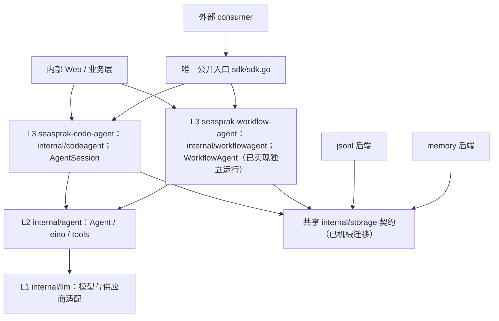

# 第 2 章：分层、职责与扩展边界

状态：讨论稿。对应教程 [M02 三层架构](https://dg-ai-notes.pages.dev/modules/ch02-three-layer-arch)。用户已确认参考 pi 逐层组织、下层不依赖上层；本章细化职责与验收，具体 Go API 留给对应章节。

## 1. 执行摘要

### 1.1 要解决的问题

如果执行核心依赖具体页面或传输协议，更换前端就会牵动底座；如果产品直接把 Eino Checkpoint 当作 Session，历史分支、任务取消和版本更新就会混在一起。

采用三层与独立所有权规则：**L1 模型、L2 通用执行、L3 两类同级产品。** Code Agent 的 AgentSession 控制会话内任务，SessionManager 管理历史与分支；Workflow Agent 独立管理定义、Eino Graph、节点状态与生命周期。两类复用 Agent/模型和 storage 实现，互不导入、不共享业务状态；业务在外层分别调用或用已有受控工具接口组合。各自运行期间使用稳定版本，Code Agent 与共享存储已迁移，独立 Workflow Agent、工厂和三类 Web 资源路由及视图已接通，有对应默认测试；最终认证见 [P3 验证记录](../p3-verification.md)。

### 1.2 教程与实际 pi 的区别

教程的三层思想可借鉴，但本地 pi 0.84.2 的 agent-core 已导出 harness、tools、skills、compaction 和 session；新 `AgentHarness.prompt` 等入口仍有未实现占位，实际 coding-agent SDK 继续装配 `Agent + AgentSession`。因此本产品学习已实现的调用路径，不把新接口或包名当作成熟行为。证据见 [P-01～P-03](source-evidence.md#pi-证据)。

## 2. 用户体验与功能

### 2.1 三层核心与对外接入

参考 pi 的职责递进组织三层核心：L1 提供模型，L2 提供通用执行，L3 包含两类同级产品 Agent。Code Agent 与共享存储位于 `internal/codeagent`、`internal/storage`；旧会话内工作流 target、定义/编译/图、节点状态及执行/恢复分支已退出，独立 `internal/workflowagent`、两类公开工厂、Web 三类资源路由及独立视图已接通，有对应默认测试与 SDK 消费者。本文保留完整目标边界，实际签名/DTO 见开发 06/10/13，最终认证见验证记录，不把目录或局部测试等同完整交付。

| 层级 | 目标目录 | 本产品负责的功能 | 依赖限制 |
| --- | --- | --- | --- |
| L1 模型能力层 | `internal/llm` | 基于 Eino/eino-ext 提供统一请求/响应、供应商适配、usage、缓存及错误语义 | 不导入 L2/L3，不查询运行对象、任务调度或存储 |
| L2 通用 Agent 层 | `internal/agent`，含 `eino` 与 `tools` | 保留 `Agent` 名称；通用执行端口、消息/事件及工具管道，复用 Eino Agentic DeepAgent/TurnLoop | 使用 L1；不导入任一 L3 产品包或接入实现，不持有具体会话状态管理器 |
| L3 Code Agent | `internal/codeagent`（已由 `internal/sessions` 机械迁移） | `seasprak-code-agent` 的装配、资源/扩展、对话历史、输入队列、权限与 Trace 生命周期；运行对象仍为 `AgentSession` | 使用 L2/L1 与共享存储契约；不导入 `internal/workflowagent` 或 Web |
| L3 Workflow Agent | `internal/workflowagent`（已接线） | `seasprak-workflow-agent` 独立拥有定义、编译、Eino Graph、节点状态、运行生命周期和节点级暂停/显式恢复 | 使用 L2/L1 的通用能力与共享存储契约；不导入 `internal/codeagent`，不以 AgentSession 管理工作流 |
| 共享存储 | `internal/storage` 及 `jsonl` / `memory` 后端（已机械迁移） | 共用存储契约和后端实现，提供记录/提交能力 | 不拥有任一 Agent 的调度或业务状态；后端依赖契约，不反向导入产品包 |
| 对外接入（外侧） | `sdk/sdk.go` 与业务/Web 适配 | SDK 选择性导出内部类型供外部消费者使用；内部 Web 分别调用两类受控 L3 接口，按需映射 HTTP/SSE、A2UI | 外部消费者唯一公开 import 为 `github.com/ww1489/seasprak/sdk`；内部 Web 不导入 sdk、不直接操作管理器或 Store；同 module 不新增公开子包，核心不依赖传输或页面 |

模型层优先复用 Eino 接口和 eino-ext；复用不等于模型兼容或缓存计量已经通过产品验收。L2 继续复用 Agentic 执行路径，不另写 ReAct。`cmd/agentd` 仍仅为 help/version 入口，本轮不导入 `sdk` 或 `internal`。

下列依赖图已在源码接线，架构默认测试约束两类上层和中立 storage；Web 协议调用与业务工具组合不形成产品间 import。

```mermaid
flowchart TB
  Consumer["外部 consumer"] --> SDK["唯一公开入口 sdk/sdk.go"]
  Web["内部 Web / 业务层"] --> Code["L3 seasprak-code-agent：internal/codeagent；AgentSession"]
  Web --> Workflow["L3 seasprak-workflow-agent：internal/workflowagent；WorkflowAgent（已实现独立运行）"]
  SDK --> Code
  SDK --> Workflow
  Code --> Agent["L2 internal/agent：Agent / eino / tools"]
  Workflow --> Agent
  Agent --> Model["L1 internal/llm：模型与供应商适配"]
  Code --> Storage["共享 internal/storage 契约（已机械迁移）"]
  Workflow --> Storage
  JSONL["jsonl 后端"] --> Storage
  Memory["memory 后端"] --> Storage
```

依赖与所有权规则：

1. 上层组合下层，下层不导入上层；两类 L3 互不导入，也不通过全局对象查找对方运行对象。共享错误和工程限制继续分别归 `internal/errors`、`internal/config`。
2. L2 需要持久化、上下文或策略时，定义执行层窄端口，由对应 L3 注入；端口不用 AgentSession、WorkflowAgent 或具体状态管理器指针。运行时回调不构成反向代码依赖。
3. Code Agent 的 SessionManager、ResourceLoader、ExtensionRegistry 各保有原职责，不反向调度 AgentSession；其状态层不导入 Eino 适配或具体存储后端。Workflow Agent 独立负责定义、图编译和节点状态，不复用 Code Agent 的历史树或输入队列。
4. 共用 storage 契约及 jsonl/memory 实现，不共享日志写入者、历史、审批、恢复、generation 或隐式预算。即使业务让两类访问同一工作区，也必须有独立运行身份、记录与授权作用域。
5. 两类互调由外层业务使用已有受控工具接口组合；允许业务工具调用另一类的公开入口，不设置 workflow-as-tool 禁令，也不将 Workflow 内置为 Code Agent 的子 Agent。调用不转移授权；被调方拥有独立策略、审批、预算、generation 和恢复。SDK 不新增专用跨 Agent 调用框架、共享总额或整树恢复。
6. Code Agent 内部的 general-purpose/专家受控委派仍属于其父 Trace，保留父预算、权限、版本与取消约束；这与两个同级产品 Agent 的独立运行不同。Workflow 内部保留静态子流程、条件分支、并行汇合、已有节点级暂停审批与显式恢复。
7. HTTP/SSE/A2UI 仅在外侧映射。高级跨任务编排、审批/补偿、业务幂等、完整持久子树恢复和跨运行总预算归业务；原有单调用校验、参数冻结、票据、预算、真实取消退出及未知效果核对仍由各自受控执行路径保证。
8. 本次架构调整不迁移旧开发数据，也不自动删除日志或其他旧数据。Coze 导入、动态定义加载、热重载、多 generation 管理和补参仍属原未来阶段，本轮不启动 P4/P5。批准目标不作为交付或测试通过证据。

### 2.2 可验收的架构需求

| 编号 | 用户价值 | 验收条件 |
| --- | --- | --- |
| ARCH-01 | 应用能无头嵌入底座 | 无终端测试完成一条任务；更换输出消费者不影响任务结果 |
| ARCH-02 | 业务扩展无需改循环 | Code Agent 工具/普通子 Agent 经 ExtensionRegistry 装配；Workflow 在独立产品包定义/编译；业务用既有受控工具接口组合，不改 L2 循环或新增 SDK 跨 Agent 框架 |
| ARCH-03 | 会话不会随运行实例消失 | Code Agent 的 Abort、模型错误和换实例保留同一 session ID、cwd 及已提交历史；Open 不自动执行 |
| ARCH-04 | 两类运行的状态可推理 | Code Agent 同 Session 单写入者；Workflow 拥有独立写入者、节点状态与生命周期；并发使用不共享历史、审批、恢复、generation 或隐式预算 |
| ARCH-05 | 扩展变更不会影响半途任务 | Code Agent 任务 A 固定原工具/skill/handler 版本；后续正常任务才用 B。未来 Workflow 更新在其自身运行范围验收，不激活另一类版本 |
| ARCH-06 | 历史数据不受插件缺失破坏 | 未加载自定义消息插件时仍可读取、保留并重新保存原始 payload；不伪造模型角色；本次不迁移或自动删除旧开发数据 |
| ARCH-07 | 独立工作流路径确定 | 业务直接调用 Workflow Agent 目标公开入口时 Code Agent 主模型调用次数为 0；工作流自己的模型节点按本运行计数，不进入 AgentSession targetAgent 调度 |
| ARCH-08 | 恢复旧任务不串用新拓扑 | 各自恢复绑定原状态、版本与权限；另一类更新/审批/checkpoint 不能授权或替代本运行恢复，不承诺完整持久跨 Agent 子树恢复 |
| ARCH-09 | 层级可以独立使用 | L1 `internal/llm`、L2 `internal/agent`、L3 两类及 storage 的依赖符合 2.1；两类互不导入；仅 `sdk/sdk.go` 公开，Agent 不改名 |
| ARCH-10 | 前端可以独立替换 | Web 验证页仅调用公开接口完成提交、订阅、取消与继续；移除页面后后端和 SDK 仍可构建运行 |
| ARCH-11 | 供应商差异有唯一处理边界 | 更换供应商后 L2 不解析厂商流事件或缓存字段；L1 提供统一结果/usage，缓存请求与稳定上下文分别通过 M04/M08 验收 |

这些是待实现的要求，不是上游自动保证。

### 2.3 与 pi 对齐的对象名称与职责

本节是全套文档的术语来源。2026-10-01 保留 Code Agent 的 pi 式职责名称，新增同级 Workflow 产品；2026-10-02 按当前源码同步已接线目录与公开名称，最终认证仍以验证记录为准。旧称 `Host`、`AgentHost` 和 `AgentApp` 不作为当前设计对象，也不把 L2 `Agent` 改名为 Code Agent。

| 名称 | 一句话职责 | 负责什么 | 职责边界 |
| --- | --- | --- | --- |
| `seasprak-code-agent` | L3 工作区对话产品 | `internal/codeagent` 已由 `internal/sessions` 机械迁移，承接运行、历史、资源和扩展职责 | 旧内置工作流与节点状态已退出，独立工作流单份定义/编译/图及生命周期归 WorkflowAgent；不导入 Workflow 产品包 |
| `CreateAgentSession` / `OpenAgentSession` | 保留的 Code Agent 公开创建/打开入口 | 创建校验显式工作区并装配 Agent、SessionManager、资源及默认能力；打开读取原绑定与记录 | 返回 AgentSession；打开不改绑定、不自动恢复，不新造 CodeAgent 命名入口；跨类型/不兼容格式拒绝并保持原目录/数据，见 M10 4.5.1 |
| `AgentSession` | Code Agent 运行对象 | 输入队列、Trace、Prompt/Steer/Abort、已有交互恢复、压缩协调及事件 | 通过 Agent 执行、SessionManager 保存；不管理 Workflow 定义、节点或生命周期 |
| `Agent` | L2 通用执行对象 | 通用端口及 Eino Agentic DeepAgent/TurnLoop 适配 | 名称不变，不导入任一 L3、具体历史存储或 HTTP；不另写 ReAct |
| `SessionManager` | Code Agent 历史与分支所有者 | 读取/提交消息、摘要、分支及关联记录，提供历史视图 | 不调用模型或调度；依赖共享存储契约，不依赖具体后端 |
| `ResourceLoader` | Code Agent 资源读取 | skills、项目规范、提示词、候选资源与诊断 | 不启动任务、不直接激活配置或改变历史 |
| `ExtensionRegistry` | Code Agent 完整能力登记目标 | 工具、消息处理器、普通受控子 Agent 和显式替换；未来通用 AddSubAgent 归它，当前 SessionOptions.Tools/Agents 已静态装配，见开发 10 | 不将独立 Workflow 登记为内置子 Agent；完整注册器/hooks 和动态更新仍为原未来范围 |
| `seasprak-workflow-agent` | 同级 L3 工作流产品 | 目标 `internal/workflowagent` 独立管理定义、编译、Eino Graph、节点状态及生命周期 | 不导入 Code Agent，不沿用 AgentSession/history/审批或恢复 |
| `WorkflowAgent` / `WorkflowOptions` / `CreateWorkflowAgent` / `OpenWorkflowAgent` | 独立工作流运行对象、选项与创建/打开目标 | 当前公开名称已从唯一 SDK 入口接通，有对应默认测试及消费者；精确接口见开发方案 06/10，最终认证见验证记录 | 从同一 `sdk/sdk.go` 导出，不建新公开包，不新增跨 Agent 调用框架 |
| `internal/storage` / jsonl / memory | 共用契约与后端已机械迁移 | Code 与 Workflow 分别提交/读取自己的日志；独立 Workflow 已接线 | 实现共用不等于共享日志写入者、历史、审批、恢复、generation 或预算 |

pi 的对应实现依据见 [P-02](source-evidence.md#p-02可运行-sdk-的装配路径) 与 [P-08](source-evidence.md#p-08名称与职责边界)。`SessionStore` 仍描述 Code Agent SessionManager 所需的存储端口语义；现由 `internal/storage` 的既有存储契约承载，不把它变成另一会话控制器或共享业务状态管理器，也不伪称 pi 已有该接口。

`Session` 表示 Code Agent 的持久对话身份与历史；`AgentSession` 表示其运行对象。关闭不删除 Session，换掉 Agent/TurnLoop 不创建另一历史。Workflow 的运行、节点记录与恢复独立归 Workflow Agent；外层按产品类型及其自身身份分别路由，不将一个 AgentSession/SessionManager 定义为两类产品的全局管理器。

pi 的 `AgentSessionRuntime` 是上游整体会话替换职责，见 P-08；不等于本产品 Eino 执行适配，也不为了对齐名称新增对象。

Code Agent 协作顺序：创建/打开 → AgentSession 受理 → Agent 执行 → AgentSession 协调 SessionManager 提交 → 提交成功后发布事实。普通 general-purpose/专家委派按 Code Agent 的父 Trace 权限、预算、generation 与取消范围执行。Workflow 的创建/打开目标、图执行、节点提交与发布由自身生命周期协调；跨类工具封装只交换显式请求/结果，不自动传播队列、批准、generation、整树恢复或总预算。

## 3. AI 系统需求

### 3.1 装配边界

| 能力 | Eino 提供的部分 | 产品需补足的部分 |
| --- | --- | --- |
| 模型请求/响应与缓存 | Eino 消息/流接口、eino-ext 供应商转换及部分缓存能力 | L1 的统一响应语义、协议兼容策略、缓存能力矩阵、缓存统计和失效回退；具体见 M04 |
| 模型与工具往返 | DeepAgent 基于 ChatModelAgent 装配执行 | 模型配置选择、应用指令、验收用例 |
| 子 Agent | DeepAgent 的 `task` 与 general-purpose 子 Agent | 业务子 Agent 注册、权限及父子任务归属 |
| 工具 | 工具元信息、执行接口、ToolsNode | 默认能力、策略、产品级结果和扩展管理 |
| 安全审核/沙箱 | middleware 与文件/Shell 接口提供组合位置，并非完整安全实现 | 参考 DSH 的按调用策略、一次批准与审计，以及 Zero 的三平台原生后端；见 M05 和安全补充篇 |
| skills | Skill middleware 与 backend 访问 | 搜索路径、可信来源、内容版本与重载规则 |
| 工作流 | Workflow/Graph 编译后执行 | 独立 Workflow Agent 的定义、编译、节点状态与生命周期；业务直接调用或受控工具组合；Coze/动态来源适配保留未来阶段 |
| 暂停恢复 | Interrupt/Resume 与 checkpoint | 产品上的等待状态、恢复请求、版本兼容 |

依据见 [E-01～E-07](source-evidence.md#eino-证据)。工具封装是产品适配工作；不把示例仓库中的 Graph Tool helper 当作当前本地已提供的稳定核心 API。

工具层按 pi 分为模型元信息、可执行能力和应用定义，通过窄 Operations/后端接口切换环境。安全不修改上述分层：应用为各类注入独立审核/审批策略，Agent 工具管道调用接口，文件/进程后端实施约束；Code 由 AgentSession 协调 SessionManager 留痕，Workflow 由自身生命周期协调节点提交，二者不共享授权或票据。具体职责、DSH 策略和 Zero 平台实现见[安全补充篇](12-security-sandbox.md#41-策略执行器与后端分工)。

Code Agent 默认装配文件读写/搜索、命令执行、TODO 与 general-purpose 子 Agent；CreateAgentSession 根据明确的工作区/执行环境提供受控 Backend 与 Shell/StreamingShell。Eino 的文件/命令能力仍依赖这些配置，不是零配置就能运行；见 [配置](../../eino/adk/prebuilt/deep/deep.go#L65) `[VERIFY: eino/adk/prebuilt/deep/deep.go:65]`。开发者可以显式裁剪；默认所需后端或保护条件不满足时明确报错，不静默裸跑或减少能力。

工作区必填是 L3 Code Agent Session 的规则。独立调用 L1 模型或使用 L2 测试替身不因此依赖 AgentSession；通过产品 SDK 创建测试 Session 时仍提供明确测试工作区。Workflow 使用自身显式输入/资源绑定，不自动继承 Code 的工作区能力或授权。

### 3.2 子 Agent 作用域

本节仅讨论 Code Agent 内部普通 general-purpose/专家委派，独立 Workflow 不属于此子 Agent 作用域。DeepAgent 默认子 Agent 继承工具和 handlers；产品要求子调用受父 Trace 权限、预算、generation 与取消约束，不能消费父 steering/follow-up 队列或取得主历史写入权。具体来源识别与事件分派见第 3、7 章。业务工具跨两类组合则使用被调方独立状态与策略，不继承上述父子关系。上游事实见 E-02。

### 3.3 模型响应与前缀缓存分别由谁负责

前缀缓存复用供应商已处理的模型输入；模型每次仍生成新输出。它与应用保存最终答案、Eino checkpoint、供应商保存会话并通过响应 ID 续接是不同能力，不能用一个 `cache=true` 混为一谈。

| 职责 | 所属位置 | 具体边界 |
| --- | --- | --- |
| 请求/响应归一化 | L1，详见 M04 | 处理厂商角色/参数差异，统一文本、公开推理、工具参数流、结束原因和 usage；保留必要回放 metadata |
| 厂商缓存请求 | L1，详见 M04 | 根据供应商/模型/API/endpoint 能力选择断点、缓存键、保留选项或显式缓存资源；不向所有兼容接口盲传同一字段 |
| 可复用的输入前缀 | L2 Agent 的上下文管道，详见 M08 | 稳定指令、工具顺序与 schema、资源内容和既有历史；新增输入放到合适的后缀；不因无关时间戳或随机 ID 重写前缀 |
| 会话、分支与权限范围 | L3 各自运行对象 | Code Agent 传入自身会话/分支作用域，Workflow 传入自身运行/节点作用域；两类不共享历史或权限缓存。L1 仅消费不透明作用域，不反向访问运行对象 |
| 命中与成本事实 | L1 归一化，L3 保存，M07 展示 | 缓存读/写和未知状态分开；未报告不等于零；请求配置了缓存不等于实际命中 |

例如 Claude 的断点放在哪个请求字段，由 L1 的供应商适配处理；连续两轮的系统指令和工具定义是否保持稳定，由 M08 保证。两者结合才形成有效优化。本地 pi 与 eino-ext 的具体差异、可复用实现及验收见 [M04 缓存契约](04-model-access.md#45-供应商前缀缓存与续接契约)。

## 4. 技术规格

### 4.1 Session、Trace 与 Turn

本节及 4.2～4.3 的队列、历史与 Trace 规则属于 Code Agent；其中“目标 Agent”仅表示已装配的 Code Agent 执行目标，不包括独立 Workflow。Workflow 在自身运行中记录节点、执行尝试与恢复关联，不自动套用 Code Agent 对话语义。

| 名词 | 本 PRD 的含义 |
| --- | --- |
| Session | 用户可持续恢复的对话及分支，拥有稳定身份和创建时必需的工作区/执行环境绑定 |
| Trace | 一次完整运行/回复过程，包含多个 Turn；运行中受理的 steering/follow-up 在同一 Trace 中消费，暂停恢复也保持其身份 |
| Turn | 沿用 pi：一次模型回复及其触发的工具执行；工具结果结算后本轮结束，需要继续推理时开始下一轮 |
| 输入 | 一条 prompt、steering 或 follow-up，使用 inputId 去重；一个 Trace 可消费多条输入 |
| 一次执行尝试 | 执行器从启动到返回、暂停或失败的一段运行；恢复可产生新尝试，是内部运行记录 |
| TurnLoop 实例 | Agent 内的 Eino 调度对象；AgentSession 决定会话何时执行、停止或恢复，并通过 Agent 重建已关闭的循环 |
| 扩展版本 | Code 当前任务绑定的工具、handler、skill、指令资源和普通子 Agent 集合；Workflow 自身冻结定义/节点/静态子流程，不归此集合 |

主线采用 Session → Trace → Turn。traceId 是完整运行身份；执行尝试仅是内部记录。观测 span、日志采样与供应商请求 ID 属于附属诊断，不改变 Trace 生命周期。Turn 沿用 pi 的模型/工具轮次，不等同于 Eino TurnLoop 调度的一次 Runner 执行；详细流程见 M03。

### 4.2 普通任务轨迹

1. CreateAgentSession 完成初始装配，入口将输入交给目标 AgentSession，分配可去重的输入身份。
2. AgentSession 经 SessionManager 保存 inputId、目标 Agent 与 traceId 归属；普通忙时输入为当前 Trace 的 follow-up，显式独立 prompt 或选择另一 Agent 的新请求则预留另一 Trace 并排队。
3. `GenInput` 消费确定的输入；AgentSession 协调 SessionManager 按输入身份去重提交用户消息，Agent 接收投影后的输入。
4. `PrepareAgent` 使用受理时已固定的目标/generation 返回或重建同版本实例，并复核当前执行条件；ResourceLoader 和 ExtensionRegistry 不参与任务调度。
5. Agent 适配框架执行事件；AgentSession 协调 SessionManager 保存产品历史，并在提交成功后发布产品事实。
6. 每轮结算后处理轮后钩子和 steering；内层自然停下后消费同 Trace 的 follow-up。确实无需继续且历史提交完成后，AgentSession 结束该 Trace，再允许下一独立 Trace 启动。

Eino 的 `GenInput` 先于 `PrepareAgent`，后者失败会退出循环；因此 AgentSession 必须协调 SessionManager 的去重提交，并处理同版本实例不可用/构建失败；新候选失败的旧版保留发生在受理选版之前，受理后不静默换版，不能只照搬回调顺序。证据见 E-03。

本章不冻结全部事件名、消息字段或工具错误结构；这些分别由第 5～7 章统一定义。

### 4.3 Abort 与实例重建

Eino `Stop(WithImmediate())` 关闭 TurnLoop；再次 `Run()` 不会启动同一对象。产品应保证 Session 持续存在，而非要求对象持续存在。证据见 E-04。

已确认行为：停止活动任务 → 等待退出并保留未处理输入 → 提交 cancelled → 无未决副作用冲突时，用户新 prompt 可由新执行实例承接。当时已排队的独立 Trace 暂停自动启动，用户显式继续才恢复；旧 Trace 的未消费 steering/follow-up 不自动迁移，重做需作为新 prompt 受理。具体队列规则以 M03 为准。

**取消后新任务不等于恢复被取消任务。** 不应因存在旧 Checkpoint 就自动继续已取消的副作用。恢复检查点和开启新任务需使用不同的明确意图；具体 ID 与清理策略在第 3、10 章设计。

这里重建的是生命周期实例，内部仍使用 TurnLoop 调度，不引入另一套手写推理循环。

### 4.4 扩展延迟生效

本节是 Code Agent 的版本契约；动态加载、热重载与多 generation 仍属原未来阶段。工具、skill、handlers、普通子 Agent 和指令资源在独立输入受理时固定 generation；follow-up 不建新 Trace，不能触发热更新。逐 Turn 模型选择由 M03/M04 定义。独立 Workflow 的定义、子流程和节点绑定在自己的运行受理边界冻结，不由 AgentSession 选版，业务工具版本也不等于被调方 generation。

1. 扩展加载器读取并验证候选，完成校验与执行实例编译。
2. 当前 Code Agent Trace 继续已绑定版本；AgentSession 在受理下一独立输入时原子选择已验证版本，将目标、generation、依赖引用与 inputId/traceId 一致保存后才返回 accepted。
3. 候选失败且旧版本满足目标时保留旧版并报告未生效；无可用目标则拒绝，不改投另一 Agent。
4. 已受理 queued 项、ContinueQueue、重启和 checkpoint 恢复不重选最新版；原版不能重建则明确失败/不兼容，不能静默换版。

固定内容包括 skill 和工具实现等资源；Eino skill backend 调用时 `Get`，实时磁盘不能保证旧任务内容稳定，见 E-06。业务工作区文件不因此冻结。各自当前权限撤销优先于旧版本，立即拒绝后续启动或传播取消。

### 4.5 工作流使用方式

- **业务直接调用**：Web/业务调用独立 Workflow 目标创建/打开入口；定义、编译、Eino Graph、节点状态与生命周期由 Workflow 自己管理。Code Agent 主模型选路为 0，不进入 AgentSession、SessionManager 或 targetAgent。
- **业务受控工具组合**：业务用已有工具接口包装对另一类公开能力的调用，可双向组合；调用方只保存配对原工具请求的结果，被调方独立保存运行与节点事实。workflow-as-tool 禁令取消，但不把 Workflow 内置为 Code Agent 子 Agent，不新增 SDK 专用跨 Agent 框架。

WorkflowAgent/WorkflowOptions/CreateWorkflowAgent/OpenWorkflowAgent 已在唯一 SDK 入口接通，并有对应默认测试和消费者；精确签名见开发 06/10，最终认证见验证记录。两类独立授权、审批、预算、generation 与恢复；外层批准不是内层授权，工具包装也不承诺取消被调方或恢复整树。保留静态子流程、条件分支、并行汇合和已有节点级暂停审批/显式恢复，副作用仍按冻结参数、票据、逐次校验和 unknown 核对处理。跨任务编排/审批/补偿、业务幂等、完整持久子树恢复和跨运行总预算归业务。动态定义、Coze、热重载与补参留原未来阶段，本轮不启动 P4/P5。

### 4.6 消息、存储及模型接口

内部 AgentMessage 包含三类标准消息语义及必要的应用消息，普通扩展使用通用 content/details；只有特殊结构需要自定义转换。先 transformContext，再 convertToLlm，契约见 M06。产品历史与模型上下文不是同一份持久化对象，UI 隐藏也不等于不送给模型。

消息选型已确认使用 `*schema.AgenticMessage`，模型接口使用 `model.AgenticModel`，执行器使用匹配的 TypedAgent/TypedResumableAgent、`deep.NewTyped`、TurnLoop 与 middleware 泛型路径。主/子 Agent 的消息类型必须一致；旧 `schema.Message` 路径仅作为兼容适配来源，不形成第二套产品消息基线。现有取消/重试实现仍需结合所选适配器验证，证据见 E-05。

SessionManager 管理历史与分支，通过 SessionStore 后端持久化；Eino checkpoint 保存执行恢复状态。AgentSession 协调二者的任务/执行身份关联，不把框架内部 checkpoint 格式当作产品长期存储格式。

### 4.7 前端接入与测试页面的边界

本产品负责接口语义，不规定页面框架和组件。对外接入层需要覆盖以下能力；具体 URL、字段和协议版本在后续章节确定：

| 接入面 | 能力 | 当前落地建议 |
| --- | --- | --- |
| 操作与查询 | Code 创建/读取 AgentSession、提交任务、状态/取消、已有 steering/恢复；Workflow 按自身交付范围创建/打开、受理、节点查询/取消/恢复 | 内部 Web 经受控 L3 接口映射 HTTP，不导入 sdk、不直接操作管理器或 Store；外部消费者经唯一 sdk 包调用。路由域见 M07；Workflow API 已接线，有默认测试；当前签名/DTO 见开发 06/13，最终认证见验证记录，不经 targetAgent |
| 执行事件 | 各自文本/节点增量、工具结果、错误、运行状态与待输入 | SSE 携带所属产品及自身运行关联，不共用日志游标、审批或恢复票据 |
| UI 描述与动作 | 按场景把结构化输出转换为 UI 描述，并将客户端动作转回应用操作 | 预留 A2UI 等映射边界，不修改 Agent 内核；完整协议实现另定 |
| 联调客户端 | 提交、显示事件、停止并继续 | 最小 Web 测试页面；能力交付后增补相应测试控件 |

HTTP/SSE 是操作和事件的传输方式，A2UI 是 UI 描述及交互的协议适配；核心统一使用自身的消息/事件契约。预留适配位置不要求现在实现一个通用协议插件框架。

页面关闭或 SSE 断开与用户显式取消是两个不同动作。断连后的任务状态查询、重新订阅以及是否重放事件，在第 3、7 章规定；不能靠页面内存推断任务已经停止。测试先在本地完成，远程多用户服务不因此自动进入首期范围。

## 5. 风险与下一步

[第 3 章](03-agent-loop.md)定义内层模型/工具循环、steering、外层 follow-up 和完整 Trace 的统一收尾。Eino 在终答附近已返回时，可由外层继续同一 Trace；这属于框架适配，不改变对外运行身份，具体实现仍待验证。

依赖与状态的整体闭合见[系统检查](system-review.md)。先完成全部章节的契约评审，再制定开发方案；本章包划分仍是职责边界，不是立即创建代码目录的指令。

本章通过的标准是 ARCH-01～ARCH-11 的方向成立、职责没有互相矛盾、原方案的生命周期问题被明确记录。后续 API 和实现应服从这些要求；遇到新证据再修订，不用当前草案强行约束未研究的细节。
