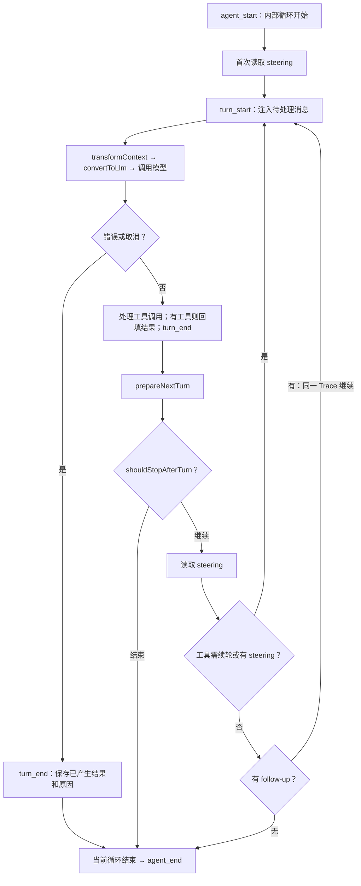

# 第 3 章：Agent Loop、Trace 与 Turn

状态：按 Agent Loop 对照审查修订。参考 [M03 Agent Loop](https://dg-ai-notes.pages.dev/modules/ch03-agent-loop/) 与 [pigo 双层循环图](https://github.com/smallnest/pigo/raw/master/book/images/agent-loop-flowchart.svg)。本章定义完整运行、轮次和输入的行为；接口、持久化与恢复细节分别由 M07/M10 承接，不提前制定开发方案。

## 1. 执行摘要

底座以 Session → Trace → Turn 组织执行。Session 保存长期对话；Trace 表示从开始处理输入到完整收尾的一次运行，正常时覆盖一次完整回复过程；Turn 是一次模型调用及其触发的全部工具执行。一个 Trace 可以包含多个 Turn、多条输入和多条助手消息，也可能以失败或取消结束。

采用 pi 的双层循环：内层处理模型、工具和 steering；内层自然停下后，外层检查 follow-up，有消息就在同一 Trace 中继续。两层都无需继续时才结束 Trace。判断循环是否继续依据真实工具调用和待处理消息，不增加“任务完成度评估器”。

L2 Agent 通过 Eino DeepAgent 实现模型/工具循环及通用控制钩子；L3 AgentSession 管理 Trace 归属、输入队列和收尾，并通过 SessionManager 保存事实。CreateAgentSession 只负责组装。消息统一使用 `*schema.AgenticMessage`，前端通过 SDK/HTTP/SSE 观察和操作同一底座。

### 1.1 三个核心概念

| 概念 | 含义 | 例子 |
| --- | --- | --- |
| Session | 持续保存的对话及分支，可以先后产生多个 Trace | 一个代码仓库中的长期对话 |
| Trace | 一次完整运行，包含输入处理、多个 Turn 和最终收尾；内部以 agent_start/agent_end 标识循环边界，产品以 trace.settled 标识最终收尾 | “修复登录问题”从开始到完整回复，期间接纳的 follow-up 也可属于它 |
| Turn | 一次逻辑模型生成 + 本次生成触发的所有工具执行；回填结果后再调模型就是下一 Turn | Turn 1 读文件，Turn 2 修改并测试，Turn 3 输出总结 |

Trace 沿用教程中的运行语义，不是日志采样对象。pi 底层使用 agent_start/agent_end 表达循环边界，coding-agent 通过 agent_settled 表达重试、压缩和队列处理后的最终状态。产品使用稳定 traceId 关联完整运行，inputId 标识每条输入，turnId 标识轮次，trace.settled 是对外完成边界。HTTP 命令幂等身份及内部执行尝试见 M07/M10。

日志、指标、供应商 request ID 和观测 span 是附属诊断信息，关闭诊断不影响 Trace 的存在。普通助手消息结束、单个 Turn 结束、一次 Eino 调用返回，都不自动等于 Trace 结束。

### 1.2 对照源码的边界

| 事实 | 本地证据 | 产品约束 |
| --- | --- | --- |
| pi 在首次模型调用前和每个完整 Turn 后检查 steering，内层结束后检查 follow-up | [内外循环](../../pi/packages/agent/src/agent-loop.ts#L155) `[VERIFY: pi/packages/agent/src/agent-loop.ts:155]`；[follow-up](../../pi/packages/agent/src/agent-loop.ts#L262) `[VERIFY: pi/packages/agent/src/agent-loop.ts:262]` | follow-up 在当前 Trace 中继续；不能以第一条无工具回复提前关闭 Trace |
| 无工具轮次也触发 turn_end 和轮后处理 | [pi](../../pi/packages/agent/src/agent-loop.ts#L224) `[VERIFY: pi/packages/agent/src/agent-loop.ts:224]`；[pigo](../../pigo/internal/runtime/loop.go#L228) `[VERIFY: pigo/internal/runtime/loop.go:228]` | 配图省略的分支步骤仍需落实 |
| 当前 pi 对截断响应中的工具调用生成失败结果，不执行可能不完整的参数 | [length 分支](../../pi/packages/agent/src/agent-loop.ts#L202) `[VERIFY: pi/packages/agent/src/agent-loop.ts:202]` | 不采纳教程中 length 仍直接执行工具的旧描述 |
| pi coding-agent 在底层结束后还可能重试，并提供 agent_settled | [结束通知](../../pi/packages/coding-agent/src/core/agent-session.ts#L648) `[VERIFY: pi/packages/coding-agent/src/core/agent-session.ts:648]`；[settled](../../pi/packages/coding-agent/src/core/agent-session.ts#L607) `[VERIFY: pi/packages/coding-agent/src/core/agent-session.ts:607]` | 对外完整回复边界由 AgentSession 汇总，不透传内部框架结束为最终完成 |
| Eino TurnLoop 调度完整 Agent，业务中断会退出实例保存 checkpoint | [调度与中断](../../eino/adk/turn_loop.go#L1697) `[VERIFY: eino/adk/turn_loop.go:1697]` | Eino 调度轮次与本文 Turn 不同；内部实例退出不必结束逻辑 Trace |

产品在重试、自动压缩续执行和人工审批恢复期间保留同一逻辑 Trace，直到完整收尾。这是将教程的完整运行概念适配到 Eino 的约定，不声称一个产品 Trace 必须等于一次底层 Runner 调用。独立 Workflow Agent 也有完整运行边界，但没有模型调用时不伪造 Turn。

## 2. 用户体验与功能

### 2.1 输入如何进入循环

作为使用者，我希望忙时补充当前执行、等待其自然停下后追加工作、启动另一项独立工作、停止以及回答审批具有明确区别。

| 输入 | 归属 | 消费时机 |
| --- | --- | --- |
| prompt | 创建新 Trace；空闲时启动，显式独立请求忙时排队 | 该 Trace 开始时 |
| steering | 指定活动 Trace，不创建新 Trace | 首次模型调用前或当前完整 Turn 结束后的安全边界 |
| follow-up | 指定当前未结束 Trace，不创建新 Trace | 内层已无工具续轮且无待消费 steering 时，由外层取出 |
| cancel | 指定 Trace；停止模型、工具与子调用 | 按取消流程收尾，不回滚已经发生的副作用 |
| interaction response / resume | 指定待答交互与原 Trace | checkpoint、权限与版本校验通过后继续 |
| 选择独立 Agent 的新请求 | 创建独立 Trace，沿用当前 Session 串行调度 | 不经过主模型选路；内部模型节点照常计数 |

普通聊天入口默认空闲时作为 prompt、忙时作为当前 Trace 的 follow-up，并在受理结果中明确返回实际类别、目标 Agent 与 traceId。显式指定独立 prompt 与 follow-up 是不同意图；指定已结束 Trace 的 steering/follow-up 返回冲突，不能偷偷改成新运行。等待审批时可保留 follow-up，但不会越过待答交互执行；steering 只对 running 状态受理。

新 chat/prompt 未选择 Agent 时默认主 Agent；用户改选另一 Agent 后发送的新请求是独立 prompt，不能被隐式映射为旧 Trace 的 follow-up。steering/follow-up 必须指定原 Trace，目标 Agent 省略时继承该 Trace，显式错配返回冲突，不改成新任务；resume 始终使用原保存目标。chat/prompt 不带目标 Trace，非法字段组合拒绝。

独立输入受理时一致保存目标 Agent、generation 及工作流定义/依赖版本；queued（含暂停自动启动项）也保留这些引用。随后 reload、开始执行、继续队列或重启均不重新选择版本；原版本缺失明确失败，当前权限收紧仍生效。相同幂等请求先返回原归属/版本，不重新进行选路或选版。

上述自由文本续轮适用于开放式 Agent。独立 Workflow Agent 若未声明支持此类输入，steering/follow-up 返回不支持；调用者仍可提交独立 prompt 排队。不能接受消息后无人消费，也不为处理自由文本擅自增加工作流模型节点。自然语言首次输入可通过声明的字段映射或获准的参数提取步骤转换；首次输入适配与运行中的自由文本干预是不同能力。

### 2.2 受理、队列与完成竞争

- **LOOP-01**：受理结果在 inputId、内容及 Trace 归属可恢复保存后返回；同 ID 同内容重试返回原结果，同 ID 异内容拒绝。新 prompt 可先预留 traceId，真正开始执行时才发送 agent_start。
- **LOOP-02**：steering 与 follow-up 分别排队。未消费输入不进入模型上下文；follow-up 不影响当前尚未结束的内层循环，但会在同一 Trace 的外层继续。
- **LOOP-03**：默认按受理顺序一次消费一条同类队列输入；开发者可替换消费策略，终端用户无需配置。子 Agent 不消费顶层队列。
- **LOOP-04**：错误、取消或显式停止不自动消费 steering/follow-up。未消费输入保留未投递原因与原 Trace 关联；Trace 已终结后，重新执行需用户明确作为新 prompt 提交，使用新 inputId 并关联原输入，不能复活旧 Trace。活动 Trace 失败/取消后，当时已有的独立排队项保留并暂停自动启动，显式继续规则如下。
- **LOOP-05**：自然收尾前串行检查已受理的 steering、follow-up 与待提交结果。若输入先被受理，则当前 Trace 继续；若终态先提交，迟到的定向输入明确拒绝。不能先发布产品 trace.settled 再处理已接纳的补充；内部 agent_end 不等于最终完成。
- **LOOP-06**：HTTP 超时、页面关闭或 SSE 断连不取消 Trace；客户端通过查询和重新订阅继续观察。

例如 Trace A 正在读文件时收到 steering S 和 follow-up F：当前工具批次完成后，下一 Turn 消费 S；模型与工具内层自然停下后再消费 F。整个过程只有一个 Trace A，所有续处理完成后才发送一次 trace.settled；agent_end 可能先作为内部执行段边界出现。另一条显式独立 prompt B 仍等待 A 完整收尾。

#### 2.2.1 取消后的旧队列与新输入

已确认采用“保留记录、旧队列不自动执行、新 prompt 可独立开始”的默认行为：

- 取消仍在进行时，不启动新顶层 Trace；确认执行停止且终态已提交后，再按 M05/M12 检查未决副作用冲突。
- 被取消 Trace 的未消费 steering/follow-up 标记未投递并保留原归属，不再作为可自动消费项。显式重做使用新的 inputId/traceId，并关联旧记录。
- 本次取消完成时已经排队的独立 Trace 仍为 queued，另记录自动启动暂停的原因；不改成需 checkpoint 的 paused 执行，也不删除其输入。
- 此后新提交的独立 prompt 是新的明确意图：无活动执行及未决副作用冲突时可以启动，不受旧暂停队列阻塞，也不顺带恢复它。之后新受理的请求按正常调度处理。
- AgentSession 提供显式“继续队列”操作，选择本次恢复的 queued 项并保留其原受理顺序；它们重新进入可调度队列，和其他已可调度请求按受理顺序串行执行，不抢占活动 Trace，不恢复终态 Trace。
- 仅取消某个尚未启动的 queued Trace 时，只取消该项，不暂停其他任务。活动 Trace 失败时同样保留并暂停当时旧队列；后续副作用冲突不会因新 prompt 或“继续队列”而被绕过。

队列状态、输入去向与受理结果经 SessionManager 保存，可在重启后查询；“保留记录”不等于继续占有可消费队列。普通聊天空闲/忙时映射仍按 2.1，SDK 也可明确指定新 prompt。

### 2.3 取消与人工交互

- **LOOP-07**：取消只表示已接受停止意图，不能立即宣称进程已停止；传播至模型、工具和子 Agent，未启动工具不再启动。已经发生的文件或外部系统变更不承诺回滚。
- **LOOP-08**：等待审批或保留执行栈的补参使用 waiting_input + checkpoint。有效回复只消费一次；并行交互只恢复明确回答的点，其他点继续等待。恢复保留 traceId 及未完成 turnId，不重复已经提交的 Turn/工具事实；新执行段按 executionId 关联内部 agent_start/agent_end，整个 Trace 最终只提交一次 trace.settled。
- **LOOP-09**：普通聊天澄清可以完整结束当前 Trace，等待下一条 prompt；不能把每句疑问都做成执行栈暂停。
- **LOOP-10**：审批按 M12 的 allowed-once/rejected/cancelled/unavailable 处理；无应答通道不永久等待，无许可不执行。普通工具拒绝可反馈模型；安全基础设施失败或副作用未知不得被 follow-up 绕过。

工具结果未知时使用 M05/M07/M10 的受控核对操作，可在该 Trace 为 paused 时提交材料或运行受控查询；核对不新建业务 Trace/Turn，也不自动继续执行。提交后仅重新计算恢复资格，有兼容 checkpoint 才能显式 resume；否则需明确结束原 Trace 后另起新 prompt，终态请求不复活。

没有取消意图但副作用未知时进入 paused；已接受取消则保持 cancelling，确认停止后为 cancelled，并保存未知副作用记录。核对前阻止冲突操作，不能将 cancelled 改回 paused。取消前终态已提交则返回原结果，不倒退状态。

手动压缩仍是带 operationId 的会话维护操作，仅在无活动/待恢复 Trace 且队列为空时受理。自动压缩属于当前 Trace 的内部阶段，不能自行创建第二个顶层执行者。

## 3. Agent Loop 的完整行为

### 3.1 内层模型/工具循环与外层 follow-up

这是运行行为图，不要求在 Eino 之外再实现一套模型/工具循环。人工审批发生在工具执行内部，可暂停当前 Turn；恢复后回到未完成工作。图中的自然收尾还需完成 LOOP-05 的竞争检查；错误或显式停止的收尾不会反过来消费队列。图示 agent_end 是内部边界，AgentSession 处理重试、压缩等续执行并完成持久提交后，才发布产品 trace.settled；一个 Trace 可有多个内部执行段。

### 3.2 每个 Turn 的固定顺序

1. 首个 Turn 前读取 steering；后续轮次使用上一轮或外层取得的待处理消息，发送 turn_start 并追加本轮输入。
2. 对结构化 AgentMessage 执行 transformContext，再 convertToLlm 为 Agentic 消息；系统与工具选项、预算校验按 M08。
3. 调用模型并消费输出流，保存助手消息。一次 Turn 只有一次逻辑模型生成；M04 内部网络重试是该调用的 attempt，不重做已经执行的工具。
4. 错误/取消走失败收尾，不派发本轮未执行工具。否则检查真实 FunctionToolCall 内容块、完整参数及 M05 的工具策略；有工具则执行并追加结果。
5. 无论本轮是否有工具，均发送 turn_end。工具批次未结算或审批仍在等待时不提前结束该 Turn。
6. 调用 prepareNextTurn，再调用 shouldStopAfterTurn；允许继续时读取 steering，判断内层是否续轮。
7. 内层自然结束后才读取 follow-up；有则在同一 Trace 开始下一 Turn，无则尝试完整收尾。

### 3.3 轮后扩展点

| 扩展点 | 职责 | 边界 |
| --- | --- | --- |
| prepareNextTurn | 在轮次结束后准备下一轮上下文、模型/思考参数与工具选择 | 默认沿用现有配置；模型按 M04 校验，工具从原 generation 的获准集合选择并按 M05 记录下一轮生效状态 |
| shouldStopAfterTurn | 提供轮后停止决定及原因，如到达预算或要求受控停止 | 返回停止后不消费 steering/follow-up；预算耗尽等非成功停止不能写成 completed |
| getSteeringMessages | 提供首轮前/轮后可消费的 steering | 来源由 AgentSession 注入；L2 不反向导入会话控制器 |
| getFollowUpMessages | 内层自然结束后提供后续消息 | 每条输入仍有 inputId，沿用 traceId，不重置 Trace 预算或扩展版本 |

这些是行为契约及可替换接口，最终 Go 命名后定。整个 Trace（从独立输入受理开始，包括 queued/hold）固定工具实现/schema、handlers、skill、工作流定义/节点执行器及必要资源 generation；下一 Turn 可从同一版本选择工具子集，默认沿用当前集合。模型调用、重试、工具批次与审批恢复绑定本轮选择；普通更新不重解释已经接纳的调用。用户主动选择的下一次默认模型仍在新 Trace 生效，代码定义的逐 Turn 模型策略与此分开。

M11 扩展发送的 prompt/steering/follow-up 同样先受理、再按既有边界消费，并保存扩展来源；不会因来自 hook 就立即重入循环。自定义消息默认不触发执行，活动时在所属 invocation 下一安全输入边界消费；排队期间不进入模型或摘要。工具/模型选择请求本身不强制增加 Turn，循环正常结束时未生效请求保留状态，不自动延长或复活 Trace。

### 3.4 继续与停止的判断

| 情况 | 内层行为 | Trace 行为 |
| --- | --- | --- |
| 有完整工具调用，结果允许继续 | 回填结果，进入下一 Turn | 保持运行 |
| 无工具调用，但有 steering | 消费 steering，进入下一 Turn | 保持运行，不提前终结 |
| 无工具续轮/steering，但有 follow-up | 外层重新进入内层 | 保持同一 Trace |
| 无工具续轮、无 steering、无 follow-up | 无需继续生成 | 统一收尾后 completed；不等于产物通过业务验收 |
| 模型错误、用户取消 | 不执行未派发工具；保存部分结果 | 分别 failed/cancelled；内部允许的模型重试尚未耗尽时不提前终结 |
| length 截断 | 不执行该响应中可能截断的工具调用，保留明确失败反馈 | 按 M04 预算纠正或失败；不能把截断直接当正常完成 |
| shouldStopAfterTurn 要求停止 | 停止读取两类队列 | 记录具体原因；预算/策略中止为 failed，用户取消为 cancelled；确需可恢复暂停时按 M10 保存 checkpoint |
| 工具批次全部 terminate | 不再由本批工具驱动续轮 | 参考 pi 仍经过轮后判断及队列检查；它不同于取消或硬停止 |
| 审批等待 / 副作用待核对 | 暂停未完成工作 | waiting_input / paused，不发布产品 trace.settled；内部执行段可结束 |

pi 的 terminate 聚合为“本批所有结果都要求停止”，不是任一工具停止；其后仍有轮后和队列判断。[批次聚合](../../pi/packages/agent/src/agent-loop.ts#L582) `[VERIFY: pi/packages/agent/src/agent-loop.ts:582]`。pigo 的同名路径会直接收尾，Eino return-direct 也有自己的语义，不能混作一个开关；本产品若开放这类工具能力，遵循 M05 的明确策略。

模型生成、工具次数、重试、压缩和总执行时间使用开发者默认策略。follow-up 与内部恢复不重置 Trace 预算；终端用户无需填写限制数值。主 Agent、子 Agent 和 Workflow Agent 共用归属预算，默认值在后续开发验证中确定。开发者仍通过 ExtensionRegistry.AddSubAgent 添加能力，不需要修改循环或建立用户侧编排配置。

## 4. Eino 适配、状态与验收

### 4.1 分层与执行适配

| 责任 | 所属位置 | 与循环的关系 |
| --- | --- | --- |
| 模型/工具内层循环 | L2 Agent 内的 Agentic DeepAgent | 复用 Eino ReAct，按 FunctionToolCall 及结果继续 |
| Trace、输入归属和外层续执行 | L3 AgentSession，通过 L2 的通用控制接口协调 | 同一 Trace 可包含多个框架执行段，不把每次 Runner 返回当成完整回复结束 |
| 会话执行调度 | Agent 内的 TurnLoop 适配 | 保持同 Session 单一活动执行者；Eino 调度一次 Agent 可包含多个本文 Turn |
| 轮后处理和安全输入边界 | L2 控制钩子；L3 注入策略与消息来源 | 有工具与无工具路径都覆盖；若 Eino 已自然返回，由协调者在框架退出后继续同一 Trace |
| 历史与事件提交 | SessionManager / SessionStore | AgentSession 协调保存后发布事实，不依赖普通观察订阅落库 |
| 日志与性能诊断 | 可选观测适配 | 不决定 Trace 是否存在、是否结束或是否可恢复 |

主/子 Agent、Runner、TurnLoop 和 middleware 均使用匹配的 `*schema.AgenticMessage` 泛型路径。工具后 hook 只覆盖有工具路径，不能代替完整的轮后契约。Eino 的 BeforeModelRewriteState 可承接安全模型前注入，AfterAgent 只在成功时调用，故统一收尾还要观察错误、取消和实际退出。[工具后 hook](../../eino/adk/chatmodel.go#L125) `[VERIFY: eino/adk/chatmodel.go:125]`；[middleware](../../eino/adk/handler.go#L144) `[VERIFY: eino/adk/handler.go:144]`；[Agentic 循环](../../eino/adk/react.go#L688) `[VERIFY: eino/adk/react.go:688]`。

外层协调不得在事件回调中同步重入 Runner，不用 preempt 冒充 steering。若本次框架实例需要结束后再续执行，traceId、历史、队列、预算和 generation 均延续；新的内部执行段使用新的 executionId，可发布其 agent_start/agent_end，但不创建第二个 Trace 或提前发布 trace.settled。具体 hook 组合和适配实现留到开发方案验证。

### 4.2 Trace 状态与统一收尾

| 状态 | 含义与允许的后续行为 |
| --- | --- |
| queued | 已为独立 prompt 或选定 Agent 的新请求预留 Trace，尚未开始；可启动或取消，装配失败为 failed |
| running | 正在模型/工具执行或内部续执行；可等待交互、暂停、取消或终结 |
| waiting_input | 已保存可恢复交互；有效回复后继续原 Trace |
| paused | 无法安全自动继续；核对及恢复条件满足后继续，或明确取消/失败 |
| cancelling | 已受理取消，等待执行器及子进程停止，不启动后续工具 |
| completed / failed / cancelled | 已提交终态；不可恢复为运行中，重新执行创建新 Trace |

同 Session 同时最多一个活动或待恢复的顶层 Trace 持有历史写入权；子 Agent 使用独立 invocationId，仍属于父 Trace。取消或装配失败的 Trace 若尚未开始，只记录状态，不伪造 agent_start/agent_end。

已开始的 Trace 统一完成以下收尾：结算已产生的消息和工具观察 → 处理未消费输入去向 → 提交 Trace 终态及相关事件 → 发送一次产品 `trace.settled`。内部 agent_end 不携带最终业务完成语义。存储失败时不能发布虚假的持久终态；公开诊断并停止推进，恢复后核对。

人工等待、内部模型重试、自动压缩续执行及框架实例重建不属于最终收尾；产品不透传内部 agent_end/EOF 为完整回复完成。最终边界承担类似 pi coding-agent 的 settled 语义，详见 M07；无需再增加另一套请求完成事件。

### 4.3 恢复与执行记录

恢复依赖 traceId、目标 Agent、分支、checkpoint、未完成轮次/工具调用、generation 以及当时有效的模型和上下文版本。Eino checkpoint 与产品记录均确认可恢复后才发布 waiting_input/canResume；任意进程崩溃不保证有最新 checkpoint。新选择不能替换旧 checkpoint 对应的 Agent 或工作流定义。

内部 executionId 仅标识一次框架执行尝试，恢复时可变化，不能取代 Trace。Resume 保留原 traceId，未完成 Turn 继续原 turnId；只有下一次逻辑生成才产生新 Turn。旧工具结果和 inputId 不重复提交。更详细的提交、幂等与副作用核对规则归 M07/M10。

TurnLoop 的 Stop 关闭实例，Run 只启动一次；恢复或取消后的新 Trace 可由新实例承接。GenInput 必须完整处理 Consumed/Remaining，退出时还需接管中断和迟到输入。[输入契约](../../eino/adk/turn_loop.go#L636) `[VERIFY: eino/adk/turn_loop.go:636]`；[Run](../../eino/adk/turn_loop.go#L1335) `[VERIFY: eino/adk/turn_loop.go:1335]`；[Stop](../../eino/adk/turn_loop.go#L1500) `[VERIFY: eino/adk/turn_loop.go:1500]`。

### 4.4 贯穿验收

| 编号 | 场景 | 必须观察到的结果 |
| --- | --- | --- |
| LOOP-A01 | 同一 prompt 超时重发三次 | 一个 inputId 受理结果、一个 traceId、一次消费 |
| LOOP-A02 | 工具执行中收到 B、C follow-up | 当前内层不提前看到 B/C；自然停下后按序在同一 Trace 继续；最终只有一条产品 trace.settled 持久事实，内部 agent_start/agent_end 按 executionId 区分 |
| LOOP-A03 | 工具批次中收到 steering | 不取消当前工具；整批结果结算后下一 Turn 消费 |
| LOOP-A04 | 无工具终答与 steering/follow-up 同时到达 | 先受理则同 Trace 继续，终态先提交则拒绝定向输入；无丢失、无重复终结 |
| LOOP-A05 | 错误或 Abort 时队列非空 | 不自动消费 follow-up；未消费输入可查询；已取消 Trace 不复活 |
| LOOP-A06 | 两工具分别审批，只回答一个 | 只恢复指定交互；Trace 未终结，其余问题仍等待 |
| LOOP-A07 | waiting_input 时 reload，随后恢复和 follow-up | 均使用原 Trace generation；下一独立 Trace 才采用新资源 |
| LOOP-A08 | SSE 断连后重连 | 同一 Trace 继续，状态、历史、轮次与事件可恢复观察 |
| LOOP-A09 | 截断、预算耗尽、落盘失败 | 无不完整参数执行、无虚假 completed；真实中间结果可定位 |
| LOOP-A10 | 代码注册自定义子 Agent | 无需改循环或用户配置，使用 Agentic 泛型接口并受父 Trace 预算约束 |
| LOOP-A11 | 无工具轮次、工具轮次及多工具轮次 | 每轮恰好一个 turn_end；轮后顺序一致；工具数量不增加 Turn 数 |
| LOOP-A12 | 模型网络重试、审批恢复或内部重建 | 保持 traceId；未完成轮次不重复 started；诊断导出失败不改变执行 |
| LOOP-A13 | prepareNextTurn 选择已获准模型；shouldStopAfterTurn 要求停止 | 下一 Turn 正确采用配置；停止路径不消费队列且原因明确 |
| LOOP-A14 | 一批工具全部 terminate，队列仍有 follow-up | 不由工具结果自动续轮；按 pi 规则检查队列，同 Trace 处理后续输入；不当作硬取消 |
| LOOP-A15 | A 取消时 B/C 已排队，随后提交 D，再显式继续旧队列 | 无冲突时 D 可启动，B/C 仍保留且不自动执行；显式继续后按约定顺序串行运行，不复活 A |
| LOOP-A16 | unknown 核对完成，分别存在/不存在兼容 checkpoint | 有条件时仅更新 canResume，显式恢复承接已有结果；无条件时不调用原执行栈，终态不复活 |
| LOOP-A17 | 主任务运行中改选独立 Workflow Agent 并发送新输入 | 新请求排队为独立 Trace，不误投为旧 Trace 的 follow-up；恢复仍绑定原目标 |

## 5. 风险与系统闭合

本章明确对外行为，尚未实现或验证 Eino 扩展点的组合。重点验证无工具路径的轮后处理、终答与输入竞争、内部重建不重复结束 Trace，以及 checkpoint 与轮次关联。不能以框架具有某个 hook 就宣称完整契约已经实现。

M04 负责每轮模型选择与重试，M05 负责工具与副作用，M06/M08 负责消息及上下文，M07/M10 负责事件和恢复。取消/失败后的默认队列行为已确认；预算具体值和适配实现进入后续开发方案，不再把已确定的队列语义列为待选择。
